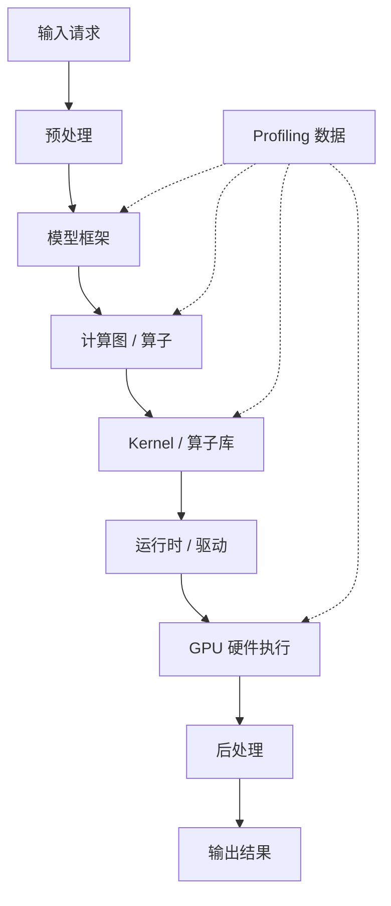

# 第0章 写给读者的话

## 本章导读

> 欢迎你，未来的 AI Infra 构建者！这一章不写代码，也不急着抛 GPU 术语。我们先坐下来聊清楚三件事：AI Infra 到底在解决什么问题？这本教程打算怎样带你学？以及，为什么后面所有章节都围着「硬件、测量、优化、自动化」这八个字转？读完这一章，希望你不仅能判断这本教程适不适合自己，更能在心里搭起一张 AI Infra 的"全景地图"——后面每一站会走到哪儿，心里大致有数。

## 0.1 为什么 AI Infra 很重要

我们先从一个你很可能会遇到的场景开始。

你写了一个推理脚本，在自己的机器上跑得好好的。后来把它搬到另一台机器——模型没换，输入也差不多，延迟却明显高了一截。打开监控，GPU 好像也在工作；调一调 batch size，吞吐有时变好、有时变差；换一个推理引擎，有的模型收益肉眼可见，有的几乎纹丝不动。

到这一步，你心里大概已经冒出一个念头：**问题已经不是"会不会调用模型"了**。真正让人头疼的，是下面这一连串没人能一句话说清的疑问：

- 这次请求究竟经过了哪些系统层次？
- 时间花在模型计算、数据搬运、前后处理，还是服务框架上？
- GPU 上真正执行的是哪些 kernel？
- 当前瓶颈是访存、计算、调度，还是 batch / 并发策略？
- 你做的改动，到底是真的更快了，还是只是测量方式变了？

这些问题，全都落在 **AI Infra** 的范围里。它们不是"调一调参数就能搞定"的问题，而是需要你走到框架底下、走到运行时里面、甚至走到硬件执行那一层去，才能看清全貌。

如果一定要给一个简短的定义，可以这样说：**AI Infra 是让 AI 模型高效、稳定、可复现地运行起来的那一整套工程能力**。它把模型、框架、算子、编译器、运行时、硬件和服务系统串成一条完整的链路。只盯着其中一层，往往看不清完整问题——就像你不可能只盯着发动机的某一个零件就判断整辆车为什么跑不快一样。

一个模型请求大致会经过这样的路径：

  
图 0.1 一次推理请求从输入到 GPU 执行再到输出的简化路径

如图 0.1 所示，只盯着最上面一层，你大概会得出"模型慢"的结论；只盯着最下面一层，又会觉得"所有问题都得手写 kernel"。真正的 AI Infra 学习，是在这些层之间来回穿梭：**先弄清问题落在哪一层，再决定该掏出哪一把工具**。

所以这本教程不会停在"怎么运行某个工具"上。我们更关心的是：这个工具到底帮你回答了什么问题？它给出的证据，撑不撑得起你的优化判断？——换个说法，我们教的是"诊断学"，而不只是"药方大全"。

## 0.2 AI Infra 到底包括什么

这一节先递给你一张地图。第一次读不需要记住所有名词——知道它们各自待在系统的哪个位置就够了。就像你第一次看地铁线路图，不用背下每一站的换乘口，但得知道哪条线通哪个方向。

| 模块 | 你可以先这样理解 | 后续会在哪里学 |
| ---- | ---- | ---- |
| 框架 | 负责表达模型、调度算子、管理张量 | 第 1 篇、第 5 篇 |
| 算子 / Kernel | 真正在 GPU 上执行的计算单元 | 第 3 篇、第 4 篇 |
| Profiling / Benchmark | 用数据回答“慢在哪里” | 第 2 篇 |
| 推理引擎 / 服务 | 把模型放进端到端请求链路 | 第 5 篇 |
| AI 编译器 | 自动做图优化、调度搜索、代码生成 | 第 6 篇 |
| Agent 自动化 | 把测量、分析、修改、报告串成闭环 | 第 7 篇 |

这些模块不是孤立的，它们之间的关系比你想象的要紧密得多。你在 PyTorch 里写一个矩阵乘，框架会把它映射成某个后端算子；算子又会落在一个 GPU kernel 上；而 kernel 跑得快不快，最终取决于数据布局、访存方式、并行度和硬件特性。换句话说，从一行 Python 到 GPU 上的电信号，中间隔着五六层抽象。profiling 工具看到的时间线，就是把这些层重新串起来的那根线索——有了它，你才知道"慢"到底出在哪一层。

本教程会反复使用下面这条主线。请把它记在心里——它比任何具体工具都重要：

  
图 0.2 本教程反复使用的 AI Infra 优化闭环

工具会换代，硬件会迭代，框架版本会升级——但「先测量、再判断、再优化、再复测」这套思维习惯不会过时。后面每一章的实验设计，都是这个闭环在某一个环节上的展开。等你学完整本教程再回头看图 0.2，会发现它已经把 AI Infra 的方法论画完了。

## 0.3 为什么主线选 AMD GPU / ROCm

市面上的 GPU 学习资料，十本里有九本默认从 CUDA 起步。这很自然——CUDA 生态成熟、社区庞大、经典优化案例也大多来自 NVIDIA 平台。但我们还是刻意选了 AMD GPU / ROCm 这条路。

**不是为了"反 CUDA"，而是希望你借这条路线，把系统视角练得更通用一些。**

GPU 性能优化里真正核心的问题，并不归某个厂商独有：

- 数据是否连续访问？
- 算子是计算瓶颈还是访存瓶颈？
- kernel launch 开销是否值得关注？
- batch 和并发策略是否合理？
- profiling 结果能不能撑起优化结论？
- 自动调参是否真的在当前硬件上变快了？

这些问题在任何平台上都会出现，变的只是工具名、术语和实现细节。沿着 AMD GPU / ROCm 学下来，你会接触 CU、Wavefront、LDS、HIP、HSA、MIGraphX、Triton on AMD 这些概念。一开始可能会觉得有点陌生——没关系，陌生感恰恰说明你正在从"框架使用者"往"系统优化者"的方向走。

也提前划一下边界：**这本教程不是 CUDA 到 ROCm 的逐 API 翻译手册**。需要时我们会提一笔 HIP 和 CUDA 的对应关系，但不会把每一节写成对照表。你的注意力应该花在更值钱的问题上：

- 这个算子为什么慢？
- 慢的证据在哪里？
- 当前硬件上能尝试哪些优化？
- 优化后怎么确认结果是可信的？

最后再强调一次：**本教程所有实验数据基于 AI MAX 395 + ROCm 7.12.0**。其他 AMD GPU 可以参考方法论，但性能数字和工具可用性需要自己实测验证。

## 0.4 这本教程和别的 AI Infra 教程有什么不同

市面上已经有不少讲 AI Infra 的好资料了。有的深入某个框架源码，有的手把手教你写 CUDA kernel，有的把编译器优化讲得很透。那我们为什么还要再写一本？

如果只能让你带走三个关键词，那就是下面这三个。它们就是本教程和"工具使用说明书"之间最大的分界线：

| 关键词 | 含义 | 你会怎么练 |
| ---- | ---- | ---- |
| Hardware-Aware | 先理解程序最终怎样落到硬件执行 | 看 CU、Wavefront、LDS、访存和并行度 |
| Profiling-Driven | 用数据决定优化方向 | 写 benchmark、看 timeline、读 profiling 报告 |
| Agent-Driven | 把重复的分析和实验流程自动化 | 构建 AutoInfra Agent |

**第一，Hardware-Aware（硬件感知）**

很多性能问题看上去发生在 Python 或框架层，真正的根因却埋在硬件执行那一层。一个 kernel 慢，可能不是因为算得多，而是访存方式不好；一个推理服务吞吐上不去，也可能跟模型结构没什么关系，而是 batch、并发和显存之间的账没算清楚。所以我们不会只讲"怎么写代码"，而是会反复追问："这段代码落到 GPU 上，到底在干什么？"

**第二，Profiling-Driven（用数据驱动优化）**

我们不鼓励凭感觉改代码。**一个优化成不成立，必须经过 benchmark 和 profiling 验证**。后续大量章节都遵循同一个节奏：先写 baseline，再测量，再分析瓶颈，提出假设，最后复测。这个流程听起来朴素，但你会发现它能帮你过滤掉一大半"看上去变快了"的伪优化——而这是真正做性能工作的人最怕的东西。

**第三，Agent-Driven（把流程自动化）**

注意，这里的 Agent **不是**"让大模型随便生成一段代码"。在 AI Infra 场景里有价值的 Agent，应该会读硬件信息、跑 benchmark、调 profiling、整理日志、列实验计划、比较 before / after，并且把失败的尝试也老老实实记下来——因为失败的记录往往比成功的那一次更值钱。

所以本教程最后的 AutoInfra Agent，并不是凭空给出"最优代码"，而是把前面这些流程串成一个可以反复运行的闭环：

  
图 0.3 AutoInfra Agent 的最小优化闭环

这就是本教程最核心的野心：不只要告诉你按钮在哪儿，更要让你看清每一步在整个闭环里承担什么角色——以及，为什么**这个角色缺了，链路就断了**。

## 0.5 你将完成的毕业项目：AutoInfra Agent

先把镜头快进到终点，看一眼你学完整本教程后的"毕业作品"：一个简化版的 **AutoInfra Agent**。

它不会一口气解决所有性能问题——那是科幻片里的剧情。它会做的是完成一个**可控、可复查的小闭环**：

1. 读取当前机器的硬件和软件环境，生成硬件画像。
2. 运行指定算子或推理 pipeline 的 benchmark。
3. 调用 profiling 工具，提取关键 kernel 和开销分布。
4. 根据规则和 LLM 推理，生成瓶颈判断和优化候选。
5. 对低风险参数或代码做候选修改。
6. 重新运行 benchmark，比较前后结果。
7. 输出一份包含命令、日志、指标、失败尝试和下一步建议的报告。

它的价值不在"Agent 一定能写出最快的代码"——换个角度想，如果 Agent 每次都能一次到位，那说明问题本身就太简单了。真正重要的是，它把优化流程变成了**可记录、可复查、可迭代**的系统。在团队协作、版本演进和事后复盘里，这三个"可"比单次最优值重要得多。

你可以把这个毕业项目当成前面所有章节的"演练场"——前面练的每一项能力，都会在这里找到属于自己的位置：

| 前面学到的能力 | 在毕业项目里的作用 |
| ---- | ---- |
| 硬件基础 | 让 Agent 知道当前机器是什么 |
| Profiling | 让 Agent 知道应该收集什么证据 |
| HIP / Triton | 给 Agent 提供可尝试的优化对象 |
| 推理优化 | 让 Agent 不只盯着单个算子 |
| 编译器与自动调优 | 让 Agent 理解搜索空间和候选配置 |
| 报告写作 | 让人类 reviewer 能检查结论是否可信 |

这里有一条贯穿始终的底线：**Agent 的输入数据必须可信**。benchmark 不可信、profiling 没保存、硬件上下文没写清楚——那么不管 Agent 的报告写得多漂亮，都不能拿到工程场合当结论用。数据质量决定 Agent 的上限，这一点怎么强调都不为过。

## 0.6 学习路线图与读者画像

这一节给你两样东西：一条推荐路线，和一份"对号入座"的读者画像。建议你先按顺序读，等熟悉后再按主题回看——就像去一个新城市，第一次坐地铁跟着线路图走，熟了之后自然会知道在哪换乘。

### 推荐学习路线

| 阶段 | 对应篇章 | 你要学什么 | 学完能做什么 |
| ---- | ---- | ---- | ---- |
| 0 | 前言与环境 | 项目定位、环境验证、实验边界 | 判断自己能否跟着教程跑 |
| 1 | AI Infra 全景与 AMD GPU 基础 | 系统地图、ROCm 软件栈、GPU 基本概念 | 看懂后续章节的硬件和软件名词 |
| 2 | 性能分析与瓶颈定位 | benchmark、profiling、报告 | 用证据说明程序慢在哪里 |
| 3 | HIP 算子优化 | 手写 kernel、访存、LDS、Reduction | 写出并分析教学版 GPU 算子 |
| 4 | Triton on AMD | Matmul、Softmax、Attention、autotune | 用更高层表达写常见算子 |
| 5 | 推理优化与模型部署 | 端到端延迟、吞吐、服务化、LLM 指标 | 分析完整推理 pipeline 的性能 |
| 6 | AI 编译器与自动调优 | 图优化、调度搜索、工具定位 | 理解编译器为什么能优化模型 |
| 7 | AutoInfra Agent | 数据结构、自动实验、报告生成 | 搭建一个最小自动优化系统 |

### 不同读者怎么读这本教程

| 你是谁 | 这本教程能帮你 | 推荐读法 |
| ---- | ---- | ---- |
| AI 应用 / 算法工程师，想搞清楚"模型为什么慢" | 学会用 profiling 找证据，而不是凭直觉调参 | 别跳过第 2 篇；第 3、4 篇按需选读 |
| 刚接触 GPU 编程的同学 | 从 HIP 最小例子起步，逐步建立硬件直觉 | 从头顺序读，第 3 篇是你的核心训练场 |
| 有 CUDA 经验、想看看 ROCm 什么样 | 在熟悉概念上"换个平台"再练一遍 | 快速浏览第 1 篇，重点攻第 4、5 篇 |
| 推理部署 / 服务化方向 | 把端到端延迟、吞吐、batch 拆开看 | 第 2 + 第 5 篇组合阅读 |
| 对编译器、自动调优感兴趣 | 理解搜索空间和调度变换到底在做什么 | 第 4、6 篇 |
| 想做 LLM × Infra 的 Agent 工作 | 看 Agent 怎么和真实工程闭环结合 | 通读全本，重点在第 7 篇 |

如果你是初学者，**请务必不要跳过第 2 篇**。很多人一上来就急着写 kernel、调参数，但要是连测量都测不准，所谓的"优化"就很容易变成赌博——你连自己是赢了还是输了都不知道。

如果你已经有 GPU 编程经验，前两篇可以快速翻阅，把主要精力放在 Profiling、Triton 和 Agent 上。但还是建议先读完第 1 章的环境验证——确认基础链路打通之后，后面会顺手很多。

## 0.7 环境与前置知识

这一节说明开始之前需要准备什么。先讲知识，再讲环境。

知识上，你最好具备三类基础：

| 基础 | 需要到什么程度 |
| ---- | ---- |
| Python | 能运行脚本、看懂函数、列表、字典和基本包管理 |
| Linux 命令行 | 能进入目录、运行命令、查看日志、理解环境变量 |
| 深度学习概念 | 大概知道 tensor、batch、矩阵乘、Softmax、Attention、推理是什么 |

请放心，你不需要一开始就会 GPU 编程，更不需要先成为编译器专家。本教程的做法是把复杂内容一层层拆开，从"能跑通的最小例子"开始往上搭。你不会一上来就被扔进几百行 kernel 代码里。

环境上，本教程当前的实验基线是：

| 项目 | 当前基线 |
| ---- | ---- |
| 主线硬件 | AI MAX 395 |
| GPU 架构 | gfx1151 |
| ROCm 版本 | 7.12.0 |
| Python 环境管理 | uv |

这里的"基线"不是说其他设备一定跑不了——不同 AMD GPU 的读者都可以借鉴方法论，但性能数字需要在自己设备上实测。

下一章会带你做环境准备与验证。它不会一上来就展开 ROCm 软件栈的内部原理，只帮你确认三件最关键的事：ROCm 能不能看到 GPU？PyTorch ROCm 能不能跑？最小 HIP 程序能不能编译运行？三道门推开，后面的路就是通的。

## 本章小结

- **AI Infra 是连接层的工程**——模型、框架、算子、编译器、运行时、硬件和服务系统之间的衔接处，往往才是性能问题真正的藏身之所。只盯着其中一层，就像只看一根链条上的一个链节。
- 本教程的三条主线是 **Hardware-Aware、Profiling-Driven、Agent-Driven**，不是工具清单，更不是 API 对照表。工具会换代，但这三种思维方式不会。
- 实验结论基于 **AI MAX 395 + ROCm 7.12.0**，其他设备的读者请以方法论为主、自行复测数据。
- 学习路线从环境验证起步，经过 profiling、HIP、Triton、推理优化、编译器，最终落到 AutoInfra Agent——每一站都是下一站的基础。
- 下一章解决第一个动手问题：**怎样确认你的 AMD GPU 实验环境可以继续往后跑？**

## 延伸阅读

- [AMD ROCm Documentation](https://rocm.docs.amd.com/)
- [PyTorch](https://pytorch.org/)
