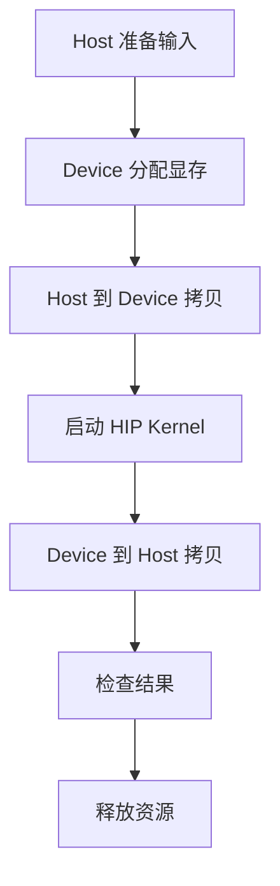

# 第1章 环境准备与验证

## 本章导读

> 把这一章想象成一张「开工前体检表」就好。你**不必**在这里搞懂 ROCm、HIP、uv 的所有原理——那是后面章节的事。这一章只做一件事：让你有底气回答三个问题。ROCm 能不能看到 GPU？PyTorch 能不能用上 GPU？最小 HIP 程序能不能编译运行？三个都过了，基础链路就打通了；万一哪个过不去，我们也准备了排错指南，帮你用最快速度把问题定位出来。

本章对应代码在:

```text
code/part0-preface/
├── pyproject.toml
├── uv.lock
├── activate-rocm.sh
└── chapter1/
    ├── check_torch_rocm.py
    └── vector_add.hip
```

## 1.1 本教程的实验基线

本章不打算做"安装百科"，也不会覆盖所有 AMD GPU 和系统组合——真要写成那样，恐怕这一章就得比整本教程还厚。它只回答一个问题：**当前环境，够不够支撑你继续往后学？**

你可以把这一章想成三道门，必须依次推开，一道都跳不过去：

| 门 | 验证什么 | 推开之后说明 |
| ---- | ---- | ---- |
| 第一道门 | ROCm 能看到 GPU | 底层驱动和运行时基本可用 |
| 第二道门 | PyTorch ROCm | 框架层能把计算放到 AMD GPU 上 |
| 第三道门 | 最小 HIP 程序 | 后续手写 kernel 的路径基本打通 |

本章使用的基线如下：

| 项目 | 基线 |
| ---- | ---- |
| 硬件 | AI MAX 395 |
| GPU 架构 | gfx1151 |
| ROCm 版本 | 7.12.0 |
| Python 环境管理 | uv |
| ROCm Python 包来源 | AMD gfx1151 wheel 源 |

如果你的硬件或 ROCm 版本和上面对不上，不用担心——验证顺序仍然可以照搬，只是包版本、设备名、工具输出会有差异，到时候自己对照一下就好。

## 1.2 同步本篇 uv 环境

开始之前，先把代码目录切过来：

```bash
cd code/part0-preface
```

依赖已经写好在 `pyproject.toml` 和 `uv.lock` 里，你**不用手动 `uv add` 一堆包**。一条命令就够了：

```bash
uv sync
```

<details>
<summary>输出：uv sync 创建本篇环境</summary>

```text
Using CPython 3.12.12
Creating virtual environment at: .venv
Resolved 17 packages in 0.61ms
Installed 16 packages in 123ms
 + filelock==3.20.3
 + fsspec==2026.2.0
 + jinja2==3.1.6
 + markupsafe==3.0.3
 + mpmath==1.3.0
 + networkx==3.6.1
 + numpy==2.4.4
 + rocm==7.12.0
 + rocm-sdk-core==7.12.0
 + rocm-sdk-devel==7.12.0
 + rocm-sdk-libraries-gfx1151==7.12.0
 + setuptools==82.0.0
 + sympy==1.14.0
 + torch==2.9.1+rocm7.12.0
 + triton==3.5.1+rocm7.12.0
 + typing-extensions==4.15.0
```

</details>

同步完成后，激活本篇环境：

```bash
source ./activate-rocm.sh
```

<details>
<summary>输出：激活 ROCm uv 环境</summary>

```text
Activated ROCm uv environment:
  PROJECT:    hello-ai-infra/code/part0-preface
  VENV:       hello-ai-infra/code/part0-preface/.venv
  ROCM_PATH:  hello-ai-infra/code/part0-preface/.venv/lib/python3.12/site-packages/_rocm_sdk_devel
  Python:     hello-ai-infra/code/part0-preface/.venv/bin/python
Python 3.12.12
```

</details>

输出里**最关键的一行**是 `ROCM_PATH` 指向 `_rocm_sdk_devel`。如果你看到的是 `_rocm_sdk_core`，后面编译 HIP 程序时十有八九会撞上 `cannot find ROCm device library` 这个报错。别慌，这是 ROCm wheel 安装的一个"老熟人级"的坑，原因和处理方式我们留到本章附录里仔细讲。

## 1.3 验证 GPU 可见性

第一道门：ROCm 能不能看到 GPU。

先用 `rocminfo` 摸一摸你的 GPU：

```bash
rocminfo | grep -E "^[[:space:]]*(Name|Marketing Name|Vendor Name|Device Type|Uuid):|gfx1151" | head -40
```

<details>
<summary>输出：rocminfo 识别到 gfx1151 GPU</summary>

```text
  Name:                    AMD RYZEN AI MAX+ 395 w/ Radeon 8060S
  Uuid:                    CPU-XX
  Marketing Name:          AMD RYZEN AI MAX+ 395 w/ Radeon 8060S
  Vendor Name:             CPU
  Device Type:             CPU
  Name:                    gfx1151
  Uuid:                    GPU-XX
  Marketing Name:          Radeon 8060S Graphics
  Vendor Name:             AMD
  Device Type:             GPU
      Name:                    amdgcn-amd-amdhsa--gfx1151
      Name:                    amdgcn-amd-amdhsa--gfx11-generic
```

</details>

关键看两点：`Device Type: GPU` 必须出现，并且架构是 `gfx1151`。两条都对上了，说明驱动认得你的卡——第一道门已经推开一半了。

再用 `rocm-smi` 看一眼 GPU 的运行状态：

```bash
rocm-smi
```

<details>
<summary>输出：rocm-smi 能读取 GPU 状态</summary>

```text
======================================== ROCm System Management Interface ========================================
================================================== Concise Info ==================================================
Device  Node  IDs              Temp    Power     Partitions          SCLK  MCLK  Fan  Perf  PwrCap  VRAM%  GPU%
              (DID,     GUID)  (Edge)  (Socket)  (Mem, Compute, ID)
==================================================================================================================
0       1     0x1586,   40101  27.0°C  12.046W   N/A, N/A, 0         N/A   N/A   0%   auto  N/A     71%    0%
==================================================================================================================
============================================== End of ROCm SMI Log ===============================================
```

</details>

**如果这一步失败了，请先不要急着去跑 PyTorch、HIP 或 Triton**。上层框架全都建在底层驱动和运行时之上——底层不通，上层抛出来的错通常只会更让你迷惑。先回到驱动安装和 ROCm 官方文档去排查，确认 `rocminfo` 能看到 GPU 之后再继续。

## 1.4 验证 PyTorch ROCm

第二道门：框架层能不能真的把计算放到 AMD GPU 上。

先看检查脚本:

<details>
<summary>代码：check_torch_rocm.py</summary>

```python
import platform

import torch

print(f"python: {platform.python_version()}")
print(f"torch: {torch.__version__}")
print(f"cuda_available: {torch.cuda.is_available()}")

if not torch.cuda.is_available():
    raise SystemExit("PyTorch ROCm backend is not available")

print(f"device_count: {torch.cuda.device_count()}")
print(f"device_name: {torch.cuda.get_device_name(0)}")

x = torch.randn(1024, 1024, device="cuda")
y = x @ x

print(f"result_shape: {tuple(y.shape)}")
print(f"result_dtype: {y.dtype}")
print(f"result_device: {y.device}")
print(f"result_checksum: {y.sum().item():.6f}")
```

</details>

这个脚本做了三件事：导入 PyTorch、检查 GPU 后端、在 GPU 上跑一次 `1024 × 1024` 矩阵乘。简单到不能再简单——但验证环境时，**越简单越好**。复杂的例子只会让排查时变量更多、更乱。

运行：

```bash
python chapter1/check_torch_rocm.py
```

<details>
<summary>输出：PyTorch ROCm smoke test</summary>

```text
python: 3.12.12
torch: 2.9.1+rocm7.12.0
cuda_available: True
device_count: 1
device_name: Radeon 8060S Graphics
result_shape: (1024, 1024)
result_dtype: torch.float32
result_device: cuda:0
result_checksum: 89723.382812
```

</details>

这里有个**几乎每个新手都会问的问题**：为什么 ROCm 版 PyTorch 里到处都是 `cuda`？答案是历史包袱——PyTorch 的设备字符串一直沿用 `cuda` 这个名字，没有为 ROCm 单独开一条。看到 `device="cuda"` 不代表你跑在 NVIDIA 卡上，把它读作"把 tensor 放到当前可用的 GPU 后端"就行。第二道门推开之后，这个命名的小别扭很快就会被你忘掉。

这一步过了，至少说明三件事：

| 检查项 | 通过后说明什么 |
| ---- | ---- |
| `import torch` 成功 | Python 环境里的 PyTorch 可用 |
| `cuda_available: True` | PyTorch 能看到 GPU 后端 |
| 矩阵乘完成 | 基础 GPU 计算路径可用 |

## 1.5 验证最小 HIP 程序

第三道门：你后续手写 kernel 的那条路有没有打通。

PyTorch 跑通只能证明框架层 OK；要真正走到 GPU 编程，还得能把一段 HIP C++ 编译、加载、跑起来。这里**不要求你立刻理解 HIP 的所有细节**——那是第 3 篇的事情。现在你只需要知道一个最小 HIP 程序的骨架长什么样：



<div align="center">
  <p>图 1.1 最小 HIP 程序的基本路径</p>
</div>

如图 1.1 所示，这是几乎所有 HIP / CUDA 程序的最小骨架——分配显存、拷数据、起 kernel、拷回结果、校验、释放。后面写更复杂的算子时，外壳依然是这个样子，变的只是 kernel 内部那几行。把这个骨架刻在脑子里，后面学起来会轻松很多。

下面是本章用到的 HIP 文件：

<details>
<summary>代码：vector_add.hip</summary>

```cpp
#include <hip/hip_runtime.h>

#include <cmath>
#include <iostream>
#include <vector>

#define HIP_CHECK(call)                                                     \
  do {                                                                      \
    hipError_t err = call;                                                  \
    if (err != hipSuccess) {                                                \
      std::cerr << "HIP error: " << hipGetErrorString(err) << std::endl;   \
      return 1;                                                             \
    }                                                                       \
  } while (0)

__global__ void vector_add(const float* a, const float* b, float* c, int n) {
  int idx = blockIdx.x * blockDim.x + threadIdx.x;
  if (idx < n) {
    c[idx] = a[idx] + b[idx];
  }
}

int main() {
  const int n = 1 << 20;
  const size_t bytes = n * sizeof(float);

  std::vector<float> h_a(n, 1.0f);
  std::vector<float> h_b(n, 2.0f);
  std::vector<float> h_c(n, 0.0f);

  float* d_a = nullptr;
  float* d_b = nullptr;
  float* d_c = nullptr;

  HIP_CHECK(hipMalloc(&d_a, bytes));
  HIP_CHECK(hipMalloc(&d_b, bytes));
  HIP_CHECK(hipMalloc(&d_c, bytes));

  HIP_CHECK(hipMemcpy(d_a, h_a.data(), bytes, hipMemcpyHostToDevice));
  HIP_CHECK(hipMemcpy(d_b, h_b.data(), bytes, hipMemcpyHostToDevice));

  const int threads = 256;
  const int blocks = (n + threads - 1) / threads;
  vector_add<<<blocks, threads>>>(d_a, d_b, d_c, n);
  HIP_CHECK(hipGetLastError());
  HIP_CHECK(hipDeviceSynchronize());

  HIP_CHECK(hipMemcpy(h_c.data(), d_c, bytes, hipMemcpyDeviceToHost));

  float max_error = 0.0f;
  for (int i = 0; i < n; ++i) {
    max_error = std::max(max_error, std::abs(h_c[i] - 3.0f));
  }

  hipDeviceProp_t prop{};
  HIP_CHECK(hipGetDeviceProperties(&prop, 0));

  std::cout << "device_name: " << prop.name << std::endl;
  std::cout << "vector_size: " << n << std::endl;
  std::cout << "blocks: " << blocks << std::endl;
  std::cout << "threads_per_block: " << threads << std::endl;
  std::cout << "max_error: " << max_error << std::endl;
  std::cout << "status: " << (max_error == 0.0f ? "PASS" : "FAIL") << std::endl;

  HIP_CHECK(hipFree(d_a));
  HIP_CHECK(hipFree(d_b));
  HIP_CHECK(hipFree(d_c));

  return max_error == 0.0f ? 0 : 1;
}
```

</details>

先确认一下 `hipcc` 版本——这个命令顺带还能验证编译器路径是否在 `_rocm_sdk_devel` 下面：

```bash
hipcc --version
```

<details>
<summary>输出：HIP 编译器版本</summary>

```text
HIP version: 7.12.60610-2bd1678d3d
AMD clang version 22.0.0git (https://github.com/ROCm/llvm-project.git c849bc16b0e49951d313756f20b73c2b28d321d7+PATCHED:9a6ac45c97a1e511db838c5b46257324d2de1780)
Target: x86_64-unknown-linux-gnu
Thread model: posix
InstalledDir: hello-ai-infra/code/part0-preface/.venv/lib/python3.12/site-packages/_rocm_sdk_devel/lib/llvm/bin
```

</details>

然后编译 HIP 程序——这一步检验的是 HIP 编译器能不能找到你的 GPU 对应的 device library：

```bash
cd chapter1
hipcc vector_add.hip -O2 -o vector_add && echo "compile_status: PASS"
```

<details>
<summary>输出：HIP 程序编译</summary>

```text
compile_status: PASS
```

</details>

运行程序：

```bash
./vector_add
```

<details>
<summary>输出：vector add 运行结果</summary>

```text
device_name: Radeon 8060S Graphics
vector_size: 1048576
blocks: 4096
threads_per_block: 256
max_error: 0
status: PASS
```

</details>

看到 `status: PASS` 那一刻，意味着这条链路已经全部接通：HIP 编译器认识你的 GPU、device library 找得到、kernel 顺利启动、Host 与 Device 之间的数据拷贝正常、结果校验通过。三道门全部推开——恭喜你，正式具备继续往后学的条件了。后面章节的每一行代码，都建立在这三道门的基础之上。

## 1.6 环境不通时先收集什么

环境问题最容易让人焦虑——这一点我们都经历过。但**最糟糕的排错方式是只说一句"跑不通"**。无论求助对象是助教、社区，还是几小时之后冷静下来的你自己，你都需要把模糊的"不行"翻译成别人能判断的具体信息。

一个像样的排错请求，至少需要包含下面这些信息：

| 信息 | 示例 | 为什么重要 |
| ---- | ---- | ---- |
| 机器信息 | AI MAX 395 / ROCm 7.12.0 | 明确硬件和软件背景 |
| 目录 | `hello-ai-infra/code/part0-preface` | 排查路径和环境变量问题 |
| 环境 | `source ./activate-rocm.sh` 后运行 | 判断 venv 是否正确激活 |
| 命令 | `python chapter1/check_torch_rocm.py` | 方便别人复现 |
| 期望 | PyTorch 能看到 GPU 并完成矩阵乘 | 明确你认为应该发生什么 |
| 实际 | 完整报错输出 | 保留关键证据 |
| 最近改动 | 刚执行过 `uv sync` | 排查环境变化来源 |

保存输出最省事的办法是用 `tee`——既能让你看到屏幕输出，也能同时留下一份完整日志：

```bash
python chapter1/check_torch_rocm.py 2>&1 | tee check_torch_rocm.log
```

<details>
<summary>输出：日志命令结果</summary>

```text
python: 3.12.12
torch: 2.9.1+rocm7.12.0
cuda_available: True
device_count: 1
device_name: Radeon 8060S Graphics
result_shape: (1024, 1024)
result_dtype: torch.float32
result_device: cuda:0
result_checksum: 89723.382812
```

</details>

另外，尽量把下面这些版本信息也记下来——别嫌麻烦，一行命令报错时它们能帮你省掉至少半小时的盲目搜索：

- ROCm 版本
- Python 版本
- PyTorch 版本
- uv 环境所在路径
- 当前 GPU 架构
- 运行日期

最后请把这条铁律刻在心上：**先确认底层，再确认上层**，顺序千万别反过来。

```text
ROCm / GPU 可见性
  ↓
Python 环境
  ↓
PyTorch ROCm
  ↓
HIP / Triton / profiling 工具
```

按这个顺序从下往上排查，无论是自己复盘，还是去问别人，沟通成本都会低很多。这也是整个 AI Infra 领域的通用排错思路——后面做 profiling、调优时，你还会反复用到这一条。

## 附录 A：环境安装细节与常见坑

主线内容只要求你会跑 `uv sync` 和几个验证命令。但很多读者还会想知道——**这套环境文件到底是怎么来的？**这一节就从这个问题出发，按步骤拆开本篇环境的生成过程，顺便把几个反复出现的坑提前指出来。

正常学习时你不需要每次重建这些文件，只要仓库里已经有 `pyproject.toml` 和 `uv.lock`，前面的 `uv sync` 就够用了。这一节更适合两种场景：你想自己开新篇、用 `bootstrap` 脚本从头搭环境；或者环境出了奇怪问题，想搞清楚每个文件是干什么的。

### A.1 用脚本生成本篇初始环境

从零准备一篇新内容时，一条命令就能生成这一篇自己的 uv 环境文件：

```bash
cd hello-ai-infra
bash scripts/bootstrap-rocm-env.sh --part part0-preface
```

这个脚本会在 `code/part0-preface/` 下准备好三类文件：

```text
code/part0-preface/
├── pyproject.toml
├── uv.lock
└── activate-rocm.sh
```

各司其职：

| 文件 | 作用 |
| ---- | ---- |
| `pyproject.toml` | 写清楚本篇需要哪些 Python / ROCm 包 |
| `uv.lock` | 锁定实际解析出来的包版本，保证复现 |
| `activate-rocm.sh` | 激活 `.venv`，并设置 `ROCM_PATH` / `HIP_PATH` 等环境变量 |

生成出来的 `pyproject.toml` 会自动用篇名作为项目名，例如：

```toml
[project]
name = "part0-preface"
```

### A.2 添加 PyTorch ROCm 依赖

`bootstrap` 脚本生成的环境只包含 ROCm wheel 基础包。本章还要跑 PyTorch，所以需要把 PyTorch ROCm、Triton 和 NumPy 加进本篇的依赖列表。

在本篇目录下执行：

```bash
cd code/part0-preface
uv add "torch==2.9.1+rocm7.12.0" "triton==3.5.1+rocm7.12.0" "numpy>=2.4.4"
```

添加完成后，`pyproject.toml` 里应该能看到这些依赖：

```toml
[project]
dependencies = [
    "numpy>=2.4.4",
    "rocm==7.12.0",
    "rocm-sdk-core==7.12.0",
    "rocm-sdk-devel==7.12.0",
    "rocm-sdk-libraries-gfx1151==7.12.0",
    "torch==2.9.1+rocm7.12.0",
    "triton==3.5.1+rocm7.12.0",
]
```

这里有一个很容易踩的坑：`torch` 和 `triton` 也来自 AMD gfx1151 wheel 源，所以它们同样需要在 `[tool.uv.sources]` 里映射到 `rocm-amd`：

```toml
[tool.uv.sources]
torch = { index = "rocm-amd" }
triton = { index = "rocm-amd" }
```

忘了这一步是个**老熟人级别的坑**：`uv` 会跑去普通 PyPI 找 `torch==2.9.1+rocm7.12.0`，然后理所当然地告诉你"找不到这个版本"——不是包不存在，是找错了地方。

### A.3 为什么 AMD wheel 源要 explicit

ROCm 相关包来自 AMD gfx1151 wheel 源：

```toml
[[tool.uv.index]]
name = "rocm-amd"
url = "https://repo.amd.com/rocm/whl/gfx1151/"
explicit = true
```

`explicit = true` 的意思是：**只有在 `[tool.uv.sources]` 里被明确点名映射到 `rocm-amd` 的包，才会去这个源查询**，其他包一律不打扰它。

这一点非常关键。AMD wheel 源有个"脾气"——对一些普通 Python 包，它不返回"没找到"，而是直接甩一个 `403 Forbidden`。如果让 uv 在解析任意包时都跑去问 AMD 源，那些普通依赖就可能被这个 `403` 一刀切，整个解析直接崩掉。

所以本篇环境采用"双源 + 显式映射"的结构，让两类包各走各的路：

```toml
[[tool.uv.index]]
name = "rocm-amd"
url = "https://repo.amd.com/rocm/whl/gfx1151/"
explicit = true

[tool.uv.sources]
rocm = { index = "rocm-amd" }
rocm-sdk-core = { index = "rocm-amd" }
rocm-sdk-devel = { index = "rocm-amd" }
rocm-sdk-libraries-gfx1151 = { index = "rocm-amd" }
torch = { index = "rocm-amd" }
triton = { index = "rocm-amd" }
```

普通包继续从默认 PyPI（或镜像）走，ROCm 相关的才走 AMD wheel 源。井水不犯河水，干净利落。

### A.4 `rocm-sdk init` 和 `ROCM_PATH` 的坑

这是本篇里**最容易让人栽跟头的一个坑**，单独拎出来讲透。

`rocm-sdk-devel` 装完之后，devel 的内容并不会自动展开——需要手动（或通过脚本）把它展开到 `_rocm_sdk_devel` 目录里，HIP 编译器才能找到 ROCm device library。

本篇的 `activate-rocm.sh` 已经替你处理了这一步。所以正常情况下，你只需要两条命令：

```bash
uv sync
source ./activate-rocm.sh
```

脚本内部会检查 `_rocm_sdk_devel` 是否存在，不存在就帮你跑一次 `rocm-sdk init`，然后再回头查找正确的路径。

但如果你在没有用新版 `activate-rocm.sh` 的情况下手动操作，就很容易掉进下面这个陷阱——

步骤是这样的：

1. 你激活环境后看到 `ROCM_PATH=.../_rocm_sdk_core`（指向了 core 而非 devel）
2. 你觉得不对，于是手动运行 `rocm-sdk init`
3. 这条命令确实把 devel 文件展开出来了
4. 但它**不会回头刷新当前 shell 里已经设好的 `ROCM_PATH` / `HIP_PATH`**
5. 于是同一个终端里继续编译，`hipcc` 还在用旧的 `_rocm_sdk_core` 路径
6. 结果就是下面这个让人摸不着头脑的报错：

```text
clang++: error: cannot find ROCm device library; provide its path via '--rocm-path' or '--rocm-device-lib-path'
```

修复方法出奇简单——把脚本重新 source 一次就行：

```bash
source ./activate-rocm.sh
```

正确状态应该是这样：

```text
ROCM_PATH=.../_rocm_sdk_devel
```

看到 `_rocm_sdk_devel` 而不是 `_rocm_sdk_core`，这个坑就算迈过去了。

## 本章小结

- 本章推开了三道环境验证门：**ROCm 可见、PyTorch ROCm、最小 HIP 路径**，每一道都是上一道的延伸，跳不过去。
- 环境通过 `pyproject.toml` + `uv.lock` 固化，进入 `code/part0-preface` 后只需 `uv sync` 就能复现——不用手动装任何东西。
- `activate-rocm.sh` 负责处理 ROCm wheel 的环境变量，最核心的职责是让 `ROCM_PATH` 指向 `_rocm_sdk_devel`，而不是 `_rocm_sdk_core`。
- PyTorch ROCm 里看到 `cuda:0` 完全正常，是历史命名问题，**不代表**你在用 NVIDIA GPU。
- 环境不通时不要只甩一句"失败了"——把机器信息、目录、命令、完整输出、版本号和最近改动一起拿出来，排错效率会高一个数量级。
- 下一章我们正式进入 AI Infra 全景图，把模型、框架、算子、编译器、运行时和硬件放到同一条链路里来看——三道门之后的风景，我们来了。

## 延伸阅读

- [uv Documentation](https://docs.astral.sh/uv/)
- [AMD ROCm Documentation](https://rocm.docs.amd.com/)
- [PyTorch Get Started](https://pytorch.org/get-started/locally/)
