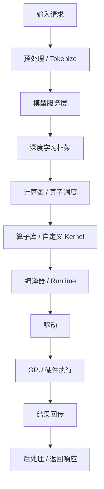
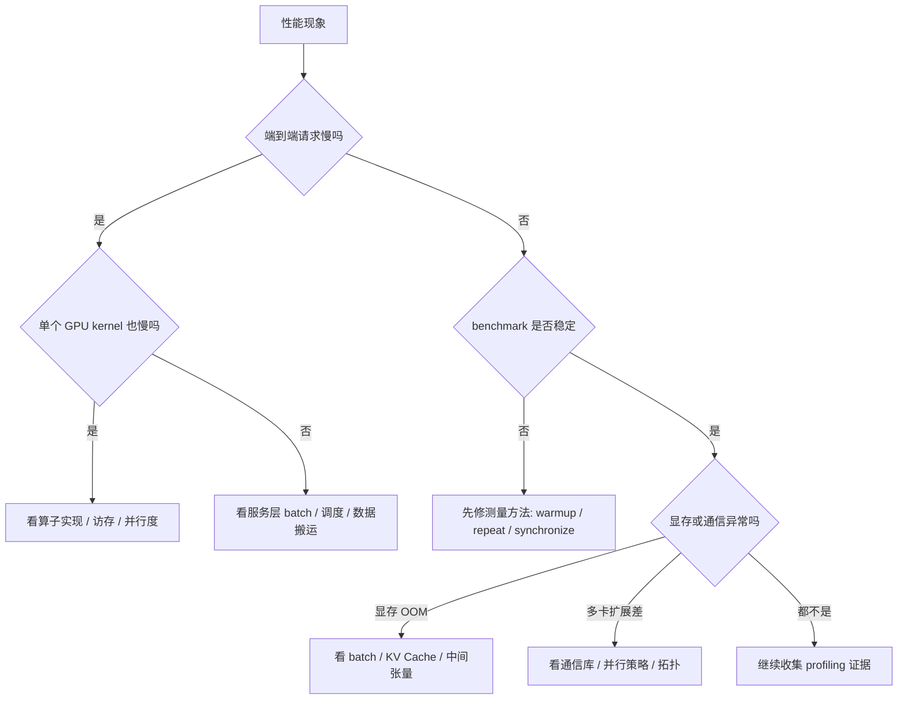
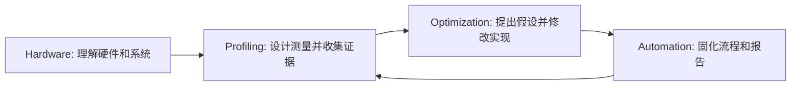

# 第2章 AI Infra 全景图

## 本章导读

> [第 1 章](../../part0-preface/chapter2/index.md)我们解决了"机器能不能跑起来"这件事——确认 GPU 可见、PyTorch 能调用 ROCm、最小 HIP 程序能编译运行。现在，机器已经就绪，本章要回答一个更关键的问题：**跑起来之后，AI Infra 到底在盯着什么看？**
>
> 我们会跟着一次推理请求，从最上层的用户输入一路走到最底层的 GPU 执行，把模型、框架、算子、编译器、运行时和硬件串成一条完整的链路。读完这一章，你不一定立刻就能动手优化一个模型，但你会获得一张"AI Infra 地图"——当别人告诉你"它很慢"时，你能心里有底地反问回去：**慢在哪一层？**

很多人刚接触 AI Infra 的时候，会习惯把所有的性能问题都归结为一句话："GPU 没跑满。"——这句话听起来像个结论，但其实只是一个现象。GPU 没跑满，可能是因为数据还没送到 GPU 手里；可能是因为 kernel（GPU 上跑的一段并行代码）太碎，启动开销太大；可能是因为某个算子（一个数学运算的具体实现）不适合当前硬件的执行方式；也可能是因为服务层的 batch（把多个请求攒在一起处理）策略出了问题，GPU 在等活儿干。

换句话说，没有一张完整的地图，光看一个利用率数字是无法做出判断的。所以在动手优化之前，我们先得把这张地图铺开。

## 2.1 从模型到硬件：一次推理请求经历了什么

先想象一个最普通的模型推理请求：用户发来一段输入，服务端返回模型输出。站在应用层看，这只是一次函数调用；但站在 AI Infra 的视角看，它会穿过很多层。

  
图 2.1 一次模型请求从输入到 GPU 执行再到返回的简化路径

如图 2.1 所示，一次请求并不是“直接跑到 GPU 上”。它先经过服务层和框架层，再变成一个个算子，最后才落到 GPU kernel 上。每一层都有可能成为瓶颈。

在继续之前，先认识几个本章会反复出现的关键词：

- **kernel**：GPU 上跑的一段并行代码，可以先理解成”交给 GPU 的一个小任务”；
- **算子**：一个数学运算的具体实现，比如矩阵乘、Softmax、向量加法；
- **Runtime**：程序和硬件之间的中间人，负责把任务提交给 GPU、管理内存和同步状态。

举几个很常见的例子：

| 现象 | 可能落在哪一层 | 直觉解释 |
| ---- | ---- | ---- |
| 单次请求延迟很高 | 服务层 / 推理引擎 / 算子层 | 可能是 batch（攒多个请求一起处理）策略、KV Cache（大模型推理时保存历史上下文的缓存）、某个算子或数据搬运拖慢了整体链路 |
| GPU 利用率忽高忽低 | 调度层 / Runtime / kernel launch | GPU 可能一直在等 CPU 发任务，或者 kernel launch（启动 GPU 小任务）太频繁、任务太碎 |
| 某个模型换引擎后变快 | 推理引擎 / 编译器 / 算子库 | 新引擎可能做了图优化、算子融合或更好的内存规划 |
| 手写 kernel 没有想象中快 | 算子层 / 硬件层 | 访存、并行度、寄存器压力（每个线程临时变量太多）或同步方式（等其他线程完成的方式）可能不合适 |
| 显存占用突然爆掉 | 模型结构 / 推理引擎 / 内存规划 | 可能是 batch、KV Cache、中间张量或 allocator（内存分配器）策略不合适 |
| 多卡扩展效果很差 | 通信库 / 并行策略 / 网络拓扑 | 可能是通信开销、负载不均或同步点太多 |
| benchmark 结果每次波动很大 | 测量方法 / 系统环境 | 可能没有 warmup（预热）、没有同步、输入规模太小，或者后台负载干扰 |

这就是 AI Infra 和“会调用模型”的区别：前者要把问题放回整条链路里看，而不是只盯着最上层 API 或最底层 GPU。

## 2.2 AI Infra 的核心模块

上一节我们跟着一次请求走完了从模型到硬件的完整链路。现在做一个思维实验：把这条链路里的每一层，放进对应的”房间”里。每个房间住着一类工具，回答一类问题。

AI Infra 不是一个单独的工具，而是一组围绕”让模型高效运行”的工程能力。下面这张表里有不少陌生的工具名——第一次看完全不用记。你只需要把它当成一张索引地图：知道哪些工具住在哪个房间。等后面真正用到某个工具时，再翻回来对照位置就够了。

| 模块 | 主要回答的问题 | 典型对象 |
| ---- | ---- | ---- |
| 模型服务 | 请求怎么进来，怎么排队，怎么返回 | HTTP/gRPC 服务、batch、并发、流式输出 |
| 深度学习框架 | 模型如何表达，算子如何调度 | PyTorch、TensorFlow、JAX |
| 算子与 Kernel | GPU 上真正执行什么计算 | Matmul、Softmax、Attention、Reduction |
| 算子库 | 常见算子有没有高性能实现 | rocBLAS、MIOpen、hipBLAS、Composable Kernel |
| 编译器 | 能不能自动改写计算图和生成更优代码 | TorchInductor、Triton、MIGraphX、MLIR |
| Runtime / Driver | 程序如何把任务交给 GPU | HIP Runtime、HSA Runtime、AMDGPU Driver |
| Profiling / Benchmark | 慢在哪里，证据是什么 | rocprof、PyTorch Profiler、Omniperf |
| 自动化系统 | 能不能把实验闭环重复跑起来 | benchmark pipeline、报告生成、AutoInfra Agent |

你更需要记住的是：**每个模块都回答不同层次的问题**。

例如 `torch.matmul` 很慢时，至少有几种可能：

1. 输入 shape 不适合当前算子库；
2. 数据在 CPU 和 GPU 之间来回搬；
3. 框架调度了很多细碎 kernel；
4. 当前 GPU 的访存带宽没有被利用好；
5. 你的测量方式把初始化、编译或数据准备时间也算进去了。

同样是“慢”，背后的处理方式完全不同。AI Infra 的第一步不是马上优化，而是先判断自己站在哪一层。

## 2.3 算子优化、推理优化、编译器优化分别解决什么问题

前面你已经看到，"慢"可能落在很多层。后续章节会反复出现三类优化：算子优化、推理优化、编译器优化。它们都和性能有关，但盯住的层次完全不同。把这三者的边界搞清楚，是 AI Infra 工程师的基本功。

### 算子优化：盯住一个计算单元

可以把算子优化想成调整一辆赛车的某个零件，比如发动机里的一个活塞。车整不整洁先不管，这里只盯住一个小部件能不能更快、更稳。

算子优化关心的是：一个具体 kernel 在 GPU 上跑得够不够好。

典型问题包括：

- 线程如何映射到数据；
- 全局内存访问是否连续；
- LDS 是否能复用数据；
- 寄存器是否太多影响 occupancy；
- 一个 block / wavefront 的工作量是否合适。

比如后面写 Vector Add、Reduction、Matmul 时，我们会关心每个线程干什么、读写哪些地址、是否有同步，以及数据有没有被重复加载。

### 推理优化：盯住端到端链路

推理优化更像重新设计赛车从起跑到冲线的整套流程：什么时候进站、怎么换胎、什么时候加速、哪里容易排队。单个零件很重要，但整条路线也会拖慢结果。

推理优化关心的是：一次请求从进入系统到返回结果，整体是否高效。

它不只看单个 kernel，还会看：

- batch size 和并发策略；
- prefill / decode 阶段的差异；
- KV Cache 占用；
- 数据预处理和后处理；
- 模型加载、内存复用和服务调度；
- TTFT、TPOT、吞吐和尾延迟。

所以推理优化经常会遇到一种情况：单个 kernel 已经不慢，但端到端仍然慢。原因可能在调度、缓存、batch 或服务层。

### 编译器优化：盯住图和程序变换

编译器优化像有个工程师不直接换零件，而是改写图纸：同样的功能，换一种装配顺序，少搬几次材料，可能就更快。

编译器优化关心的是：能不能自动把原始计算图或程序改写成更适合执行的形态。

常见优化包括：

- 算子融合；
- 常量折叠；
- 布局变换；
- memory planning；
- kernel selection；
- autotuning。

编译器优化不是魔法。它通常是在“保持语义不变”的前提下，减少不必要的中间结果、减少访存、减少 kernel launch，或者选择更适合当前 shape 和硬件的实现。

下面这张表可以帮你区分三者：

| 优化类型 | 关注对象 | 常见问题 | 后续对应篇章 |
| ---- | ---- | ---- | ---- |
| 算子优化 | 单个 kernel / 单个算子 | 这个算子为什么慢 | HIP 算子、Triton 算子 |
| 推理优化 | 一次请求或一条服务链路 | 端到端延迟和吞吐为什么不理想 | 推理优化与模型部署 |
| 编译器优化 | 计算图和程序变换 | 能否自动融合、改写、选择实现 | AI 编译器与自动调优 |

如果把所有性能问题都归因于 kernel，很容易走偏。真正的工程判断，是先定位层次，再选择工具。

## 2.4 AI Infra 工程师的核心能力模型

前面我们把优化按对象分成了三类，但一个更根本的问题是：**做这些优化的人**，到底需要哪些能力？这一节就把这个问题答了——它会成为后面所有章节训练的目标。

AI Infra 的学习曲线之所以陡，是因为它横跨了好几层：上面有模型和框架，下面有 runtime 和硬件，中间还有 benchmark、profiling、编译器和工程系统。一眼看上去，要学的东西似乎无穷无尽。

但不用被吓住。你可以先把能力拆成四类，每一类都有明确的训练路径。

| 能力 | 你要能做到什么 | 本教程会怎么训练 |
| ---- | ---- | ---- |
| 硬件理解 | 看懂 GPU 执行模型和内存层次 | 从 CU、Wavefront、LDS、访存开始建立直觉 |
| 测量分析 | 用 benchmark 和 profiling 找证据 | 从简单算子开始，逐步引入 rocprof、PyTorch Profiler、Omniperf |
| 工程实现 | 写出可运行、可对比的优化版本 | 用 HIP / Triton 实现常见算子和优化实验 |
| 复现表达 | 把环境、命令、结果和结论写清楚 | 每个实验保留代码、输出和报告结构 |

这四类能力是相互支撑的。只懂硬件但不会测量，很容易凭感觉优化；只会跑 profiler 但不懂硬件，看见指标也不知道意味着什么；只会写代码但不记录实验，过几天就没人知道哪个版本真的更快。

后面的毕业项目也会把这四类能力合在一起：Agent 先读取 benchmark 和 profiling 结果，这是测量分析；再根据硬件和软件栈判断瓶颈，这是硬件理解；然后修改 HIP / Triton / 推理配置，这是工程实现；最后把命令、结果和结论整理成报告，这是复现表达。

AI Infra 不是“背工具名”，而是建立一个稳定的工作方式：先理解系统，再测量，再动手，再复盘。

## 2.5 拿到性能问题时先怎么分诊

理论讲完了，来点实战的。这一节给你一个非常实用的入口：当你手上只有一句”它很慢”时，先不要急着改 kernel，而是像医生分诊一样，先判断问题更像落在哪一层。

  
图 2.2 性能问题的第一轮分诊路径

如图 2.2 所示，分诊的目的不是一次猜中答案，而是避免一开始就跑错方向。如果 benchmark 本身不稳定，就先别谈优化；如果端到端慢但单个 kernel 不慢，就别只盯着算子；如果显存或多卡通信已经异常，问题也未必在单卡计算上。

这里有三个后面会反复出现的新词：

- warmup：正式计时前先跑几次，让缓存、JIT 编译和设备状态进入稳定状态；
- repeat：同一个实验重复跑多次，不用一次结果下结论；
- synchronize：GPU 任务通常是异步提交的，计时前后要等 GPU 真的算完。

小练习：你用 PyTorch 跑一个模型，发现单次推理 200 ms，CPU 利用率正常但 GPU 利用率只有 30%。按图 2.2 的分诊路径，你会先问哪几个问题？（提示：答案不是”优化 kernel”。）

如果你是从推理部署方向进来的，[第 4 章](../chapter3/index.md)的 baseline benchmark 习惯比代码本身更值钱。后面整本书的实验都会沿着一条明确的顺序走：**先稳定测量，再判断层次，再动手优化**。

## 2.6 本教程的学习闭环：理解 -> 测量 -> 优化 -> 自动化

分诊只是入口。一旦你判断出问题落在哪一层，真正做下去的时候，会反复走同一个闭环——这一节就把这个闭环讲清楚。

本教程后面会反复使用一个闭环：理解、测量、优化、自动化。为了方便记忆，也可以把它叫做 HPOA：Hardware、Profiling、Optimization、Automation。

  
图 2.3 HPOA：本教程反复使用的 AI Infra 学习闭环

如图 2.3 所示，这不是一条直线，而是一个循环。你不会只测一次，也不会只优化一次。每一次修改都要回到测量，确认它是否真的改善了目标指标。

后续篇章大致会沿着这个顺序展开：

1. 先理解 AMD GPU 和 ROCm 的基础结构；
2. 再学习如何设计可信 benchmark；
3. 然后用 profiling 工具找到瓶颈证据；
4. 接着用 HIP / Triton 写出优化版本；
5. 再把问题放到推理链路和编译器视角里看；
6. 最后把这些步骤整理成 AutoInfra Agent 的自动化闭环。

这也是为什么本教程不会一上来就追求"最快代码"。**先把问题分清楚，再用数据确认方向**——这样换出来的优化才不是一次性的运气，而是下次还能放心复用的方法。

到这里，AI Infra 的地图已经在你手上了。下一章，我们把镜头从整条链路收回来，对准地图最底层的那块地基——AMD GPU 和 ROCm 软件栈本身。

## 本章小结

- 一次模型请求会穿过服务层、框架层、算子层、runtime、驱动和硬件层——每一层都可能成为瓶颈。
- AI Infra 优化的第一步不是改 kernel，而是判断问题落在哪一层。
- 算子优化盯单个 kernel、推理优化盯端到端链路、编译器优化盯图和程序变换——三者边界不同，不能混在一起看。
- AI Infra 工程师需要同时具备硬件理解、测量分析、工程实现和复现表达四类能力。
- 拿到性能问题时，先按分诊路径判断它更像服务、框架、算子、运行时还是硬件问题。
- 本教程后续会围绕 HPOA 闭环展开：理解硬件 → 收集证据 → 提出优化 → 自动化复盘。

## 延伸阅读

- [AMD ROCm Documentation](https://rocm.docs.amd.com/)
- [PyTorch Profiler](https://pytorch.org/tutorials/recipes/recipes/profiler_recipe.html)
- [Triton Language Documentation](https://triton-lang.org/main/index.html)
