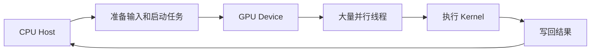
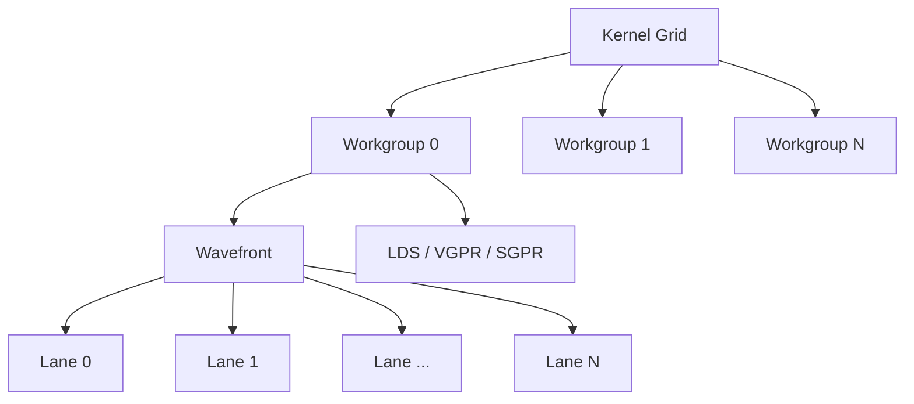
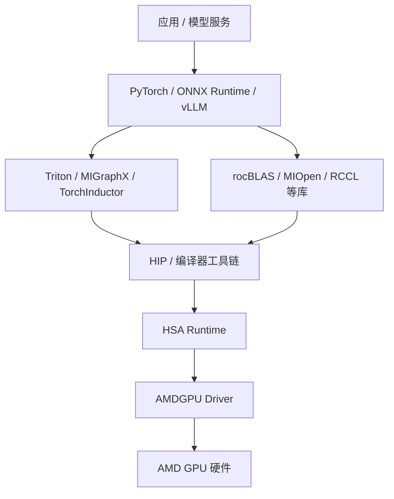
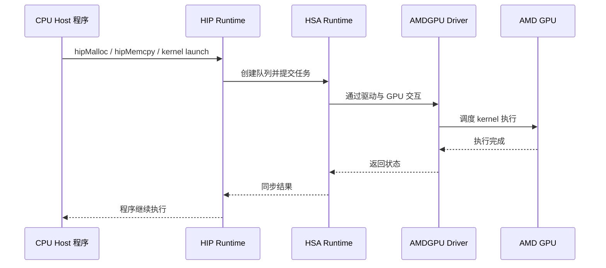
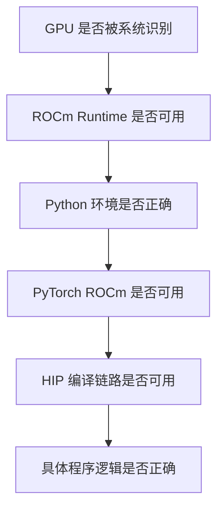

# 第3章 AMD GPU 与 ROCm 软件栈

## 本章导读

> 上一章我们站在一次推理请求的视角，把 AI Infra 的整条链路从头看到了尾。这一章，我们把镜头往下推，对准链路最底层的那块地基——AMD GPU 和 ROCm 软件栈本身。
>
> 我们不会一上来就钻进所有硬件细节，而是先建立一个**最小可用的心智模型**：GPU 是怎么并行执行的？ROCm 这套软件栈又怎么把上面的 PyTorch、Triton 一路连到硬件？以及后面会反复出现的 CU、Wavefront、LDS、HIP、HSA，分别站在哪一层？读完这一章，再看到这些名词时，你心里至少能给它们对号入座。

[第 2 章](../chapter1/index.md)我们把 AI Infra 看成一条从模型到硬件的链路。同一片地，换一个视角来看：那一章是站在请求角度串模块，本章是站在 AMD / ROCm 角度拆地基。

如果你只想从这一章带走一句话，可以是这一句：**ROCm 是 AMD GPU 的软件栈，HIP 是你最常直接接触到的编程接口，而真正执行计算的，是 GPU 上成千上万个并行线程。**

## 3.1 AMD GPU 基本架构

CPU 和 GPU 都能执行程序，但**它们擅长的事完全不一样**。

CPU 更像少数几个很强的工人——能做复杂的判断、灵活地切换任务、处理各种意外。GPU 则像一大群节奏统一的工人——单兵能力一般，但胜在人多、动作整齐，特别擅长"同一件事一次干一万份"（如图 3.1 所示）。

  
图 3.1 类比示意：CPU 像几位精英工人，GPU 像一支整齐的大型小队

这就是为什么深度学习适合 GPU：矩阵乘、卷积、Softmax、Attention 这类计算，本质上都包含大量结构相似的数值运算。

实际写程序时，CPU 和 GPU 的分工可以画成图 3.2 这条链：

  
图 3.2 CPU 负责调度，GPU 负责大规模并行执行

如图 3.2 所示，CPU 侧通常负责准备数据、分配显存、启动 kernel；GPU 侧负责执行真正的大规模并行计算。

在 AMD GPU 上，你后面会反复遇到几个词。可以先把它们当成一个工厂里的角色清单：

| 名词 | 工厂类比 | 技术含义 |
| ---- | ---- | ---- |
| Kernel | 写给 GPU 的菜谱 | 跑在 GPU 上的一段并行函数 |
| Work-item / Thread | 具体干活的工人 | 最小的并行执行单元之一 |
| Wavefront | 按同一个节拍干活的班组 | 一组一起调度执行的线程 |
| CU | 车间里的一条流水线 | Compute Unit，GPU 上执行 wavefront 的核心单元 |
| LDS | 流水线工人共用的工作台 | CU 内部的高速共享存储 |
| VGPR / SGPR | 每个工人手里的笔记本 | GPU 线程执行时使用的寄存器资源 |

这些名词一开始看起来多，但它们都服务于同一个问题：一份“菜谱”到底怎样分给很多工人，在 GPU 上铺开执行。

## 3.2 CU、Wavefront、SIMD、LDS、VGPR、SGPR

这一节的名词看起来全是硬件细节，但它们其实只回答一个问题：**为什么有时候开了一万个线程，GPU 反而没变快？** 后面写算子时你会反复撞上这个问题——线程多了，访存乱了，寄存器不够了，这些问题都藏在这些名词背后。现在先认个脸，后面写代码时再回来看，感受会完全不同。

先从 CU 开始。CU，全称 Compute Unit，可以粗略理解为 AMD GPU 上负责执行计算的一组硬件资源。一个 GPU 里会有多个 CU，kernel 启动后，许多 workgroup 会被分派到这些 CU 上执行。

但 GPU 不是让每个线程都完全独立、随心所欲地跑。AMD GPU 里常见的执行单位叫 wavefront。一个 wavefront 是一组一起调度的线程，它们在 SIMD 执行模型下推进。

下面这张表先给出最小解释：

| 名词 | 位置 | 对性能的影响 |
| ---- | ---- | ---- |
| CU | GPU 的计算单元 | CU 越忙，GPU 计算资源利用越高 |
| Wavefront | 一组一起执行的线程 | 分支发散、访存模式会影响 wavefront 效率 |
| SIMD | 单指令多数据执行方式 | 适合大量线程执行相同操作 |
| LDS | CU 内部高速共享存储 | 用得好可以减少全局内存访问 |
| VGPR | 每个线程使用的向量寄存器 | 用太多会降低同时驻留的 wavefront 数量 |
| SGPR | 存放标量值的寄存器 | 常用于地址、常量、控制信息 |

  
图 3.3 Kernel、Workgroup、Wavefront 和硬件资源的关系

如图 3.3 所示，kernel 的并行层级会逐步映射到 GPU 硬件资源上。后续写 HIP kernel 时，你会看到 `blockIdx`、`threadIdx` 这些概念；它们描述的是程序层面的并行组织。到了硬件层，它们会进一步映射到 workgroup、wavefront 和 CU 的执行上。

图 3.4 这张工厂剖面图把上面的层级关系画得更直观一些（如图 3.4 所示）：

  
图 3.4 类比示意：GPU 工厂里 CU、Workgroup、Wavefront、Lane 之间的层级

这里最容易踩的认知坑是：**线程越多不一定越快**。

如果每个线程都从全局内存乱读乱写，GPU 可能大部分时间都在等数据；如果一个 kernel 用了太多寄存器，同一个 CU 上能同时驻留的 wavefront 变少，延迟隐藏能力也会下降；如果分支太多，同一个 wavefront 里的 lane 不能一起有效工作，SIMD 的优势也会打折。

所以后续做算子优化时，我们不会只问“开了多少线程”，还会问：

- 这些线程访问内存是否连续；
- 同一个 wavefront 内部是否走相同分支；
- 有没有把可复用数据放进 LDS；
- 寄存器使用量是否影响 occupancy；
- 每个线程的工作量是否太少或太多。

这些问题现在先有印象就够了，后面的 HIP 和 Triton 章节会用具体代码把它们串起来。

案例：连续 vs 非连续访存

  
图 3.5 连续访存更容易合并，非连续访存会制造更多内存事务

  
图 3.6 同一个 Wavefront 内部分支越整齐，lane 利用率越高

## 3.3 HBM、Cache 与访存层次

很多 AI 算子看起来是在”算”，但真正的瓶颈经常是”搬数据”。这一节我们就来拆开 GPU 的存储系统，看看数据在搬动过程中会遇到什么。

矩阵乘之所以值得花大力气优化，不只是因为乘加计算多，更因为数据能不能被重复利用决定了最终效率；Softmax 之所以容易受访存拖累，是因为它要读输入、做归约、写输出，每一步都在和数据搬运打交道；Attention 之所以复杂，是因为它同时牵涉矩阵乘、Softmax、Mask、KV Cache 和内存布局——搬数据的路径比计算本身更难理顺。

你可以先把 GPU 的访存层次画成一座金字塔（如图 3.7 所示）：

  
图 3.7 GPU 访存层次的金字塔视图

如图 3.7 所示，越靠上通常越快、容量越小；越靠下容量越大，但访问代价更高。

在数据中心 GPU 上，显存通常是 HBM。在 AI MAX 395 这类 APU 上，GPU 使用的是面向整机的内存资源，工具里仍然可能以“显存占用”的形式展示。无论底层形态是什么，对性能分析最重要的仍然是三件事：带宽、局部性、复用。

| 关注点 | 问题 | 例子 |
| ---- | ---- | ---- |
| 带宽 | 单位时间能搬多少数据 | 大向量逐元素读写容易受带宽影响 |
| 局部性 | 数据访问是否集中、连续 | 连续线程访问连续地址通常更友好 |
| 复用 | 同一份数据能否多次使用 | Matmul 会尽量复用 tile 里的数据 |

后面你会经常看到两个词：memory-bound（被搬数据卡住）和 compute-bound（被算数卡住）。这是判断一个算子瓶颈的最基本分类。

- memory-bound：主要时间花在等数据，优化方向通常是减少访存、改善访问模式、提高复用；
- compute-bound：主要时间花在计算，优化方向通常是提高并行度、使用更合适的数据类型或指令路径。

判断一个 kernel 属于哪类，不能靠猜。第 2 篇会用 benchmark、profiling 和硬件计数器来收集证据。

## 3.4 ROCm 是什么

前面三节我们都站在 GPU 硬件视角看东西：CU 怎么调度、wavefront 怎么并行、数据怎么从显存搬上来。现在把镜头往上拉一层——你写的 PyTorch / HIP 代码，到底是怎么一路递到 GPU 上的？答案就藏在 ROCm 这套软件栈里。

ROCm（Radeon Open Compute）可以理解为 AMD GPU 的开放软件栈。它负责把上层框架、编译器、运行时、库和驱动连接起来，让程序能在 AMD GPU 上运行。它不是单个命令，也不是单个库——它是一整套分层组件。

  
图 3.8 ROCm 软件栈把上层框架连接到 AMD GPU 硬件

如图 3.8 所示，ROCm 不是单个命令，也不是单个库。它是一整套分层组件。

目前你只需要知道：PyTorch 在最上面，马上就会用到；HIP 和 `hipcc` 在中间，[第 4 章](../chapter3/index.md)就会用到；HSA Runtime 和 AMDGPU Driver 在最下面，平时一般不直接写，但排错时会听到它们的名字。其他名字先认个位置，遇到再回来查。

| 层次 | 作用 | 你会在哪里接触 |
| ---- | ---- | ---- |
| 上层框架 | 表达模型和张量计算 | PyTorch、ONNX Runtime、vLLM |
| 编译器 / 图优化 | 改写图、生成或选择 kernel | Triton、MIGraphX、TorchInductor |
| 算子库 | 提供常见高性能算子 | rocBLAS、MIOpen、hipBLAS |
| HIP 工具链 | 编写和编译 GPU 程序 | `hipcc`、HIP Runtime |
| HSA Runtime | 管理 GPU 队列、内存和调度接口 | 通常不直接写，但 profiling 时会看到 |
| Driver | 和内核、硬件交互 | 环境排错时会接触 |
| GPU 硬件 | 真正执行 kernel | CU、Wavefront、LDS、寄存器、内存层次 |

平时写教程实验时，你最常直接接触的是 PyTorch、Triton、HIP、rocprof、rocm-smi 这些工具。它们背后都在调用 ROCm 栈里的不同组件。

## 3.5 HIP、HSA、AMDGPU Driver 的关系

前面看了 ROCm 的分层全貌，这一节聚焦其中最容易被混淆的三个名字，把一条 HIP 程序从 Host 端提交到 GPU 执行的完整路径拆开。

HIP、HSA、AMDGPU Driver 这几个词很容易混在一起，可以先这样区分：

- HIP 是给程序员用的 GPU 编程接口；
- HSA Runtime 是更底层的运行时接口；
- AMDGPU Driver 是操作系统里负责和 GPU 硬件交互的驱动。

当你编译并运行一个 HIP 程序时，大致路径如下。先用白话翻译一下：你的 C++ 代码说“在 GPU 上分配点显存、拷点数据、启动一个并行函数”，这条命令要经过 HIP、HSA、驱动、硬件几道转手，才真正落到 GPU 上。

  
图 3.9 HIP 程序从 Host 侧提交到 AMD GPU 执行的简化路径

如图 3.9 所示，HIP 是你写代码时看到的接口，但它不是最底层。它会继续通过 runtime 和 driver 把任务提交给硬件。换成更直观的画面，可以把这条链路想成一个 4 棒接力赛（如图 3.10 所示）：

  
图 3.10 类比示意：HIP 程序的 Host→HIP→HSA→Driver→GPU 接力链路

这也解释了为什么排错时要分层：

| 失败位置 | 可能看到的现象 |
| ---- | ---- |
| Driver / 设备识别 | `rocminfo` 看不到 GPU |
| ROCm Runtime | 框架无法初始化 GPU 后端 |
| HIP 编译器 / device library | `hipcc` 编译失败 |
| 框架依赖 | `import torch` 成功但 `torch.cuda.is_available()` 为 False |
| 程序逻辑 | kernel 能运行但结果错误 |

[第 1 章 1.3 节](../../part0-preface/chapter2/index.md#_1-3-验证-gpu-可见性)的环境验证之所以从 `rocminfo`、`rocm-smi` 开始，再到 PyTorch 和 HIP，就是为了从底层到上层逐层确认。

## 3.6 PyTorch / Triton / MIGraphX / vLLM 与 ROCm 的关系

理解了 ROCm 是什么，后续你会接触很多站在它之上的工具。它们并不是 ROCm 的替代品，而是利用 ROCm 提供的能力，从不同角度使用 GPU。

| 工具 | 主要定位 | 和 ROCm 的关系 |
| ---- | ---- | ---- |
| PyTorch ROCm | 深度学习框架 | 通过 ROCm 后端把张量计算放到 AMD GPU 上 |
| Triton on AMD | 高层 GPU kernel 编程和自动调优 | 生成面向 AMD GPU 的 kernel，需要 ROCm 编译和运行能力 |
| MIGraphX | AMD 的图优化和推理编译工具 | 把模型图优化后落到 ROCm / AMD GPU 执行 |
| ONNX Runtime ROCm | ONNX 推理运行时 | 通过 ROCm Execution Provider 使用 AMD GPU |
| vLLM on AMD | LLM 推理服务框架 | 依赖 PyTorch / ROCm / kernel 支持，具体能力和版本强相关 |

可以把 ROCm 想成地基。PyTorch、Triton、MIGraphX、vLLM 是建在地基上的不同房间。房间用途不同，但地基不稳，哪个房间都住不舒服。

这也是为什么[第 1 章 1.3 节](../../part0-preface/chapter2/index.md#_1-3-验证-gpu-可见性)先验证底层环境，而本章再解释软件栈。等你后面遇到 PyTorch、Triton 或推理引擎报错时，可以先判断：这是上层工具自己的问题，还是 ROCm 底层链路没通。

## 3.7 如何检查一台机器的 AMD GPU 环境

[第 1 章 1.3 节](../../part0-preface/chapter2/index.md#_1-3-验证-gpu-可见性)已经带你跑过一组检查命令。本节不重复贴输出，而是把这些命令放回软件栈的语境里——让每个"验证动作"和 ROCm 的某一层对上号。这样以后排错时，你不再是盲目地反复敲命令，而是知道自己正在敲打哪一层。

| 命令 | 它在敲打什么 | 如果失败，先怀疑哪里 |
| ---- | ---- | ---- |
| `rocminfo` | 敲打 GPU 本身，问“你叫什么名字、是什么架构” | 设备识别、驱动或 ROCm runtime |
| `rocm-smi` | 敲打 GPU 本身，问“你现在状态怎样” | 设备状态、显存占用、功耗或权限问题 |
| `python -c "import torch"` | 敲打 Python 环境，问“框架包装好了没” | Python 依赖或当前虚拟环境 |
| `torch.cuda.is_available()` | 敲打 PyTorch，问“你有没有连上 GPU” | PyTorch ROCm 后端或 runtime 初始化 |
| `hipcc --version` | 敲打 HIP 编译器，问“你是不是当前环境里的工具链” | `ROCM_PATH`、`HIP_PATH` 或 uv 环境激活 |
| `hipcc xxx.hip` | 敲打编译链路，问“源文件能不能变成 GPU 程序” | 编译器、device library 或代码语法 |

排错时建议从下往上看：

  
图 3.11 AMD GPU 环境排错的推荐顺序

如图 3.11 所示，越底层的问题越应该优先排查。比如 `rocminfo` 都看不到 GPU，就没必要先研究 PyTorch；`ROCM_PATH` 没指到正确位置，也没必要先怀疑你的 HIP kernel 写错了。

这套顺序后面还会继续用。只不过到 profiling、推理服务和编译器章节时，我们会在每一层加入更多证据，而不是只看“能不能跑”。

小练习：在你自己的环境里跑一遍上面这 6 个命令，把每条命令的关键输出抄进一份临时的 `notes.md`。然后做一个小实验：故意先 `unset ROCM_PATH` 再激活环境，预测一下哪几条会先挂、报什么错。跑一次看看猜得对不对。这个小动作能帮你把"软件栈分层"这个抽象概念，和你机器上的真实输出绑在一起。

到这里，AMD GPU 这块地基我们已经从硬件结构、访存层次、ROCm 软件栈、HIP 提交链路一路看到了环境检查。下一章，终于要真正写一段代码，把这套地基用起来了。

## 本章小结

- AMD GPU 适合大量结构相似的并行计算，CPU 侧通常负责调度，GPU 侧负责执行 kernel。
- CU、Wavefront、LDS、VGPR、SGPR 是理解 AMD GPU 执行模型时最常见的基础词。
- 性能问题经常和访存层次有关，不能只看“算了多少”，还要看“搬了多少、怎么搬”。
- ROCm 是 AMD GPU 的软件栈，连接上层框架、编译器、算子库、runtime、driver 和硬件。
- HIP 是常用编程接口，HSA Runtime 和 AMDGPU Driver 位于更底层。
- 检查 AMD GPU 环境时，应该从设备识别、runtime、框架、编译器到具体程序逐层排查。

## 延伸阅读

- [ROCm Documentation](https://rocm.docs.amd.com/)
- [HIP Documentation](https://rocm.docs.amd.com/projects/HIP/en/latest/)
- [ROCm System Management Interface](https://rocm.docs.amd.com/projects/rocm_smi_lib/en/latest/)
