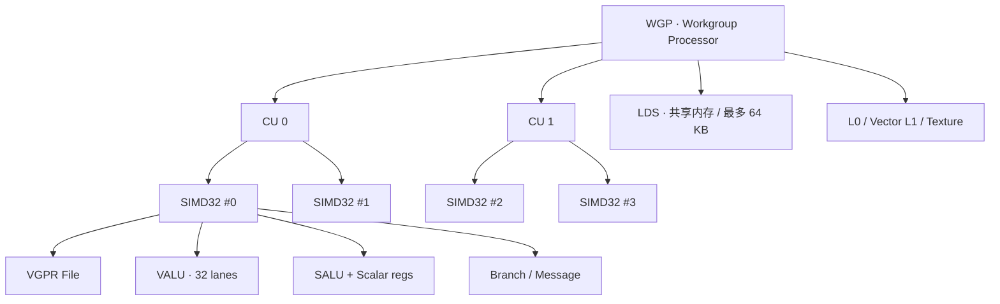
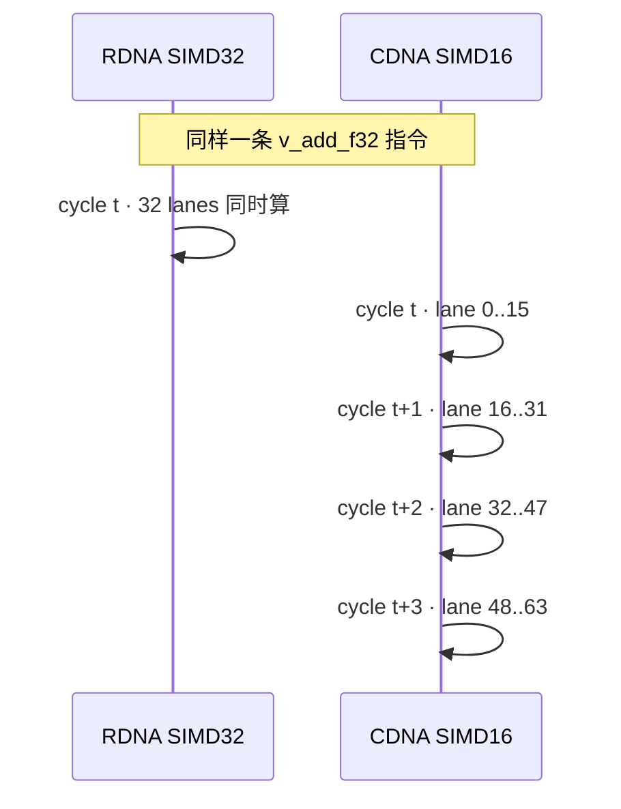
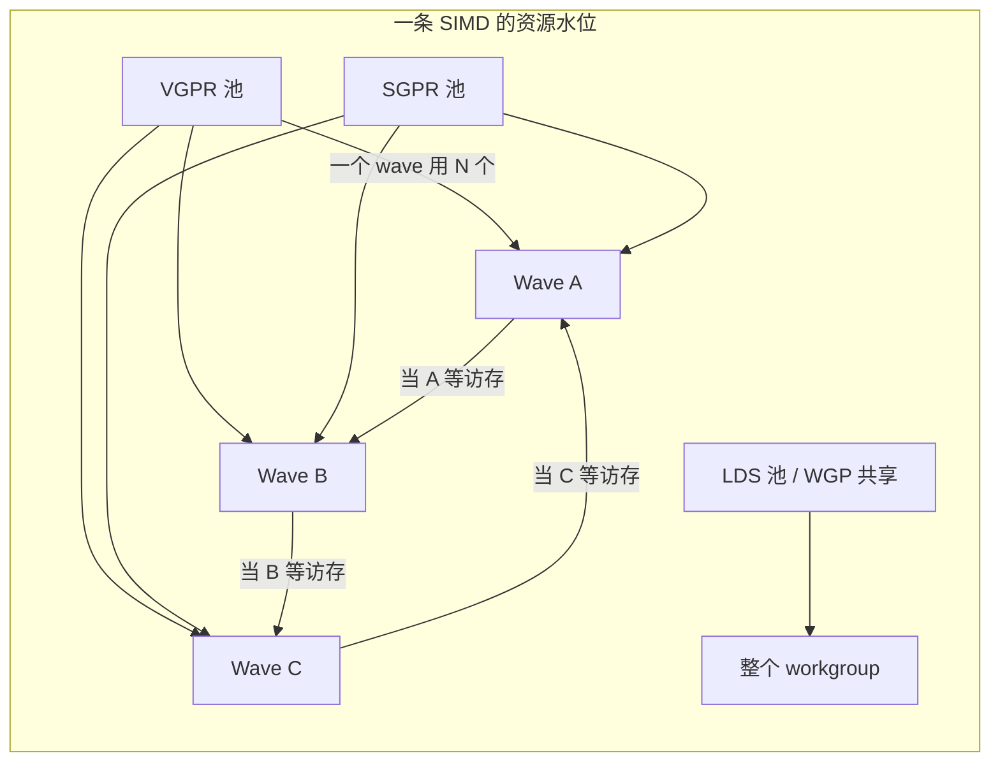
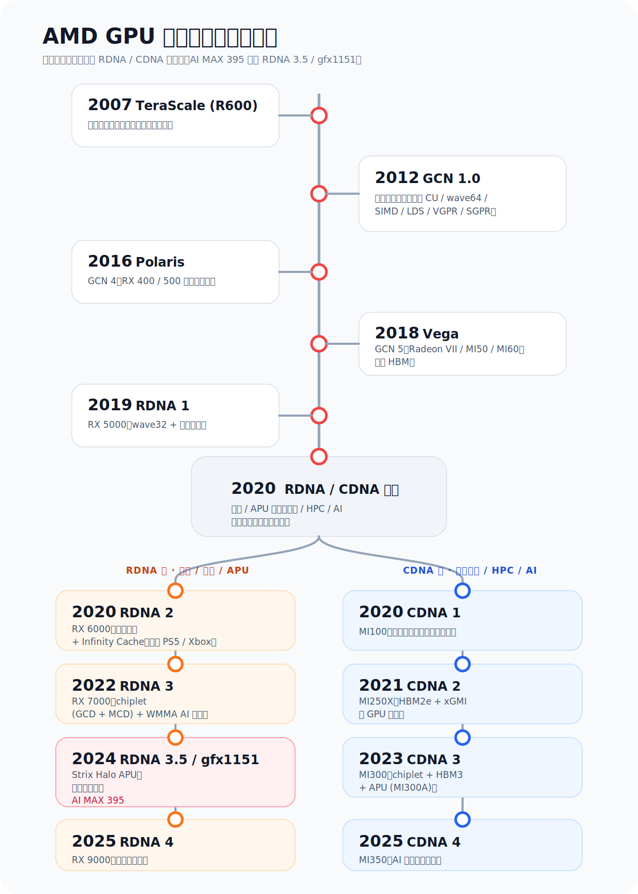
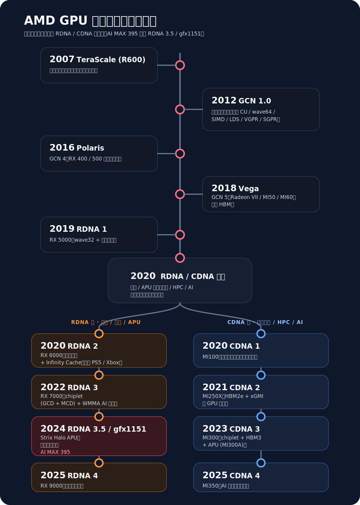
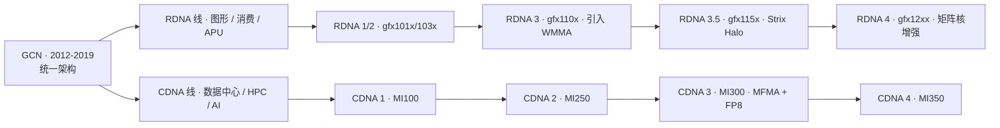
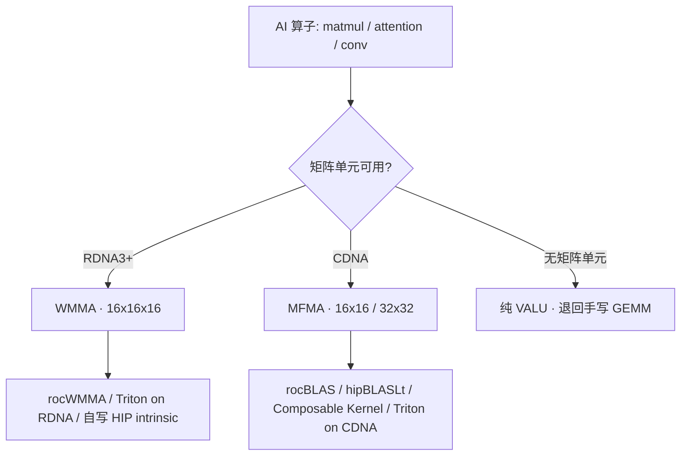

# 第3章 AMD GPU 体系结构

## 本章导读

> 本章建立后续优化会反复用到的 AMD GPU 硬件最小模型。读完后，你应该能用自己的话讲清楚一个 kernel 在 AMD GPU 上从 launch 到执行经过哪些硬件单元，能区分 RDNA 与 CDNA 在 AI 工作负载上的差异，并知道 gfx1151（AI MAX 395）在两条产品线中的位置。

[第 2 章](../chapter2/index.md) 我们把 AI Infra 看成一条从模型到硬件的链路，把"GPU 跑得怎么样"放回完整链路里看。这一章把镜头继续往下推，对准链路最底下、也是后面最常被点名的那一层：**AMD GPU 这块芯片本身**。

接下来你会反复在 profiler 报告、HIP 编译警告、AMD 工程博客里看到这些词：CU、SIMD、Wavefront、VGPR、SGPR、LDS、RDNA、CDNA、MFMA、WMMA。第一次读它们像在背单词，但一旦把它们组装成一张完整的硬件图，后面看 rocprof 输出、Triton autotune log 时，你会突然发现指标和指标之间的因果关系自己浮出来了。

整章我们走七步：先剖开一个 CU，再看 wavefront 怎么跑起来，再看寄存器和共享内存为什么是稀缺资源，然后跨过 RDNA 与 CDNA 之间那条产品线的分水岭，把本书硬件基线 gfx1151（AI MAX 395 / Strix Halo）安放在地图上，最后用 MFMA / WMMA 串联到 AI 算子，并把硬件参数翻译成 Roofline 上那两条线。

> **阅读方式提示**：本章是硬件概念章节，不要求你执行命令，也不要求你现在能写 HIP kernel。第一次阅读只需要建立一条主线——一个 kernel launch 后，会被拆成 workgroup / wavefront，最终落到 SIMD lane 上执行；VGPR、SGPR、LDS 会限制同时能跑多少 wave。其它术语第一次看不进去都没关系，下面这张表给你"现在掌握到什么程度"的尺子。

| 类型 | 术语 | 现在掌握到什么程度 |
| ---- | ---- | ---- |
| 本章必须懂 | CU、SIMD、Wavefront、VGPR、SGPR、LDS、RDNA、CDNA | 能说出它们在 GPU 执行路径中的位置和作用 |
| 先知道名字 | MFMA、WMMA、Roofline、occupancy | 知道它们和性能分析有关，后面会实测 |
| 后续再深入 | EXEC mask、bank conflict、intrinsic、BLOCK_M/N/K | 现在不用掌握细节，实验章节会展开 |

如果你刚从 CPU 思维切到 GPU 思维，可以先用 @fig-cpu-vs-gpu-workers 建立直觉：CPU 像少数几个擅长复杂判断的工人，GPU 像一大群动作统一的工人，适合把同一种计算同时铺到大量数据上。

::: figure fig-cpu-vs-gpu-workers


CPU 更适合复杂控制，GPU 更适合大规模同构并行计算
:::

## 3.1 Compute Unit（CU）的内部结构

这一节剖开"GPU 的最小车间"——Compute Unit（计算单元，简称 CU），看清楚 kernel 真正落到哪些执行单元上。

把整块 GPU 想象成一座大型工厂。从上往下看：芯片 → Shader Engine（着色引擎，分区）→ 一组 Workgroup Processor（WGP，工作组处理器）/ 一组 CU → 每个 CU 里若干 SIMD（单指令多数据执行管线）→ 每个 SIMD 里若干 lane（向量通道）。一个 kernel launch 出去，最终落到这些 lane 上完成乘加和访存。

写 HIP kernel 时看到的 thread / block / shared memory 这些概念，并不是凭空的抽象——它们都对应着上面这条硬件路径上的某一格。先把对照关系记下来，后面读代码就不会"硬件词"和"编程词"两套打架：

| 写代码时看到 | 硬件上大致对应 | 现在怎么理解 |
| ---- | ---- | ---- |
| thread / work-item | 一个 lane 上的一份执行 | 一个数据位置上的工作 |
| warp / wavefront | 一组同步执行的 work-item | AMD 上叫 wavefront；RDNA 默认 32，CDNA 默认 64 |
| block / workgroup | 一组 wave（同一 WGP 或同一 CU 上） | 块内 wave 之间可以共享 LDS |
| shared memory | LDS | block 内共享的高速 scratchpad |
| register | VGPR / SGPR | 每个线程或每个 wave 的临时变量空间 |

RDNA 体系下 CU 不是孤立的，而是两两组成一个 WGP；workgroup 内部的 wave（也叫 wavefront，波前）会被发射到同一个 WGP 的四条 SIMD32 上，并且可以共享 LDS。这是 RDNA 1 引入、RDNA 2/3/3.5 一路保留的核心组织方式：「Waves in a work-group are all issued to the same WGP but can run on any of the 4 SIMD32's and can share data through LDS」（来自 RDNA 3 ISA 参考手册）。CDNA 则没有 WGP 这层抽象，每个 CU 独立工作，4 条 SIMD16 逐周期执行 64 宽 wavefront[^cdna3-isa]。

如 @fig-wgp-simd-layout 所示，可以把 RDNA 一个 WGP 内部画成下面的层级：

::: figure fig-wgp-simd-layout


RDNA 体系下 WGP / CU / SIMD 的层级（按 RDNA 3 ISA 参考手册整理）
:::

如果觉得 Mermaid 层级图还是太抽象，可以对照 @fig-gpu-factory 的工厂类比看：GPU 不是“一大堆散乱线程”，而是按 CU / Workgroup / Wavefront / Lane 一层层组织起来的并行工厂。

::: figure fig-gpu-factory


GPU 工厂里 CU、Workgroup、Wavefront、Lane 之间的层级关系
:::

要看懂这张图，记住几个关键单元就够了：

- **VALU（Vector ALU，向量算术逻辑单元）**：每条 SIMD 一组，宽度 32 lane（RDNA）或 16 lane（CDNA）。kernel 里"每个线程做一次乘加"最终就落在它身上。
- **SALU（Scalar ALU，标量算术单元）**：每个 wavefront 共享一组标量执行单元和 SGPR（标量寄存器堆）。控制流（if / loop / 分支）、地址常量、wave 级广播信息都走这里。RDNA 3 ISA 明确写道："All kernel control flow ... is handled using scalar ALU instructions"。
- **Branch / Message Unit**：处理跳转、栈、s_waitcnt（等待访存完成）、跨 wave 通信等控制信号。
- **VGPR File（Vector 寄存器堆）**：每个 lane 私有一组 32 位寄存器，是 GPU 上"一线"的存储——SIMD 真正吃饭用的本子。
- **LDS（Local Data Share，本地共享内存）**：CU 或 WGP 内部一块软件可控的高速 scratchpad，多数 RDNA 上一个 workgroup 最多可见 64 KB，wavefront 之间通过它做 block 内归约和 tile 复用[^rdna3-isa]。
- **L0 / Vector L1 / Texture cache**：和 SIMD 配套的近端缓存。L0 是 RDNA 引入的 CU 私有读缓存，RDNA 3 在 RDNA 2 基础上把它从 16 KB 翻倍到 32 KB（来自 AMD RDNA 3 架构概述）。

把这些单元摆在一起，CU 的"分工"就很清楚了：SALU 决定**走哪条路**，VALU 决定**算什么**，LDS / 缓存决定**数据从哪里来**，VGPR/SGPR 决定**多少东西能同时在飞**。后面三节会逐一展开后两件事。

## 3.2 Wavefront 与 SIMT 执行

这一节讲 GPU 是怎么"一群线程一起走"的——wavefront 的概念，以及它对分支、访存的影响。

先记两个数字：**RDNA 上一个 wave 通常是 32 个 work-item（也叫 wave32）**，但 RDNA 3 ISA 明确允许 wave64 模式存在；**CDNA 上 wave 固定是 64**。RDNA 3 ISA 是这样定义的：「A wave is a collection of 32 or 64 work-items that execute in parallel on a single RDNA3 processor」；ROCm 文档里的 device hardware glossary 也给出对照规则：「For AMD Instinct GPUs, the wavefront size is 64 threads, while AMD Radeon GPUs have a wavefront size of 32 threads」[^rocm-glossary]。

为什么会有这两个数字的取舍？因为它对应硬件 SIMD 的宽度：

| 体系 | SIMD 宽度 | 默认 wave 宽度 | 一条向量指令的发射节奏 |
| ---- | ---- | ---- | ---- |
| RDNA / RDNA 2 / RDNA 3 / RDNA 3.5 | SIMD32 | 32（wave32）；可选 wave64 | 单周期发射（wave32 时 SIMD 与 wave 同宽） |
| CDNA / CDNA 2 / CDNA 3 | SIMD16 | 64（wave64） | 一条 wave64 在 SIMD16 上跨 4 个周期发射[^cdna3-isa] |

这张表解释了一个常被读者混淆的现象：CDNA 的 wave64 不是因为一次"瞬发"64 条计算，而是 SIMD16 跨 4 个时钟把 64 个 lane 处理完。这种设计在数据中心负载里能拿到更高的指令复用，但在分支密集的图形负载里就不划算——这是 RDNA 选 32 / CDNA 选 64 的根本动机之一。

如 @fig-wave-issue-timing 所示，把同一段简单 kernel 在 wave32 和 wave64 上的执行节奏画出来：

::: figure fig-wave-issue-timing


同一条向量指令在 RDNA SIMD32（wave32）与 CDNA SIMD16（wave64）上的节奏差异
:::

无论 wave 多宽，**同一个 wave 内部的所有 lane 永远共享同一个程序计数器（PC）**——这就是 SIMT（Single Instruction Multiple Threads，单指令多线程）执行模型。它带来一个直接后果：**分支发散（branch divergence）会让某些 lane 被强制空转**。

考虑这样一段代码：

```cpp
// 简化的 HIP kernel 片段
if (threadIdx.x < 16) {
    // 走 A 路
    compute_a(data);
} else {
    // 走 B 路
    compute_b(data);
}
```

在 wave32 模式下，前 16 个 lane 走 A、后 16 个 lane 走 B。硬件做不到"两路同时跑"——它会先用 EXEC mask（execution mask，执行掩码）把后 16 个 lane 屏蔽掉跑完 A，再把前 16 个屏蔽掉跑完 B。实际花费的时间是两条路径之和，而不是更长那条。如果一个 wave 内部有 N 个互不相同的分支去向，最坏情况就是 N 倍代价——所以"让同一个 wave 里的 lane 走相同分支"是 GPU 算子的基本功。

> **如果你还没写过 HIP kernel，可以这样理解**：同一组一起出发的 32 个线程最好走同一条路；如果一半走 A、一半走 B，硬件会先把走 B 那一半"暂停"跑完 A，再反过来跑完 B。被暂停的 lane 不是"另一个 CPU 核去做别的事"，而是真的空着等。EXEC mask 是硬件自己维护的开关，**不需要你在代码里手动控制**，你能做的只是别写出让一个 wave 切两半的 if。

::: figure fig-wavefront-divergence


同一个 Wavefront 内部分支越整齐，lane 利用率越高
:::

> 经验法则：写 kernel 时，**让分支沿着 wave 边界（32 / 64 的整数倍）切**，不要让一个 if 把同一个 wave 切两半。

另一个相关概念是 **occupancy（占用率）**：一个 SIMD 上同时驻留多少个 wave。RDNA 3 上一个 SIMD 最多可以驻留多个 wave，让它们轮流"挡延迟"——访存的 wave 先去等数据，计算的 wave 抢上 VALU 干活。但驻留 wave 数受 VGPR、SGPR、LDS 的约束（详见下一节）。这就是为什么我们说 occupancy、VGPR 用量、LDS 用量是绑在一起的三件事。

> **现在不需要手算 occupancy**。你只需要知道：occupancy 反映 GPU 同时塞进多少 wave 来隐藏访存等待；高不一定就好，关键是有没有被 VGPR / LDS 这些资源卡住。后面 [性能分析方法论](../../part2-profiling/chapter7/index.md) 章节会教你从 rocprof / Omniperf 的输出里看它是被哪个资源限制的。

## 3.3 VGPR、SGPR 与 LDS 资源

这一节讲清楚为什么 VGPR / SGPR / LDS 是 kernel 优化绕不开的"片上资源池"。

GPU 不像 CPU 那样靠"几级 cache + 重命名 + 大量乱序"来藏延迟。它靠的是**同一时刻让足够多的 wave 在飞**：当一个 wave 卡在访存上时，调度器立即切到另一个 wave 上跑 VALU。能"在飞"的 wave 数量越多，访存延迟越容易被掩盖。但 wave 不是免费的——每个 wave 都要占一份寄存器和共享内存。

把这块片上资源想象成一个**有上限的资源池**。每个 wave 在池子里"租"几样东西：

| 资源 | 谁在用 | 单位 | 多了的副作用 |
| ---- | ---- | ---- | ---- |
| VGPR（向量寄存器） | 每个 lane 私有 | 32-bit 寄存器 | 单 wave 越大 → 同 SIMD 上能驻留的 wave 越少 |
| SGPR（标量寄存器） | 整个 wave 共享 | 32-bit 寄存器 | 控制流、地址、常量太多会撑爆 SGPR 上限 |
| LDS（共享内存 / 工作台） | 整个 workgroup 共享 | KB | 单 workgroup 越大 → 同 WGP 上能驻留的 workgroup 越少 |

RDNA 3 ISA 给的定义很干脆：「SGPRs are 32-bit registers shared by work-items in each wave. VGPRs are 32-bit registers private to each work-item in a wave」。RDNA 一个 workgroup 在 LDS 上最多可见 64 KB[^rdna3-isa]。具体上限随代际略有变化（如 RDNA 3 把 L0 翻倍到 32 KB），所以本书所有"具体到几个 wave、几 KB"的数字会在第 4 章 [内存层次](../chapter4/index.md) 通过实测复核，**这里只讲机制**。

如 @fig-vgpr-sgpr-lds-pool 所示，可以把"占用率约束"画成一组并列的水位线：

::: figure fig-vgpr-sgpr-lds-pool


VGPR/SGPR/LDS 任何一项打满，都会限制可同时驻留的 wave 数量
:::

如 @fig-vgpr-sgpr-lds-pool 所示，三个资源池中**任何一个**先打满，就决定了 occupancy 的上限。这也是 rocprof / Omniperf 常给出 "VGPR-limited" / "LDS-limited" 这类标签的原因——它在告诉你瓶颈是哪个池子先没水了。

LDS 还有第二个性质：它不是一块纯线性内存，而是**分 bank** 的（多数 AMD GPU 上 32 个 32-bit bank）。同一周期里，如果同一个 wave 内不同 lane 访问到同一个 bank 的不同地址，就会发生 **bank conflict（bank 冲突）**——硬件会串行化访问。LDS 用得好不好的标准之一就是有没有让 bank conflict 控制住。具体怎么测，会在下一章 [内存层次与访存模式](../chapter4/index.md) 用 micro-benchmark 验证。

对 kernel 写手来说，这一节的实操含义是：

- 看到编译器报 VGPR > 某阈值就别忽略——同 SIMD 上能驻留的 wave 少了；
- block size（每个 workgroup 多少线程）和 LDS 用量是两个互相约束的旋钮，不能只看一个；
- 用 LDS 复用 tile 是手段，不是目的——如果一个 kernel 已经是 compute-bound，再多塞一份 LDS 反而会挤占其他 workgroup 的位置。

> **一个最小例子**：假设你写的 kernel 里每个线程有很多临时变量（中间结果、循环展开后的临时值、不必要的寄存器变量），编译器为了把它们都放下，每个线程要占的 VGPR 数就上去了。VGPR 总量是固定的，每个 wave 占的越多，同一个 SIMD 上能同时塞下的 wave 就越少。wave 少了，原来"A 在等访存时 B 顶上"的腾挪空间也就小了——结果就是访存延迟没人挡，VALU 闲在那里等数据。所以"减少不必要的临时变量、控制循环展开次数"在 GPU 上不仅是代码风格问题，而是直接影响 occupancy。

## 3.4 AMD GPU 演进简史：从 GCN 到 RDNA / CDNA

前面三节剖完了 CU、wavefront 和片上资源——这些不是凭空出现的概念，而是 AMD 一步步演化出来的。在跳到 RDNA 与 CDNA 的关键差异之前，先用一节把"AMD GPU 是怎么走到今天"串一遍，这样后续章节里冒出的 wave64 vs wave32、Infinity Cache、MFMA vs WMMA 才不会觉得是凭空蹦出的术语。

::: figure fig-amd-gpu-timeline



AMD GPU 主要架构演进时间线
:::

> **这条时间线不要求你背下来**。你只需要记住一件事：2019 年前后 AMD 把一条架构线分成了 RDNA（图形 / 消费 / APU）和 CDNA（数据中心 / HPC / AI）两条，之后所有"RDNA vs CDNA"的对比都从这次分叉开始。具体代际编号在用到时翻回这张图查就行。

把这条线分成三段看，每段都对应到本书后面会反复用到的某个概念。

**TeraScale → GCN（2007 → 2012）：从图形优先转向通用计算。** TeraScale 时代 AMD GPU 还按 VLIW（超长指令字，Very Long Instruction Word）思路设计，主要服务图形渲染，对通用计算（GPGPU）不算友好。2012 年的 GCN（Graphics Core Next，下一代图形核心）是一次大重构：CU、wavefront（wave64）、SIMD lane、Scalar / Vector Unit 分工、VGPR / SGPR、LDS——前面三节出现的所有词，几乎都是 GCN 时代定义下来的。GCN 还引入了 ACE（Asynchronous Compute Engine，异步计算引擎），让 GPU 不必只画三角形，也能高效跑通用计算 kernel。

**GCN 成熟 → RDNA / CDNA 分叉（2016 → 2020）：游戏路线和数据中心路线分家。** GCN 1～5 一路演进出 Polaris（RX 400/500，消费级主流）和 Vega（Radeon VII、MI50/MI60，引入 HBM 与更强的计算能力）。但 GCN 后期 AMD 发现"用一个架构同时取悦游戏和数据中心"既贵又难取得最优。于是从 2019 年起架构线分叉：游戏侧拉出 **RDNA**（wave32、CU 重新组织成 WGP、面向单帧渲染效率），HPC/AI 侧拉出 **CDNA**（去掉图形管线、保留 wave64、堆 Matrix Core 与 HBM）。一条架构线变成两条，本书反复对比的"RDNA vs CDNA"就是从这里开始的。

**RDNA 1-4 与 CDNA 1-4（2019 → 2025）：本书硬件基线 gfx1151 在哪一支。** RDNA 这条线 RDNA 2 引入硬件光追与 Infinity Cache（也是 PS5 / Xbox Series X 用的架构），RDNA 3 进入 chiplet 时代并补上 AI Matrix 单元（WMMA 指令），RDNA 3.5 落到 Strix Halo APU 形态——这就是本书唯一基线 **AI MAX 395 / gfx1151** 所在的位置。CDNA 这条线则一路 MI100 → MI200 → MI300 → MI350，把 Matrix Core（MFMA 指令）、HBM、多 GPU xGMI 互联做到极致，主要面向数据中心训练 / 推理。本书以 gfx1151 为主线，**CDNA / MI 系列不展开实测**——本书只报告在 AI MAX 395 + ROCm 7.12.0 上实际跑过的结果；没有硬件条件复测的 MI 系列数据，不会在正文中编造，任何"在 MI300 上 ..."的论断都不会出现在后续章节里。

下一节会把这两条产品线在 wave 宽度、Tensor 加速单元、缓存层级、AI 算子库支持上的具体差异讲清楚，让你知道为什么 hello-gpu 教程把 gfx1151 当主线、MI 系列只做参考。

## 3.5 RDNA vs CDNA 的关键差异

这一节把上面看到的所有区别归并到一张图里：RDNA 与 CDNA 是两条并行的产品线，不是新旧关系。

很多人以为 RDNA 和 CDNA 像 CPU 的 12 代和 13 代那样有先后顺序——其实不是。AMD 在 2019 年用 GCN（图形核心新一代）做完最后一代后，**把单一架构按场景拆成了两条线**：

- **RDNA**（Radeon DNA）服务于游戏、消费级图形以及移动 / APU 平台。代际：RDNA 1（gfx1010）/ RDNA 2（gfx103x）/ RDNA 3（gfx110x）/ RDNA 3.5（gfx115x）/ RDNA 4（gfx12xx）。
- **CDNA**（Compute DNA）服务于数据中心、HPC、AI 训练，对应 Instinct MI 系列。代际：CDNA 1（MI100，gfx908）/ CDNA 2（MI200 系列，gfx90a）/ CDNA 3（MI300 系列，gfx942）/ CDNA 4（gfx950）。

两条线最大的不同不是"谁更快"，而是**优化方向不一样**。如 @fig-rdna-cdna-lines 所示：

::: figure fig-rdna-cdna-lines


RDNA 与 CDNA 两条产品线的代际演进（gfx 编号来自 LLVM AMDGPU 后端文档）
:::

把两条线在硬件上的关键差异列在一起：

| 维度 | RDNA / RDNA 3.5 | CDNA / CDNA 3 |
| ---- | ---- | ---- |
| 主要场景 | 游戏、视频、轻度 AI、APU 集成显卡 | HPC、大模型训练 / 推理 |
| 组织单元 | WGP（2 CU）+ 4×SIMD32 | 独立 CU + 4×SIMD16 |
| 默认 wave 宽度 | 32（wave32），可选 wave64 | 64（wave64） |
| 矩阵单元 | **WMMA**（RDNA 3 引入，wave 级） | **MFMA**（CDNA 1 起，wave 级） |
| 支持精度 | FP16 / BF16 / INT8 / INT4（RDNA 3）；RDNA 4 增加 FP8 | FP16 / BF16 / FP32 / FP64 / INT8；CDNA 3 起加 FP8 / BF8、TF32 |
| 显存形态 | GDDR6 / GDDR7（独显）；与系统 LPDDR 共享（APU） | HBM2e / HBM3（数据中心高带宽显存） |
| 多芯设计 | 通常单 die（独显），APU 集成在 SoC | CDNA 3 起 chiplet：多 XCD + IOD（MI300）[^cdna3-wp] |
| 图形流水 | 完整光栅 / RT / 显示输出 | 砍掉或弱化图形流水，腾出面积给计算 |

实操层面意义：

- **代码可以共享，性能要分别测。** HIP 源码大多能同时编 gfx9xx（CDNA）和 gfx11xx（RDNA），但同一个 kernel 在 wave32 / wave64 下的最优 tile size 通常不同。
- **库的覆盖度不同。** rocBLAS / hipBLASLt / Composable Kernel 在 MI 系列上的覆盖最完整；在 RDNA / RDNA 3.5 上的覆盖一直在补齐——这也是 gfx1151 用户最常踩的坑（详见 3.6）。
- **不要替没有的硬件编数字。** 本书所有性能数字都来自 AI MAX 395（gfx1151）实测；MI 系列的对照数据交给读者按本书方法论自行复测。

## 3.6 gfx1151 / AI MAX 395 定位

这一节定锚：本书硬件基线 gfx1151 在上面那张图里到底站在哪里、能力如何、有哪些已知限制。

gfx1151 是 AMD **Strix Halo**（代号）平台、即 **Ryzen AI Max+ 395** 这块 APU 上集成 GPU 的架构标识。它属于 **RDNA 3.5** 代际。AMD 官方页面把它定位成"为高端轻薄本而生的 16 核 Zen 5 + RDNA 3.5 + XDNA 2 NPU 的整合方案"[^amd-strix-halo]，对外的 GPU 商品名是 **Radeon 8060S**。

按业界整理（包括 llm-tracker 与 Tom's Hardware 等评测）的关键参数（仅作为定位，不作为本书任何实测数字的来源）：

| 项目 | 数值 |
| ---- | ---- |
| 架构 | RDNA 3.5（gfx1151） |
| GPU 商品名 | Radeon 8060S |
| CU 数量 | 40 RDNA 3.5 CU |
| WGP 数量 | 20 |
| 内存形态 | 与 CPU 共享，LPDDR5X，256-bit 总线，最高 128 GB |
| NPU | XDNA 2，对外标称 50+ TOPS |
| 默认 wave 宽度 | wave32（典型）；支持 wave64 |
| 矩阵单元 | WMMA（RDNA 3 引入，3.5 沿用） |

> 上表中的 CU/WGP 数和内存形态来自 AMD 官方产品页与 RDNA 3.5 ISA 公告；具体峰值算力数字与本书实测的带宽、延迟将在 [内存层次与访存模式](../chapter4/index.md) 中按 AI MAX 395 + ROCm 7.12.0 复测后给出。

要理解 gfx1151 的"性格"，把它放在三组对照里看：

1. **相对独立显卡（如 RX 7900 XTX）**：核心架构同属 RDNA 3 家族（3.5 是小幅迭代），但 gfx1151 没有独立 HBM 或 GDDR——它和 CPU **共享 LPDDR5X**。这一点决定了它的带宽上限受系统内存子系统约束，而不是受 GPU 板载显存约束。AMD 官方架构描述把这套方案称为"unified memory architecture"（统一内存架构）。
2. **相对 MI300 系列（CDNA 3）**：架构理念完全不同。MI300X 的 wave 是 64、SIMD 是 16、矩阵单元是 MFMA（支持 FP64 矩阵、FP8、TF32 等更激进的精度）；gfx1151 的 wave 是 32、SIMD 是 32、矩阵单元是 WMMA（精度集中在 FP16/BF16/INT8/INT4）。**移植 MI 系列上的 kernel 到 gfx1151，wave 宽度和指令集是首先要核对的两件事**。
3. **相对纯 CPU 推理或 NPU 推理**：gfx1151 与 XDNA 2 NPU 各有所长，本书只覆盖 GPU 部分。

软件栈层面，gfx1151 这块 APU GPU 在 ROCm 上是"近期才被一线支持"的目标。**社区与官方都在补齐 hipBLASLt 等库的 gfx1151 路径**：例如 llm-tracker 上的整理显示，未走 hipBLASLt 时 GEMM 实测仅占理论峰值不到 9%，走 hipBLASLt 后能上到 60% 以上[^llm-tracker]。**本书所有库版本号都会在每一章入口的环境记录里写明**，避免读者拿到与实验不一致的运行结果。

总结一句话：**gfx1151 是 RDNA 3.5 在 APU 上的代表，wave32 + WMMA + 共享 LPDDR5X 是它的三个核心标签**。本书从这里出发讲算子优化，是因为它便宜、可得、完整覆盖了 RDNA 体系大部分性能问题；但凡是涉及"更大模型 / 更高精度矩阵 / HBM 带宽"的论断，本书都会显式留给未来的 MI 系列复测。

## 3.7 MFMA 与 WMMA：Tensor 加速单元

这一节把"AI 算子怎么落到硬件矩阵单元上"讲清楚——它是 RDNA / CDNA 在 AI 场景里跑得多快的核心来源。

先记住一句话：**MFMA 和 WMMA 都是 wave 级指令**——一条指令需要整个 wave 的所有 lane 配合完成。它们不像 v_add_f32 那样"每个 lane 各算各的"，而是把 A、B、C 三个 tile 的元素**分散到 wave 内每个 lane 的 VGPR 上**，硬件再用矩阵单元做一次 `D = A·B + C`。

**MFMA（Matrix Fused Multiply-Add，矩阵融合乘加）**：CDNA 上的矩阵指令族，从 CDNA 1（MI100）就有，CDNA 3（MI300）扩展到 FP8 / BF8 / TF32。HIP 里通过 clang 内置函数调用，签名形如 `__builtin_amdgcn_mfma_<C 类型>_<MxNxK><A 类型>`（来自 ROCm Lab Notes "AMD matrix cores"）：

> **以下片段不是完整程序，只是让你看到底层矩阵指令在 HIP / clang 里大概长什么样**；它依赖一段完整的 kernel 上下文（A/B/C 的加载、lane 之间的布局、wave 同步等），本章不要求复制、编译或运行。`float4` / `float16` 在这里是 HIP 内置的 SIMD 向量类型（一个寄存器里装 4 个或 16 个 float），用来匹配矩阵指令规定的 tile 形状，不是普通 C++ 类型。

```cpp
// 16x16x16 fp16 → fp32，CDNA 3
float4 d = __builtin_amdgcn_mfma_f32_16x16x16f16(a_frag, b_frag, c_frag, 0, 0, 0);
// 32x32x16 fp8(e4m3) → fp32，CDNA 3
float16 d2 = __builtin_amdgcn_mfma_f32_32x32x16_fp8_fp8(a8, b8, c32, 0, 0, 0);
```

CDNA 3 上常见的稠密 MFMA tile 形状（来自 ROCm Blogs "Matrix Core Programming on AMD CDNA 3 and CDNA 4"）：

| 精度（A/B → C） | 16×16 形 | 32×32 形 |
| ---- | ---- | ---- |
| FP16 → FP32 | 16×16×16 | 32×32×8 |
| BF16 → FP32 | 16×16×16 | 32×32×8 |
| FP8/BF8 → FP32 | 16×16×32 | 32×32×16 |
| FP32 → FP32 | 16×16×4 | 32×32×2 |
| FP64 → FP64 | 16×16×4 | — |
| INT8 → INT32 | 16×16×32 | 32×32×16 |

**WMMA（Wave Matrix Multiply Accumulate，波矩阵乘累加）**：RDNA 3 引入、RDNA 3.5 沿用、RDNA 4 进一步增强的矩阵指令族。WMMA 与 MFMA 的设计哲学一致——**用一条 wave 协作完成一个 matmul tile**，但具体形状和精度组合更"消费向"。GPUOpen 官方博客 "How to accelerate AI applications on RDNA 3 using WMMA" 给出的关键事实：

- **支持 wave32 与 wave64 两种模式**，编译器选哪种由 build target 决定；
- RDNA 3 / 3.5 上**只支持 16×16×16 一种 tile 形状**；
- 输入 A/B 类型可以是 FP16、BF16、INT8、INT4；累加器 C/D 类型可以是 FP16、FP32、BF16、INT32；
- 编译器内置函数形如（**同样只是指令入口形态，本章不要求复制运行**）：

```cpp
// RDNA 3 / 3.5：16x16x16 fp16 → fp32，wave32
float8 d = __builtin_amdgcn_wmma_f32_16x16x16_f16_w32(a_frag, b_frag, c_frag);
// RDNA 3 / 3.5：16x16x16 int8 → int32，wave32
int8   d = __builtin_amdgcn_wmma_i32_16x16x16_iu8_w32(/*unsigned*/ false, a8,
                                                      false, b8, c32, false);
```

> **听说过 NVIDIA Tensor Core 的话**：MFMA / WMMA 在角色上和 Tensor Core 一致——都是"一条指令完成一个小 matmul tile"的专用矩阵单元，不是同一套指令集，但解决的是同一类问题。

> 注意 RDNA 3 上做 WMMA 时，**A 和 B 的某些元素需要在 lane 之间复制存放**（"some elements for A and B needed to be duplicated"），这是为了让 16×16 的 tile 能落到 32 个 lane 的 VGPR 上。GPUOpen 在 "Using the Matrix Cores of AMD RDNA 4" 里说这一限制在 RDNA 4 上被去掉了。

把 MFMA 和 WMMA 放在一起对比：

| 维度 | MFMA（CDNA） | WMMA（RDNA 3 / 3.5） |
| ---- | ---- | ---- |
| 引入代际 | CDNA 1（MI100） | RDNA 3 |
| Wave 宽度 | 64 | 32（也支持 wave64） |
| Tile 形状家族 | 16×16、32×32（多种 K）、4×4 等 | 仅 16×16×16 |
| 精度 | FP16/BF16/FP32/FP64/INT8；CDNA 3 加 FP8/BF8/TF32 | FP16/BF16/INT8/INT4；累加 FP16/FP32/BF16/INT32 |
| 重点用户 | rocBLAS / hipBLASLt / Composable Kernel / FA 系列 | rocWMMA、Triton（RDNA 后端）、社区 GEMM/Attention |
| 矩阵布局复杂度 | 高（分布跨 lane / 分 block / 多 K） | 较低（只一种 tile，但 RDNA 3 需复制元素） |

回到 AI 算子层。**为什么 GEMM、Attention、Conv 都喜欢 MFMA / WMMA？** 因为它把"乘加密集"这件事直接交给硬件矩阵单元，不再走 VALU 一条一条加；外加它是 wave 级指令，VGPR 之间自然形成数据复用，把"重复加载同一个 tile"的代价摊薄掉。

如 @fig-matrix-decision-tree 所示，可以把 AI 算子选型决策画成一棵小树：

::: figure fig-matrix-decision-tree


在 AMD GPU 上选择矩阵单元路径的简化决策
:::

实操含义：

- 在 gfx1151（本书基线）上写矩阵相关 kernel，**优先确认 WMMA 路径**：要么用 rocWMMA / hipBLASLt 帮你封好，要么直接调 `__builtin_amdgcn_wmma_*` 内置函数。第 3 篇 [Matmul 入门优化](../../part3-hip-kernels/chapter16/index.md) 会做对比实验。
- **不要在 gfx1151 上期待 FP64 矩阵 / TF32 / FP8 矩阵指令**——这些是 CDNA 3+ 的强项。
- WMMA / MFMA 的 tile 形状决定了 BLOCK_M / BLOCK_N / BLOCK_K 的最佳取值。第 4 篇的 [Triton autotune](../../part4-triton/chapter19/index.md) 会把这点反复用到。

## 3.8 Roofline 的硬件来源

最后一节把硬件参数翻译成 **Roofline 模型** 上的两条线，这样后面我们打开 profiler 时，就能很快判断"还有多少空间"。

Roofline 的核心想法非常朴素：**任何 kernel 的实际性能都被两件事卡住——算力上限和带宽上限**。把它们画在同一张坐标系里：

- 横轴：**arithmetic intensity（算术强度）**，单位 FLOP/Byte，意思是"每搬运 1 字节数据，能做多少次浮点运算"；
- 纵轴：**实际性能**，单位 FLOP/s（或 TFLOPS）；
- 两条线：
  - **水平线**：硬件的峰值算力 P_peak（给定精度下的 TFLOPS）；
  - **斜线**：硬件的峰值带宽 B_peak 乘以算术强度。

如 @fig-roofline 所示：

::: figure fig-roofline


Roofline 的两条线：左半边由带宽决定，右半边由算力决定
:::

两条线的硬件来源很具体：

- **峰值算力 P_peak** 来自"每 CU / 每周期能做多少 FLOP × CU 数 × 时钟"。对 gfx1151（按官方 / 行业整理：40 CU、约 2.9 GHz、走 WMMA 时 512 ops/clk/CU），FP16 / BF16 峰值约 ~59 TFLOPS[^llm-tracker]。**注意这条线是"使能 WMMA"的前提下的；不走 WMMA 时减半**。本书涉及的所有具体数字都会在第 4 章 micro-benchmark 和第 2 篇 Roofline 实战里**实测复现**，再贴在 Roofline 上。
- **峰值带宽 B_peak** 来自"每个内存通道带宽 × 通道数"。gfx1151 的 LPDDR5X 256-bit 总线给出**理论峰值 ~256 GB/s**，rocm_bandwidth_test 实测 ~212 GB/s 量级（行业整理）[^llm-tracker]。在数据中心 GPU 上这条线由 HBM 决定，量级会上到几 TB/s。

把这两条线画到同一张图上，每个 kernel 都会落在某一个点上。在看下面这张表之前，先用最简单的 Vector Add `c[i] = a[i] + b[i]` 走一遍"算术强度怎么从代码里算出来"：

```text
对每个 float32 元素：
  读 a[i]：4 Byte
  读 b[i]：4 Byte
  写 c[i]：4 Byte
  做 1 次加法：1 FLOP

算术强度 = FLOP / Byte = 1 / 12 ≈ 0.083 FLOP/Byte
```

按"只算一次有效访问"等简化口径也能写成约 0.25 FLOP/Byte，本书后面在 Roofline 实战里以实测为准。关键不是死记这个数字，而是理解：**Vector Add 的算术强度天然很低**——搬一堆数据只做一次加法，所以它必然落在 Roofline 的斜线那一侧，属于 memory-bound。

| 算子典型 | 算术强度量级 | 落在哪一边 |
| ---- | ---- | ---- |
| Vector add（按元素加） | 很低（约 0.083–0.25 FLOP/Byte，取决于读写口径） | memory-bound |
| Reduction / Softmax 单趟 | < 1 FLOP/Byte | memory-bound |
| Conv / GEMM（小 batch） | 数 FLOP/Byte | 取决于 tile 是否有效复用 |
| GEMM（大 M/N/K，有 tile + 矩阵单元） | 数十至数百 FLOP/Byte | compute-bound |
| Attention（FA 风格融合） | 取决于 head_dim 与序列长度 | 中间区，常被融合策略左右 |

读到这里，三件事应该串起来了：

1. **"算子是 memory-bound 还是 compute-bound" = "落在斜线上还是水平线上"**；
2. **优化 memory-bound 算子，就是想办法把工作点往右挪**——更高的复用、更大的 tile、合并访存、LDS 缓存（详见 [内存层次](../chapter4/index.md)）；
3. **优化 compute-bound 算子，就是想办法把水平线往上抬**——用矩阵单元（WMMA / MFMA）、更合适的精度、更高 occupancy 来逼近 P_peak。

后面 [第 7 章 性能优化的基本方法论](../../part2-profiling/chapter7/index.md) 会专门用一章来教你怎么用实测 benchmark 在 AI MAX 395 上画出真实 Roofline 曲线，并用 rocprof / Omniperf 验证一个 kernel 实际落在哪个区。

## 本章小结

- **CU 内部不是黑盒**：SIMD（VALU + SALU）、寄存器堆、LDS、L0 缓存各司其职；RDNA 还在 CU 之上多了一层 WGP，WGP 内 4 条 SIMD32 共享 LDS。
- **wave 是 GPU 的最小调度单位**：RDNA 默认 wave32、CDNA 默认 wave64；同一个 wave 内分支发散会让 lane 串行化执行。
- **VGPR / SGPR / LDS 是同一个 occupancy 池子的三个水位**：任何一个先满，都会限制可同时驻留的 wave 数，从而限制延迟隐藏能力。
- **RDNA 与 CDNA 是并行的两条产品线**，不是新旧关系；wave 宽度、矩阵单元（WMMA vs MFMA）、显存形态、库覆盖度都不一样。
- **gfx1151（AI MAX 395 / Strix Halo）**位于 RDNA 3.5，wave32 + WMMA + 共享 LPDDR5X 是它的三个核心标签；本书所有性能数字都来自这块硬件。
- **MFMA / WMMA 是 wave 级矩阵指令**：RDNA 3+ 上仅 16×16×16 一种 tile，CDNA 上覆盖 16×16 / 32×32 多种 K，并支持更激进的精度。
- **Roofline 上的两条线直接来自硬件参数**：水平线是峰值算力（受是否使能矩阵单元影响），斜线是峰值带宽。

下一章 [内存层次与访存模式](../chapter4/index.md) 会把"带宽这条斜线"完整拆开——从寄存器一直走到 LPDDR5X，让你看清一次访存到底走了几跳、哪一跳代价最高，并给出一组可在 AI MAX 395 上复现的 micro-benchmark。

## 自检问题

读完本章后，你应该能回答：

1. CU、SIMD、wavefront 三者是什么关系？一个 wave 是怎么落到 SIMD 上的？
2. 为什么同一个 wave 内分支走向不同会变慢？EXEC mask 是硬件做的还是你写代码控制的？
3. VGPR / SGPR / LDS 为什么会限制 occupancy？哪一个先打满，会出现什么样的标签？
4. RDNA 和 CDNA 最大的差异是什么？为什么说它们是并行的两条产品线、不是新旧关系？
5. gfx1151 的三个核心标签是什么？它和 MI300 在 wave 宽度、矩阵单元、显存形态上分别有何不同？
6. Vector Add 为什么通常是 memory-bound？大 GEMM 配合矩阵单元为什么能跑到 compute-bound？

> **读不懂怎么办**：如果你第一次读不懂 MFMA / WMMA 的 intrinsic 细节，或者算不出确切的 FLOP/Byte，**不需要现在停下来查完**。这些细节在第 3 篇 [HIP 算子](../../part3-hip-kernels/chapter16/index.md) 和第 4 篇 [Triton autotune](../../part4-triton/chapter19/index.md) 里都会重新出现。现在只要能回答上面 6 题中的前 4 题，本章就算过关。

## 延伸阅读

按"阅读优先级"分组，全部为公开可访问的官方或权威资料。

> **如果你是第一次学习**：优先看 ROCm Device hardware glossary 和 AMD Developer 的 AI MAX 395 介绍——它们是术语字典和硬件定位的最短路径。ISA 手册、LLVM AMDGPU 后端文档不必现在读，等到你真正写 HIP kernel 或想看编译器输出时再翻回来更高效。

**初学者优先看**

- [ROCm Conceptual: Device hardware glossary](https://rocm.docs.amd.com/en/docs-7.2.1/reference/glossary/device-hardware.html) — 本章所有硬件术语的对照字典
- [AMD Developer：Ryzen AI Max+ 395 — Generative AI Performance](https://www.amd.com/en/developer/resources/technical-articles/2025/amd-ryzen-ai-max-395--a-leap-forward-in-generative-ai-performanc.html) — 本书基线硬件的官方定位介绍

**写 kernel 时再看：架构 white paper / 总览**

- [AMD CDNA 3 White Paper（PDF）](https://www.amd.com/content/dam/amd/en/documents/instinct-tech-docs/white-papers/amd-cdna-3-white-paper.pdf)
- [AMD RDNA Architecture White Paper（PDF）](https://www.amd.com/system/files/documents/rdna-whitepaper.pdf)

**查 ISA 细节时再看：ISA 与编译器后端**

- [AMD RDNA 3 Shader ISA Reference Guide（PDF）](https://www.amd.com/content/dam/amd/en/documents/radeon-tech-docs/instruction-set-architectures/rdna3-shader-instruction-set-architecture-feb-2023_0.pdf)
- [AMD RDNA 3.5 ISA Reference Guide 公告](https://gpuopen.com/news/amd-rdna-3-5-isa/)
- [AMD Instinct MI300 (CDNA 3) ISA Reference Guide（PDF）](https://www.amd.com/content/dam/amd/en/documents/instinct-tech-docs/instruction-set-architectures/amd-instinct-mi300-cdna3-instruction-set-architecture.pdf)
- [AMD GPU Architecture Programming Documentation Hub](https://gpuopen.com/amd-gpu-architecture-programming-documentation/)
- [LLVM AMDGPU Backend User Guide](https://llvm.org/docs/AMDGPUUsage.html)

**写矩阵相关 kernel 时再看：矩阵单元（MFMA / WMMA）**

- [GPUOpen：How to accelerate AI applications on RDNA 3 using WMMA](https://gpuopen.com/learn/wmma_on_rdna3/)
- [GPUOpen：Using the Matrix Cores of AMD RDNA 4 architecture GPUs](https://gpuopen.com/learn/using_matrix_core_amd_rdna4/)
- [GPUOpen Lab Notes：AMD matrix cores](https://gpuopen.com/learn/amd-lab-notes/amd-lab-notes-matrix-cores-readme/)
- [ROCm Blogs：Matrix Core Programming on AMD CDNA 3 and CDNA 4](https://rocm.blogs.amd.com/software-tools-optimization/matrix-cores-cdna/README.html)
- [ROCm/amd_matrix_instruction_calculator（GitHub 工具）](https://github.com/ROCm/amd_matrix_instruction_calculator)

**gfx1151 / Strix Halo / AI MAX 395 — 配合本书基线随时翻阅**

- [AMD 官方产品页：Ryzen AI Max+ 395](https://www.amd.com/en/products/processors/laptop/ryzen/ai-300-series/amd-ryzen-ai-max-plus-395.html)
- [llm-tracker：AMD Strix Halo (Ryzen AI Max+ 395) GPU Performance](https://llm-tracker.info/AMD-Strix-Halo-(Ryzen-AI-Max+-395)-GPU-Performance)（社区整理，作为辅助参考；本书自身数字以 AI MAX 395 + ROCm 7.12.0 实测为准）

[^cdna3-isa]: AMD Instinct MI300 (CDNA 3) ISA Reference Guide 中关于 wavefront 与 SIMD16 的描述。原文 PDF：<https://www.amd.com/content/dam/amd/en/documents/instinct-tech-docs/instruction-set-architectures/amd-instinct-mi300-cdna3-instruction-set-architecture.pdf>。
[^rdna3-isa]: AMD RDNA 3 Shader ISA Reference Guide 中关于 WGP / 4×SIMD32 / 64 KB LDS 的描述。原文 PDF：<https://www.amd.com/content/dam/amd/en/documents/radeon-tech-docs/instruction-set-architectures/rdna3-shader-instruction-set-architecture-feb-2023_0.pdf>。
[^rocm-glossary]: ROCm Documentation - Device hardware glossary，关于 Instinct（wave64）与 Radeon（wave32）的区分。原文：[rocm.docs.amd.com / Device hardware glossary](https://rocm.docs.amd.com/en/docs-7.2.1/reference/glossary/device-hardware.html)。
[^cdna3-wp]: AMD CDNA 3 White Paper，关于 MI300X 多 die（XCD + IOD）chiplet 设计。原文 PDF：<https://www.amd.com/content/dam/amd/en/documents/instinct-tech-docs/white-papers/amd-cdna-3-white-paper.pdf>。
[^amd-strix-halo]: AMD 官方 Ryzen AI Max+ 395 产品页与 2025 年 AMD Blog 关于 Strix Halo 的介绍。产品页：[Ryzen AI Max+ 395](https://www.amd.com/en/products/processors/laptop/ryzen/ai-300-series/amd-ryzen-ai-max-plus-395.html)；性能介绍：[AMD Developer — Generative AI Performance](https://www.amd.com/en/developer/resources/technical-articles/2025/amd-ryzen-ai-max-395--a-leap-forward-in-generative-ai-performanc.html)。
[^llm-tracker]: llm-tracker.info 上社区整理的 gfx1151 实测数据，作为定位参考；本书所有具体数字以本机实测为准。原文：[AMD Strix Halo (Ryzen AI Max+ 395) GPU Performance](https://llm-tracker.info/AMD-Strix-Halo-%28Ryzen-AI-Max%2B-395%29-GPU-Performance)。
