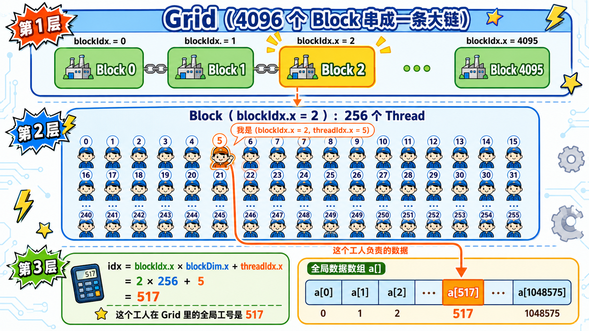

# 第4章 第一个 AMD GPU 程序

## 本章导读

> 前面两章我们铺开了两张地图：一张是 AI Infra 的系统全景，一张是 AMD GPU 与 ROCm 软件栈的结构。现在，地图已经在你手上了——终于到了**写一点代码**的时候。
>
> 本章会做两件事：先编译并运行一个最小 HIP kernel，亲眼看到 GPU 上同时跑起上百万个线程；再加一个很小的 baseline benchmark，把后面章节会反复用到的 warmup、repeat、指标记录这些习惯先建立起来。目标不是跑得快，而是跑得对、跑得稳、跑完能说清自己做了什么。

提前说清楚一件事：**这一章不是来追求"最快的向量加法"的**。Vector Add 太简单，本身也不是深度学习里最值得优化的算子。它的价值在于另一面：路径短、结果好检查、能把一个完整 GPU 程序的骨架跑通。把骨架跑顺了，后面再装 Reduction、Softmax、Matmul 这些更复杂的算子才不会乱。

本章对应代码在：

```text
code/part1-hardware-rocm/
├── pyproject.toml
├── uv.lock
├── activate-rocm.sh
└── chapter3/
    ├── vector_add.hip
    └── benchmark_vector_add.py
```

## 4.1 从已经验证的 ROCm 环境开始

在写第一行 GPU 代码之前，有一件事必须确认：环境是通的。好在这件事[第 1 章](../../part0-preface/chapter2/index.md)已经帮你做完了——三道环境验证门（`rocminfo` 能看到 GPU、PyTorch ROCm 能跑 GPU tensor、最小 HIP 程序能编译运行）都已经通过。如果你还没做，请先回去跑完那三道门。本章的 `uv sync` 和 `hipcc` 都建立在那一章的基础上，跳过这一步很容易卡在第一行命令上。

确认这三道门都通过后，再进入 `part1-hardware-rocm` 的章节环境：

```bash
cd code/part1-hardware-rocm
uv sync
source ./activate-rocm.sh
```

如果这里无法激活环境，先回到[第 1 章环境准备与验证](../../part0-preface/chapter2/index.md)排查 `uv` 环境、ROCm wheel 和 `_rocm_sdk_devel` 初始化问题。

## 4.2 跑通第一个 HIP kernel

环境就绪，开始写代码。一个最小但完整的 HIP 程序通常包含六步：Host 准备数据、Device 分配显存、Host 到 Device 拷贝、启动 kernel、Device 到 Host 拷回、检查结果。这六步构成了所有 GPU 程序的骨架，后面的 Reduction、Softmax、Matmul 无论多复杂，骨架都是这六步。


<div align="center">
  <p>图 4.1 最小 HIP Vector Add 程序的数据路径</p>
</div>

如图 4.1 所示，真正的加法只发生在 kernel 里，但一个完整 GPU 程序还必须处理显存分配、数据拷贝和结果校验。

完整 Host 端流程在[第 1 章 1.5 节](../../part0-preface/chapter2/index.md#_1-5-验证最小-hip-程序)已经作为环境验证出现过。为了方便对照，这里再把完整文件折叠贴一次：

<details>
<summary>代码：vector_add.hip</summary>

```cpp
#include <hip/hip_runtime.h>

#include <cmath>
#include <iostream>
#include <vector>

#define HIP_CHECK(call)                                                     \
  do {                                                                      \
    hipError_t err = call;                                                  \
    if (err != hipSuccess) {                                                \
      std::cerr << "HIP error: " << hipGetErrorString(err) << std::endl;   \
      return 1;                                                             \
    }                                                                       \
  } while (0)

__global__ void vector_add(const float* a, const float* b, float* c, int n) {
  int idx = blockIdx.x * blockDim.x + threadIdx.x;
  if (idx < n) {
    c[idx] = a[idx] + b[idx];
  }
}

int main() {
  const int n = 1 << 20;
  const size_t bytes = n * sizeof(float);

  std::vector<float> h_a(n, 1.0f);
  std::vector<float> h_b(n, 2.0f);
  std::vector<float> h_c(n, 0.0f);

  float* d_a = nullptr;
  float* d_b = nullptr;
  float* d_c = nullptr;

  HIP_CHECK(hipMalloc(&d_a, bytes));
  HIP_CHECK(hipMalloc(&d_b, bytes));
  HIP_CHECK(hipMalloc(&d_c, bytes));

  HIP_CHECK(hipMemcpy(d_a, h_a.data(), bytes, hipMemcpyHostToDevice));
  HIP_CHECK(hipMemcpy(d_b, h_b.data(), bytes, hipMemcpyHostToDevice));

  const int threads = 256;
  const int blocks = (n + threads - 1) / threads;
  vector_add<<<blocks, threads>>>(d_a, d_b, d_c, n);
  HIP_CHECK(hipGetLastError());
  HIP_CHECK(hipDeviceSynchronize());

  HIP_CHECK(hipMemcpy(h_c.data(), d_c, bytes, hipMemcpyDeviceToHost));

  float max_error = 0.0f;
  for (int i = 0; i < n; ++i) {
    max_error = std::max(max_error, std::abs(h_c[i] - 3.0f));
  }

  hipDeviceProp_t prop{};
  HIP_CHECK(hipGetDeviceProperties(&prop, 0));

  std::cout << "device_name: " << prop.name << std::endl;
  std::cout << "vector_size: " << n << std::endl;
  std::cout << "blocks: " << blocks << std::endl;
  std::cout << "threads_per_block: " << threads << std::endl;
  std::cout << "max_error: " << max_error << std::endl;
  std::cout << "status: " << (max_error == 0.0f ? "PASS" : "FAIL") << std::endl;

  HIP_CHECK(hipFree(d_a));
  HIP_CHECK(hipFree(d_b));
  HIP_CHECK(hipFree(d_c));

  return max_error == 0.0f ? 0 : 1;
}
```

</details>

外面那一大段 `main()` 在做的事，其实就是图 4.1 那条数据路径：分配显存 → 拷数据 → 启动 kernel → 拷回结果 → 校验 → 释放。这一层在第 1 章已经讲过，我们这一章不重复。**真正值得重点看的是中间那段 kernel**，它才是跑在 GPU 上的代码：

```cpp
__global__ void vector_add(const float* a, const float* b, float* c, int n) {
  int idx = blockIdx.x * blockDim.x + threadIdx.x;
  if (idx < n) {
    c[idx] = a[idx] + b[idx];
  }
}
```

这段 kernel 的映射关系很直接：一个 GPU 线程负责一个元素。`blockIdx.x * blockDim.x + threadIdx.x` 计算出当前线程负责的全局下标，`if (idx < n)` 用来处理最后一个 block 可能越界的情况。

新语法速查：

- `__global__`：告诉编译器“这是一个 GPU 函数，由 CPU 调用、在 GPU 上运行”；
- `<<<blocks, threads>>>`：HIP / CUDA 特有的 kernel 启动语法，`blocks` 是要启动多少组，`threads` 是每组多少个线程；
- `blockIdx.x` / `threadIdx.x`：每个 GPU 线程拿到的“工号”，用它来算自己负责数组里的哪个位置。

换成大白话：`vector_add<<<blocks, threads>>>(...)` 就是在 GPU 上同时叫起 `blocks × threads` 个工人，每个工人执行一次 `vector_add` 函数（如图 4.2 所示）。



<div align="center">
  <p>图 4.2 Grid → Block → Thread 的层级，以及 blockIdx/threadIdx 如何算出全局下标</p>
</div>

如图 4.2 所示，Grid 是 4096 个 Block 串成的大链；放大其中任意一个 Block，里面是 256 个并行 Thread；每个 Thread 通过 `blockIdx.x × blockDim.x + threadIdx.x` 算出自己在整条数据数组里负责哪一格。

先确认 HIP 编译器版本：

```bash
cd chapter3
hipcc --version
```

<details>
<summary>输出：HIP 编译器版本</summary>

```text
HIP version: 7.12.60610-2bd1678d3d
AMD clang version 22.0.0git (https://github.com/ROCm/llvm-project.git c849bc16b0e49951d313756f20b73c2b28d321d7+PATCHED:9a6ac45c97a1e511db838c5b46257324d2de1780)
Target: x86_64-unknown-linux-gnu
Thread model: posix
InstalledDir: hello-ai-infra/code/part1-hardware-rocm/.venv/lib/python3.12/site-packages/_rocm_sdk_devel/lib/llvm/bin
```

</details>

编译：

```bash
hipcc vector_add.hip -O2 -o vector_add && echo "compile_status: PASS"
```

<details>
<summary>输出：HIP 程序编译</summary>

```text
compile_status: PASS
```

</details>

运行：

```bash
./vector_add
```

<details>
<summary>输出：HIP Vector Add 运行结果</summary>

```text
device_name: Radeon 8060S Graphics
vector_size: 1048576
blocks: 4096
threads_per_block: 256
max_error: 0
status: PASS
```

</details>

`max_error: 0` 表示每个输出元素都等于期望值 `3.0`。输出里的 `blocks: 4096`、`threads_per_block: 256` 也不神秘：程序里 `n = 1 << 20 = 1048576`，每个 block 使用 256 个线程，所以 `1048576 / 256 = 4096` 组。换句话说，**我们刚才同时叫起了 1048576 个 GPU 工人**，每人负责数组里的一个元素，齐刷刷做了一次加法（如图 4.3 所示）。


<div align="center">
  <p>图 4.3 一线程一元素：每个 GPU 线程负责一个数据元素</p>
</div>

这一步通过后，你已经跑通了第一段真正由自己编译的 AMD GPU kernel——欢迎正式进入 GPU 编程的世界。

## 4.3 建立 baseline benchmark

这一节加入一个很小的 benchmark。它不是为了证明 Vector Add 有多快，而是为了提前建立后续章节会反复使用的习惯：固定输入规模、先 warmup、重复运行多次、记录 mean / median / min。

完整代码在下面的折叠块里。如果你只想先看懂大意，记住三件事（如图 4.4 所示）：

1. 正式计时前先 warmup 5 次，让 GPU 进入比较稳定的状态；
2. 正式跑 30 次，每次用 `torch.cuda.Event` 量 GPU 真正执行完成的时间；
3. 最后用最小值估算带宽，因为最小值更像“没被外部干扰”的那次。


<div align="center">
  <p>图 4.4 准确 benchmark 前先 warmup、多次 repeat，并在同步后计时</p>
</div>

benchmark 脚本如下：

<details>
<summary>代码：benchmark_vector_add.py</summary>

```python
import argparse
import statistics
import time

import torch


def parse_args():
    parser = argparse.ArgumentParser(description="Benchmark torch vector add on CPU and ROCm GPU.")
    parser.add_argument("--size", type=int, default=1 << 24)
    parser.add_argument("--warmup", type=int, default=5)
    parser.add_argument("--repeat", type=int, default=30)
    return parser.parse_args()


def benchmark_cpu(size, warmup, repeat):
    a = torch.ones(size, dtype=torch.float32)
    b = torch.full((size,), 2.0, dtype=torch.float32)

    for _ in range(warmup):
        c = a + b
    _ = c.sum().item()

    times = []
    for _ in range(repeat):
        start = time.perf_counter()
        c = a + b
        _ = c.sum().item()
        end = time.perf_counter()
        times.append((end - start) * 1000)
    return times


def benchmark_gpu(size, warmup, repeat):
    if not torch.cuda.is_available():
        raise SystemExit("PyTorch ROCm backend is not available")

    a = torch.ones(size, device="cuda", dtype=torch.float32)
    b = torch.full((size,), 2.0, device="cuda", dtype=torch.float32)

    for _ in range(warmup):
        c = a + b
    torch.cuda.synchronize()
    _ = c.sum().item()

    times = []
    for _ in range(repeat):
        start = torch.cuda.Event(enable_timing=True)
        end = torch.cuda.Event(enable_timing=True)
        start.record()
        c = a + b
        end.record()
        torch.cuda.synchronize()
        times.append(start.elapsed_time(end))
    _ = c.sum().item()
    return times


def summarize(name, times, size):
    mean_ms = statistics.mean(times)
    median_ms = statistics.median(times)
    min_ms = min(times)
    bytes_moved = size * 3 * 4
    bandwidth_gb_s = bytes_moved / (min_ms / 1000) / 1e9

    print(f"{name}_mean_ms: {mean_ms:.6f}")
    print(f"{name}_median_ms: {median_ms:.6f}")
    print(f"{name}_min_ms: {min_ms:.6f}")
    print(f"{name}_bandwidth_gb_s_by_min: {bandwidth_gb_s:.6f}")


def main():
    args = parse_args()
    print(f"torch: {torch.__version__}")
    print(f"cuda_available: {torch.cuda.is_available()}")
    if torch.cuda.is_available():
        print(f"device_name: {torch.cuda.get_device_name(0)}")
    print(f"vector_size: {args.size}")
    print(f"warmup: {args.warmup}")
    print(f"repeat: {args.repeat}")

    cpu_times = benchmark_cpu(args.size, args.warmup, args.repeat)
    gpu_times = benchmark_gpu(args.size, args.warmup, args.repeat)

    summarize("cpu", cpu_times, args.size)
    summarize("gpu", gpu_times, args.size)
    print("status: PASS")


if __name__ == "__main__":
    main()
```

</details>

其中 GPU 计时最关键的是使用 event 并在每轮后同步：

```python
start.record()
c = a + b
end.record()
torch.cuda.synchronize()
times.append(start.elapsed_time(end))
```

否则 CPU 端可能只是把任务提交出去，计到的不是 GPU 真正执行完成的时间。

运行：

```bash
python benchmark_vector_add.py
```

<details>
<summary>输出：Vector Add baseline benchmark @ AI MAX 395 + ROCm 7.12.0</summary>

```text
torch: 2.9.1+rocm7.12.0
cuda_available: True
device_name: Radeon 8060S Graphics
vector_size: 16777216
warmup: 5
repeat: 30
cpu_mean_ms: 4.518574
cpu_median_ms: 4.427747
cpu_min_ms: 4.117748
cpu_bandwidth_gb_s_by_min: 48.892405
gpu_mean_ms: 0.877171
gpu_median_ms: 0.878001
gpu_min_ms: 0.844619
gpu_bandwidth_gb_s_by_min: 238.363804
status: PASS
```

</details>

这里的带宽估算使用的是 Vector Add 的最简单数据量模型。一次 Vector Add 要读 `a`、读 `b`、写 `c`，一共经过 3 个数组；每个元素是 `float32`，也就是 4 字节。所以一次完整 Vector Add 搬动的数据量是：

```text
bytes_moved = vector_size × 3 × 4
```

按这个口径，本次 AI MAX 395 + ROCm 7.12.0 上的 CPU baseline 约为 **48.9 GB/s @ AI MAX 395, fp32**，GPU baseline 约为 **238 GB/s @ AI MAX 395, fp32**。GPU 约是 CPU 的 `238 / 48.9 ≈ 4.87` 倍，可以先粗略记成 5 倍左右。

这个差距不神秘：Vector Add 主要是在搬数据，GPU 侧有更适合大规模连续读写的并行执行和内存访问路径。不过这个数字不是硬件理论带宽，也不是后续优化目标。

作为粗略参照：AI MAX 395 公开规格上的统一内存带宽约 256 GB/s 级别。我们这次跑出来的 GPU baseline 约 238 GB/s，看起来已经很接近这个数字——但要小心：256 GB/s **不是本教程实测**出来的理论上限，238 GB/s 也只是 PyTorch elementwise benchmark 下的有效带宽估算。后面 profiling 篇会用更严格的方法把 kernel 时间、数据搬运、缓存行为和测量误差一一拆开。

想查自己机器的理论带宽，最稳妥的方式是去 AMD 官方规格表确认（见本章延伸阅读）。无论查到的数字是多少，请记住一件事：**理论带宽是上限，不是承诺**——任何 benchmark 跑出来的有效带宽，都只能逼近、不会超过它。

## 4.4 留下实验记录

跑完前面三段命令，你大概觉得事情已经做完了——其实还没有。**性能工作真正麻烦的一刻，往往不是第一次没跑快，而是过几天回头看时，你自己也说不清当时跑了哪个版本、用了什么输入、那个 238 GB/s 到底是怎么量出来的。** 没留记录的实验，三天后基本等于白做。

所以从这第一个 GPU 程序开始，建议你养成一个小习惯：**每跑完一组实验，顺手把目标、命令、结果记到同一个地方**。在哪里记并不重要——一个 markdown 文件、一份 notebook、甚至一张手写便签都行；重要的是这份记录能在几天后让你（或者别人）一眼看回当初做了什么。

够用的结构其实只有三段:**目标 → 流程 → 结论**。下面这个模板可以直接拿去用，不用一字不差，只要每节都愿意花两分钟写它：

````markdown
# 实验记录：第一个 AMD GPU 程序

## 实验目标

验证 PyTorch ROCm、最小 HIP kernel 和 Vector Add baseline benchmark 是否能跑通。

## 实测流程

（贴出可以从章节目录直接复制运行的命令）

```bash
cd code/part1-hardware-rocm
source ./activate-rocm.sh
python chapter3/check_torch_rocm.py
cd chapter3
hipcc vector_add.hip -O2 -o vector_add
./vector_add
python benchmark_vector_add.py
```

## 实测结论

| 项目 | 数值 |
| ---- | ---- |
| 硬件 | AI MAX 395 + ROCm 7.12.0 |
| 输入规模 | 16,777,216 个 float32 |
| GPU min 延迟 | 0.844 ms |
| GPU 估算带宽 | 238 GB/s |
| status | PASS |
````

看起来朴素，但半年后你回头翻这些记录，会非常感谢现在的自己。后面这本教程会一路写到 Reduction、Softmax、Matmul、Attention，外加 rocprof / Omniperf 一堆 profiling 实验——等到 kernel 版本越积越多、benchmark 配置越改越乱时，**能不能一眼看回当初跑过什么**，往往就是"顺利继续"和"回头返工"的分界线。

试一试：把 `--size` 从默认的 `1 << 24` 改成 `1 << 20` 和 `1 << 26`，分别再跑一次 benchmark，把每次的硬件、输入规模、GPU min 延迟和估算带宽随手记到你的实验记录里。先猜一下——GPU 带宽会一直变大、一直变小，还是先升后降？这道题没有标准答案，目的是让你亲手建立"输入规模 vs 性能"的第一感觉，后面第 2 篇会反复用到。现在种下的这棵小树苗，到时候已经能帮你遮风挡雨了。

## 本章小结

- 本章在 `part1-hardware-rocm` 环境里跑通了第一个手写 HIP Vector Add kernel。
- 第一个 HIP kernel 使用“一线程处理一个元素”的最简单映射方式，方便理解 block、thread 和全局下标。
- baseline benchmark 使用 warmup + repeat，并用 GPU event 计时，避免只量到 CPU 提交开销。
- 下一章会进入性能优化方法论，开始系统地区分 latency、throughput、bandwidth、FLOPS 和可信 benchmark。

## 延伸阅读

- [ROCm HIP Documentation](https://rocm.docs.amd.com/projects/HIP/en/latest/)
- [PyTorch CUDA semantics](https://docs.pytorch.org/docs/stable/notes/cuda.html)
- [ROCm System Management Interface](https://rocm.docs.amd.com/projects/rocm_smi_lib/en/latest/)
