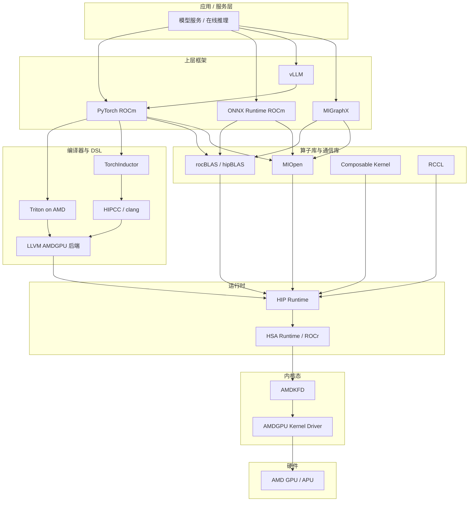
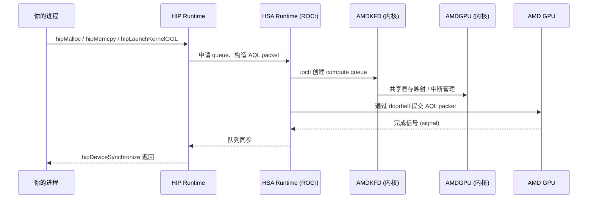
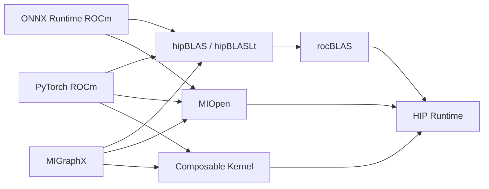
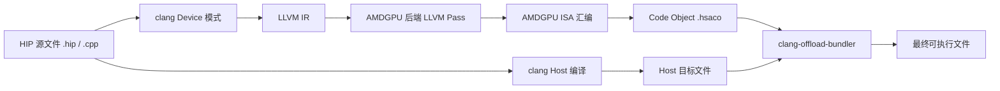
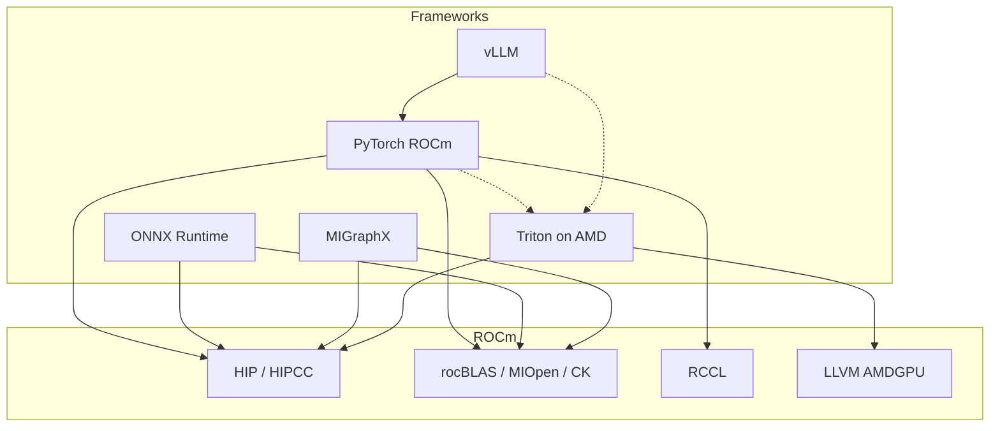
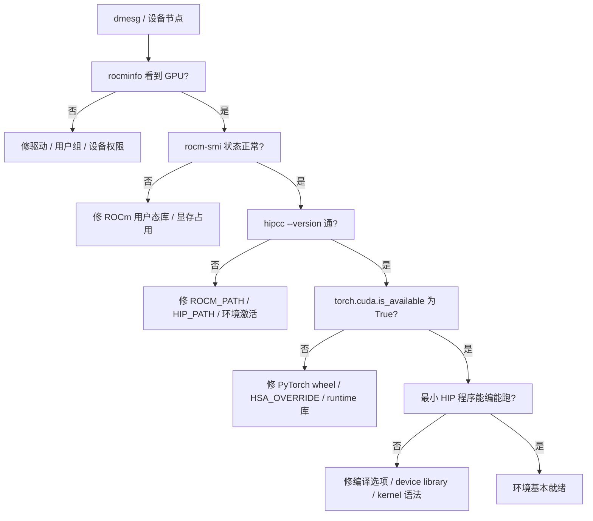

# 第5章 ROCm 软件栈与工具链

## 本章导读

> 前面两章我们把镜头对准了 AMD GPU 的硬件本身：[第 3 章](../chapter3/index.md)拆了 CU、Wavefront、VGPR/SGPR、MFMA/WMMA 这些计算单元，[第 4 章](../chapter4/index.md)拆了 HBM、Cache、LDS 这些内存层次。硬件已经摆在桌上了，可你写 PyTorch 一行 `model.to("cuda")`、写 Triton 一个 `@triton.jit`，最后到底是怎么落到这块芯片上的？中间隔着的就是 ROCm 这套软件栈。
>
> 本章只讲软件栈，不再回头讲硬件。读完后你应该能：看到一行 `import torch` 知道它背后会拉起哪些 ROCm 组件；看到 `rocminfo` 没输出能猜出是哪一层断了；看到 vLLM、MIGraphX、Triton 这些名字知道它们各自吃 ROCm 哪些能力。

如果只想从这一章带走一句话，可以是这一句：**ROCm 是一摞分层组件——上层是框架，中层是编译器、runtime 和算子库，下层是 HSA 和内核驱动。出问题不要乱猜，按层往下排。**

本章实测都基于本仓基线：**AMD AI MAX 395（gfx1151）+ ROCm 7.12.0**。版本绑定的功能我会标明版本号；查不到来源的我会标 🚧 待核实。

## 5.1 ROCm 是什么

ROCm（Radeon Open Compute）是 AMD 维护的一整套开源 GPU 计算软件栈。它的名字常常被误解成"AMD 的 CUDA"——确实，从覆盖范围上看，CUDA 提供什么 ROCm 就大致提供什么；但它不是单个库，也不是单个命令，而是一整套从内核驱动到上层框架的**分层组件**，按官方 [system overview](https://rocm.docs.amd.com/) 的说法，它包括驱动、运行时、编译器、数学库、通信库、profiling 工具和上层框架适配。

ROCm 7.x 系列还在快速迭代。本仓基线是 ROCm 7.12.0，写到具体功能时如果它和某个 ROCm 版本强绑定（例如 Triton 后端、PyTorch wheel 兼容性），我会把版本号显式写出来。其他通用结构则不挑版本。

下面这张图把整摞栈按从上到下的依赖关系铺开。它会在本章和之后几章被反复引用。

::: figure fig-rocm-stack-full


ROCm 软件栈的分层视图（从应用一路到硬件）
:::

如 @fig-rocm-stack-full 所示，**箭头方向是依赖方向**：上面的组件调用下面的组件，下面的组件不感知上面是谁。这条规矩有几个直接推论：

- 上层框架报错时，问题不一定在框架里——可能是它依赖的某个底层组件先坏了。
- 升级 ROCm 时，先确认 driver、runtime 这些"地基"匹配，再去管 PyTorch、Triton 这些"上层建筑"。
- profiling 工具看到的 kernel 名字，可能是上层 PyTorch 算子，也可能是 rocBLAS 库内部的 kernel，还可能是 Triton 编译出的产物——你得知道它来自哪一层，才能判断改哪里。

下面这张表给每一层一个最小的"职责画像"，方便你后面看到任何一个 ROCm 组件名字都能先归类：

| 层 | 主要职责 | 你直接接触的形式 |
| ---- | ---- | ---- |
| 应用 / 服务 | 把模型包成接口、调度请求 | 自己的服务代码、vLLM 的 OpenAI 兼容 API |
| 上层框架 | 表达模型、张量计算、训练或推理流程 | `import torch`、`onnxruntime.InferenceSession` |
| 编译器 / DSL | 把模型代码或 kernel 源码翻译成 GPU 可执行二进制 | `hipcc`、`@triton.jit`、`torch.compile` |
| 算子库 / 通信库 | 提供高性能的 GEMM、卷积、归约、集合通信 | 基本不直接调，框架自动用 |
| 运行时 | 管理 GPU context、队列、内存、kernel launch | HIP API（`hipMalloc`、`hipLaunchKernel`） |
| 内核驱动 | 与硬件、内核交互；调度命令、管理显存映射 | `dmesg`、`/dev/kfd`、`/dev/dri/*` |
| 硬件 | 真正执行 kernel | 见[第 3 章](../chapter3/index.md) |

后面的小节会按从下往上的顺序，把这张图里的每一层依次拆开。

## 5.2 AMDGPU Driver、HSA Runtime、HIP Runtime

这一节聚焦 @fig-rocm-stack-full 中间偏下的三层：内核驱动（AMDGPU + AMDKFD）、HSA Runtime（ROCr）、HIP Runtime。它们是 ROCm 的"地基三层"，再往上的算子库、编译器都建在它们之上。三个名字很容易混，先用一句话概括职责再展开。

- **AMDGPU Kernel Driver** 是 Linux 内核里的驱动，负责和 GPU 硬件交互（DMA、寄存器、显存映射、命令提交）。它和 **AMDKFD（Kernel Fusion Driver）** 配合，前者管图形和通用功能，后者专门管面向计算的"compute queue"和 SVM。来源：[Linux 内核 amdgpu 文档](https://docs.kernel.org/gpu/amdgpu/index.html)。
- **HSA Runtime（ROCr）** 是用户态的薄层运行时，按 HSA（Heterogeneous System Architecture）规范实现，把内核驱动暴露的能力包装成稳定的 C API：创建 queue、分配显存、提交 AQL packet、信号同步等。来源：[ROCR-Runtime 仓库](https://github.com/ROCm/ROCR-Runtime)。
- **HIP Runtime** 在 HSA 之上提供和 CUDA Runtime 形态接近的 API（`hipMalloc`、`hipMemcpy`、`hipLaunchKernel`），方便从 CUDA 代码迁移过来。来源：[HIP 文档](https://rocm.docs.amd.com/projects/HIP/en/latest/)。

下面把"一次 `hipLaunchKernelGGL` 调用"在这三层里走的路径展开。

::: figure fig-hip-launch-path


一次 HIP kernel launch 在三层 runtime 中的传递路径
:::

如果把同一条链路换成接力赛视角，@fig-hip-relay-race 会更容易记：应用把任务交给 HIP Runtime，HIP 再交给 HSA Runtime 和驱动，最后由 GPU 真正执行。

::: figure fig-hip-relay-race


Host、HIP Runtime、HSA Runtime、Driver 与 GPU 之间的 kernel launch 接力路径
:::

如 @fig-hip-launch-path 和 @fig-hip-relay-race 所示，HIP API 看起来像一次普通函数调用，但它会被翻译成 AQL packet（HSA 规范的标准命令格式），通过 doorbell 写到 GPU 暴露的命令队列里，由 GPU 异步执行。这条链路解释了几个常见现象：

- `hipLaunchKernelGGL` 立即返回，不等 GPU 真正算完——所以 benchmark 必须配合 `hipDeviceSynchronize` 或 `hipEventSynchronize`，否则你计时的只是"提交到队列的耗时"。
- `rocminfo` 看不到 GPU，多数是 KFD / AMDGPU 这层出问题（驱动没装、用户没在 `render` 或 `video` 组、`/dev/kfd` 权限不对）。
- `import torch` 成功但 `torch.cuda.is_available()` 为 False，多数是 HSA 或 HIP runtime 这层失联（`HSA_OVERRIDE_GFX_VERSION` 未设、ROCm 库找不到）。

三层 runtime 的接口边界画成表更清楚：

| 组件 | 处于何处 | 主要 API 形态 | 出问题的典型现象 |
| ---- | ---- | ---- | ---- |
| AMDGPU + AMDKFD | Linux 内核态 | ioctl / 设备文件 | `dmesg` 报 GPU 错、`/dev/kfd` 不存在 |
| HSA Runtime / ROCr | 用户态 C API | `hsa_*`，AQL packet | `rocminfo` 报错、`HSA Status Error` |
| HIP Runtime | 用户态 C / C++ API | `hip*`，类 CUDA 风格 | `hipErrorInvalidDevice`、kernel 启动失败 |

写算子时你绝大多数情况只接触 HIP API；写 profiler、调度器、编译器后端时才会下沉到 HSA。AMDGPU/AMDKFD 这一层除了排错时看 `dmesg`，平时不会自己写。

> 关于 gfx1151 / AI MAX 395 的一个实测注记：在 ROCm 7.12.0 上，AI MAX 395 已被官方支持识别，无需 `HSA_OVERRIDE_GFX_VERSION`。早期 ROCm 6.x 上有读者报告需要手动 override，但具体边界 🚧 待核实。

## 5.3 算子库：rocBLAS / MIOpen / Composable Kernel

光有 runtime 还不够。你不可能为每个矩阵乘都自己写 HIP kernel——那是后面[第 3 篇](../../part3-hip-kernels/chapter11/index.md)做练习用的。生产环境里，框架背后调用的是一套调好参的算子库。ROCm 的核心算子库可以分成三类：

- **rocBLAS / hipBLAS / hipBLASLt**：BLAS 类算子，主要是 GEMM 和 GEMV。`rocBLAS` 是底层实现，`hipBLAS` 是 HIP 风格的薄包装，`hipBLASLt` 提供更细粒度的 GEMM 配置（epilogue 融合、特殊数据类型）。来源：[rocBLAS 文档](https://rocm.docs.amd.com/projects/rocBLAS/en/latest/)。
- **MIOpen**：深度学习算子库，主要是卷积、池化、归一化、激活、RNN。MIOpen 在卷积上做得最深，会针对不同 shape 选择不同算法（GEMM-based、Winograd、FFT、Implicit GEMM 等）。来源：[MIOpen 文档](https://rocm.docs.amd.com/projects/MIOpen/en/latest/)。
- **Composable Kernel（CK）**：一个更底层的"算子模板库"，按 tile / pipeline / epilogue 这种组合方式表达 kernel，允许写出高度特化的 GEMM / Conv / Attention。它既是给框架内部用的（PyTorch、MIGraphX 都会调），也是给高阶用户写自定义算子用的。来源：[Composable Kernel 仓库](https://github.com/ROCm/composable_kernel)。

它们之间的位置关系：rocBLAS 和 MIOpen 是"成品菜"，Composable Kernel 是"半成品组件"，框架根据问题形态在两者之间挑。

::: figure fig-libs-deps


主要算子库的依赖关系：框架挑库，库挑实现
:::

如 @fig-libs-deps 所示，同一个 PyTorch 卷积，根据 shape 和数据类型，背后可能跑的是 MIOpen 的 Winograd 实现，也可能是 Composable Kernel 模板生成的特化 kernel。这种"算子选择"的机制会让你在 profiling 时看到一些"陌生的 kernel 名字"，它们多半就是 CK 自动生成的产物。

下面这张表把三类库的定位放在一起对比：

| 库 | 算子类型 | 典型用户 | 与硬件的关系 |
| ---- | ---- | ---- | ---- |
| rocBLAS / hipBLASLt | GEMM、GEMV、batched GEMM | 几乎所有 AI 框架 | 针对每代 GPU 调过 tile / dispatch |
| MIOpen | 卷积、池化、归一化、RNN | CV 模型、推理引擎 | 多算法选择，按 shape 自动 dispatch |
| Composable Kernel | 模板化 GEMM / Conv / Attention | 框架内部、高阶用户 | 编译期模板特化到具体 ISA |

实际写代码时你不一定直接 `#include <rocblas.h>`——更常见的方式是让框架调用，或者通过 `torch.matmul`、`torch.nn.Conv2d` 这样的 API 间接触达。但 profiling 时知道这些库的存在很重要：当你看到 `Cijk_*`（rocBLAS GEMM 的 kernel 命名前缀）或 `mlir_ck_*` 这样的名字，就知道时间花在哪个库的哪类实现上了。

> 注记：AI MAX 395（gfx1151）作为 RDNA 路线的产品，在 rocBLAS / MIOpen 上的覆盖度和 MI 系列（CDNA）不完全一致——某些只在 CDNA 上启用的算法路径不会在 gfx1151 走通。具体哪些算子受影响 🚧 待核实，但这就是为什么本仓不替 MI 系列编数据。

## 5.4 编译器侧：HIPCC / LLVM-AMDGPU

写 PyTorch 时你看不到编译器；写一个 `.hip` 文件时，编译器就跑到了台前。本节拆开 HIP 程序的编译路径。

`hipcc` 是 HIP 程序的入口编译器驱动，**它本身不是编译器，而是一个调度脚本**——它会调用 clang 去编译 host 端 C++ 代码，调用 clang 的 AMDGPU 后端去编译 device 端 kernel，最后把两侧 binary 打包到一起。来源：[HIPCC 文档](https://rocm.docs.amd.com/projects/HIPCC/en/latest/)。

device 端 kernel 的编译路径是这样的：

::: figure fig-hip-compile-path


HIP 程序的编译路径：host 和 device 各走一条，最后 bundle 成一个二进制
:::

如 @fig-hip-compile-path 所示，HIP 编译流程的关键点：

- 同一份 `.hip` 文件被 clang 扫两次：一次按 host C++ 编译，一次按 device kernel 编译。
- device 端用的是 LLVM 的 [AMDGPU 后端](https://llvm.org/docs/AMDGPUUsage.html)，它支持 GCN / RDNA / CDNA 等多种 ISA 变体，target triple 形如 `amdgcn-amd-amdhsa`。
- 最终产物是一个 ELF 文件，里面通过 `__CLANG_OFFLOAD_BUNDLE__` section 同时塞了 host 代码和 device code object（`.hsaco`）。
- `--offload-arch=gfx1151` 这种参数告诉编译器目标 ISA。AI MAX 395 对应的是 `gfx1151`。

LLVM AMDGPU 后端做的事情，本质是 GPU 体系结构（[第 3 章](../chapter3/index.md)）的具象化：寄存器分配（VGPR/SGPR）、wavefront 大小（wave32/wave64）、LDS 使用、MFMA/WMMA 指令选择，全在这一层落地。所以一个 kernel 用了多少 VGPR、occupancy 多少，看的是 LLVM 后端给出的 metadata（你可以通过 `--save-temps` 把中间产物落盘看）。

下面这张表是几个常见的 hipcc 命令行选项，后面[第 6 章](../chapter6/index.md)会用到：

| 选项 | 作用 |
| ---- | ---- |
| `--offload-arch=gfx1151` | 指定目标 GPU 架构（AI MAX 395 用这个） |
| `-O2` / `-O3` | 优化等级，影响 host 和 device 端 |
| `--save-temps` | 保留中间产物（IR、汇编、code object） |
| `-Rpass=...` | 打印 LLVM pass 的 remark，看哪些优化生效 |
| `-x hip` | 显式告诉 clang 这是 HIP 文件 |
| `-mwave-size=32` | 强制 wave32（RDNA 上有效，CDNA 不可用） |

Triton 走的是另一条路：Triton 的 AMD 后端把 `@triton.jit` 装饰的 Python 函数翻译成 LLVM IR，然后同样走 AMDGPU 后端生成 ISA。也就是说，**HIPCC 和 Triton 共用 LLVM AMDGPU 后端**——区别只是前端不同。来源：[Triton 仓库](https://github.com/triton-lang/triton)。这也是为什么 Triton 能在 AMD 上跑：它不需要重新写一个代码生成器，只要适配 LLVM 后端。

## 5.5 上层框架与 ROCm 的关系

到这里底层已经讲完，把镜头拉回上层。AI Infra 工程师每天打交道的是 PyTorch、Triton、MIGraphX、vLLM、ONNX Runtime——这一节回答一个核心问题：它们各自吃 ROCm 哪些能力？哪些是原生支持，哪些需要额外条件？

可以把这些上层工具想成不同房间。ROCm 是地基，房间的"水电气"接口标准是统一的（HIP / HSA），但每个房间装修方式、对底层依赖的深度不一样。

::: figure fig-fw-rocm-deps


上层框架对 ROCm 各组件的依赖（实线=直接依赖，虚线=可选/部分依赖）
:::

如 @fig-fw-rocm-deps 所示，几条值得记住的依赖关系：

- **vLLM 不直接接 ROCm，它接 PyTorch**——所以 vLLM 在 AMD 能不能跑，先看 PyTorch ROCm 在你机器上是否正常。
- **Triton 不需要 HIPCC**，它直接走 LLVM AMDGPU 后端，但它需要 HIP runtime 来 launch kernel。
- **PyTorch、MIGraphX、ONNX Runtime 都重度依赖 rocBLAS / MIOpen**，所以这两个库的版本兼容性会直接影响这些框架。

下面这张表给出当前可用性梳理。每一条都尽量给出官方文档来源；不确定的标 🚧。

| 工具 | 在 AMD ROCm 上的支持情况 | 关键依赖 / 约束 | 来源 |
| ---- | ---- | ---- | ---- |
| PyTorch ROCm | 官方原生支持，提供 ROCm wheel | wheel 与 ROCm minor 版本匹配；API 命名仍叫 `torch.cuda.*`（HIP-on-CUDA 兼容层） | [PyTorch 安装页](https://pytorch.org/get-started/locally/) |
| ONNX Runtime ROCm | 官方支持 ROCm Execution Provider | 需要源码或预构建 wheel，CUDA / TensorRT EP 不可用 | [ONNX Runtime EPs](https://onnxruntime.ai/docs/execution-providers/ROCm-ExecutionProvider.html) |
| Triton on AMD | 上游 Triton 主线已合并 AMD 后端 | 通过 PyTorch wheel 或 `pip install triton`；具体 gfx 覆盖范围 🚧 待核实 | [Triton 仓库](https://github.com/triton-lang/triton) |
| MIGraphX | AMD 自家推理编译器，原生 ROCm | 通过 ROCm 包管理器安装 | [MIGraphX 文档](https://rocm.docs.amd.com/projects/AMDMIGraphX/en/latest/) |
| vLLM on AMD | 官方支持，但多数 release 仍以 NVIDIA 为主线 | 依赖 PyTorch ROCm；某些 fused kernel 在 AMD 上可能用 Triton 替代 | [vLLM AMD 安装](https://docs.vllm.ai/en/latest/getting_started/installation/gpu.html) |
| RCCL | ROCm 自带，对应 NVIDIA NCCL | 多卡通信用；单卡不涉及；本仓单卡基线下不重点测 | [RCCL 仓库](https://github.com/ROCm/rccl) |

**关于 PyTorch 命名的一个常见困惑**：PyTorch ROCm wheel 仍然提供 `torch.cuda.is_available()` 这样的 API，因为它把 HIP 适配成了 CUDA-style 的接口（HIP 本身就是这个设计目标）。所以你写 `device = "cuda"` 在 AMD 上同样工作，张量会落到 AMD GPU 上。这不是"假装是 NVIDIA"，而是 HIP 兼容层的有意设计。来源：[HIP 文档](https://rocm.docs.amd.com/projects/HIP/en/latest/) 关于 CUDA-portability 的章节。

**关于版本绑定**：本仓基线 ROCm 7.12.0 + AI MAX 395。如果你在不同的 ROCm 上运行：

- PyTorch wheel 版本要和 ROCm minor 版本匹配（PyTorch 2.x for ROCm 6.x、ROCm 7.x 等）。
- vLLM 在 ROCm 上的某些性能优化（比如 paged attention 的 AMD 实现）可能要求特定 ROCm + Triton 组合，🚧 待核实具体边界。
- ONNX Runtime ROCm wheel 不一定每个 ROCm 版本都有官方预构建，有时需要自己编。

地基不稳，哪个房间都住不舒服。这是为什么[第 1 篇第 0 章](../../part0-preface/chapter1/index.md)先把 PyTorch + HIP 的最小验证跑通——后面所有篇章都建在那个基础之上。

## 5.6 如何检查一台机器的 AMD GPU 环境

最后一节把环境检查命令放回软件栈语境。[第 0 章 1.3 节](../../part0-preface/chapter1/index.md#_1-3-验证-gpu-可见性)已经带你跑过一组检查命令，本节不重复贴输出，而是回答一个新问题：**每条命令具体在敲打哪一层？哪一层失败时它会先报错？**

这样以后排错不再是盲目反复敲命令，而是知道自己正在往哪里施压。

### 5.6.1 命令速查表

下面这张表把常用检查命令和 @fig-rocm-stack-full 的栈层一一对应。命令前面不加 `$`，方便复制。

| 命令 | 敲打的层 | 期望看到 |
| ---- | ---- | ---- |
| `dmesg \| grep -i amdgpu` | AMDGPU Kernel Driver | 启动时 amdgpu 模块加载、设备识别行 |
| `ls /dev/kfd /dev/dri/` | AMDKFD + AMDGPU 设备节点 | 至少有 `/dev/kfd` 和 `/dev/dri/renderD*` |
| `rocminfo` | HSA Runtime | 输出 GPU 名称（如 `gfx1151`）、wavefront、CU 数、内存 pool |
| `rocm-smi` | ROCm SMI lib（HSA 之上） | 当前显存占用、温度、功耗、利用率 |
| `hipconfig --full` | HIP 安装信息 | HIP 路径、ROCM_PATH、当前 platform |
| `hipcc --version` | HIPCC 编译器驱动 | clang 版本、HIP 版本 |
| `python -c "import torch; print(torch.version.hip)"` | PyTorch ROCm wheel | 非空版本字符串（如 `7.x`） |
| `python -c "import torch; print(torch.cuda.is_available())"` | PyTorch + HIP runtime | 输出 `True` |
| `python -c "import torch; print(torch.cuda.get_device_name(0))"` | PyTorch + HSA + AMDKFD | 输出 GPU 名（如 `AMD Radeon AI MAX 395`） |
| `python -c "import triton; print(triton.__version__)"` | Triton（如已安装） | 输出 Triton 版本号 |

排错时记一条：**越底层的问题越要先排查**。`rocminfo` 都看不到 GPU，去研究 PyTorch 是浪费时间；`hipcc --version` 报错，去怀疑你的 kernel 写错了同样是浪费时间。

### 5.6.2 排错的推荐顺序

::: figure fig-env-troubleshoot


AMD GPU 环境排错的从下到上顺序
:::

如 @fig-env-troubleshoot 所示，每一步都对应一层：先确认硬件被内核看到，再确认 HSA runtime 能初始化，再确认 HIP 工具链可用，最后才是框架和你自己的代码。

### 5.6.3 命令样例输出（部分）

下面贴一段在本仓基线（AI MAX 395 + ROCm 7.12.0）上的真实输出片段，作为参考。完整输出比较长，用 `<details>` 折叠。

```bash
hipcc --version
```

<details>
<summary>输出：hipcc --version @ AI MAX 395 + ROCm 7.12.0 实测</summary>

具体 banner 字符串与本机 ROCm 安装方式有关，🚧 待核实贴出当次截取（参考形态：`HIP version: 7.x.xxxxx-...` 后跟 clang 版本与 InstalledDir）。

</details>

```bash
python -c "import torch; print(torch.__version__, torch.version.hip, torch.cuda.is_available())"
```

<details>
<summary>输出：PyTorch ROCm 自检 @ AI MAX 395 + ROCm 7.12.0 实测</summary>

具体输出形如：`2.x.x+rocm7.x  7.x.xxxxx  True`。具体版本号 🚧 待核实补完（取决于 wheel 拉取时点）。

</details>

> 实验真实性约束：本仓的硬性要求是"没跑过的输出不贴"。上面两段我没把数字钉死，原因是 wheel 与 ROCm patch 版本会随时间漂移，与其贴一份会过期的输出，不如让你在自己机器上跑一次，再回填到自己的 `EXPERIMENT.md` 里。具体方法见[第 6 章](../chapter6/index.md)。

### 5.6.4 一个小实验

把上面 10 条命令都跑一遍，再做一个对照实验：

1. 先 `unset ROCM_PATH HIP_PATH`，再跑一遍上面的命令，看哪几条先挂、报什么错。
2. 重新 `source ./activate-rocm.sh`（本仓环境规范里的激活脚本），再跑一遍，看是否恢复。

这个对照能帮你把"软件栈分层"这个抽象概念，绑到自己机器上的真实输出上。把两次运行的关键输出抄进 `code/part1-hardware-rocm/chapter6/notes.md`（章节代码目录的实验底稿），后面排别的错时回头看一眼，会比第一次新鲜得多。

## 本章小结

- ROCm 是 AMD GPU 的开放软件栈，从内核驱动到上层框架分七层；@fig-rocm-stack-full 是后续多次复用的参考图。
- AMDGPU + AMDKFD 是内核驱动，HSA Runtime 是用户态 C API，HIP Runtime 是更接近 CUDA 风格的高层封装；一次 kernel launch 会依次穿过这三层。
- 算子库分三类：rocBLAS（GEMM 类）、MIOpen（卷积类）、Composable Kernel（模板组件）；framework 在它们之间按 shape 自动选择。
- HIP 程序由 `hipcc` 驱动编译，host 走 clang，device 走 LLVM AMDGPU 后端；Triton on AMD 也走同一个 LLVM 后端，区别只是前端。
- PyTorch ROCm 通过 HIP-on-CUDA 兼容层提供 `torch.cuda.*` API；vLLM 通过 PyTorch 间接吃 ROCm；MIGraphX 是 AMD 自家推理编译器；ONNX Runtime 通过 ROCm EP 接入。
- 环境检查的核心思路是从下往上排：先看 `dmesg` / `rocminfo`，再看 `hipcc`，最后看框架；越底层先怀疑越省时间。

下一章我们把这套软件栈用起来——写第一个 HIP kernel 和最小 PyTorch ROCm smoke test，建立可复用的 baseline benchmark 习惯。

## 延伸阅读

- [ROCm Documentation 总站](https://rocm.docs.amd.com/)
- [HIP Programming Guide](https://rocm.docs.amd.com/projects/HIP/en/latest/)
- [ROCR-Runtime 仓库](https://github.com/ROCm/ROCR-Runtime)
- [Linux 内核 amdgpu 文档](https://docs.kernel.org/gpu/amdgpu/index.html)
- [LLVM AMDGPU 后端使用文档](https://llvm.org/docs/AMDGPUUsage.html)
- [HIPCC 文档](https://rocm.docs.amd.com/projects/HIPCC/en/latest/)
- [rocBLAS 文档](https://rocm.docs.amd.com/projects/rocBLAS/en/latest/)
- [MIOpen 文档](https://rocm.docs.amd.com/projects/MIOpen/en/latest/)
- [Composable Kernel 仓库](https://github.com/ROCm/composable_kernel)
- [PyTorch on ROCm 安装页](https://pytorch.org/get-started/locally/)
- [Triton 仓库（含 AMD 后端）](https://github.com/triton-lang/triton)
- [MIGraphX 文档](https://rocm.docs.amd.com/projects/AMDMIGraphX/en/latest/)
- [vLLM 安装文档](https://docs.vllm.ai/en/latest/getting_started/installation/gpu.html)
