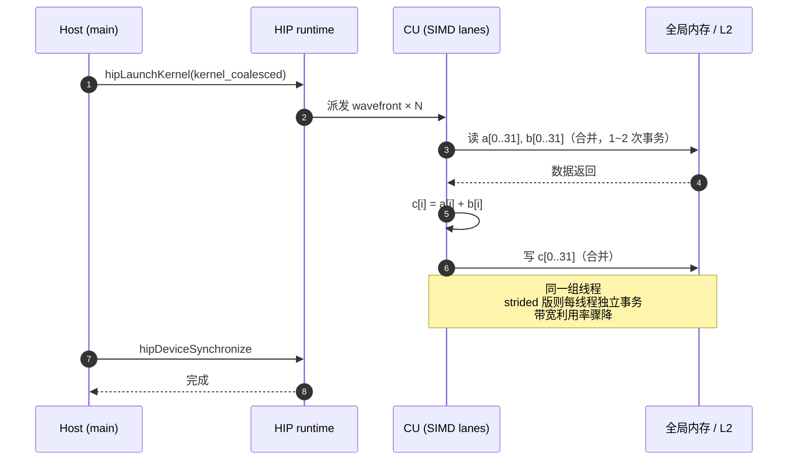
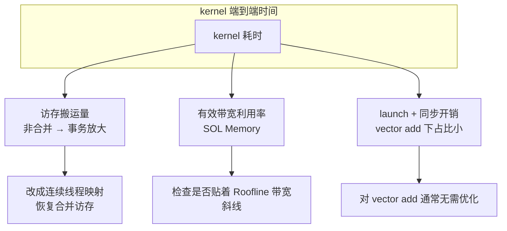
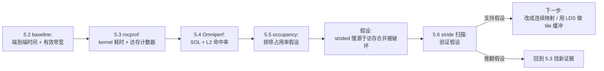

# 第5章 rocprof + Omniperf 定位瓶颈

## 本章导读

> 上一章解决了"数字可不可信"的问题——热身、重复、GPU event 计时、避免测量陷阱，见 [第 4 章 benchmark 与可信计时](../chapter4/index.md)。本章继续用同一个 vector add 做主线，但视角下沉到 GPU 内部：它到底慢在哪里——是 kernel 算得慢，还是访存喂不饱硬件。
>
> 为了让"慢在哪里"这个问题有抓手，我们故意准备两个版本做对照：一个是连续线程访问连续地址的**合并访存版**，另一个是线程间地址跨步的 **strided 非合并访存版**反例。两个版本做完全相同的计算（`c[i] = a[i] + b[i]`），只有访存模式不同。读完后，你应该能用 `rocprof` 看 kernel 时间、用 Omniperf 看硬件计数器（带宽利用率、L2 命中率、occupancy），并把"它慢"这种模糊感觉转成"strided 版的访存合并被破坏"这种可验证的判断。
>
> 前置知识：[第 3 章 3.2 节](../../part0-intro/chapter3/index.md) 跑通了 vector add 并建立了 memory-bound 的 Roofline 直觉；[第 2 章](../../part0-intro/chapter2/index.md) 讲过 CU、Wavefront、显存层次和 Roofline 的硬件来源。本章会用真实计数器把这些地图点亮——而 [第 6 章](../chapter6/index.md) 会把算子点正式画到 Roofline 曲线上。

本章不从大模型开始。一个完整推理链路里同时出现请求排队、KV Cache、算子库、通信、后处理，刚入门时很难判断某个数字到底来自哪一层。我们先选一个可控的小案例：vector add。这条链路足够简单，但已经包含 profiling 入门最常见的几个问题：

- kernel 本身要多久；
- 访存有没有喂饱硬件（带宽利用率多少）；
- L2 cache 命中率如何、访存合并有没有被破坏；
- occupancy（占用率）够不够、寄存器压力大不大；
- 看到瓶颈以后，下一步应该改哪里。

本章实验环境是 Radeon RX 9070 XT（gfx12，RDNA4），ROCm 6.4.x，独立 GDDR6 显存。输入规模与第 3、4 章保持一致，便于跨章对比。本章所有命令可直接复用；所有具体输出、计数器值和性能数字在 9070XT 实验机就绪后实测回填。

## 5.1 两个版本的 vector add：合并访存 vs strided

这一节准备本章的对照案例：合并访存版和 strided 非合并访存版。两个 kernel 做同样的运算，只有线程到地址的映射不同。这正是后面所有 profiling 工具服务的同一个问题。

### 5.1.1 合并访存版

合并版就是 [第 3 章 3.2 节](../../part0-intro/chapter3/index.md) 跑通的那个 kernel：相邻线程处理相邻下标。

```cpp
__global__ void kernel_coalesced(const float* __restrict__ a,
                                 const float* __restrict__ b,
                                 float*       __restrict__ c,
                                 int n) {
    int idx = blockIdx.x * blockDim.x + threadIdx.x;
    if (idx < n) {
        c[idx] = a[idx] + b[idx];
    }
}
```

它的访问模式是：

```text
线程 0：a[0], b[0], c[0]
线程 1：a[1], b[1], c[1]
...
```

同一 wavefront 内相邻线程访问的下标差 1（相差 4 字节，连续内存）。这是理想的访存合并模式，GPU 可以把一整组线程的读写合并成少数几次内存事务。合并访存为什么重要、背后是哪些硬件单元，见 [第 2 章 2.2 节（CU 内部结构）](../../part0-intro/chapter2/index.md) 和 [2.3 节（Wavefront 与 SIMT）](../../part0-intro/chapter2/index.md)。

### 5.1.2 strided 非合并访存反例

strided 版把线程到地址的映射改坏：让 wavefront 内的线程在**同一次迭代**里就跳着访问内存，破坏合并。

```cpp
// strided：故意让相邻线程访问跨步地址（非合并访存反例）
__global__ void kernel_strided(const float* __restrict__ a,
                               const float* __restrict__ b,
                               float*       __restrict__ c,
                               int n,
                               int stride) {
    // 让 wavefront 内相邻线程的地址间隔 stride 个 float
    int lane  = threadIdx.x;
    int wave  = blockIdx.x * blockDim.x / warpSize;   // RDNA4 wavefront 默认 32
    int base  = wave * warpSize * stride;
    int idx   = base + lane * stride;
    if (idx < n) {
        c[idx] = a[idx] + b[idx];
    }
}
```

当 `stride = 32` 时，访问模式变成：

```text
线程 0：a[0],    a[0]   ... (本例每线程只读一次, idx = base + lane*32)
线程 1：a[32]
线程 2：a[64]
...
```

同一 wavefront 内，相邻线程的地址间隔 `stride × 4` 字节。stride 越大，单次内存事务能覆盖的有效线程越少，带宽利用率越低。

### 5.1.3 合并 vs strided 直觉图

::: figure fig-coalesce-vs-strided


合并访存与非合并访存的对比。合并时整组线程的访问被合并成少数几次内存事务；strided 时每个线程触发独立事务，带宽利用率大幅下降。
:::

如 @fig-coalesce-vs-strided 所示，合并访存时 32 个线程共需 1~2 次事务（32 个 float × 4 字节 = 128 字节）；strided 时几乎每个线程各需 1 次事务——带宽利用率差了一个量级。但这是**纸面分析**。真实硬件上 strided 到底慢多少，受 L2 cache、内存控制器、事务粒度影响，必须实测。这正是本章要做的事。

两个 kernel、计时框架和正确性校验统一放在 `code/part1-profiling/chapter5/vector_add.hip`，沿用 [第 4 章](../chapter4/index.md) 建立的 benchmark 习惯：固定 warmup / repeat、用 HIP event 计时、显式同步、关键数字落 JSON。

## 5.2 运行 baseline benchmark

这一节先跑一遍 baseline，得到两个版本的端到端 kernel 时间和有效带宽，作为后续所有 profiling 工具的对照基准。

先跑合并版和 strided 版。命令如下：

```bash
# 合并版
./vector_add_bench --kernel coalesced --size 16777216 --block 256 \
    --warmup 20 --repeat 100 \
    --output-json logs/coalesced_size16777216.json

# strided 版（stride=32）
./vector_add_bench --kernel strided --size 16777216 --block 256 --stride 32 \
    --warmup 20 --repeat 100 \
    --output-json logs/strided_size16777216.json
```

向量加法的理论访存量：读 `a`（n float）+ 读 `b`（n float）+ 写 `c`（n float）= `3n` 个 float = `3n × 4` 字节。有效带宽按 [第 3 章 3.4 节](../../part0-intro/chapter3/index.md) 的口径计算：

```text
bandwidth (GB/s) = (3 × n × 4 字节) / (最小耗时 ms / 1000) / 1e9
```

<details>
<summary>🚧 待实测：两个版本的 baseline 时间与有效带宽 @ 9070XT + ROCm 6.4.x</summary>

机器就绪后在此粘贴 `coalesced_size16777216.json` 与 `strided_size16777216.json` 的关键字段，并按下表回填：

| kernel | min_ms | bandwidth_GB/s | 说明 |
| ---- | ----: | ----: | ---- |
| coalesced | 待测 | 待测 | 连续地址，理论最优 |
| strided (stride=32) | 待测 | 待测 | 跨步地址，预期带宽明显下降 |

关注两点：绝对带宽离 9070XT 标称带宽（约 760 GB/s，以实测为准）多远；strided 相对 coalesced 慢几倍。这两条数字是后面所有判断的锚。
</details>

这里最重要的不是某个绝对数字，而是**两个版本的比例**：如果 strided 明显慢于 coalesced，说明访存模式确实在拖后腿；如果两者几乎一样，说明这个 stride 还没大到打穿 cache。本章用 9070XT（独立 GDDR6）正是为了放大这个差距，让访存合并的代价看得见。

baseline 提示我们：下一步不能只问"kernel 快不快"，还要问"同样的计算，为什么换一种访存模式就慢"。

## 5.3 用 rocprof 看 kernel 时间

这一节把视角下沉到 GPU 内部：到底启动了哪些 kernel，每个用了多少时间，访存量和计算量是什么比例。

ROCm 的 profiling 入口是 `rocprof`（ROCprofiler）。它有两种主要用法：`--stats` 给每个 kernel 的调用次数和耗时聚合；`--pmc` / `--counters` 采集硬件性能计数器（PMC，Performance Monitor Counter）。先看 kernel 时间。

```bash
# 合并版：kernel 级耗时统计
rocprof --stats \
    -o logs/rocprof_coalesced.csv \
    -- ./vector_add_bench --kernel coalesced --size 16777216 --block 256 \
       --warmup 5 --repeat 10

# strided 版：kernel 级耗时统计
rocprof --stats \
    -o logs/rocprof_strided.csv \
    -- ./vector_add_bench --kernel strided --size 16777216 --block 256 --stride 32 \
       --warmup 5 --repeat 10
```

几个关键点：

- `--stats` 生成 per-kernel 的聚合表（Calls / Total Duration / Average），避免只读原始 trace；
- `rocprof` 跑 profiling 时会带来一定 overhead，且采样窗口包含 warmup，所以这里 `repeat=10` 的目的不是和 5.2 的 `repeat=100` 比绝对值，而是看"两个版本的 kernel 平均耗时差几倍"。

<details>
<summary>🚧 待实测：rocprof --stats 的 kernel 统计 @ 9070XT + ROCm 6.4.x</summary>

机器就绪后在此粘贴 `rocprof_coalesced.csv` 与 `rocprof_strided.csv` 的 kernel stats 节选，并回填下表：

| rocprof kernel stats | Calls | Total Duration | Average | 解读 |
| ---- | ----: | ----: | ----: | ---- |
| `kernel_coalesced` | 待测 | 待测 | 待测 | 合并访存 |
| `kernel_strided` | 待测 | 待测 | 待测 | 跨步访存，预期 Average 显著高于 coalesced |

预期：strided 的单次 kernel 平均耗时明显高于 coalesced，且与 5.2 的端到端时间量级一致。
</details>

光看耗时还不够——"慢"可能是算得慢，也可能是搬得慢。vector add 每个元素只做一次加法，算术强度极低（约 0.083 FLOP/Byte，见 [第 3 章 3.4 节](../../part0-intro/chapter3/index.md)），它必然落在 memory-bound 一侧。所以慢几乎一定来自访存。要验证这一点，需要看访存计数器：两个版本到底从全局内存搬了多少字节（`FETCH_SIZE` + `WRITE_SIZE`）。

```bash
# 采集访存 PMC 计数器（FETCH_SIZE = 读字节数, WRITE_SIZE = 写字节数）
rocprof --pmc FETCH_SIZE WRITE_SIZE \
    -o logs/rocprof_coalesced_pmc.csv \
    -- ./vector_add_bench --kernel coalesced --size 16777216 --block 256 \
       --warmup 0 --repeat 3

rocprof --pmc FETCH_SIZE WRITE_SIZE \
    -o logs/rocprof_strided_pmc.csv \
    -- ./vector_add_bench --kernel strided --size 16777216 --block 256 --stride 32 \
       --warmup 0 --repeat 3
```

> 注意：`rocprof` 单次通常只能采集一组兼容的 PMC；`FETCH_SIZE` / `WRITE_SIZE` 一般在同一组。其他组（如 `SQ_INSTS_*`、L2 命中率相关）需要分多次运行再合并。组与组的划分依赖 GPU 代次，gfx12 上以 `rocprof --list-counters` 的实际输出为准。

<details>
<summary>🚧 待实测：rocprof PMC 访存计数器 @ 9070XT + ROCm 6.4.x</summary>

机器就绪后在此粘贴 `rocprof_coalesced_pmc.csv` 与 `rocprof_strided_pmc.csv` 的计数器值，并回填下表：

| kernel | FETCH_SIZE (读字节) | WRITE_SIZE (写字节) | 实际搬运 / 理论搬运 | 解读 |
| ---- | ----: | ----: | ----: | ---- |
| coalesced | 待测 | 待测 | 待测 | 理论 = 3 × n × 4 字节 |
| strided | 待测 | 待测 | 待测 | 预期实际搬运 ≫ 理论（cache line 被部分利用） |

理论访存量都是 `3 × 16777216 × 4 ≈ 192 MiB`。合并版实测应接近这个值；strided 版因为每次事务只用到 cache line 的一小部分，实测搬运量会显著放大——这就是非合并访存在计数器上的直接证据。
</details>

两条证据线已经出现：`--stats` 说 strided 慢，`--pmc` 说 strided 搬的数据多。但 rocprof 给的是分散的计数器，把它们组装成"带宽利用率""L2 命中率""occupancy"这种工程友好的判断，需要更上层的工具——这就是 5.4 的 Omniperf。

> 当 baseline、`rocprof --stats`、`rocprof --pmc` 三方结论方向一致时，结论更可信；方向不一致时，应该先检查测量边界（采样窗口是否含 warmup、计数器组是否兼容），而不是急着改代码。

## 5.4 用 Omniperf 看硬件计数器

这一节解决一个具体问题：怎么把分散的硬件计数器组装成"带宽跑了几成、L2 命中多少、occupancy 够不够"这种一眼能判断的指标。

Omniperf 是 ROCm 之上的 profiling 分析工具，它在底层也调用硬件计数器，但额外做了两件事：把原始计数器聚合成 **Speed-of-Light（SOL，光速比）** 指标（带宽利用率、计算利用率各占峰值的百分比），并提供内置的 Roofline 叠加。这两点正好补上 rocprof 不擅长的部分。

```bash
# 合并版：Omniperf 采集
omniperf profile -n vadd_coalesced \
    -- ./vector_add_bench --kernel coalesced --size 16777216 --block 256 \
       --warmup 5 --repeat 10

# strided 版：Omniperf 采集
omniperf profile -n vadd_strided \
    -- ./vector_add_bench --kernel strided --size 16777216 --block 256 --stride 32 \
       --warmup 5 --repeat 10
```

采集完成后，用 `omniperf analyze` 看聚合指标（具体子命令和路径以本机 Omniperf 版本输出为准）：

```bash
# 查看某个 workload 的 Speed-of-Light、L2 命中率、occupancy 等面板
omniperf analyze -p workloads/vadd_coalesced   # 路径以 omniperf profile 实际输出为准
omniperf analyze -p workloads/vadd_strided
```

Omniperf 最值得关注的三组指标：

- **Speed-of-Light（SOL）**：`SOL Memory`（带宽利用率）和 `SOL Compute`（计算利用率）。对 vector add 这种 memory-bound kernel，`SOL Memory` 应该接近 100%，`SOL Compute` 很低——如果 `SOL Memory` 远低于预期，说明访存没喂饱硬件。
- **L2 Cache Hit Rate**：命中率高说明数据被 cache 复用；strided 版因为访问分散，预期命中率明显低于 coalesced。
- **Occupancy / Resource 限制**：是寄存器（VGPR/SGPR）、LDS 还是 wave 数限制了 CU 上同时活跃的 wavefront 数。vector add 寄存器压力极小，occupancy 通常不是瓶颈——这一点能帮我们排除"occupancy 太低"这个错误假设。

<details>
<summary>🚧 待实测：Omniperf Speed-of-Light 与 cache 指标 @ 9070XT + ROCm 6.4.x</summary>

机器就绪后在此粘贴两个 workload 的 Omniperf 面板节选，并回填下表：

| 指标 | coalesced | strided | 解读 |
| ---- | ----: | ----: | ---- |
| SOL Memory（带宽利用率） | 待测 | 待测 | coalesced 应接近峰值；strided 预期偏低 |
| SOL Compute（计算利用率） | 待测 | 待测 | 两者都应很低（memory-bound） |
| L2 Cache Hit Rate | 待测 | 待测 | strided 预期显著低于 coalesced |
| 实测带宽 GB/s | 待测 | 待测 | 与 5.2 的有效带宽交叉验证 |

预期结论方向：coalesced 把带宽跑满（memory-bound 的健康形态），strided 既慢又喂不饱带宽——"慢"和"带宽利用率低"同时出现，是访存合并被破坏的典型信号。
</details>

Omniperf 的另一个价值是**内置 Roofline 叠加**：它能把 kernel 实测的（算术强度, 吞吐）点直接画到 9070XT 的 Roofline 上，让你看到这个点离带宽斜线多远。Roofline 两条线的硬件来源见 [第 2 章 2.7 节](../../part0-intro/chapter2/index.md)，把点正式画到曲线上则是 [第 6 章](../chapter6/index.md) 的工作。本章只需要从 Omniperf 面板读出"coalesced 贴着带宽斜线、strided 离斜线很远"这个方向性结论。

## 5.5 Occupancy 与 Wavefront 行为

这一节专门看占用率：CU 上同时活跃的 wavefront 数受什么限制，以及它和 vector add 的性能是什么关系。

Occupancy（占用率）指一个 CU 上实际驻留的 wavefront 数与该 CU 最大可调度 wavefront 数之比（[第 2 章 2.4 节](../../part0-intro/chapter2/index.md) 讲过 VGPR / SGPR / LDS 这三类资源如何限制 occupancy）。直觉上 occupancy 越高越能隐藏访存延迟，但它不是越高越好——对 memory-bound kernel，只要 wave 数足够把内存控制器喂满，再提高 occupancy 收益很小。

vector add 是分析 occupancy 的理想样本，因为它的资源消耗极低：

- **寄存器**：每个线程只读两个 float、写一个 float、做一次加法，VGPR 占用极少；
- **LDS**：完全不使用；
- **wave 数**：由 `grid × block` 决定，对 `n=16M, block=256` 有海量 wave。

所以 vector add 的 occupancy 几乎总是被硬件上限（而非资源）卡住，coalesced 和 strided 两个版本在 occupancy 上应该**几乎没有差异**。这条结论本身很有价值——它说明 strided 版慢下来的原因不是 occupancy，而是 5.4 看到的带宽利用率和 L2 命中率。排除一个错误假设，往往和确认一个正确假设同样重要。

Omniperf 的 Occupancy 面板会直接给出"limiting resource"（是 VGPR、SGPR、LDS 还是 wave 上限），不用自己算：

<details>
<summary>🚧 待实测：Omniperf Occupancy 面板 @ 9070XT + ROCm 6.4.x</summary>

机器就绪后在此粘贴两个 workload 的 Occupancy 面板，并回填：

| 指标 | coalesced | strided | 解读 |
| ---- | ----: | ----: | ---- |
| Achieved Occupancy（活跃 wave/CU） | 待测 | 待测 | 预期两者接近且较高 |
| 限制资源（limiting resource） | 待测 | 待测 | 预期是 wave 上限，而非 VGPR/LDS |
| VGPR / SGPR per wave | 待测 | 待测 | 预期都很小 |

预期：两个版本 occupancy 几乎相同 → occupancy 不是 strided 变慢的原因，瓶颈在访存侧。
</details>

把 5.3、5.4、5.5 三层视角放进同一张图，就能看清 vector add 这条慢路径到底慢在哪。下面这张图把 vector add 一次 launch 里 host 调用、HIP runtime、CU 上的 wavefront 和全局内存的协作画出来：

::: figure fig-vadd-timeline


vector add 一次 launch 的时间线：合并版里 wavefront 的读写被合并成少数事务；strided 版同样走这条路径，但每个事务只覆盖一个线程的有效数据。
:::

如 @fig-vadd-timeline 所示，合并版和 strided 版在 host 调用、launch、occupancy 上几乎相同，唯一的差别在 wavefront 访问全局内存那一步——这正是 5.4 计数器里看到的带宽利用率差异的来源。

## 5.6 从 profiling 结果反推优化方向

这一节把 5.2~5.5 的观察归类成明确的瓶颈判断，并转成下一步可验证的实验假设，而不是"GPU 没跑满"这种模糊结论。

四条证据线汇总如下：

| 证据来源 | 视角 | 这个案例里的主要发现 |
| ---- | ---- | ---- |
| 5.2 端到端 benchmark | wall-clock + 有效带宽 | strided 的 min_ms 显著高于 coalesced，有效带宽明显下降 |
| 5.3 `rocprof --stats` | kernel 级耗时 | strided 单次 kernel 平均耗时高于 coalesced |
| 5.3 `rocprof --pmc` | 访存计数器 | strided 的 FETCH/WRITE 实测搬运量 ≫ 理论值（cache line 被部分利用） |
| 5.4 Omniperf SOL | 带宽/计算利用率 + L2 命中率 | coalesced 的 SOL Memory 接近峰值，strided 明显偏低；L2 命中率 strided 更低 |
| 5.5 Omniperf Occupancy | 占用率与限制资源 | 两个版本 occupancy 几乎相同，限制资源是 wave 上限，不是 VGPR/LDS |

把这些证据归类到三种典型开销，对应不同的优化路径：

::: figure fig-overhead-breakdown


把 kernel 时间拆成三类开销。对 vector add，launch 开销占比很小，真正决定快慢的是访存搬运量（合并 vs strided）和带宽利用率。
:::

由此得到本案例的瓶颈判断（写法刻意避免"算子慢"这种模糊结论）：

> 在当前 stride 配置下，strided 版变慢的直接原因是**访存合并被破坏**：同一 wavefront 内相邻线程访问跨步地址，每次内存事务只能利用 cache line 的一小部分，实测搬运量（`FETCH_SIZE + WRITE_SIZE`）远超理论值，带宽利用率（SOL Memory）明显低于合并版。这不是算力问题（SOL Compute 两版都很低）、也不是 occupancy 问题（两版几乎相同）——它纯粹是访存模式问题。

这句话比"strided 慢"有用得多，因为它已经指向具体的下一步实验。

为了把判断变成可验证假设，跑一组 stride 扫描：固定 `n` 和 `block`，让 `stride ∈ {1, 2, 4, 8, 16, 32, 64}`，看有效带宽随 stride 怎么变化。

```bash
# stride 扫描（stride=1 即等价于合并版）
for s in 1 2 4 8 16 32 64; do
    ./vector_add_bench --kernel strided --size 16777216 --block 256 --stride $s \
        --warmup 20 --repeat 100 \
        --output-json logs/strided_s${s}.json
done
```

<details>
<summary>🚧 待实测：stride 扫描的有效带宽曲线 @ 9070XT + ROCm 6.4.x</summary>

机器就绪后在此粘贴各 stride 的 min_ms / bandwidth，并回填：

| stride | min_ms | bandwidth_GB/s | 相对 stride=1 |
| ----: | ----: | ----: | ----: |
| 1 | 待测 | 待测 | 1.0×（基准） |
| 2 | 待测 | 待测 | 待测 |
| 4 | 待测 | 待测 | 待测 |
| 8 | 待测 | 待测 | 待测 |
| 16 | 待测 | 待测 | 待测 |
| 32 | 待测 | 待测 | 待测 |
| 64 | 待测 | 待测 | 待测 |

预期：带宽随 stride 增大单调下降，到某个 stride 后趋于平台（事务粒度饱和）。这条曲线就是"访存合并被破坏"假设的直接证据。
</details>

如果带宽随 stride 增大单调下降，那么 5.6 的假设就被证据支持。这并不说明 stride 扫描是终点——真实工程里，非合并访存的来源往往更隐蔽（矩阵按列访问、转置、gather / scatter），但排查思路是一样的：先用基准看比例，再用 rocprof 看搬运量，再用 Omniperf 看带宽利用率和 cache 命中率，最后用一次对照实验验证假设。

这就是 profiling 闭环的最小形态：

::: figure fig-profiling-loop


从 benchmark 到优化假设再到对照验证的最小 profiling 闭环。vector add 这个案例的好处是"假设"和"对照实验"都极简，但闭环结构对任何算子都通用。
:::

后面如果继续优化这个 workload，可以沿两条线走：

- **访存模式**：把跨步映射改成连续映射（恢复合并），或在确实需要跨步访问时用 LDS 做中间缓冲。
- **整体吞吐**：如果 kernel 已经贴着带宽斜线，进一步优化空间有限——这时应该回头用 [第 6 章](../chapter6/index.md) 的 Roofline 曲线确认"是否已经到顶"，而不是盲目改代码。

本章先停在"提出可验证假设 + 一次 stride 扫描"这一步。下一章 [第 6 章 Roofline 曲线详解 + 性能报告](../chapter6/index.md) 会把本章的命令、计数器、数字和判断整理成一份可复查的报告，并把 vector add 这个点正式画到 Roofline 曲线上。

## 本章小结

- 一个好的 profiling 案例应该先可控、再复杂；本章用 vector add（合并版 vs strided 版）把访存合并这个核心概念用数字看清，避免一开始就陷入完整模型的多层噪声。
- baseline 给出端到端时间和有效带宽；`rocprof --stats` 给 kernel 耗时，`rocprof --pmc` 给访存搬运量（FETCH/WRITE）；Omniperf 把这些聚合成带宽利用率（SOL）、L2 命中率和 occupancy。多层证据方向一致时，结论才可信。
- 对 vector add 这种 memory-bound kernel，occupancy 几乎总被 wave 上限卡住而非资源卡住，所以它**不是** strided 变慢的原因——排除错误假设和确认正确假设同样重要。
- 瓶颈判断应该写成可验证假设（"strided 慢源于访存合并被破坏，体现为 FETCH/WRITE 放大、SOL Memory 偏低、L2 命中率下降"），而不是模糊判断（"GPU 没跑满"）；用一次 stride 扫描就能验证。
- 涉及命令、输出或性能数字的内容，后续必须在 Radeon RX 9070 XT + ROCm 6.4.x（Linux）上实测回填；代码、日志和实验底稿放在 `code/part1-profiling/chapter5/`。

## 延伸阅读

- [ROCm rocprof / ROCprofiler 文档](https://rocm.docs.amd.com/projects/rocprofiler/en/latest/)
- [Omniperf 官方文档](https://rocm.docs.amd.com/projects/omniperf/en/latest/)
- [Roofline Model 介绍（Berkeley 原论文）](https://dl.acm.org/doi/10.1145/1498765.1498785)
- [HIP Programming Guide — Performance guidelines](https://rocm.docs.amd.com/projects/HIP/en/latest/how-to/performance_guidelines.html)
- [AMD GPU Architecture — Memory Coalescing](https://rocm.docs.amd.com/en/latest/conceptual/gpu-arch.html)
