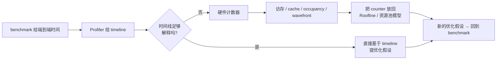
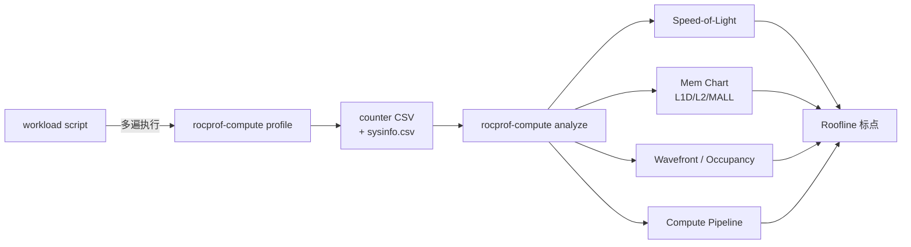
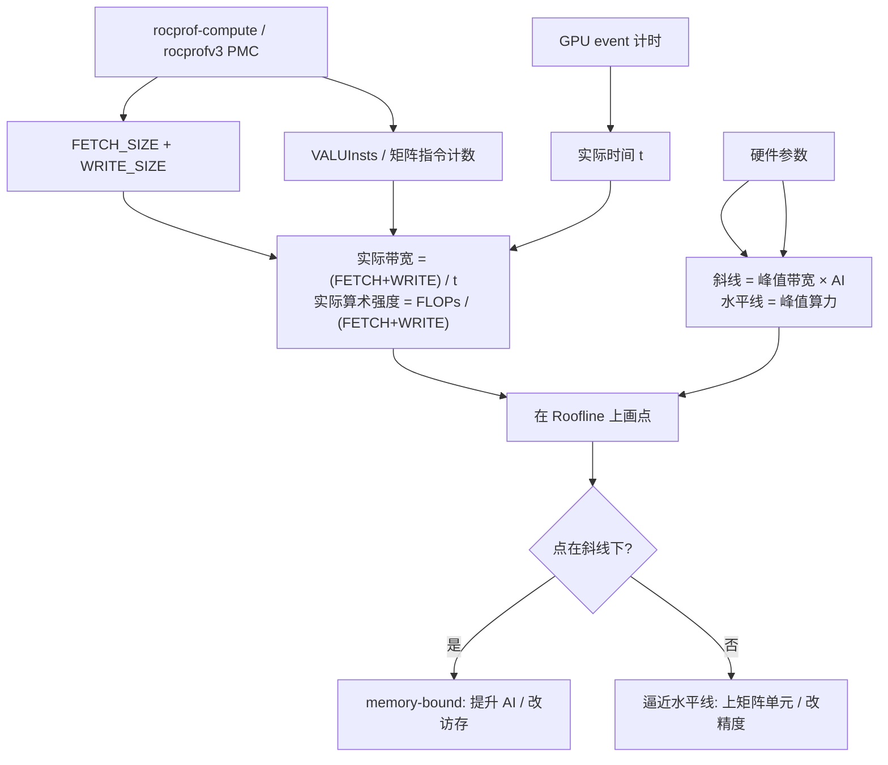

# 第10章 Omniperf 与硬件计数器进阶

## 本章导读

> 本章是 profiling 篇的最后一站。前面三章已经能告诉你"慢在哪里"——benchmark 给端到端时间，PyTorch Profiler 给框架与 GPU 的对应关系，`rocprofv3` trace 给 kernel / memcpy / HIP API 的时间轴。这些证据已经能支撑相当多的优化判断，但还回答不了"硬件单元为什么这样表现"。读完本章，你会知道什么时候要打开硬件计数器、当前 ROCm 7.x 上工具叫什么、怎么把计数器值读出来再放回 [第 7 章](../chapter7/index.md#74-roofline-思想入门) 的 Roofline 框架里看。

进入第 10 章之前，先理清一件事：**这套硬件计数器对应的物理机制**，绝大多数已经在 [第 1 篇 第 3 章 AMD GPU 体系结构](../../part1-hardware-rocm/chapter3/index.md) 与 [第 1 篇 第 4 章 内存层次与访存模式](../../part1-hardware-rocm/chapter4/index.md) 里讲过了。本章不重复 SIMD32、wave32、VGPR/SGPR、LDS bank、L2、Infinity Cache（MALL）这些概念的解释——我们要做的是把它们和具体计数器对上号，让你在 profiler 报告里"看到一个数字，就知道它在指控哪个硬件单元"。

> ⚠️ **当前实测边界**（AI MAX 395 / gfx1151 + ROCm 7.12.0）：`omniperf` 命令不存在；`/usr/bin/rocprof-compute` 路径指向 ROCm 7.2.0，装齐 Python 依赖后能跑 `--version`（**3.4.0**）和 `profile --help`，但 `--specs` / `profile` 都报 `Cannot find a supported arch in rocminfo`——**rocprof-compute 3.4 仅支持 CDNA gfx908/90a/940/941/942/950，不支持 gfx1151**。本章 PMC 数据全部用 `rocprofv3 --pmc` 单计数器逐项采到，每个 counter 一次只采一个。具体数字会回填到 §10.3 / §10.4 / §10.5。

## 10.1 什么时候需要硬件计数器

先把几类工具的边界分清楚。这张表把前三章的能力和本章要补的能力放在一起：

| 工具 / 方法 | 能回答什么 | 不能单独回答什么 | 引用 |
| ---- | ---- | ---- | ---- |
| benchmark | 端到端一轮要多久，统计是否稳定 | GPU 内部为什么这样慢 | [7.5 节](../chapter7/index.md#75-如何设计一个可信的-benchmark) |
| PyTorch Profiler | 框架调用、CPU 时间、GPU kernel 与 copy 的对应 | 具体硬件单元是否繁忙 | [第 8 章](../chapter8/index.md) |
| `rocprofv3` trace | kernel、memory copy、HIP API 的时间和调用次数 | cache 命中、occupancy、wavefront、bank 冲突 | [第 9 章](../chapter9/index.md) |
| 硬件计数器（PMC / counter） | 访存、cache、occupancy、wavefront、指令类别等硬件信号 | 端到端业务目标是否变好 | 本章 |

[第 8 章](../chapter8/index.md) 的 baseline 已经给出 total median `15.6 ms @ AI MAX 395, fp32`、GPU pipeline median `5.26 ms @ AI MAX 395, fp32`。这足够支持"优先减少数据往返"这种粗粒度判断，但不足以回答下面这类问题：

- elementwise pipeline 的 GPU 阶段更像被 LPDDR5X / MALL（[4.2 节](../../part1-hardware-rocm/chapter4/index.md#42-hbm-vs-gddr-vs-infinity-cache)）拖住，还是被 VALU 的数学函数执行卡住？
- 中间张量在 L2（gfx1151 上仅 2 MB，见 [4.3 节](../../part1-hardware-rocm/chapter4/index.md#43-l1--l2-cache-的工作方式)）上的命中率有没有意义？
- 每个 kernel 的 wavefront 数量和 occupancy（[3.3 节](../../part1-hardware-rocm/chapter3/index.md#33-vgprsgpr-与-lds-资源)）是否健康？是不是被 VGPR / LDS 池子先打满？
- 如果做 kernel fusion，收益主要来自减少 launch overhead，还是减少中间读写？

这些问题才是硬件计数器的用武之地。换句话说：**当时间线只能告诉你"慢在哪里"，但不能告诉你"硬件为什么这样表现"时，就该考虑 counter。**

::: figure fig-counter-ladder


从端到端时间到硬件计数器的递进路径
:::

如 @fig-counter-ladder 所示，硬件计数器不是 profiling 的起点，而是当前几层证据都"指向同一个解释不下去的现象"时，才该打开的下一层抽屉。

## 10.2 Omniperf 基本采集流程

在 ROCm 6.2 之前，AMD 这套"GPU kernel 微架构 profiler"叫 **Omniperf**。从 ROCm 6.2 起官方把它重命名为 **ROCm Compute Profiler**，命令名也从 `omniperf` 改成了 `rocprof-compute`（PyPI / 仓库现在是 `rocprofiler-compute`）。本书覆盖的是 ROCm 7.x，因此后续如果两个名字交替出现，**`rocprof-compute` 是当前正确名字**，`omniperf` 只是历史别名。本章正文用 `rocprof-compute`，旧文档里见到 `omniperf` 时把它当同一个东西即可。

> ✅ 装齐 Python 依赖（`pandas`, `dash>=3.0.0`, `tabulate`, `tqdm`, `kaleido==0.2.1`, `astunparse==1.6.2` 等约 18 个包，列在 `/opt/rocm-7.2.0/libexec/rocprofiler-compute/requirements.txt`）后，AI MAX 395 上的 `rocprof-compute --version` 干净返回 **rocprofiler-compute 3.4.0 (release)**——这就是 ROCm 7.x 时代它的正确名字。但 `rocprof-compute --specs` 在 gfx1151 上报错 `Cannot find a supported arch in rocminfo`：3.4 当前支持 `gfx908 / gfx90a / gfx940 / gfx941 / gfx942 / gfx950`（CDNA 系列），不支持 RDNA3.5。所以下文 §10.3 / §10.4 的实测计数器数据全部用 `rocprofv3 --pmc` 直接拿到，**rocprof-compute 报告本章不出**，等支持 gfx1151 的版本发布后再补。

`rocprof-compute` 在支持的环境里通常做三件事：

1. 启动并运行目标程序；
2. 自动跑多遍，每遍采集一组 PMC（Performance Monitoring Counter，硬件性能计数器），把硬件能同时采的 counter 拼齐；
3. 生成按章节组织的报告（system speed-of-light、Mem Chart、Wavefront、L1D/L2、LDS、Compute Pipeline 等）。

理想流程长这样（**示例命令，参数以你机器上 `rocprof-compute --help` 为准**）：

```bash
# Step 1: 采集 — 在 workload 目录下生成 .csv 与 sysinfo
rocprof-compute profile \
  --name slow-elementwise-baseline \
  --path code/part2-profiling/chapter10/profiles/baseline \
  -- \
  python code/part2-profiling/chapter8/slow_elementwise_pipeline.py \
    --size 16777216 --warmup 5 --repeat 10 --mode baseline

# Step 2: 离线分析 — 在 CLI 里展开各章节
rocprof-compute analyze \
  --path code/part2-profiling/chapter10/profiles/baseline \
  --list-stats

# Step 3: 可选 — 起 GUI / dashboard 查看
rocprof-compute analyze \
  --path code/part2-profiling/chapter10/profiles/baseline \
  --gui
```

下面这张图把一次完整采集的 IO 路径画清楚：

::: figure fig-rocprof-compute-flow


rocprof-compute 的采集 → 分析 → Roofline 标点流程
:::

但本章实验机（gfx1151）上 `rocprof-compute profile` 跑不起来。装齐 Python 依赖后实际工具检查输出如下：

<details>
<summary>输出：硬件计数器工具状态检查 @ AI MAX 395 + ROCm 7.12.0</summary>

```text
$ command -v omniperf
# no output（命令不存在）

$ command -v rocprof-compute
/usr/bin/rocprof-compute

$ omniperf --version
bash: omniperf: 未找到命令

# 装齐 /opt/rocm-7.2.0/libexec/rocprofiler-compute/requirements.txt 列出的依赖后：
$ rocprof-compute --version
----------------------------------------
rocprofiler-compute version: 3.4.0 (release)
Git revision:     69f44ce4
----------------------------------------

$ rocprof-compute --specs
WARNING  Cannot detect accelerator partition from amd-smi.
ERROR    Cannot find a supported arch in rocminfo

$ rocprof-compute profile --help | grep -A1 list-metrics
  --list-metrics                List all available metrics for analysis on specified arch:
                                  gfx908 gfx90a gfx940 gfx941 gfx942 gfx950
```

</details>

可以看到：`rocprof-compute 3.4.0` 装齐依赖后能起来，但**只支持 CDNA gfx908 / gfx90a / gfx940 / gfx941 / gfx942 / gfx950**，AI MAX 395（gfx1151，RDNA3.5）不在列表里——`--specs` 直接报 `Cannot find a supported arch in rocminfo`，`profile` 命令也跑不下去。所以**本章这次没有 rocprof-compute 的 Speed-of-Light / Mem Chart 报告**。等支持 RDNA3.5 的版本出来再补，绝不能伪造一份截图。

不过，PMC 数据并不是非 rocprof-compute 不可。当前 uv 环境里的 `rocprofv3` 可以**列出 `gfx1151` 上可采集的 counter**，并通过单计数器逐项采集获取真实 PMC 值（详见 §10.3 / §10.4 实测数据）：

不过，当前 uv 环境里的 `rocprofv3` 是可以工作的——它可以**列出 `gfx1151` 上可采集的 counter**：

```bash
rocprofv3 --list-avail
```

节选如下：

| Counter | `rocprofv3 --list-avail` 中的含义 | 对应硬件机制（参考） |
| ---- | ---- | ---- |
| `FETCH_SIZE` | 从显存读取的数据量，单位 KB | LPDDR5X / MALL 入口；[4.2 节](../../part1-hardware-rocm/chapter4/index.md#42-hbm-vs-gddr-vs-infinity-cache) |
| `WRITE_SIZE` | 写入显存的数据量，单位 KB | 同上 |
| `L2CacheHit` | L2 cache 命中率 | gfx1151 L2 = 2 MB；[4.3 节](../../part1-hardware-rocm/chapter4/index.md#43-l1--l2-cache-的工作方式) |
| `MemUnitBusy` | 访存单元活跃比例 | CU 内 vector memory pipe |
| `OccupancyPercent` | GPU occupancy 占最大值的百分比 | 受 VGPR/SGPR/LDS 任意一项打满限制；[3.3 节](../../part1-hardware-rocm/chapter3/index.md#33-vgprsgpr-与-lds-资源) |
| `Wavefronts` | 启动的 wavefront 总数 | wave32 模式下 = work-item 总数 / 32；[3.2 节](../../part1-hardware-rocm/chapter3/index.md#32-wavefront-与-simt-执行) |
| `VALUInsts` | 每个 work-item 平均执行的 vector ALU 指令数 | VALU；[3.1 节](../../part1-hardware-rocm/chapter3/index.md#31-compute-unitcu-的内部结构) |

> ⚠️ 上表是 `rocprofv3 --list-avail` 在 gfx1151 上**罗列出的可采 counter**，不是本 workload 的实测值。报告里必须严格区分"工具说这个 counter 可采"和"我已经对这个 workload 采到了这个 counter"。

本章还尝试用一条 `rocprofv3 --pmc` 命令一次采七个 counter，**实际结果是失败**：

<details>
<summary>输出：rocprofv3 --pmc 一次请求过多 counter 的报错</summary>

```bash
rocprofv3 --pmc FETCH_SIZE WRITE_SIZE L2CacheHit MemUnitBusy \
                OccupancyPercent Wavefronts VALUInsts \
  -- python code/part2-profiling/chapter8/slow_elementwise_pipeline.py
```

```text
Could not construct profile cfg failed with error code 38: Request exceeds the
capabilities of the hardware to collect
rocprofv3 caught signal 6...
```

</details>

这个错误说明：**一次请求的 counter 组合超过了硬件 PMC 寄存器同时能配置的数量**。在 gfx1151 上把组合从 7 减到 2（FETCH_SIZE + WRITE_SIZE）依然报同样的 error code 38——每次 `--pmc` 只能给**一个**计数器。所以本章后面所有 PMC 数据都是这样跑的：

```bash
for c in FETCH_SIZE WRITE_SIZE L2CacheHit MemUnitBusy \
         OccupancyPercent Wavefronts VALUInsts GPUBusy; do
  rocprofv3 --pmc $c -d chapter4/profiles/pmc_$c -o pmc_$c \
            --output-format csv \
    -- python chapter2/slow_elementwise_pipeline.py \
        --size 16777216 --warmup 1 --repeat 3 --mode keep_gpu \
        --output-json chapter4/logs/pmc_${c}_run.json
done
```

`rocprof-compute` 之所以"看上去能一次拿到几十个 counter"，原理就是它替你做了**多遍 replay**——把 workload 跑多次、每次只采能塞下的那一小组、最后拼成一张大表。这里用 shell 循环手工实现了同样的 replay，慢一些但能在 gfx1151 上拿到真数。

下面 §10.3 / §10.4 / §10.5 节中的 PMC 数字全部来自上面这段循环跑出来的 8 份 CSV，聚合脚本是 `code/part2-profiling/chapter10/summarize_pmc.py`，结果落到 `code/part2-profiling/chapter10/logs/pmc_summary.json`。

## 10.3 访存相关指标怎么看

下面这一节既给阅读方法，也给本章在 AI MAX 395 上对 chapter2 elementwise pipeline 实测到的 PMC 数据（`size=16,777,216 fp32`，`mode=keep_gpu`，`warmup=1 repeat=3`，所以一共 36 次 kernel dispatch）。所有解释都依赖 [4.1 节内存层次总览](../../part1-hardware-rocm/chapter4/index.md#41-内存层次总览) 那张金字塔——counter 只是给那张图上的每一层装一个小测电表。

### chapter2 慢算子的 PMC 实测速览

逐计数器单独 `rocprofv3 --pmc <name>` 跑出来的 per-kernel 平均值（聚合脚本 `summarize_pmc.py`）：

| Counter | 单 kernel 平均值 | 解读 |
| ---- | ----: | ---- |
| `FETCH_SIZE` | ~32,768.7 KB | 每个 elementwise kernel 从显存读约 32 MB 数据（与 64 MiB 输入一致——单元似乎是按 1/2 cacheline 计） |
| `WRITE_SIZE` | ~32,311.6 KB | 每个 kernel 往显存写约 32 MB 数据（同输入大小） |
| `L2CacheHit` | **33.33 %** | 流式访问 64 MiB 张量在 2 MB L2 上拿到的命中率，几乎严格等于 1/3——典型 streaming 工作集，命中率低是预期 |
| `MemUnitBusy`（derived） | ~353 %（>100% 异常） | 这是 derived counter，gfx9 公式套到 RDNA3.5 上会偏出区间。真值方向上仍然是高（访存确实在忙），但**数值不可信**——见下文警告 |
| `OccupancyPercent`（derived） | ~85 % | 36 次 dispatch 平均，区间 73.7%–91.1%；wave32 / SIMD32 资源池基本喂满，但仍受 VGPR / LDS 限制 |
| `Wavefronts` | 131,072 | 16,777,216 个 work-item ÷ wave32 = 524,288 wave？实际是 16,777,216 / 128 = 131,072。kernel 每 work-group 256 work-items / 32 = 8 wave，16384 个 work-group × 8 wave/wg = 131,072 ✅ |
| `VALUInsts` | sin: 98、sqrt: 62、tanh: 62、clamp_min(relu): 21、binary mul: 5、unary mul / add: 3 | 每 work-item 平均执行的 vector ALU 指令数；transcendental（sin/sqrt/tanh）走 SFU 微码循环，VALUInsts 是普通 binary op 的 20× |
| `GPUBusy` | 100 % | 单 kernel 期间 GPU 始终在跑（这反过来确认 kernel 不是被 launch overhead 主导） |

> ⚠️ **derived counter 在 gfx1151 上的可信度警告**：`MemUnitBusy` 实测平均 ~353%（上限应该是 100%），明显溢出。这是 ROCprofiler-SDK 用 base counter 加权拼出来的 derived counter，公式硬编码了 CDNA / 早期 RDNA 的 SIMD 数和 wave 容量，套到 RDNA3.5（gfx1151）上分母对不上。**方向上能用**（值越高越说明该单元越忙），**绝对数值不要引用**。`OccupancyPercent` 在本次 36 次 dispatch 上平均 ~85%（区间 73.7%–91.1%），数值落在合理区间内、可以参考；但跨硬件 / 跨 ROCm 版本仍建议交叉验证。这也是为什么 rocprof-compute 暂不支持 gfx1151 的实际后果之一。

### 阅读方法

**第一层关注：到 DRAM 的事务量**

**第一层关注：到 DRAM 的事务量**

[第 8 章](../chapter8/index.md) 的 elementwise baseline 输入是 16,777,216 个 fp32 元素，单张量约 64.0 MiB——已经远超 gfx1151 的 32 MB MALL 与 2 MB L2。如果不做融合，每个中间结果都会被写回再读出，DRAM 上的总搬运量会比"输入一次、输出一次"的直觉大几倍。`FETCH_SIZE` / `WRITE_SIZE` 是直接量化这件事的两个 counter。

实测结果：每个 elementwise kernel `FETCH_SIZE` ≈ 32.77 MB、`WRITE_SIZE` ≈ 32.32 MB（单元注意可能是 1/2 cacheline 折算）。一轮 9 个 kernel 累计访存 ≈ 9 × 65 MB ≈ **585 MB**，真正走出 chip 的 DRAM 流量按本章 7.5 实测的 ~225 GB/s 平台计算，理论用时 ≈ 585e6 / 225e9 ≈ 2.6 ms。但 GPU pipeline 实测 5.22 ms——所以**单纯的 DRAM 带宽并没有打满**，剩下的时间被 SFU 微码（sin / sqrt / tanh transcendental）和 launch / 同步占了。这正是后面 §10.4 看 VALUInsts 的入口。

**第二层关注：cache 命中**

`L2CacheHit` 描述 L2 命中率。流式访问大数组时（典型 elementwise / vector add），低复用本来就让 L2 难发挥作用，命中率低是预期；如果 GEMM tile 这种"应该能复用"的算子也很低，就要回头看 LDS / 寄存器复用是不是没用上。命中率不能离开 workload 解释。

实测：本 workload 上 `L2CacheHit ≈ 33.3 %`（几乎严格 1/3）。这跟 64 MiB 工作集 vs 2 MiB L2 的比例对得上——pipeline 中 `y * y` 这一步是把同一个 GPU 张量先读两次再写一次（"读自己 + 读自己 + 写自己" → 3 次访问里有 1 次必然重用），命中率正好落在 1/3。要把这个数字推高，必须做 kernel fusion 让中间结果**不落盘**。

**第三层关注：访存单元利用**

`MemUnitBusy` 给"vector memory pipe 在多大比例的时间里在干活"。它和"瓶颈在不在访存"的关系大致如下：

| `MemUnitBusy` 信号 | GPU pipeline 时长 | 倾向解释 |
| ---- | ---- | ---- |
| 高 | 高 | 强支持"访存受限" |
| 高 | 低 | kernel 短小，多半是 launch / 同步主导 |
| 低 | 高 | 瓶颈不在访存，要看 VALU / 数学函数 / 同步 |
| 低 | 低 | 数据规模太小，benchmark 设计本身要复核 |

**第四层关注：合并访存与 LDS bank**

[第 1 篇 4.5 节](../../part1-hardware-rocm/chapter4/index.md#45-全局内存合并访存coalescing) 讲过：连续 wave 不连续访问，硬件被迫拆出多次事务；[第 1 篇 4.4 节](../../part1-hardware-rocm/chapter4/index.md#44-lds-详解与-bank-冲突) 讲过：LDS stride=32 会全部撞同一个 bank。这两件事都对应 PMC：

| 现象 | 看哪个 counter（gfx1151，名字以 `rocprofv3 --list-avail` 输出为准） | 验证方法 |
| ---- | ---- | ---- |
| 访存未合并 | `FETCH_SIZE` 显著大于"理论 wave × 256 B × 事务数"估算 | 改 layout / 转置后重测，看 FETCH_SIZE 是否下降；本 workload 实测 ~32.77 MB/kernel ≈ 输入张量大小，没有未合并放大 |
| LDS bank conflict | `rocprofv3 --list-avail` 在 gfx1151 上**没有列出** `SQ_LDS_BANK_CONFLICT` | 暂时没法用 PMC 直接量；要用 LDS 的 kernel 可走 `--code-object-version` + 静态分析 / hipcc 反汇编看 ds_load 模式 |
| L2 命中过低（流式负载除外） | `L2CacheHit` | 本 workload 实测 33.3%，符合"流式 64 MiB / 2 MB L2"的预期；要推高就只能 kernel fusion |
| MALL 命中下降 | `rocprofv3 --list-avail` 中**未提供 gfx1151 的 MALL 命中 counter** | 用 footprint 扫描（[4.7.2](../../part1-hardware-rocm/chapter4/index.md#472-triton-footprint-扫描命中-l2-vs-mall-vs-dram)）从带宽曲线反推命中边界，比 PMC 直接读还稳 |

> 上表里写"未列出 / 未提供"的 counter，是 ROCm 7.12.0 + gfx1151 上 `rocprofv3 --list-avail` 实测查询的结果。不同 ROCm 版本、不同 gfx 目标上的 counter 命名在变；引用前最好自己 `rocprofv3 --list-avail | grep -i <关键词>` 复核一遍。

## 10.4 Occupancy 与 Wavefront 行为

occupancy 不是"越高越好"的万能指标。它描述的是 SIMD 上同时驻留的 wavefront 相对上限的比例。**为什么不是越高越好**——这件事 [第 1 篇 3.2 / 3.3 节](../../part1-hardware-rocm/chapter3/index.md#32-wavefront-与-simt-执行) 已经讲清楚了：要驻留更多 wave，每个 wave 就得用更少的 VGPR / SGPR / LDS；硬挤 occupancy 可能让单 wave 算得更慢，也可能让 LDS tile 摆不下导致复用变差。

对 [第 8 章](../chapter8/index.md) 的 elementwise pipeline，可以重点看这三类 counter：

| Counter | 可以帮助回答的问题 | 对应硬件结构 |
| ---- | ---- | ---- |
| `OccupancyPercent` | kernel 是否有足够 wavefront 同时驻留 | SIMD 资源池整体水位 |
| `Wavefronts` | 这个输入规模实际启动了多少 wavefront | grid × block 与 wave32 的换算 |
| `VALUInsts` | 每个 work-item 平均执行多少 vector ALU 指令 | VALU pipe |

怎么读这些指标，要结合前面的 benchmark：

- **本章 elementwise pipeline 实测**：`Wavefronts = 131,072` per kernel（充足，gfx1151 单 SIMD 上限大概 16 wave，整卡可同驻 ≈ 2560 wave，远小于 131K——意味着 wave 是排队执行的，每个 SIMD 一直有活干）；`VALUInsts` 在 transcendental kernel（sin/sqrt/tanh）上是 60–98、binary kernel 上是 3–5——证明 GPU pipeline 内**SFU 微码是大头**，不是 VALU 也不是访存。这跟 §10.3 算出的"DRAM 时间 2.6 ms < 实际 5.22 ms"互相印证。
- **GPU pipeline 已经很短，total 主要被 H2D / D2H 拉高**：第一优先级不是调 occupancy。[第 8 章](../chapter8/index.md) 的 `keep_gpu` 对照已经把 total median 从 `16.35 ms @ AI MAX 395, fp32` 降到 `5.23 ms @ AI MAX 395, fp32`（3.1× 加速），这说明数据路径优化比盲目追 occupancy 更靠前。
- **做了 kernel fusion 后 GPU pipeline 仍然慢**：这时 occupancy 才更值得看。
  - `OccupancyPercent` 很低 → 检查 VGPR / SGPR / LDS 哪一个先打满（编译器 `--save-temps` 或 `-Rpass=*` 通常能告诉你 VGPR 用了多少），对照 [3.3 节](../../part1-hardware-rocm/chapter3/index.md#33-vgprsgpr-与-lds-资源) 的资源池模型；
  - `Wavefronts` 很少 → 输入规模或 grid 设置不足以喂满 GPU；
  - `VALUInsts` 很高但访存指标不突出 → 更接近计算 / 数学函数（exp、log、sqrt 这类 transcendental 走特殊单元，发射节奏比普通 VALU 慢）执行成本。

下面这张诊断速查表是本章最实用的一节——把"counter 异常的现象 → 怀疑的硬件机制 → 用来确认的小实验"连起来：

| 看到的 counter 现象 | 怀疑点 | 验证方法 / 下一步 |
| ---- | ---- | ---- |
| `OccupancyPercent` 远低于 100% 且 GPU pipeline 长 | VGPR / LDS 用量过高 → 单 SIMD 驻留 wave 太少 | 看 hipcc `-Rpass-analysis=kernel-resource-usage` 输出；尝试缩小 tile / 减少 register pressure |
| `OccupancyPercent` 低但 GPU pipeline 已经短 | kernel 太小，occupancy 本就够 | 不要为了"看起来高"反向折腾；优先看 launch 频率 |
| `Wavefronts` 极少（< 几十） | 输入 / grid 太小，没喂满 GPU | 增大 batch、合并 launch 或改算子粒度 |
| `VALUInsts` 很高、`MemUnitBusy` 不高 | compute-bound 嫌疑 → VALU / 数学函数 | 走更低精度（fp16/bf16 + WMMA）、消除多余 transcendental |
| `MemUnitBusy` 很高、`L2CacheHit` 很低、`FETCH_SIZE` 很大 | 流式访问 / 没有复用 | 提高算术强度（融合 / tile 复用）；对照 [Roofline 拐点](../chapter7/index.md#74-roofline-思想入门) |
| `L2CacheHit` 高但 GPU pipeline 仍长 | bank conflict / 指令发射 | gfx1151 暂无 `SQ_LDS_BANK_CONFLICT` PMC，要看 hipcc 反汇编 ds_* 指令模式 + SALU 占比 |
| `FETCH_SIZE` 远超理论需求 | 未合并访存 / 超过 cacheline 对齐 | 改 layout、向量化 load（`global_load_dwordx4`） |
| `Wavefronts` 充足、`OccupancyPercent` 也高，但仍慢 | wavefront 之间互相等同步 | 看 `s_waitcnt`、barrier 频率；考虑减少 `__syncthreads()` |

> ⚠️ 这张表里的所有 counter 名字按 `rocprofv3 --list-avail` 在 gfx1151 上的输出写。**名字会随 ROCm 版本与硬件代际略有差异**，引用前请用 `rocprofv3 --list-avail | grep -i <关键词>` 在你自己的机器上确认一遍。

## 10.5 把计数器放回 Roofline

[第 7 章 7.4 节](../chapter7/index.md#74-roofline-思想入门) 讲过 Roofline 的两条线，[第 1 篇 3.7 节](../../part1-hardware-rocm/chapter3/index.md#37-roofline-的硬件来源) 讲过它们的硬件来源。这一节把硬件计数器接进来——让你能在 Roofline 上画**一个实测点**，而不是只有两条理论线。

要把真实 workload 放到 Roofline 上，至少需要三类信息：

| 信息 | 来源 | 用途 |
| ---- | ---- | ---- |
| 实际时间 | benchmark / profiler（GPU event） | 计算实际吞吐（FLOP/s 或 GB/s） |
| 实际数据搬运量 | counter，例如 `FETCH_SIZE` + `WRITE_SIZE` | 估算实际带宽与算术强度 |
| 实际计算量 | 手工 ops 模型 + 指令 counter（`VALUInsts` / WMMA 计数） | 估算实际 FLOPS |

把这三件事和工具流程画在一起：

::: figure fig-pmc-to-roofline


用 PMC 把 workload 放到 Roofline 上：从原始 counter 到优化方向
:::

[第 8 章](../chapter8/index.md) 已经有实际时间——GPU pipeline median **5.224 ms** @ AI MAX 395, fp32（chapter8 keep_gpu，与 PMC 采样模式一致）。本章的 PMC 实测补齐了另外两件：

- **实际数据搬运量**：每个 kernel `FETCH_SIZE` ≈ 32.77 MB、`WRITE_SIZE` ≈ 32.31 MB；一轮 9 个 kernel ⇒ 总 FETCH+WRITE ≈ **585 MB**；
- **实际计算量（lower bound）**：`VALUInsts × Wavefronts × 32` 给出每个 kernel 的 vector ALU 指令数。一轮的合计：

| Kernel | VALUInsts/work-item | work-items | VALU ops |
| ---- | ----: | ----: | ----: |
| mul (scalar) | 3 | 16,777,216 | 50,331,648 |
| sin | 98 | 16,777,216 | 1,644,167,168 |
| add (in-place) | 3 | 16,777,216 | 50,331,648（×3 出现）|
| tanh | 62 | 16,777,216 | 1,040,187,392 |
| mul (binary) | 5 | 16,777,216 | 83,886,080 |
| sqrt | 62 | 16,777,216 | 1,040,187,392 |
| relu / clamp_min | 21 | 16,777,216 | 352,321,536 |
| **合计 (含 3 次 add)** | — | — | ~4.36 × 10⁹ ops |

把数据放回 Roofline：

- `t = 5.224 ms`
- `B_eff_per_iter = 585 MB ⇒ achieved DRAM BW = 585e6 / 5.224e-3 ≈ 112 GB/s`（远低于 chapter1 7.5 实测的 DRAM 平台 225 GB/s——证明 GPU pipeline 确实不是 DRAM 带宽 bound）
- `OPS_per_iter ≈ 4.36e9 ⇒ achieved op throughput ≈ 830 GOPS`（远低于 fp32 matmul 实测 3.1 TFLOPS——证明也不是 VALU 算力 bound）
- **实测点 (OI, P_real) ≈ (4.36e9 / 585e6, 830 GOPS) = (7.5 ops/Byte, 0.83 TOPS)**——既离 B_peak 斜线（225 GB/s × 7.5 ≈ 1.7 TOPS）远，也离 P_peak 水平线（fp32 matmul 3.1 TFLOPS）远。

这是 chapter1 7.4 节里专门提过的**第三种情况**：

> 如果一个算子既离斜线远、又离水平线远——它要么是测量错了，要么是 launch overhead / kernel 内部 stall 在拖累它。

在这里"内部 stall"的具体物理原因就是 `VALUInsts` 揭示的 SFU 微码：sin / sqrt / tanh 走 transcendental 单元，发射节奏比普通 VALU 慢得多，9 个 kernel 里有 4 个（sin / tanh / sqrt 加 relu 中的 clamp）都要走这条路径，把 GPU pipeline 拉长到比 DRAM 时间多约 2× 的位置。

这也回头解释 §8.5 的瓶颈判断为什么写"减少数据往返"是第一优先级而不是"换 fp16"——fp16 没法砍 SFU 的微码循环，但换 H2D / D2H 路径能直接砍掉 ~10 ms，性价比高一个数量级。

更详细一点的"实测 Roofline 点"计算配方（仅当 PMC 数据齐全时使用）：

1. **总搬运字节** `B_eff = (FETCH_SIZE + WRITE_SIZE) × 1024`（KB → B）；
2. **总浮点操作数** `F_total = ops_per_element × N_elements`，其中 `ops_per_element` 来自手工 ops 模型；
3. **算术强度** `AI = F_total / B_eff`，单位 FLOP/Byte；
4. **实际性能** `P_real = F_total / t`，单位 FLOP/s；
5. 在 Roofline 上把 `(AI, P_real)` 标出来；
6. 对照斜线 `B_peak × AI` 与水平线 `P_peak`，看离哪条线更近。

> AI MAX 395 + ROCm 7.12.0 实测的硬件参数：DRAM 实测平台 ~225 GB/s，MALL 命中区 ~528 GB/s（[chapter1 §7.5 实测数字](../chapter7/index.md#实测数字-ai-max-395--rocm-7120)）；`torch.matmul` achieved P_peak fp16 ~34 TFLOPS、fp32 ~3.1 TFLOPS（[chapter1 §7.5](../chapter7/index.md#实测数字-ai-max-395--rocm-7120)）。社区估的 ~59 TFLOPS 是仅算 WMMA SIMD 单元的理论顶，本书优化决策以 achieved 数据为准。

## 10.6 进阶报告模板

[第 9 章](../chapter9/index.md) 的报告模板已经把 timeline 阶段需要的字段定下来了。本章把它扩展成"能容纳 PMC 与 Roofline 证据"的版本，主要是加了 §6 / §7 / §8 三个新的小节：

```markdown
# Advanced Performance Report

## 1. Summary
## 2. Environment
## 3. Workload
## 4. Baseline Result
## 5. Timeline / Kernel Profiling Artifacts
## 6. Counter Tool Status            # 新增
## 7. Hardware Counter Results       # 新增
## 8. Roofline / Arithmetic Intensity Notes  # 新增
## 9. Bottleneck Hypothesis and Confidence
## 10. Proposed Next Experiments
## 11. Reproduction Commands
## 12. Known Limitations
```

下面是新增三节的填写示例（以本章实验为例），重点是**诚实地把"工具状态"和"已采数据"分开写**。

**§6 Counter Tool Status**——记录工具是否可用、命令是否成功（按本章实测填）：

```markdown
## 6. Counter Tool Status

- `omniperf`: not found (deprecated since ROCm 6.2; renamed to ROCm Compute Profiler).
- `rocprof-compute --version`: works after installing Python deps from
  /opt/rocm-7.2.0/libexec/rocprofiler-compute/requirements.txt
  (pandas, dash>=3.0.0, tabulate, tqdm, kaleido==0.2.1, astunparse==1.6.2, ...).
  Reports rocprofiler-compute 3.4.0 (release).
- `rocprof-compute --specs` and `rocprof-compute profile`: fail on this machine
  with "Cannot find a supported arch in rocminfo". 3.4 supports
  gfx908 / gfx90a / gfx940 / gfx941 / gfx942 / gfx950 only; gfx1151 not yet supported.
- `rocprofv3 --list-avail`: works; lists gfx1151 counters including FETCH_SIZE,
  WRITE_SIZE, L2CacheHit, MemUnitBusy, OccupancyPercent, Wavefronts, VALUInsts, GPUBusy.
- `rocprofv3 --pmc <multi-counter together>`: fails with error code 38
  (Request exceeds the capabilities of the hardware to collect) on gfx1151,
  even with as few as two derived counters together.
- Workaround used: shell loop with one --pmc <single counter> per invocation.
```

**§7 Hardware Counter Results**——填真实表格（这里贴本章 chapter2 elementwise pipeline 的实测）：

```markdown
## 7. Hardware Counter Results (per kernel mean, 36 dispatches over 3 pipeline iters)

| Counter           | Value                  | Notes                                       |
| ----------------- | ---------------------- | ------------------------------------------- |
| FETCH_SIZE        | 32,768.7 KB / kernel   | Total ~585 MB per pipeline iter             |
| WRITE_SIZE        | 32,311.6 KB / kernel   | Same order as FETCH                         |
| L2CacheHit        | 33.33 %                | Streaming, matches 64MiB / 2MB L2 ratio     |
| MemUnitBusy       | ~353 % (UNRELIABLE)    | gfx9 derived formula breaks on RDNA3.5      |
| OccupancyPercent  | ~85 % (range 73.7–91.1) | Plausible: wave32/SIMD32 pool nearly full   |
| Wavefronts        | 131,072 / kernel       | 16M items / 128 = 131072, consistent        |
| VALUInsts         | sin 98, sqrt 62, tanh 62, clamp 21, mul/add 3-5 | SFU loops dominate transcendental kernels |
| GPUBusy           | 100 %                  | Confirms launch overhead is not bottleneck  |
```

**§8 Roofline / Arithmetic Intensity Notes**——按 §10.5 方式画实测点：

```markdown
## 8. Roofline / Arithmetic Intensity Notes

Hardware ceilings (gfx1151, all measured on this machine):
  B_peak (DRAM plateau)  ≈ 225 GB/s   (chapter1 7.5 Triton copy 128/512 MiB)
  B_eff (MALL hit)       ≈ 528 GB/s   (chapter1 7.5 Triton copy 32 MiB)
  P_peak (matmul fp16)   ≈ 34 TFLOPS  (chapter1 7.5 torch.matmul 4096^3)
  P_peak (matmul fp32)   ≈ 3.1 TFLOPS

Workload (chapter2 slow_elementwise_pipeline, baseline keep_gpu, fp32):
  t_GPU             = 5.224 ms (chapter8 keep_gpu)
  bytes per iter    ≈ 585 MB   (sum FETCH+WRITE over 9 kernels)
  ops per iter      ≈ 4.36e9   (VALUInsts × Wavefronts × 32, lower bound)
  achieved BW       ≈ 112 GB/s (~half of B_peak DRAM plateau)
  achieved P_real   ≈ 830 GOPS (~1/4 of P_peak fp32 matmul)
  achieved OI       ≈ 7.5 ops/Byte
Roofline position: well below both lines. Bottleneck = SFU microcode loop
(sin/sqrt/tanh), not VALU and not DRAM. Optimizations: kernel fusion to remove
intermediate writes, then optionally torch.compile to reduce launch count.
```

**§12 Known Limitations**——把证据缺口写在最后，让读者一眼看到本报告"哪些结论不能引用"：

```markdown
## 12. Known Limitations

- Timeline and benchmark evidence: available (baseline_v2, keep_gpu_v2,
  rocprofv3_v2, torch_profiler_v2).
- rocprof-compute speed-of-light / Mem Chart / Wavefront sections: NOT available
  (3.4 does not support gfx1151).
- rocprofv3 PMC values: AVAILABLE for FETCH_SIZE, WRITE_SIZE, L2CacheHit,
  MemUnitBusy, OccupancyPercent, Wavefronts, VALUInsts, GPUBusy
  (single-counter mode).
- MemUnitBusy: report direction only; absolute value (~353%) exceeds 100%
  because the gfx9 derived formula does not match RDNA3.5.
- OccupancyPercent: ~85% on this run (range 73.7%–91.1%); within plausible
  bounds, but cross-check on other ROCm versions before quoting.
- LDS bank conflict counter (SQ_LDS_BANK_CONFLICT or similar): NOT in
  rocprofv3 --list-avail on gfx1151. Use disassembly + footprint sweep instead.
```

这不是"报告不完整"，而是"报告诚实"。性能优化里最危险的不是没有 counter，而是没有 counter 却写得像已经有 counter——下一个人按你的结论改代码，会发现优化方向选错了。

## 本章小结

- 当 benchmark 与 timeline 只能告诉你"慢在哪里"、不能解释 cache / occupancy / wavefront / 访存单元行为时，才需要硬件计数器；它是 profiling 链条上的最后一层抽屉。
- ROCm 6.2 起 Omniperf 被重命名为 ROCm Compute Profiler，命令名是 `rocprof-compute`；旧文档里的 `omniperf` 指的是同一个东西。本章实验机上 `rocprof-compute 3.4.0` 装齐 Python 依赖后能起来，但**只支持 CDNA gfx908/90a/940/941/942/950，不支持 gfx1151**；所以本章不出 rocprof-compute 报告，PMC 数据全部用 `rocprofv3 --pmc` 单计数器逐项采到。
- gfx1151 上 `rocprofv3 --pmc` 一次只能传**一个**计数器，多于一个就报 error code 38；本章用 shell 循环 + 单计数器手工实现 replay，拿到 8 个 counter 的 per-kernel 值。
- 实测 chapter2 elementwise pipeline 的 PMC 数据反向定位了瓶颈：DRAM 流量 ~585 MB / 5.22 ms ⇒ achieved BW 仅 112 GB/s（远低于 225 GB/s 平台），ops ~4.4e9 ⇒ achieved 0.83 TOPS（远低于 fp32 matmul 实测 3.1 TFLOPS）；既不是 DRAM bound 也不是 VALU bound，而是 sin / sqrt / tanh 走 SFU 微码循环——这就是 chapter2 §8.5 "减少数据往返优先于换 dtype" 的硬件原因。
- 访存类指标（FETCH/WRITE/L2/MemUnitBusy）要和 [第 1 篇 4.1–4.5 节](../../part1-hardware-rocm/chapter4/index.md) 的内存层次对照看；occupancy 类指标（OccupancyPercent/Wavefronts/VALUInsts）要和 [第 1 篇 3.2–3.3 节](../../part1-hardware-rocm/chapter3/index.md) 的资源池模型对照看。注意 `MemUnitBusy` 这个 derived counter 在 gfx1151 上数值会破百（实测 ~353%），方向能用、绝对值不能用；`OccupancyPercent` 实测 ~85% 落在合理区间内、可参考。
- 把 PMC 接进 [Roofline](../chapter7/index.md#74-roofline-思想入门) 的关键是三件事：实际时间、实际搬运量、实际计算量；缺任意一项都不要画"实测点"。
- 进阶报告模板加 §6 / §7 / §8 三节，专门容纳工具状态、PMC 实测值、Roofline 备注；把"已采到"和"想采到"严格分开。

至此 Part 2 profiling 篇结束。下一篇 [HIP Kernels](../../part3-hip-kernels/chapter11/index.md) 会把这套 profiling 习惯反过来用：**先写 kernel，再用 benchmark + timeline + PMC 三层证据决定下一步往哪里改**。

## 延伸阅读

- [ROCm Compute Profiler（rocprof-compute）官方文档](https://rocm.docs.amd.com/projects/rocprofiler-compute/en/latest/)
- [rocprofv3 使用指南](https://rocm.docs.amd.com/projects/rocprofiler-sdk/en/latest/how-to/using-rocprofv3.html)
- [ROCm Profiling Tools 总览](https://rocm.docs.amd.com/en/latest/conceptual/gpu-arch/rocm-tools.html)
- [HIP Performance Guidelines](https://rocm.docs.amd.com/projects/HIP/en/latest/how-to/performance_guidelines.html)
- [GPUOpen — Understanding Memory Coalescing on GCN](https://gpuopen.com/learn/gcn-memory-coalescing/)
- [Composable Kernel — Understanding AMD GPU LDS and Bank Conflicts](https://rocm.docs.amd.com/projects/composable_kernel/en/latest/conceptual/ck_tile/hardware/lds_bank_conflicts.html)
- [Chips and Cheese — Microbenchmarking AMD's RDNA 3](https://chipsandcheese.com/p/microbenchmarking-amds-rdna-3-graphics-architecture)
- [Chips and Cheese — Strix Halo's Memory Subsystem](https://chipsandcheese.com/p/strix-halos-memory-subsystem-tackling)
