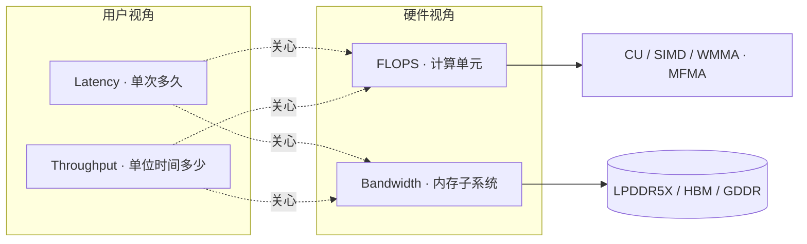
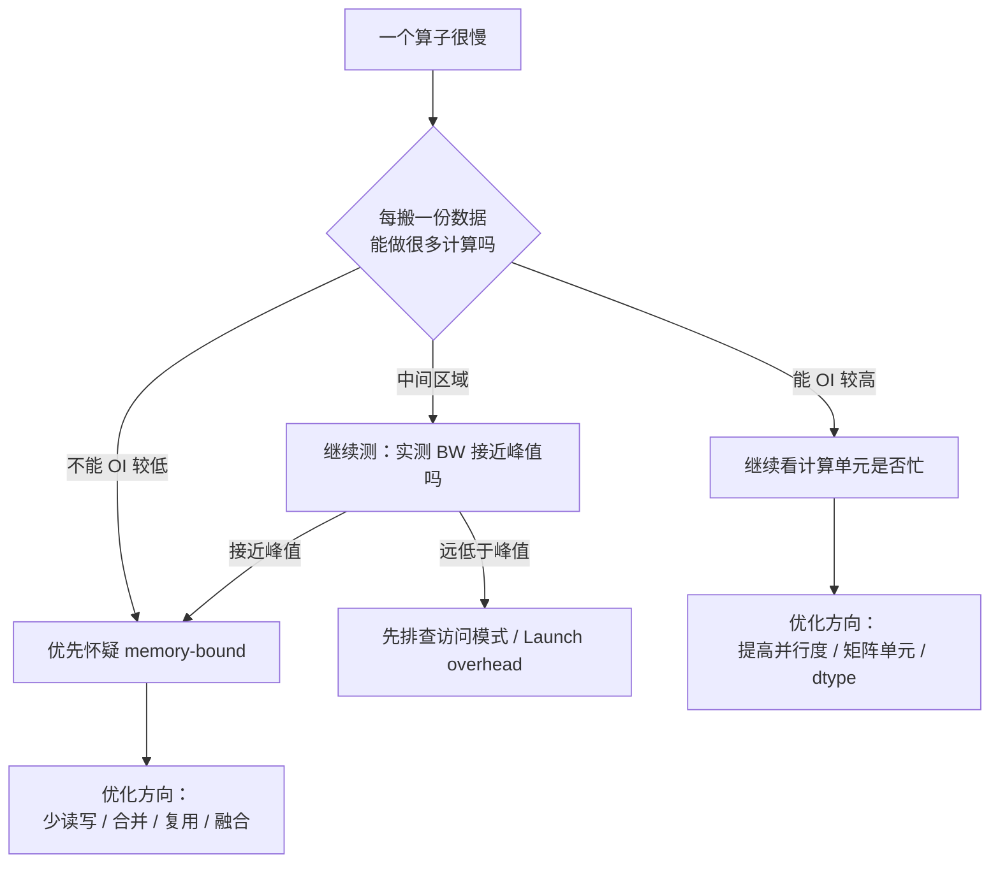
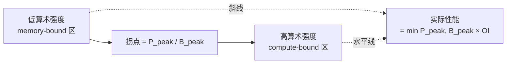
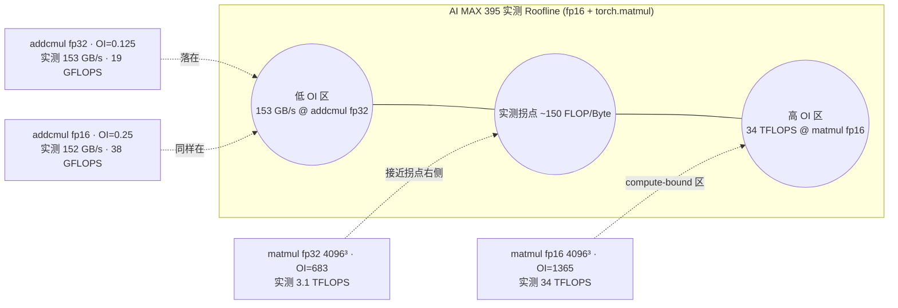

# 第7章 性能优化的基本方法论

## 本章导读

> 上一篇我们把 AMD GPU、ROCm、PyTorch 和最小 HIP 程序串起来，回答了「能不能跑」的问题。从这一篇开始，问题变成：怎么知道它跑得准不准、快不快、慢在哪里？
>
> 本章先不急着打开 profiling 工具，而是建立后面所有性能分析都会用到的判断语言。读完后你应该能：用四个核心指标（Latency、Throughput、Bandwidth、FLOPS）描述一段性能现象；用 memory-bound / compute-bound 给一个算子贴上"当前版本"的瓶颈标签；用 Roofline 把这些标签放回硬件参数里看；用一份 benchmark 清单避免常见的伪优化。

很多刚开始做性能优化的同学，会直接问：「怎么把 GPU 跑满？」这个问题听上去很工程，但还不够具体。GPU 没跑满可能是数据没送到，可能是任务太碎，可能是测量本身不可靠，也可能它**确实**已经撞上了硬件天花板——只是你还不知道天花板在哪里。

所以 Part 2 的第一步不是「马上优化」，而是先学会问更好的问题：我到底在测什么？这个数字可信吗？它说明瓶颈在哪一层？下一步应该收集什么证据？

本章和上一篇 [AMD GPU 体系结构](../../part1-hardware-rocm/chapter3/index.md)、[内存层次与访存模式](../../part1-hardware-rocm/chapter4/index.md) 是配套关系——那两章告诉你 AI MAX 395 / gfx1151 这块 APU **物理上**长什么样，本章告诉你怎么把硬件参数翻译成可以指导优化决策的判断语言。

## 7.1 为什么不能凭感觉优化

这一节先讲一个容易踩的坑：性能优化最怕的不是「没优化成功」，而是你以为自己优化成功了，其实只是测错了。

日常写业务代码时，凭感觉改一改有时还能工作；但 GPU 性能优化不太一样。GPU 程序通常是异步执行的，第一次运行可能包含初始化或编译开销，同一个输入规模下也可能因为后台负载、缓存状态、调度方式而波动。只看一次运行时间，很容易把偶然现象当成规律。

下面这张表列出几种常见的「直觉判断」与它们更值得追问的问题：

| 直觉判断 | 可能的问题 | 更好的追问 |
| ---- | ---- | ---- |
| GPU 利用率低，所以 kernel 写得差 | 可能是 CPU 调度慢、输入太小、数据搬运多，或者 GPU 一直在等任务 | GPU 到底在等什么？任务有没有持续送进去？ |
| 改完代码以后快了一点 | 可能只是 warmup、缓存、后台负载或随机波动 | 重复测了吗？统计口径一样吗？ |
| 单个算子快了，端到端就会快 | 这个算子可能只占总时间的一小部分 | 它在整条链路里占多少比例？ |
| 平均时间下降了 | 可能尾延迟变差，或者波动变大 | median、min、p95、p99 有没有一起看？ |
| GPU 时间很短，说明程序很快 | 可能只量到了 CPU 提交任务的时间，没有等 GPU 真正算完 | 计时前后有没有 synchronize？ |
| fp16 比 fp32 快两倍 | 也许只是计算路径变了，访存没变 | 是真省了带宽，还是只在算力侧变快？ |

这里先记住一句话：**没有稳定测量，就没有可靠优化。**

如 @fig-measure-loop 所示，把"凭感觉改"换成"先测后改"的最小闭环，至少要包含五步：

::: figure fig-measure-loop


从"感觉慢"到"可验证优化"的最小闭环
:::

如 @fig-measure-loop 所示，优化不是从改代码开始，而是从定义问题和设计测量开始。否则你很容易进入一种状态：代码改了很多，数字也变了，但没人知道到底是哪一步起作用。

这也是为什么本书反复强调 HPOA：先理解硬件和系统，再收集证据，再提出优化，最后把流程固化下来。Part 2 就是在补齐其中的 Profiling 这一环，本章先把"用什么语言描述性能"讲清楚，下一章 [用一个慢算子跑通 Profiling 闭环](../chapter8/index.md) 把这套语言落到一个具体例子上。

## 7.2 Latency、Throughput、Bandwidth、FLOPS

这一节先给你四个最常用的性能指标。它们都在描述「快不快」，但回答的问题完全不同。

可以先用餐厅来类比：

| 指标 | 中文直觉 | 餐厅类比 | 在 AI Infra 里常问的问题 | 常用单位 |
| ---- | ---- | ---- | ---- | ---- |
| Latency | 延迟，一次任务等多久 | 一个顾客从点单到拿到饭要等多久 | 单次请求多久返回？一个 kernel 跑多久？ | ms / μs / ns |
| Throughput | 吞吐，单位时间做多少任务 | 餐厅一段时间能服务多少顾客 | 每秒多少请求？每秒多少 token？ | req/s, tok/s, samples/s |
| Bandwidth | 带宽，单位时间搬多少数据 | 传送带一段时间能搬多少食材 | 数据从内存到计算单元够不够快？ | GB/s, TB/s |
| FLOPS | 浮点计算能力，单位时间做多少计算 | 厨师一段时间能完成多少次切菜动作 | GPU 的计算单元有没有忙起来？ | GFLOPS, TFLOPS |

这些指标之间不是简单的「越大越好」或「越小越好」，而是要看你正在解决什么问题。

### Latency：单次任务等多久

Latency 关心的是一次任务从开始到结束花了多久。对在线推理来说，用户更直接感受到的是延迟：请求发出去以后，多久能看到第一个结果，多久能拿到完整输出。

延迟也分层次。一次端到端请求的延迟，可能包含网络、排队、预处理、框架调度、kernel 执行、后处理。一个 kernel 的延迟，只是其中一小段。你不能只看 kernel 快不快，就直接断言用户体验会不会变好。

LLM 推理常见的两个延迟指标 **TTFT**（Time To First Token，首 token 时间）和 **TPOT**（Time Per Output Token，平均出 token 间隔）就是分层延迟思维的典型例子——它们刻意把"prefill 阶段"和"decode 阶段"分开看，因为这两段瓶颈完全不同。详见 [LLM 单卡推理性能分析入门](../../part5-inference/chapter25/index.md)。

### Throughput：单位时间做多少任务

Throughput 关心的是系统整体产能。一个服务可能单次请求稍慢一点，但如果能稳定同时处理更多请求，总吞吐反而更高。

这就是为什么推理系统经常要在 latency 和 throughput 之间取舍。比如把 batch 做大一点，GPU 可能更忙、吞吐更高；但单个请求要多等一会儿才能凑够 batch，延迟也可能上升。

### Bandwidth：单位时间搬多少数据

Bandwidth 关心的是数据搬运能力。很多 AI 算子看起来是在「算」，但真正卡住的是「数据送不到计算单元」。

如果一个操作每次只做很少计算，却要读写大量数据，那么它可能更像是在考验内存系统，而不是考验计算单元。Vector Add 就是这种类型的入门例子：每个元素的数学操作很简单，但每次都要读输入、写输出。

在 [内存层次与访存模式](../../part1-hardware-rocm/chapter4/index.md) 里我们已经看到，gfx1151 / AI MAX 395 是一颗 APU，CPU 和 GPU 共享 256-bit LPDDR5X-8000，理论带宽 ~256 GB/s、DRAM 实测平台约 ~225 GB/s（本章 7.5 与 chapter5 §4.7 的 micro-benchmark 实测一致）——这条线决定了所有 memory-bound 算子在这块硬件上的天花板。

### FLOPS：单位时间做多少浮点计算

FLOPS 关心的是计算能力。矩阵乘这类操作包含大量乘加，如果数据能被很好地复用，就更有机会接近计算单元的能力边界。

但高 FLOPS 不等于端到端一定快。你可能让某个矩阵乘跑得很好，但如果数据搬运、服务调度或后处理占了大头，用户看到的总延迟仍然不理想。

所以这四个指标要配合看。**先问"我现在关心的是单次请求、系统产能、数据搬运，还是纯计算能力？"再选指标。**

如 @fig-perf-metrics 所示，可以把四个指标和它们各自盯着的硬件路径画在一起：

::: figure fig-perf-metrics


四个性能指标各自盯着哪条硬件路径
:::

## 7.3 Memory-bound 与 Compute-bound

这一节把前面的 bandwidth 和 FLOPS 连起来。后面你会经常看到两个词：memory-bound（被搬数据卡住）和 compute-bound（被算数卡住）。这是判断一个算子瓶颈的最基本分类。

memory-bound 的意思是：计算本身不难，主要时间花在等数据。compute-bound 的意思是：数据供应相对跟得上，主要瓶颈在计算单元的执行能力。

可以先用下面这个问题来判断直觉：**每搬一份数据，能做多少计算？**

这个直觉也叫**算术强度**（Arithmetic Intensity，AI；为避免和"AI = 人工智能"混淆，下文有时也写作"OI = Operational Intensity，操作强度"），单位 FLOP/Byte。它在问的就是「每读 1 字节内存，平均能做多少次浮点运算」。直觉规则：

- 如果搬很多数据，只做很少计算，更容易 memory-bound；
- 如果一份数据能被反复用于很多计算，更可能 compute-bound。

### 常见 AI 算子的算术强度参考

下面这张表把几个常见 AI 算子的算术强度量级、典型瓶颈方向和优化抓手放在一起。**注意算术强度受 shape、dtype、实现方式强烈影响**，同一个名字的算子在不同条件下完全可能跨过 memory-bound / compute-bound 的边界，下表只给出"未做特殊优化的朴素实现"下的量级直觉。

| 算子 | 输入 / 实现假设 | 算术强度量级 (FLOP/Byte) | 典型瓶颈 | 优化抓手 |
| ---- | ---- | ---- | ---- | ---- |
| Element-wise add (a + b) | fp32, 大数组 | ~0.08（1 FLOP / 12 B） | memory-bound | 向量化 load、合并访存、kernel 融合 |
| Vector triad (c = a + α·b) | fp32, 大数组 | ~0.17（2 FLOP / 12 B） | memory-bound | 同上 |
| Reduction (sum) | fp32, 大数组 | < 1 | memory-bound | LDS 局部归约 + 一次 global atomic |
| Softmax (单趟) | fp32, hidden=H | ~3-5 | memory-bound | 减最大值 + 融合归约，少落盘中间结果 |
| LayerNorm | fp32, hidden=H | ~5-10 | memory-bound | reduction + normalize 融合 + 向量化 |
| GEMM 朴素 (一线程一元素) | fp16/fp32, 中等 M/N/K | 接近 1 | memory-bound | 必须 tile + LDS / 寄存器复用 |
| GEMM (tile + LDS) | fp16, 大 M/N/K, BLOCK=128 | 数十 ~ 上百 | 多在 compute-bound | 上 WMMA / MFMA、调 tile size |
| GEMM (WMMA / MFMA + 大 batch) | fp16/bf16, 大 GEMM | 数百 ~ > 1000 | compute-bound | 提高 occupancy、更激进 tile |
| Attention 朴素 (Q·K^T → softmax → ·V) | seq=L, head_dim=D | 取决于 L 和 D | 中间区，常被中间矩阵物化拖累 | FlashAttention 风格融合 |
| Conv (3×3, 中等 channel) | fp16, NCHW | 数 ~ 数十 | 取决于 tile 是否复用 | im2col / Winograd / Implicit GEMM |

> 这张表里的"算术强度量级"来自经典 HPC 教材里对 STREAM、GEMM 等基准的标准估算（参考 LBNL Roofline 主页）；在 AI MAX 395 + ROCm 7.12.0 上的真实曲线，本章 7.5 给出 micro-benchmark 设计骨架，第 8 章 [用一个慢算子跑通 Profiling 闭环](../chapter8/index.md) 把数字补齐。

如 @fig-bottleneck-triage 所示，用算术强度做"哪种瓶颈"的初筛：

::: figure fig-bottleneck-triage


用算术强度直觉做"瓶颈类型"的初筛
:::

如 @fig-bottleneck-triage 所示，memory-bound 和 compute-bound 不是两个孤立术语，而是在帮你选择下一步优化方向。前者更关注「怎么少搬、顺着搬、复用数据」，后者更关注「怎么让计算单元更有效地干活」。

不要把分类理解成绝对标签。一个算子在某个输入规模、某种实现、某块硬件上可能偏 memory-bound；换了 shape、布局或实现以后，瓶颈可能变化。**性能分析的关键不是给它贴永久标签，而是用证据判断"当前这个版本"更像被什么卡住。**

## 7.4 Roofline 思想入门

这一节介绍 Roofline。这是 LBNL（Lawrence Berkeley 国家实验室）的 Williams、Waterman、Patterson 在 2008 年提出的可视化模型，把一颗芯片的"能跑多快"压缩成一张图（参考 [LBNL Roofline 主页](https://crd.lbl.gov/divisions/amcr/computer-science-amcr/par/research/roofline/)）。它的核心想法非常朴素：**任何 kernel 的实际性能都被两件事卡住——算力上限和带宽上限**。

### 两条线的来源

把它们画在同一张坐标系里：

- **横轴**：算术强度（Arithmetic Intensity，AI / OI），单位 FLOP/Byte；
- **纵轴**：实际可达性能，单位 FLOP/s（或 TFLOPS）；
- **两条线**：
  - **水平线**——硬件峰值算力 P_peak（给定精度下的 TFLOPS）；
  - **斜线**——硬件峰值带宽 B_peak 乘以算术强度。

实际性能 ≈ `min(P_peak, B_peak × OI)`。两条线相交的地方就是**拐点**：拐点左边是 memory-bound 区（性能由斜线决定），右边是 compute-bound 区（性能由水平线决定）。

如 @fig-roofline-lines 所示：

::: figure fig-roofline-lines


Roofline 的两条线：左半边由带宽决定，右半边由算力决定
:::

### 把 AI MAX 395 放进 Roofline

Roofline 的两条线是**硬件参数**，所以同一个 kernel 在不同 GPU 上画出来的图完全不一样。下面这张表把本书硬件基线 AI MAX 395 / gfx1151 的两条线整理出来：

| 参数 | 量级 / 数值 | 来源 / 备注 |
| ---- | ---- | ---- |
| 架构 | RDNA 3.5（gfx1151） | AMD Strix Halo 平台，参见 [AMD GPU 体系结构](../../part1-hardware-rocm/chapter3/index.md) |
| CU 数量 | 40 RDNA 3.5 CU（20 WGP） | 同上 |
| 显存形态 | 共享 256-bit LPDDR5X-8000，最高 128 GB | unified memory，无独立 HBM/GDDR |
| **B_peak**（理论带宽） | ~256 GB/s | LPDDR5X 256-bit × 8 Gbps |
| **B_peak**（DRAM 实测平台） | ~225 GB/s | 本章 7.5 Triton copy 128 MiB / 512 MiB footprint 实测；与 [内存层次与访存模式](../../part1-hardware-rocm/chapter4/index.md) 4.7.2 实测 ~225 GB/s 一致 |
| **B_eff**（MALL 命中区间） | ~528 GB/s | 本章 7.5 Triton copy 32 MiB footprint 实测，对应 MALL 命中 |
| **P_peak**（torch.matmul fp16 实测，4096³） | ~34 TFLOPS（achieved） | 本章 7.5 实测；调用 rocBLAS / hipBLASLt + WMMA 路径，并不一定打满硬件 P_peak |
| **P_peak**（torch.matmul fp32 实测，4096³） | ~3.1 TFLOPS（achieved） | 本章 7.5 实测；fp32 走 VALU，不进 WMMA |
| 拐点（fp16，按实测 P_peak ≈ 34 TFLOPS / B_peak ≈ 225 GB/s 估算） | OI ≈ 34e12 / 225e9 ≈ **~150 FLOP/Byte** | 实测下限拐点：算力达不到社区整理的 ~59 TFLOPS 时，拐点会左移，更早进 compute-bound |

> 上表中的"DRAM 实测 ~225 GB/s"来自本章 7.5 + [内存层次与访存模式](../../part1-hardware-rocm/chapter4/index.md) 4.7 的 Triton copy / triad micro-benchmark；"fp16 ~34 TFLOPS"是 `torch.matmul` 在 4096×4096×4096 上的实测吞吐，是当前算子库 + WMMA 路径下的 achieved 值，不等于硬件 P_peak。社区整理的 ~59 TFLOPS 是仅算 WMMA SIMD 单元的理论顶；实际 PyTorch op 通常拿不到。

把 [7.3](#_7-3-memory-bound-与-compute-bound) 表里的算子算术强度和实测拐点 ~150 FLOP/Byte 放在一起看：

- Element-wise add / triad（OI ~0.1）：远在拐点左侧，必然 memory-bound——这块硬件上做向量逐元素 op，**理论最快也就是受 LPDDR5X 带宽决定**，再怎么改算力都没用。本章 7.5 的 PyTorch addcmul（fp32, 4096²）实测拿到 153 GB/s 有效带宽，已经接近 DRAM 实测平台 225 GB/s 的 70%；
- 朴素 GEMM（OI ~1）：仍在拐点左侧很远的位置，所以"一线程算一个元素"的朴素 GEMM 在 gfx1151 上基本跑不出像样数字——它的瓶颈是访存，不是算力；
- Tile + LDS + WMMA 的 GEMM（OI 可达数百）：才有可能逼近拐点，落在水平线附近——这就是为什么 [Matmul 入门优化](../../part3-hip-kernels/chapter16/index.md) 一定要讲 tiling 和矩阵单元；本章 7.5 跑的 `torch.matmul(4096³, fp16)` 实测 34 TFLOPS、OI ≈ 1365 FLOP/Byte，已经稳稳地落在拐点右侧的 compute-bound 区。

如 @fig-roofline-aimax395 所示，把实测拐点和典型算子的位置画在一张概念图上：

::: figure fig-roofline-aimax395


几个典型算子在 AI MAX 395 实测 Roofline 上的相对位置（数据来自 7.5 micro-benchmark）
:::

> @fig-roofline-aimax395 的实测拐点 ~150 FLOP/Byte 来自 `torch.matmul fp16 4096³` 实测 ~34 TFLOPS（achieved，含 WMMA + rocBLAS）除以 DRAM 实测平台 ~225 GB/s。注意：这是当前 `torch.matmul` + ROCm 7.12.0 算子库下的 achieved 拐点，不是硬件理论顶——硬件 P_peak（社区估 ~59 TFLOPS）+ 理论 B_peak（~256 GB/s）算出来的拐点会更靠右（~230 FLOP/Byte 量级）。性能优化时盯实测 achieved 拐点更有用。

### Roofline 不是为了背图

Roofline 不是为了让你背一张图，而是帮助你少走弯路。三条实操含义：

1. **如果一个算子明显落在斜线下方（memory-bound 区）**，你一上来只改计算指令，可能收益很小——优先看访存模式、合并访存、tile 复用、kernel 融合。
2. **如果一个算子已经贴着水平线（compute-bound 区）**，再继续纠结少读几次内存，也未必是最优先的事——更值得看 occupancy、矩阵单元利用率、dtype 选择。
3. **如果一个算子既离斜线远、又离水平线远**——它要么是测量错了，要么是 launch overhead / kernel 内部 stall 在拖累它，先回去检查 7.5 的 benchmark 流程。

后面进入 profiling 章节时，我们会把 benchmark 结果、kernel 时间和硬件计数器（[Omniperf 与硬件计数器进阶](../chapter10/index.md)）放回这个框架里看。到那时，你再看 Roofline，就不只是「理论上限」四个字，而是一套判断下一步该看哪里的方法。

## 7.5 如何设计一个可信的 benchmark

这一节讲本章最实用的部分：怎样让一次 benchmark 值得相信。

benchmark 不是「随手跑一下看个时间」。一个可信 benchmark 至少要让别人回答几个问题：你跑的输入是什么？计时范围是什么？跑了几次？有没有预热？GPU 是否真的执行完了？硬件和软件版本是什么？

### 检查清单

可以先按下面这份清单检查：

| 检查项 | 为什么重要 | 常见错误 |
| ---- | ---- | ---- |
| 固定输入规模 | 输入变了，时间自然会变 | 前后对比时 shape 不一致 |
| 固定数据类型 | fp32、fp16、bf16 的计算路径不同 | 只说"快了"，不说 dtype |
| 区分初始化和正式计时 | 第一次运行可能包含加载、编译、缓存准备 | 把首轮初始化当成稳定性能 |
| warmup | 让缓存、JIT、设备状态进入稳定状态 | 第一轮特别慢，直接拿来平均 |
| repeat | 单次结果可能只是偶然 | 只跑一次就下结论 |
| synchronize | GPU 任务常常异步提交 | 只量到 CPU 提交时间 |
| 计时器选择 | wall clock vs GPU event 精度差异大 | 用 `time.time()` 量微秒级 kernel |
| 锁定时钟 / 后台干扰 | 频率波动会污染数据 | 后台跑着别的 GPU 任务 |
| 记录环境 | 后续复查需要硬件、驱动、框架版本 | 只有一个数字，没有上下文 |
| 只改一个变量 | 才知道是谁带来变化 | 同时改 shape、dtype、实现和参数 |

### 用伪流程描述一个最小 benchmark

```text
准备固定输入
记录硬件、软件版本和参数
运行若干次 warmup
等待设备完成
重复计时多次
每次计时都确保测量范围一致
汇总 mean / median / min / 波动
保存原始输出和结论
```

`mean`、`median`、`min` 这几个统计量各有用处：

- **mean**：平均值，容易受异常慢的一次影响；
- **median**：中位数，更能代表多数情况下的表现；
- **min**：最好的一次，常用来观察较少受外部干扰时的能力；
- **波动范围 / std / p95 / p99**：告诉你这个 benchmark 是否稳定，以及尾延迟有多差。

不要只相信一个数字。**一个 benchmark 如果波动很大，你应该先修测量方法，而不是急着优化代码。**

### Micro-benchmark 设计骨架（伪代码）

下面三段是本章建议的"通用 micro-benchmark 骨架"——分别对应 PyTorch、Triton、HIP 三种最常见的入口。骨架 A、B 已经在 AI MAX 395 + ROCm 7.12.0 上跑过，实测数字见本节末尾"实测数字"小节，脚本与日志落到 [`code/part2-profiling/chapter7/`](https://github.com/Weihong-Liu/hello-ai-infra/tree/main/code/part2-profiling/chapter7)。代码块里的 `🚧 数字待实测` 是给读者复用骨架时改自己输入的占位提示。

#### 骨架 A：PyTorch 端到端 op 计时

最常见的入口：你想知道 `torch.nn.functional.softmax(x)` 在某个 shape 上有多快。

<details>
<summary>代码骨架：bench_torch_op.py</summary>

```python
# code/part2-profiling/chapter7/bench_torch_op.py
# 用法：python bench_torch_op.py --shape 4096,4096 --dtype fp16 --repeats 200
# 目标：演示一个可信的 PyTorch 算子 benchmark
# 硬件上下文：AI MAX 395 + ROCm 7.12.0  🚧 数字待实测
import argparse
import statistics
import torch


def bench(shape, dtype, repeats=200, warmup=20):
    x = torch.randn(*shape, dtype=dtype, device="cuda")

    # warmup：让 JIT、cache、clock 进入稳定状态
    for _ in range(warmup):
        torch.softmax(x, dim=-1)
    torch.cuda.synchronize()

    # 用 GPU event 计时，不要用 time.time()
    start = [torch.cuda.Event(enable_timing=True) for _ in range(repeats)]
    end   = [torch.cuda.Event(enable_timing=True) for _ in range(repeats)]
    for i in range(repeats):
        start[i].record()
        torch.softmax(x, dim=-1)
        end[i].record()
    torch.cuda.synchronize()

    times_ms = [s.elapsed_time(e) for s, e in zip(start, end)]
    return {
        "mean":   statistics.mean(times_ms),
        "median": statistics.median(times_ms),
        "min":    min(times_ms),
        "p95":    sorted(times_ms)[int(len(times_ms) * 0.95)],
        "std":    statistics.pstdev(times_ms),
    }


if __name__ == "__main__":
    p = argparse.ArgumentParser()
    p.add_argument("--shape", default="4096,4096")
    p.add_argument("--dtype", default="fp16", choices=["fp16", "bf16", "fp32"])
    p.add_argument("--repeats", type=int, default=200)
    args = p.parse_args()

    shape = tuple(int(x) for x in args.shape.split(","))
    dtype = {"fp16": torch.float16, "bf16": torch.bfloat16, "fp32": torch.float32}[args.dtype]

    stats = bench(shape, dtype, args.repeats)
    # 🚧 数字待 AI MAX 395 + ROCm 7.12.0 实测
    print(f"shape={shape} dtype={args.dtype} stats={stats}")
```

</details>

要点：

- 用 `torch.cuda.Event` 而不是 `time.time()`——前者计的是 GPU 时间，后者会被异步 launch 误导；
- warmup 至少 20 次；
- 同时输出 mean / median / min / p95 / std，单一数字不够。

#### 骨架 B：Triton kernel 计时与有效带宽

针对单个 kernel 的 micro-benchmark，重点是**用 bytes / ops 估算反推有效带宽或算力**，再和 Roofline 上的 P_peak / B_peak 比较。

<details>
<summary>代码骨架：bench_triton_copy.py</summary>

```python
# code/part2-profiling/chapter7/bench_triton_copy.py
# 用法：python bench_triton_copy.py --n 16777216 --repeats 200
# 目标：用最简单的 copy kernel 验证 benchmark 流程，并估算有效带宽
# 硬件上下文：AI MAX 395 + ROCm 7.12.0  🚧 数字待实测
import argparse
import torch
import triton
import triton.language as tl


@triton.jit
def copy_kernel(x_ptr, y_ptr, n, BLOCK: tl.constexpr):
    pid = tl.program_id(0)
    offs = pid * BLOCK + tl.arange(0, BLOCK)
    mask = offs < n
    tl.store(y_ptr + offs, tl.load(x_ptr + offs, mask=mask), mask=mask)


def bench(n, repeats=200, warmup=20, block=1024):
    x = torch.empty(n, dtype=torch.float32, device="cuda")
    y = torch.empty_like(x)
    grid = ((n + block - 1) // block,)

    for _ in range(warmup):
        copy_kernel[grid](x, y, n, BLOCK=block)
    torch.cuda.synchronize()

    s = torch.cuda.Event(enable_timing=True)
    e = torch.cuda.Event(enable_timing=True)
    s.record()
    for _ in range(repeats):
        copy_kernel[grid](x, y, n, BLOCK=block)
    e.record()
    torch.cuda.synchronize()
    ms = s.elapsed_time(e)

    # 每次迭代搬运 2 * n * 4 字节（一读一写 fp32）
    total_bytes = 2 * n * 4 * repeats
    eff_bw = total_bytes / (ms * 1e-3) / 1e9   # GB/s
    return ms, eff_bw


if __name__ == "__main__":
    p = argparse.ArgumentParser()
    p.add_argument("--n", type=int, default=1 << 24)
    p.add_argument("--repeats", type=int, default=200)
    args = p.parse_args()
    ms, gbps = bench(args.n, args.repeats)
    # 🚧 数字待 AI MAX 395 + ROCm 7.12.0 实测：
    # 大 n（>>32 MB MALL）下应接近 LPDDR5X 实测带宽（~215 GB/s 量级）
    print(f"n={args.n} time={ms:.3f} ms eff_bw={gbps:.2f} GB/s")
```

</details>

要点：

- **用一个公式把时间换算成 BW（或 TFLOPS）**——单看时间没法判断"离峰值多远"；
- 当 `n` 远大于 32 MB MALL 时，eff_bw 应该逼近 LPDDR5X 实测带宽，否则 benchmark 流程本身有问题；
- 同样的骨架可以替换 kernel 来测 GEMM、softmax 等，只要把"搬运 bytes / 计算 ops"的公式换掉。

#### 骨架 C：HIP event 计时

有时你需要绕过 Python 直接量 HIP kernel——它对应的最小 benchmark 骨架是这样的：

<details>
<summary>代码骨架：bench_hip.cpp</summary>

```cpp
// code/part2-profiling/chapter7/bench_hip.cpp
// 用法：hipcc -O3 bench_hip.cpp -o bench_hip && ./bench_hip
// 目标：HIP event 最小计时模板
// 硬件上下文：AI MAX 395 + ROCm 7.12.0  🚧 数字待实测
#include <hip/hip_runtime.h>
#include <cstdio>

__global__ void my_kernel(float* x, int n) {
    int i = blockIdx.x * blockDim.x + threadIdx.x;
    if (i < n) x[i] = x[i] * 2.0f + 1.0f;
}

int main() {
    const int n = 1 << 24;
    const int warmup = 20, repeats = 200;
    float* d;
    hipMalloc(&d, n * sizeof(float));

    int block = 256;
    int grid  = (n + block - 1) / block;

    for (int i = 0; i < warmup; ++i)
        my_kernel<<<grid, block>>>(d, n);
    hipDeviceSynchronize();

    hipEvent_t s, e;
    hipEventCreate(&s); hipEventCreate(&e);
    hipEventRecord(s);
    for (int i = 0; i < repeats; ++i)
        my_kernel<<<grid, block>>>(d, n);
    hipEventRecord(e);
    hipEventSynchronize(e);

    float ms = 0.f;
    hipEventElapsedTime(&ms, s, e);
    // 🚧 数字待 AI MAX 395 + ROCm 7.12.0 实测
    printf("avg per launch = %.4f ms\n", ms / repeats);

    hipFree(d);
    return 0;
}
```

</details>

要点：

- `hipEvent_t` 的精度足够量到 μs 级 kernel；
- 一定要 `hipEventSynchronize` 之后再读 elapsed time，否则 host 还在拿着 stale 值；
- 第 8 章 [用一个慢算子跑通 Profiling 闭环](../chapter8/index.md) 会把这个骨架挂到 rocprof / PyTorch Profiler 上做完整链路。

#### 实测数字（AI MAX 395 + ROCm 7.12.0）

下面这张表是用上面三段骨架在 AI MAX 395 上跑出来的实测值。脚本与日志见 [`code/part2-profiling/chapter7/`](https://github.com/Weihong-Liu/hello-ai-infra/tree/main/code/part2-profiling/chapter7)：

| 实验 | 算子 / 公式 | shape / dtype | median 时延 | 有效带宽 | 实际算力 | 算术强度 |
| ---- | ---- | ---- | ----: | ----: | ----: | ----: |
| 骨架 A — PyTorch addcmul | `y = a*x + b` | 4096² / fp32 | 1.754 ms | **153 GB/s** | 19.1 GFLOPS | 0.125 FLOP/B |
| 骨架 A — PyTorch addcmul | `y = a*x + b` | 4096² / fp16 | 0.880 ms | **152 GB/s** | 38.1 GFLOPS | 0.25 FLOP/B |
| 骨架 A — torch.matmul（参考 P_peak） | `M·M^T` | 4096³ / fp32 | 44.5 ms | 4.5 GB/s | **3.1 TFLOPS** | 683 FLOP/B |
| 骨架 A — torch.matmul（参考 P_peak） | `M·M^T` | 4096³ / fp16 | 4.05 ms | 24.9 GB/s | **34.0 TFLOPS** | 1365 FLOP/B |
| 骨架 B — Triton vector copy | `y = x` | 0.5 MiB（pair） | 0.0086 ms | 61 GB/s | — | — |
| 骨架 B — Triton vector copy | `y = x` | 8 MiB（pair） | 0.018 ms | **455 GB/s** | — | — |
| 骨架 B — Triton vector copy | `y = x` | 32 MiB（pair） | 0.064 ms | **528 GB/s** ← MALL 命中 | — | — |
| 骨架 B — Triton vector copy | `y = x` | 128 MiB（pair） | 0.596 ms | **225 GB/s** ← DRAM 平台 | — | — |
| 骨架 B — Triton vector copy | `y = x` | 512 MiB（pair） | 2.39 ms | 225 GB/s | — | — |

读这张表的关键点：

- **memory-bound 算子的"快"上限就是带宽**：addcmul 在 fp32 / fp16 下都拿到 ~152 GB/s，这是 4096² × 4×4 / 2×4 字节工作集（128 MiB / 64 MiB）落在 DRAM 区下的有效带宽。同样的 fp16 vs fp32 对比，时间砍半但带宽几乎不变——印证了 [7.6 节](#_7-6-如何避免伪优化) 表里的"改 dtype 之后吞吐翻倍 ≠ 真省了带宽"那一条；fp16 真省到的是 byte 数，OI 也跟着翻倍。
- **vector copy 的 footprint 扫描清楚地画出 cache 层级**：8 MiB 还在 L2/MALL 之间，看到 ~455 GB/s；32 MiB 正好踩进 MALL 命中（gfx1151 MALL 32 MB），峰值 ~528 GB/s；> 128 MiB 全进 DRAM，跌到 ~225 GB/s 平台。这条曲线就是后面所有 memory-bound 算子要参照的 B_peak 线。
- **matmul fp16 的实测 34 TFLOPS 是当前 achieved P_peak**：算子库 + WMMA 路径下能稳到的算力天花板。fp32 / VALU 路径只能到 3.1 TFLOPS，差一个数量级——这就是为什么模型推理普遍走低精度。
- **OI=0.125 / 0.25 vs OI=683 / 1365**：addcmul 与 matmul 在算术强度上差了 5000 倍，分别坐在拐点左右两侧，画到 Roofline 上就是 @fig-roofline-aimax395 那个样子。

> 上表中 8 MiB / 0.5 MiB 那两个点带宽相对较低，是因为 footprint 太小、launch overhead 占比高（每次 copy 真正干活只有几 μs）。这也提醒一个关于"micro-benchmark 设计骨架"的现实：太小的输入测出来的不是带宽峰值，是 launch overhead；太大的输入又只能看到 DRAM 平台。要看 cache 层级必须跑 footprint 扫描，而不是只跑一个 size。

> 三段骨架本身只是流程模板；上表数字落在 [`code/part2-profiling/chapter7/logs/`](https://github.com/Weihong-Liu/hello-ai-infra/tree/main/code/part2-profiling/chapter7/logs) 下的 JSON 里，按 [.docs-rules/02-experiment-policy.md](https://github.com/Weihong-Liu/hello-ai-infra/blob/main/.docs-rules/02-experiment-policy.md) 复跑可复现。

## 7.6 如何避免伪优化

这一节收尾，专门讲「看起来变快了，但其实不一定」的情况。伪优化最麻烦的地方在于，它会给你一种很强的成就感：数字变好了，代码也改了，好像问题解决了。但如果测量方式不可靠，后面换输入、换机器、换版本时，结果很可能消失。

下面是常见伪优化来源：

| 现象 | 可能原因 | 应对方式 |
| ---- | ---- | ---- |
| 第一次很慢，后面明显变快 | 首轮包含初始化、编译、缓存准备 | 单独记录首轮，正式统计前 warmup |
| 改完只快了一点 | 可能是正常波动 | 增加 repeat，看 median 和 std |
| GPU 计时几乎为零 | 没有等待 GPU 完成 | 使用 GPU event 或显式 synchronize |
| 小输入特别快 | 可能主要测到 launch overhead 或缓存效果 | 用多个输入规模观察趋势 |
| 单个 kernel 快了，但端到端没变化 | 瓶颈不在这个 kernel | 先看它在总耗时中占比 |
| 前后版本差异很大 | 同时改了多个变量 | 一次只改一个变量，保留对照组 |
| 带宽或 FLOPS 看起来异常高 | 数据量模型或计时范围不一致 | 重新核对 bytes / ops 的估算口径 |
| 改 dtype 之后吞吐翻倍 | 可能只是 Tensor 数量变了一半 | 把 byte 数和 ops 数都重新算 |
| 关掉某个 print / log 后变慢 | 可能 print 把 host 卡住，意外起到了同步效果 | 计时范围要明确包含或排除日志 |
| 第二次运行就一直很快 | 数据已被 LPDDR / MALL / L2 预热 | 在 footprint 接近 cache 容量时，按工作集大小分级测试 |

避免伪优化的核心方法也很简单：**让实验可复查。**

一次好的性能实验，至少应该留下：输入规模、数据类型、硬件和软件版本、运行命令、原始输出、统计方式、结论。这样几天以后你再回来，或者别人帮你 review 时，才知道这个数字到底从哪里来——这正是 [.docs-rules/02-experiment-policy.md](https://github.com/Weihong-Liu/hello-ai-infra/blob/main/.docs-rules/02-experiment-policy.md) 要求的 `EXPERIMENT.md` 底稿。

如果你现在只记住一条，那就是：**优化前先建立可信 baseline。** 没有 baseline，后面所有「更快了」都没有参照物。

## 本章小结

- 性能优化不是从改代码开始，而是从定义问题和设计测量开始。
- Latency、Throughput、Bandwidth、FLOPS 回答的是不同问题，不能混成一个「快不快」。
- memory-bound（被搬数据卡住）和 compute-bound（被算数卡住）是后续判断瓶颈的基础分类，**算术强度**是连接两者的尺。
- Roofline 的两条线直接来自硬件参数：水平线是 P_peak（受是否使能矩阵单元影响），斜线是 B_peak。AI MAX 395 / gfx1151 上 DRAM 实测平台 ~225 GB/s、MALL 命中区可达 ~528 GB/s；achieved P_peak 在 `torch.matmul fp16 4096³` 实测 ~34 TFLOPS、fp32 ~3.1 TFLOPS；按实测 achieved 数据计算的拐点 OI ≈ ~150 FLOP/Byte。
- 可信 benchmark 至少要控制输入、warmup、repeat、synchronize、记录环境，并保留原始输出；本章给出 PyTorch / Triton / HIP 三段最小骨架。
- 下一章 [用一个慢算子跑通 Profiling 闭环](../chapter8/index.md) 会用一个可控的慢算子，把 baseline、profiler 和瓶颈判断串成完整闭环。

## 延伸阅读

- [LBNL Roofline Performance Model 主页](https://crd.lbl.gov/divisions/amcr/computer-science-amcr/par/research/roofline/) — Williams、Waterman、Patterson 提出 Roofline 的原始项目页与 NERSC 系列教程
- [HIP Performance Guidelines](https://rocm.docs.amd.com/projects/HIP/en/latest/how-to/performance_guidelines.html)
- [HIP Programming Guide](https://rocm.docs.amd.com/projects/HIP/en/latest/) — HIP 编程模型与计时 API 入口
- [PyTorch Profiler 文档](https://docs.pytorch.org/docs/stable/profiler.html)
- [ROCm Documentation](https://rocm.docs.amd.com/)
- [ROCm Compute Profiler (Omniperf) Documentation](https://rocm.docs.amd.com/projects/omniperf/en/latest/) — 第 10 章 [Omniperf 与硬件计数器进阶](../chapter10/index.md) 会用到
- [Chips and Cheese — Strix Halo's Memory Subsystem](https://chipsandcheese.com/p/strix-halos-memory-subsystem-tackling) — gfx1151 实测带宽与 cache 层级的社区整理（仅作 Roofline 参数交叉验证，本书数字以自测为准）
