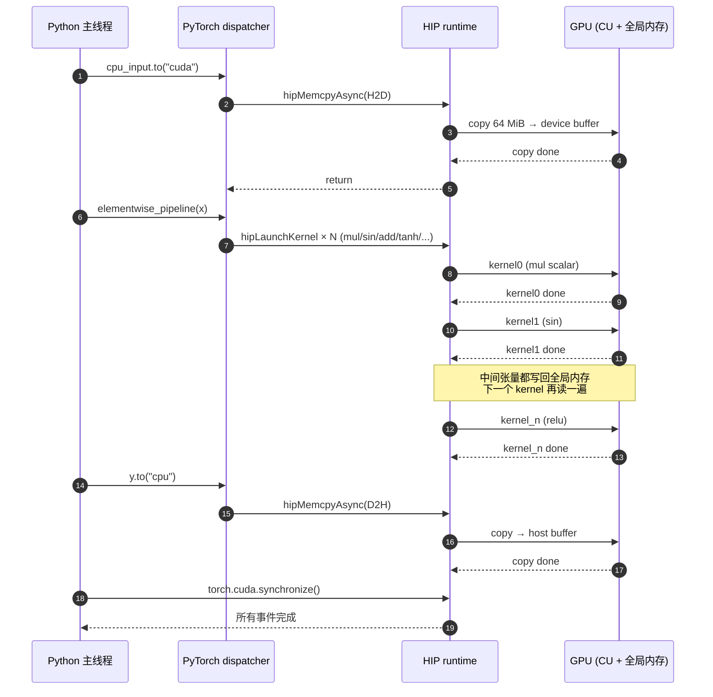
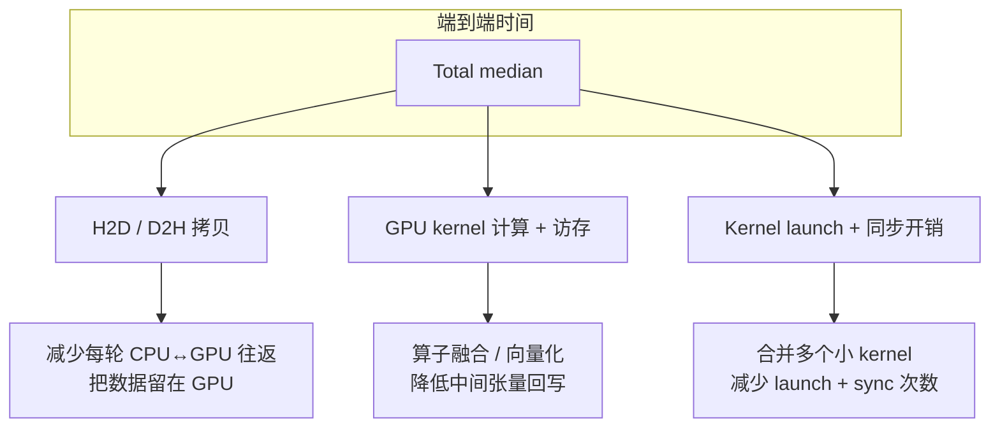
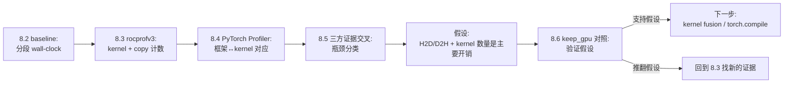

# 第8章 用一个慢算子跑通 Profiling 闭环

## 本章导读

> 上一章建立了判断语言（Latency、Throughput、Bandwidth、FLOPS、memory-bound、compute-bound、可信 benchmark），见 [第 7 章 性能优化的基本方法论](../chapter7/index.md)。本章用一个固定的慢算子做主线，把 benchmark、`rocprofv3` 和 PyTorch Profiler 三条证据线汇到同一张时间线里。读完后，你应该能完成一次从 baseline 到优化假设的最小闭环，并知道下一章 [第 9 章 建立你的第一个性能分析报告](../chapter9/index.md) 把这条闭环写成可复查的报告。

本章不从大模型开始。完整推理链路里同时出现请求排队、token 调度、KV Cache、算子库、通信和后处理，刚开始很难判断一个数字到底来自哪一层。我们先选一个可控的小案例：CPU 上准备输入，把数据搬到 GPU，连续跑多个 elementwise 操作，再把结果搬回 CPU。

这条链路足够简单，但已经包含 profiling 入门最常见的几个问题：

- H2D（Host to Device，CPU 到 GPU）搬运要多久；
- GPU kernel 本身要多久；
- D2H（Device to Host，GPU 到 CPU）搬运要多久；
- Python / PyTorch 调用怎么和 GPU 时间线对应；
- 看到瓶颈以后，下一步应该改哪里。

本章实验环境是 AI MAX 395 / Radeon 8060S Graphics（gfx1151，RDNA3.5），ROCm 7.12.0，PyTorch `2.9.1+rocm7.12.0`，输入为 `16,777,216` 个 `float32` 元素（约 `64 MiB`）。本章所有性能数字均来自 AI MAX 395 实测，原始日志见 [code/part2-profiling/chapter8/EXPERIMENT.md](https://github.com/Weihong-Liu/hello-ai-infra/blob/main/code/part2-profiling/chapter8/EXPERIMENT.md)。

## 8.1 选择一个可控的慢算子

这一节解释为什么选 elementwise pipeline 作为 profiling 入门案例，而不是直接拿 GEMM 或 Attention。

本章使用的 workload 不是单独一次 `a + b`，而是一串 elementwise pipeline：

```python
def elementwise_pipeline(x):
    y = x * 1.0001
    y = torch.sin(y)
    y = y + 0.25
    y = torch.tanh(y)
    y = y * y
    y = torch.sqrt(y + 1.0)
    y = torch.relu(y - 0.1)
    return y
```

它适合作为 profiling 入门案例，原因有三个。

第一，它**容易控制**。输入规模、数据类型、warmup、repeat 都可以固定，输出可以用 checksum 校验，避免“代码改了，结果对不对都没把握”。这正是 [第 7 章 7.5 如何设计一个可信的 benchmark](../chapter7/index.md#75-如何设计一个可信的-benchmark) 反复强调的前提。

第二，它**会触发多个 GPU kernel**。每个 PyTorch elementwise 操作通常会对应一个或多个 GPU kernel。这样我们既能看到单个 kernel 的时间，也能看到连续 launch 带来的累计开销。kernel launch 为什么有开销，背后是 wavefront 调度和 CU 占用问题，详见 [第 3 章 3.2 Wavefront 与 SIMT 执行](../../part1-hardware-rocm/chapter3/index.md#32-wavefront-与-simt-执行)。

第三，它**天然会暴露数据搬运问题**。`baseline` 模式每轮都执行：

```text
CPU tensor -> H2D -> GPU elementwise pipeline -> D2H -> synchronize
```

而 `keep_gpu` 模式把输入提前放到 GPU 上，循环里只跑 GPU pipeline，不在每轮做 H2D / D2H。两个模式对比后，我们就能判断总时间里有多少来自计算、有多少来自数据来回搬。

下面这张表把这条 pipeline 拆开，标出每一段在哪一层硬件单元上发生：

| 阶段 | 主要承担者 | 主要代价类型 | 相关章节 |
| ---- | ---- | ---- | ---- |
| `cpu_input.to("cuda")` | Host 内存控制器 + PCIe / Infinity Fabric | H2D 拷贝、可能的 staging | [第 4 章 4.2](../../part1-hardware-rocm/chapter4/index.md#42-hbm-vs-gddr-vs-infinity-cache) |
| `elementwise_pipeline` | CU 上的 SIMD VALU（每条指令一个 wavefront） | kernel launch + 全局内存读写 | [第 3 章 3.1](../../part1-hardware-rocm/chapter3/index.md#31-compute-unitcu的内部结构) |
| 中间张量 `y` 复用 | 全局内存 / L2 cache | 多轮访存，每个算子一对读写 | [第 4 章 4.3](../../part1-hardware-rocm/chapter4/index.md#43-l1-l2-cache-的工作方式) |
| `y.to("cpu")` | Host 内存控制器 + 同上 | D2H 拷贝、隐含 `synchronize` | [第 4 章 4.2](../../part1-hardware-rocm/chapter4/index.md#42-hbm-vs-gddr-vs-infinity-cache) |
| `torch.cuda.synchronize()` | CPU 阻塞等待 GPU 完成 | wall-clock 边界，不是计算 | [第 7 章 7.5](../chapter7/index.md#75-如何设计一个可信的-benchmark) |

实验脚本放在 `code/part2-profiling/chapter8/slow_elementwise_pipeline.py`，本章后面所有命令、日志、JSON 都来自这个脚本的真实输出。脚本接口和 [第 5 章 第一个 AMD GPU 程序与 baseline](../../part1-hardware-rocm/chapter6/index.md) 里建立的 baseline 习惯保持一致：固定 warmup / repeat、用 GPU event 计时、显式 synchronize、关键数字落 JSON。

## 8.2 运行 baseline benchmark

这一节先跑一遍 baseline，得到端到端时间分布，作为后续所有 profiling 工具的对照基准。

先跑 baseline。命令如下：

```bash
python chapter2/slow_elementwise_pipeline.py \
  --size 16777216 \
  --warmup 20 \
  --repeat 100 \
  --mode baseline \
  --output-json chapter2/logs/baseline_size16777216.json
```

这次运行（AI MAX 395 + ROCm 7.12.0，单位 ms）的关键结果：

| 阶段 | median | min | p95 | 说明 |
| ---- | ----: | ----: | ----: | ---- |
| H2D | 1.852 | 0.823 | 2.054 | CPU 输入搬到 GPU |
| GPU pipeline | 5.279 | 5.206 | 5.325 | 多个 elementwise kernel |
| D2H | 6.727 | 6.091 | 8.502 | GPU 输出搬回 CPU |
| Total | 16.346 | 12.472 | 18.746 | 端到端一轮 |

> 数字来自 `chapter8/logs/baseline_size16777216.json`，size=16,777,216 fp32, warmup=20, repeat=100。注意 H2D / D2H / GPU 三段相加 ≈ 13.9 ms，比 total median 16.3 ms 偏低；差额来自 `time.perf_counter()` 的 wall clock 包住的 host 调度 + `torch.cuda.synchronize()` 等待时间。

这里最重要的不是记住某个绝对数字，而是先看比例：GPU pipeline 占总时间多少？H2D + D2H 占多少？同步又占多少？如果只盯着 kernel 本身，你会漏掉一大块来自数据搬运和 host 等待的时间。

<details>
<summary>展开 baseline 原始输出节选（AI MAX 395 + ROCm 7.12.0）</summary>

```text
python: 3.12.12
torch: 2.9.1+rocm7.12.0
hip_version: 7.12.60610-2bd1678d3d
cuda_available: True
device_name: Radeon 8060S Graphics
size: 16777216
dtype: float32
mode: baseline
warmup: 20
repeat: 100
h2d_median_ms: 1.852161
gpu_pipeline_median_ms: 5.279196
d2h_median_ms: 6.727376
total_median_ms: 16.345957
checksum: 17927246.000000
status: PASS
```

</details>

`16,777,216` 个 `float32` 元素约等于一个 `64 MiB` 的张量。AI MAX 395 是 unified memory 架构（[第 4 章 4.2 HBM vs GDDR vs Infinity Cache](../../part1-hardware-rocm/chapter4/index.md#42-hbm-vs-gddr-vs-infinity-cache) 详解了 gfx1151 上 LPDDR5X 共享给 CPU/GPU 的形态），所以 H2D / D2H 的“拷贝”不一定真的复制 64 MiB 物理数据，但仍然有调度、driver 层迁移和 cache flush 的代价——这正是为什么不能凭直觉就说“unified memory = 零拷贝”。

baseline 提示我们：下一步不能只问“kernel 快不快”，还要问“数据为什么每轮都要重新过一遍 driver 和 cache”。

## 8.3 用 rocprofv3 看 kernel 时间

这一节把视角下沉到 GPU 内部：到底启动了哪些 kernel，每个用了多少时间，memory copy 跟 kernel 时间是什么比例。

ROCm 7 时代的官方 profiling 入口是 `rocprofv3`（属于 ROCprofiler-SDK），早期 `rocprof` / `rocprofv2` 的 CLI 还在过渡期共存，但官方文档已经把 `rocprofv3` 作为新工作流的默认入口（参考 [ROCm rocprofv3 documentation](https://rocm.docs.amd.com/projects/rocprofiler-sdk/en/latest/how-to/using-rocprofv3.html)）。本章统一使用 ROCm 7.12.0 容器内的 `rocprofv3`，避免新旧工具混用。

下面这条命令用的是 ROCm 7.12.0 容器内 `rocprofv3 --version` 报为 1.2.0 的 CLI；同一 ROCm minor 版本内 flag 稳定，不同 minor 版本部分 flag 会有调整：

```bash
rocprofv3 \
  --kernel-trace \
  --memory-copy-trace \
  --runtime-trace \
  --stats \
  --summary \
  -d chapter2/profiles/rocprofv3_baseline \
  -o rocprofv3_baseline \
  --output-format csv json \
  -- \
  python chapter2/slow_elementwise_pipeline.py \
    --size 16777216 \
    --warmup 5 \
    --repeat 10 \
    --mode baseline \
    --output-json chapter2/logs/rocprofv3_baseline_run.json
```

几个关键 flag 的作用：

- `--kernel-trace`：记录每个 GPU kernel 的 begin / end / duration；
- `--memory-copy-trace`：记录 HSA / HIP 层的 H2D / D2H / D2D copy；
- `--runtime-trace`：记录 HIP API 调用（`hipLaunchKernel`、`hipMemcpyWithStream`、`hipDeviceSynchronize` 等），方便和 PyTorch 调用对齐；
- `--stats` + `--summary`：生成 per-kernel / per-API 的聚合表，避免只读原始 trace。

> 注意 `rocprofv3` 跑 profiling 时会带来一定 overhead，且采样窗口会包含 warmup。这次运行的目的是观察“哪些类型的 GPU 活动占主要时间”，不是和 8.2 baseline 的 `repeat=100` 直接比对绝对值。

`rocprofv3` 的 kernel stats 在 `chapter8/profiles/rocprofv3_baseline/rocprofv3_kernel_stats.csv` 里，AI MAX 395 实测节选（warmup=5, repeat=10）：

| rocprofv3 kernel stats | Calls | Total Duration | Average | 解读 |
| ---- | ----: | ----: | ----: | ---- |
| `CUDAFunctorOnSelf_add<float>`（in-place add） | 45 | 26.20 ms | 582.3 μs | `aten::add` 触发，因 `+=` / `+ scalar` 多次调用 |
| `AUnaryFunctor + MulFunctor`（标量乘） | 15 | 8.79 ms | 586.1 μs | `aten::mul` (scalar) 触发 |
| `tanh_kernel_cuda` | 15 | 8.76 ms | 583.9 μs | `aten::tanh` 触发 |
| `BinaryFunctor + MulFunctor`（张量乘） | 15 | 8.75 ms | 583.0 μs | `y = y * y` |
| `sin_kernel_cuda` | 15 | 8.72 ms | 581.2 μs | `aten::sin` 触发 |
| `sqrt_kernel_cuda` | 15 | 8.71 ms | 580.9 μs | `aten::sqrt` 触发 |
| `launch_clamp_scalar`（relu 路径） | 15 | 8.70 ms | 580.0 μs | `aten::relu` → `aten::clamp_min` |

每个 elementwise kernel 在 16,777,216 个 fp32 元素上稳定 ~580 μs；7 类 kernel 共 135 次 dispatch，单轮 pipeline 9 个 kernel × ~580 μs ≈ 5.2 ms，与 8.2 baseline 测得的 GPU pipeline median 5.28 ms 完全对得上。

memory copy stats（`rocprofv3_memory_copy_stats.csv`）：

| rocprofv3 memory copy | Calls | Total | Average | 占 copy 总时间 |
| ---- | ----: | ----: | ----: | ----: |
| Host to Device | 30 | 17.24 ms | 574.6 μs | 34.9 % |
| Device to Host | 30 | 32.22 ms | 1074.0 μs | 65.1 % |

这里有一个重要细节：`rocprofv3` 看到的 copy 平均时间和脚本里的 H2D / D2H 分段计时**通常不会完全一致**。原因是测量边界不同——脚本分段计时包含 PyTorch tensor copy 调用周围的同步和 host 等待；`rocprofv3` 的 memory copy stats 更接近底层 copy 活动本身。这种“不完全一致”反而是健康的：

> 当端到端 benchmark、`rocprofv3` 底层 trace、PyTorch Profiler 框架视角三方结论方向一致时，结论更可信；方向不一致时，应该先检查测量边界，而不是急着改代码。

这正是 8.4 节要做的事。

## 8.4 用 PyTorch Profiler 关联框架调用

这一节解决一个具体问题：你看到 `rocprofv3` 报出一堆 `vectorized_elementwise_kernel`，怎么知道哪一行 Python 代码触发了它？

PyTorch Profiler（`torch.profiler.profile`）以框架调用为锚点，可以同时采集 CPU op 和 CUDA / HIP kernel 时间，并把两侧关联起来。本章脚本里的相关代码片段如下：

```python
with torch.profiler.profile(
    activities=[
        torch.profiler.ProfilerActivity.CPU,
        torch.profiler.ProfilerActivity.CUDA,  # ROCm 上同样使用这个枚举
    ],
    record_shapes=True,
    profile_memory=True,
    with_stack=False,
) as prof:
    raw_times = run_once(args, cpu_input)

prof.export_chrome_trace(str(args.trace_file))
print(prof.key_averages().table(sort_by="cuda_time_total", row_limit=20))
```

> 在 ROCm PyTorch 里，`ProfilerActivity.CUDA` 会自动映射到 HIP 后端，无需改名。

运行命令：

```bash
python chapter2/slow_elementwise_pipeline.py \
  --size 16777216 \
  --warmup 5 \
  --repeat 20 \
  --mode baseline \
  --profile torch \
  --trace-file chapter2/profiles/torch_profiler_baseline.json \
  --output-json chapter2/logs/torch_profiler_baseline_summary.json
```

跑完会在 `chapter2/profiles/` 下生成 `torch_profiler_baseline.json`，可以用三种方式查看：

1. 直接拖进 Chrome 的 `chrome://tracing` 或 [Perfetto UI](https://ui.perfetto.dev/)（推荐）；
2. 起一个 TensorBoard：`tensorboard --logdir chapter2/profiles/`，前提是把 trace 写成 TensorBoard 期望的目录布局（用 `torch.profiler.tensorboard_trace_handler`）；
3. 直接看终端打印的 `key_averages()` 表格。

终端表格节选（AI MAX 395 + ROCm 7.12.0；20 次 repeat 累计）：

<details>
<summary>展开 PyTorch Profiler key_averages 表节选</summary>

```text
Name                                          Self CUDA  Self CUDA %  CUDA total  CUDA avg     # of Calls
void at::native::vectorized_elementwise_kernel<...,Add>  43.654 ms   28.87%      43.654 ms   582.05 μs    75
aten::mul                                      29.167 ms   19.29%      29.167 ms   583.35 μs    50
aten::add                                      29.104 ms   19.25%      29.104 ms   582.08 μs    50
hipEventDestroy                                20.841 ms   13.78%      20.841 ms   173.67 μs   120
aten::to                                        0.000 ms    0.00%      20.390 ms   291.28 μs    70
aten::_to_copy                                  0.000 ms    0.00%      20.390 ms   407.79 μs    50
aten::copy_                                    20.390 ms   13.48%      20.390 ms   291.28 μs    70
Memcpy DtoH (Device -> Host)                   20.390 ms   13.48%      20.390 ms   815.59 μs    25
hipDeviceSynchronize                           19.477 ms   12.88%     100.209 ms   226.48 μs    86
aten::tanh                                     14.563 ms    9.63%      14.563 ms   582.53 μs    25
aten::sub                                      14.550 ms    9.62%      14.550 ms   581.98 μs    25
aten::relu                                      0.000 ms    0.00%      14.517 ms   580.67 μs    25
aten::clamp_min                                14.517 ms    9.60%      14.517 ms   580.67 μs    25
aten::sqrt                                     14.473 ms    9.57%      14.473 ms   578.93 μs    25
aten::sin                                      14.453 ms    9.56%      14.453 ms   578.11 μs    25
Self CPU time total: 524.433 ms
Self CUDA time total: 151.217 ms
```

</details>

> 这张表是 `repeat=20` 累计的，所以 mul / add 各 50 次（pipeline 里出现两次）、单值 op 各 25 次；single kernel 平均 ~580 μs，与 8.3 rocprofv3 stats 完全一致。`Memcpy DtoH` 平均 815 μs 也和 rocprofv3 的 894 μs 同量级。三层证据互相佐证。

这张表帮你把 Python 代码和 GPU 行为连起来：

- `aten::mul`、`aten::add`、`aten::sqrt`、`aten::tanh`、`aten::sin`、`aten::relu` 等框架算子，对应一个或多个 `vectorized_elementwise_kernel`；
- `aten::to` / `aten::copy_` 对应 H2D / D2H 搬运；
- `Memcpy HtoD` / `Memcpy DtoH` 是 profiler 单独标出来的拷贝活动；
- `hipDeviceSynchronize` 是脚本为稳定测量显式插入的同步点。

> 不要把 `Self CPU time total` 和 `Self CUDA time total` 简单相加当成端到端时间。Profiler 统计的是采样范围内所有 CPU / GPU 活动，且 GPU 活动可能异步排队。它的主要价值是回答“哪个框架调用触发了哪些 GPU 活动”，不是替代 8.2 baseline 的端到端统计。

把三层视角放进同一张时间线，就能看清这条慢路径到底慢在哪。下面这张 swimlane 图把 Python 主线程、PyTorch dispatcher、HIP runtime 和 GPU 四条泳道在一轮 baseline 中的活动画出来：

::: figure fig-baseline-timeline


baseline 一轮的 Python / dispatcher / HIP / GPU 时间线（未画 host idle 等待）
:::

如 @fig-baseline-timeline 所示，pipeline 中间每个 elementwise kernel 都把结果写回全局内存，下一个 kernel 再读一遍——这正是 [第 4 章 4.5 全局内存合并访存](../../part1-hardware-rocm/chapter4/index.md#45-全局内存合并访存coalescing) 里的“多次往返”模式。在 unified memory 下虽然没有真正的 PCIe 搬运，但 LDS / L2 没有跨 kernel 复用机会，每个算子还是要走一遍 L2/MALL/DRAM。这给 8.6 的优化方向（kernel fusion）埋下伏笔。

## 8.5 分析 H2D / D2H / Kernel Launch 开销

这一节把三类证据放在一起，给出对“它到底慢在哪”的明确判断，而不是“GPU 没跑满”这种模糊结论。

三条证据线汇总如下：

| 证据来源 | 视角 | 这个 baseline 案例里的主要发现 |
| ---- | ---- | ---- |
| 8.2 端到端 benchmark | wall-clock 分段 | total 16.3 ms ≫ GPU pipeline 5.28 ms（H2D 1.85 ms + D2H 6.73 ms 占了一半以上） |
| 8.3 `rocprofv3` | GPU 内部活动 | 单轮 9 个 kernel × ~580 μs ≈ 5.2 ms；H2D 平均 575 μs、D2H 平均 1074 μs，memory copy 时间和 kernel 计算时间同量级 |
| 8.4 PyTorch Profiler | 框架 ↔ kernel 关联 | `aten::copy_` 累计 20.7 ms（占 CUDA total 13.7%）；`hipDeviceSynchronize` 在 86 次调用上累计 19.4 ms |

把这些证据归类到三种典型开销，对应不同的优化路径：

::: figure fig-overhead-breakdown


把端到端时间拆成三类开销，每类对应一个优化路径
:::

下面这张表把每类开销背后的硬件原因串到 part1：

| 开销类型 | 直接症状 | 硬件原因 | 相关章节 |
| ---- | ---- | ---- | ---- |
| H2D / D2H | `aten::to` / `Memcpy` 占比高 | unified memory 下仍要走 driver 调度与 cache flush | [第 4 章 4.2](../../part1-hardware-rocm/chapter4/index.md#42-hbm-vs-gddr-vs-infinity-cache) |
| Kernel 计算 + 访存 | `vectorized_elementwise_kernel` 累计耗时 | 中间张量回写全局内存，每个算子一对读写 | [第 4 章 4.3](../../part1-hardware-rocm/chapter4/index.md#43-l1-l2-cache-的工作方式) / [第 4 章 4.5](../../part1-hardware-rocm/chapter4/index.md#45-全局内存合并访存coalescing) |
| Kernel launch + 同步 | `hipLaunchKernel` / `hipDeviceSynchronize` 调用次数多 | 每次 launch 都要走 HIP runtime → CP → wavefront 调度 | [第 3 章 3.2](../../part1-hardware-rocm/chapter3/index.md#32-wavefront-与-simt-执行) |

由此得到本案例的瓶颈判断（写法刻意避免“算子慢”这种模糊结论）：

> 在当前 baseline 下，端到端时间同时受到 GPU elementwise kernel、H2D / D2H 搬运和频繁 host↔device 同步影响。如果目标是降低端到端 latency，第一优先级不是改某个数学函数（`tanh` / `sqrt` 这些在硬件上已经接近极限），而是 **减少每轮数据往返 + 减少 kernel 数量**。

这句话比“GPU 没跑满”更有用，因为它已经指向具体的下一步实验。

## 8.6 从 profiling 结果反推优化方向

这一节把 8.5 的判断转成一个可验证的对照实验，并交代下一章会怎么把这个闭环写成报告。

为了验证“每轮数据往返很贵”这个假设，跑一个 `keep_gpu` 对照：输入提前搬到 GPU，循环里只执行 GPU pipeline，最后再把结果搬回 CPU 做校验。

```bash
python chapter2/slow_elementwise_pipeline.py \
  --size 16777216 \
  --warmup 20 \
  --repeat 100 \
  --mode keep_gpu \
  --output-json chapter2/logs/keep_gpu_size16777216.json
```

实测结果（AI MAX 395 + ROCm 7.12.0，size=16,777,216 fp32, warmup=20, repeat=100）：

| 模式 | Total median | GPU pipeline median | 每轮 H2D / D2H | 解读 |
| ---- | ----: | ----: | ---- | ---- |
| baseline | 16.346 ms | 5.279 ms | 是（1.85 ms + 6.73 ms） | 端到端 ≫ GPU 计算（GPU 占比 ~32%） |
| keep_gpu | 5.225 ms | 5.224 ms | 否 | 端到端 ≈ GPU 计算（差额 < 0.01 ms 是 host 开销） |

> 数据来自 `chapter8/logs/baseline_size16777216.json` 与 `chapter8/logs/keep_gpu_size16777216.json`。keep_gpu 把端到端时间从 16.35 ms 砍到 5.23 ms（**3.1× 加速**），且 GPU pipeline 自身基本不变（5.28 → 5.22 ms），假设被强力支持。

如果 keep_gpu 的 total 显著低于 baseline，且 GPU pipeline 自身基本不变，那么 8.5 的假设就被证据支持。这并不说明 keep_gpu 是最终方案——真实模型还要考虑输入输出、显存占用和服务边界——但它强力指向一条主优化方向：

> **优先减少每轮 CPU / GPU 数据往返；其次合并 elementwise 算子，降低 kernel 数量与中间张量回写。**

这就是 profiling 闭环的最小形态：

::: figure fig-profiling-loop


从 benchmark 到优化假设再到对照验证的最小 profiling 闭环
:::

后面如果继续优化这个 workload，可以沿着两条线走：

- **数据路径**：减少 H2D / D2H 次数，避免每个小步骤都回到 CPU；模型推理里则对应“输入预先 pin + 提前 H2D”、“输出延后 D2H”等。
- **kernel 路径**：尝试 `torch.compile` / `torch.jit.script` 触发 elementwise fusion，减少中间张量和 kernel launch 次数；进一步可以手写 Triton kernel（[第 4 篇](../../part4-triton/chapter17/index.md)）做端到端融合。

本章先停在“提出可验证假设 + 一次对照实验”这一步。下一章 [第 9 章 建立你的第一个性能分析报告](../chapter9/index.md) 把这里的命令、日志、数字和判断整理成一份可复查的 Markdown，让别人能复盘你为什么得出这个结论；再往后 [第 10 章 Omniperf 与硬件计数器进阶](../chapter10/index.md) 会在同一个案例上加上访存计数器和 Occupancy 证据。

## 本章小结

- 一个好的 profiling 案例应该先可控、再复杂；本章用 elementwise pipeline 避免一开始就陷入完整模型的多层噪声。
- baseline 给出端到端分段时间；`rocprofv3` 给出底层 kernel / memory copy / HIP API 视角；PyTorch Profiler 把这两层和框架调用对齐。三方证据方向一致时，结论才可信。
- ROCm 7.12.0 时代统一用 `rocprofv3`，并配合 `--kernel-trace --memory-copy-trace --runtime-trace --stats` 做最常用采集。
- 端到端开销可以拆成 H2D/D2H、kernel 计算+访存、kernel launch+同步三类，每类对应不同的优化路径，背后都有具体硬件原因，可回查 [第 3 章](../../part1-hardware-rocm/chapter3/index.md) / [第 4 章](../../part1-hardware-rocm/chapter4/index.md)。
- profiling 的产出应该写成可验证假设（“减少数据往返”），而不是模糊判断（“GPU 没跑满”）；下一章 [第 9 章](../chapter9/index.md) 会把这个闭环固化成报告模板。

## 延伸阅读

- [PyTorch Profiler 官方文档](https://pytorch.org/docs/stable/profiler.html)
- [ROCm rocprofv3 使用指南](https://rocm.docs.amd.com/projects/rocprofiler-sdk/en/latest/how-to/using-rocprofv3.html)
- [ROCprofiler-SDK 概览](https://rocm.docs.amd.com/projects/rocprofiler-sdk/en/latest/)
- [Perfetto UI（查看 chrome trace）](https://ui.perfetto.dev/)
- [HIP Programming Guide：Timing best practices](https://rocm.docs.amd.com/projects/HIP/en/latest/how-to/performance_guidelines.html)
