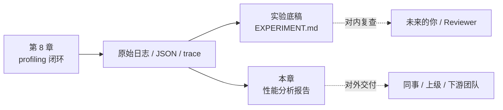
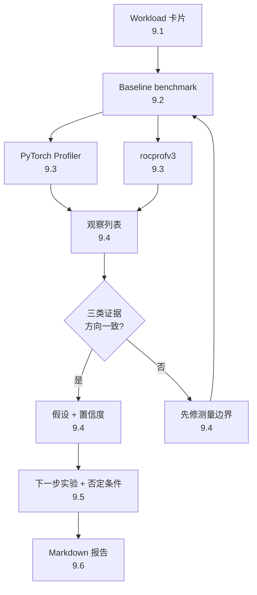

# 第9章 建立你的第一个性能分析报告

## 本章导读

> 本章把上一章的 profiling 过程整理成一份**可对外交付**的性能报告。读完后，你应该能把命令、日志、关键数字、瓶颈判断、可验证假设和已知风险写成别人能复现的 Markdown，并且知道这份"性能报告"和实验底稿（`EXPERIMENT.md`）的边界在哪里。

[上一章](../chapter8/index.md#第8章-用一个慢算子跑通-profiling-闭环)已经完成了一次 profiling 闭环：先跑 baseline，再用 `rocprofv3` 和 PyTorch Profiler 收集证据，最后用 `keep_gpu` 对照验证"数据往返很贵"这个假设。

但在真实工作里，把一串命令、几张截图、若干日志丢给同事或上级是不够的。**性能分析的最终交付物是一份报告**：它要说清楚你测了什么、在哪里测、怎么测、看到了什么、你的判断有多确定、下一步准备怎么验证、还有哪些场景没覆盖。一份合格的报告应该让任何拿到它的人，在不打扰你的前提下：

1. 用同样的命令在同样的硬件上把数字跑出来；
2. 在不同硬件 / 不同 shape 下，按你的方法论自行复测；
3. 接着你的下一步实验继续往前推，而不是从零开始。

本章继续使用[上一章](../chapter8/index.md#81-选择一个可控的慢算子)的同一个慢算子（PyTorch elementwise pipeline），不重新发明新案例。我们会先讲清楚"性能报告"和实验底稿 `EXPERIMENT.md` 的差异，再给出一份可直接复制的报告模板，最后用 case study 走一遍模板每个字段怎么填。

::: figure fig-doc-types


同一份原始数据派生出"实验底稿"和"性能报告"两类文档
:::

如 @fig-doc-types 所示，两类文档共享同一份原始证据，但服务对象不同。下面用一张表把差异落到字段级别。

| 维度 | 实验底稿 `EXPERIMENT.md` | 性能分析报告（本章） |
| ---- | ---- | ---- |
| 主要读者 | 未来的你 / Reviewer | 同事 / 上级 / 下游团队 |
| 是否进站点 | 否（只在 `code/` 下） | 可进站点或随 PR 交付 |
| 强制字段 | 硬件 / 命令 / 时间 / 关键数字 | summary / hypothesis / limitations 等 8–10 节 |
| 数字精度 | 原始值即可 | 必须带硬件上下文与统计口径 |
| 结论范围 | 描述"我跑了什么" | 描述"我相信什么、还差什么证据" |
| 引用关系 | 报告引用底稿做证据 | 底稿不引用报告 |

> 简单说：底稿是"我做了"，报告是"我相信，且证据如下"。本章 6 个小节会一步步把第 8 章的素材变成一份完整报告。

## 9.1 选择一个慢算子

报告的第一步不是贴数字，而是定义对象。一个好的性能报告至少要回答：

| 问题 | 本章案例的答案 |
| ---- | ---- |
| 分析对象是什么 | PyTorch elementwise pipeline（多步 elementwise 串联） |
| 输入规模是什么 | `16,777,216` 个 `float32` 元素（约 64 MiB） |
| 硬件是什么 | AI MAX 395 / Radeon 8060S Graphics |
| 软件环境是什么 | ROCm 7.12.0，PyTorch `2.9.1+rocm7.12.0` |
| baseline 做了什么 | 每轮 H2D + GPU pipeline + D2H + synchronize |
| 对照组是什么 | `keep_gpu`，循环里保持数据在 GPU 上 |
| 校验方式 | 输出 checksum，确保前后实现行为一致 |

这些信息看起来普通，但它们决定了报告是否可复查。如果只写"这个算子 15 ms 🚧"，别人不知道输入多大、dtype 是什么、是不是包含数据搬运、check 通不通过，也就无法判断这个数字意味着什么。

本章的报告对象可以这样固定下来，作为整份报告的"workload 卡片"：

```text
Workload: slow_elementwise_pipeline.py
Mode: baseline
Input: 16,777,216 float32 elements (~64 MiB)
Path: CPU tensor -> H2D -> GPU elementwise pipeline -> D2H -> synchronize
Hardware: AI MAX 395 / Radeon 8060S Graphics
Software: ROCm 7.12.0, PyTorch 2.9.1+rocm7.12.0
Validation: checksum equality vs reference run
```

注意这里**没有说**"这是一个 memory-bound 算子"。那是后面的判断，不应该在对象定义阶段提前下结论。报告里把"对象"和"判断"分到不同小节，是避免读者把一个未经证实的标签当作前提继续推理。

定义对象时还要主动写出"我**不**测什么"。本章案例里至少要交代清楚：

- 不测多 GPU、多请求、动态 batching（属于后续 hello-mlsys 范围）；
- 不测 `float16` / `bfloat16` 的对比（留作后续假设之一）；
- 不测真实模型链路里的 tokenizer / 后处理开销。

把边界写清楚，报告才不会被误读为"这个 workload 已经被全面分析过了"。

## 9.2 运行 baseline 并归档

报告的第二步是给出 baseline 命令和结果。命令要能直接复现，不要只写"运行 benchmark"。

```bash
python chapter8/slow_elementwise_pipeline.py \
  --size 16777216 \
  --warmup 20 \
  --repeat 100 \
  --mode baseline \
  --output-json chapter8/logs/baseline_size16777216.json
```

[上一章](../chapter8/index.md#82-运行-baseline-benchmark) baseline 的核心结果如下：

| 阶段 | median | min | p95 |
| ---- | ----: | ----: | ----: |
| H2D | 1.85 ms @ AI MAX 395, fp32 | 0.823 ms | 2.05 ms |
| GPU pipeline | 5.28 ms @ AI MAX 395, fp32 | 5.21 ms | 5.33 ms |
| D2H | 6.73 ms @ AI MAX 395, fp32 | 6.09 ms | 8.50 ms |
| Total | 16.3 ms @ AI MAX 395, fp32 | 12.5 ms | 18.7 ms |

写报告时，建议把"原始输出"和"解释后的表格"分开：

- **原始输出**用于复查，最好保存在日志或 JSON 里（`chapter8/logs/baseline_size16777216.json`），并在报告里给出相对路径；
- **表格**用于阅读，保留 median / min / p95 三个统计量即可；
- **结论文字**不要超过证据范围，并且要带硬件上下文。

例如，这里的安全结论是：

> baseline 的 GPU pipeline median 是 `5.28 ms @ AI MAX 395, fp32`，但 total median 是 `16.3 ms @ AI MAX 395, fp32`。因此端到端耗时不只来自 elementwise kernel，还包含 H2D、D2H、同步和 host 侧调度边界。

不建议写成：

```text
这个算子已经确定是内存瓶颈。
```

因为还没有硬件计数器、不同 shape、不同实现的交叉验证。更准确的表达是"当前证据支持优先检查数据搬运和同步边界"。

**归档纪律**很重要。一份报告引用的每一个数字，都应该能在仓库里找到对应的原始文件：

| 报告里的数字 | 原始来源 | 路径示例 |
| ---- | ---- | ---- |
| baseline median | benchmark JSON | `code/part2-profiling/chapter8/logs/baseline_size16777216.json` |
| keep_gpu median | benchmark JSON | `code/part2-profiling/chapter8/logs/keep_gpu_size16777216.json` |
| PyTorch Profiler 表 | profiler trace + summary JSON | `code/part2-profiling/chapter8/profiles/torch_profiler_baseline.json` |
| rocprofv3 stats | rocprofv3 输出目录 | `code/part2-profiling/chapter8/profiles/rocprofv3_baseline/` |

如果你某个数字在仓库里找不到来源，那它就还不该出现在报告里。这也是 项目实验真实性规范里“跑过才能写”的具体落地方式。

## 9.3 收集 profiling 数据

baseline 之后，报告要列出你收集了哪些 profiling 数据，并明确每一类数据的**用途**和**测量边界**。本章案例至少有两类。

第一类是 PyTorch Profiler。它帮助我们从框架层看 Python 调用和 GPU 活动的对应关系：

```bash
python chapter8/slow_elementwise_pipeline.py \
  --size 16777216 \
  --warmup 5 \
  --repeat 20 \
  --mode baseline \
  --profile torch \
  --trace-file chapter8/profiles/torch_profiler_baseline.json \
  --output-json chapter8/logs/torch_profiler_baseline_summary.json
```

PyTorch Profiler 的输出里可以看到：

| Item | CUDA total | Calls | 说明 |
| ---- | ----: | ----: | ---- |
| vectorized elementwise kernels | 43.5 ms @ AI MAX 395, fp32 | 75 | 多个 elementwise kernel 累计 |
| `aten::mul` | 29.2 ms @ AI MAX 395, fp32 | 50 | 乘法相关框架调用 |
| `aten::add` | 29.0 ms @ AI MAX 395, fp32 | 50 | 加法相关框架调用 |
| `aten::copy_` | 20.9 ms @ AI MAX 395, fp32 | 70 | tensor copy 路径 |
| `hipDeviceSynchronize` | 19.6 ms @ AI MAX 395, fp32 | 86 | 显式同步路径 |

第二类是 `rocprofv3`。它帮助我们从 ROCm / GPU 侧看 kernel、memory copy 和 HIP API：

```bash
rocprofv3 \
  --kernel-trace \
  --memory-copy-trace \
  --runtime-trace \
  --stats \
  --summary \
  -d chapter8/profiles/rocprofv3_baseline \
  -f csv json \
  -- \
  python chapter8/slow_elementwise_pipeline.py \
    --size 16777216 \
    --warmup 5 \
    --repeat 10 \
    --mode baseline \
    --output-json chapter8/logs/rocprofv3_baseline_run.json
```

`rocprofv3` 的 memory copy stats 给出：

| Memory copy | Calls | Total | Average |
| ---- | ----: | ----: | ----: |
| Device to Host | 30 | 32.22 ms @ AI MAX 395, fp32 | 1.074 ms |
| Host to Device | 30 | 17.24 ms @ AI MAX 395, fp32 | 0.575 ms |

报告里要特别说明 profiling run 的配置。这里 `rocprofv3` 使用的是 `warmup=5`、`repeat=10`，PyTorch Profiler 使用的是 `warmup=5`、`repeat=20`，主 benchmark 使用的是 `warmup=20`、`repeat=100`。这些 run 的用途不同，**不能把调用次数和总时间直接混在一起比较**。下表把这件事写明：

| Run | warmup | repeat | 用途 | 不能直接和谁比 |
| ---- | ----: | ----: | ---- | ---- |
| baseline benchmark | 20 | 100 | 端到端 latency 统计 | 不能和 profiling run 的总时间相加 |
| PyTorch Profiler | 5 | 20 | 框架调用 ↔ GPU 活动映射 | 不能用它的 CUDA total 当 latency |
| rocprofv3 | 5 | 10 | 底层 kernel / copy / HIP API | 不能直接和 benchmark 分段时间对齐 |

## 9.4 判断瓶颈类型

判断瓶颈时，不要急着给一个永久标签。报告应该把"观察"和"假设"分开，并且为假设标注**置信度**。

本章案例的观察包括：

1. baseline total median 是 `16.3 ms @ AI MAX 395, fp32`；
2. GPU pipeline median 是 `5.28 ms @ AI MAX 395, fp32`；
3. D2H median 是 `6.73 ms @ AI MAX 395, fp32`，H2D median 是 `1.85 ms @ AI MAX 395, fp32`；
4. PyTorch Profiler 能看到 `aten::to`、`aten::copy_`、`hipDeviceSynchronize`；
5. `rocprofv3` 能看到 memory copy、kernel dispatch 和 HIP API 活动。

从这些观察可以提出一个假设：

> 对这个 baseline 来说，端到端 latency 的主要改进空间不只在单个 elementwise kernel，而在减少每轮 CPU / GPU 数据往返、同步边界和多个 elementwise kernel 的 launch / 中间张量开销。

这个假设的置信度可以写成 **medium-high**。原因是 benchmark、PyTorch Profiler 和 `rocprofv3` 三类证据方向一致；但它还不是最终定论，因为我们还没有实现融合 kernel，也还没有在多个输入规模上重复验证。

下表给出一份可复用的"置信度 → 用语"对照，避免每次写报告都要重新定义口径：

| 置信度 | 含义 | 推荐用语 | 报告要求 |
| ---- | ---- | ---- | ---- |
| low | 单一信号、未做对照 | "可能"、"初步看起来" | 必须在 limitations 里展开 |
| medium | 两类独立证据方向一致 | "倾向于"、"目前支持" | 给出至少一个反例检查项 |
| medium-high | 三类及以上证据一致，且有对照实验 | "在当前 workload 下" | 列出仍需验证的边界 |
| high | 多 shape / 多实现交叉验证 | "在测试覆盖范围内" | 仍要保留 limitations |
| confirmed | 已被库版本 / 上游 issue / 多机器验证 | "确认" | 引用具体 PR / issue |

把置信度写出来很重要。性能分析不是法官判案，而是工程实验：你要告诉读者你对结论有多确定，以及还缺什么证据。

## 9.5 提出可验证的优化假设

报告里的优化建议应该能被下一次实验**证伪**。不要写"优化内存"这种太大的词，而要写成具体动作 + 预期观察 + 验证方式。

本章案例可以提出三类下一步实验：

| 假设 | 下一步实验 | 预期观察 | 否定条件 |
| ---- | ---- | ---- | ---- |
| 每轮数据往返是主要端到端开销之一 | 使用 `keep_gpu`，循环中不做 H2D / D2H | total latency 明显下降 | total latency 下降 < 10%（说明假设错） |
| 多个 elementwise kernel 有 launch 和中间张量开销 | 写 fused pipeline 或使用编译/融合方式 | kernel 数量减少，GPU pipeline 时间下降 | kernel 数量降了但时间没降 |
| dtype 会影响计算和访存平衡 | 对比 `float32`、`float16`、`bfloat16` | 不同 dtype 的 GPU pipeline 和 copy 时间变化 | 三种 dtype 时间几乎一致 |

其中第一条已经在[第 8 章](../chapter8/index.md#86-从-profiling-结果反推优化方向)验证：`keep_gpu` 的 total median 是 `5.23 ms @ AI MAX 395, fp32`，baseline 是 `16.3 ms @ AI MAX 395, fp32`。这个对照支持"先减少每轮数据往返"的方向。

注意"支持"不等于"证明所有场景都如此"。真实模型可能必须把输入从 CPU 送到 GPU，也可能必须把输出拿回 CPU。报告里的建议应该写成"下一步优先检查 / 尝试"，而不是"所有代码都必须这样改"。

把整套流程画成图能让 reviewer 一眼看懂：

::: figure fig-report-flow


从 baseline 到性能报告的字段流向
:::

如 @fig-report-flow 所示，每个字段都不是凭空写出来的，而是从上一步推导出来的。报告好不好读，关键就在于这条链是否完整、是否每一步都有证据。

## 9.6 生成 Markdown 性能报告

到这一步，所有材料都已经齐备：workload 定义、baseline、profiling 数据、观察、假设、下一步实验。最后一步是把它们拼成一份对外可交付的 Markdown。

本章对应的报告工件放在：

```text
code/part2-profiling/chapter9/performance-report.md
```

### 9.6.1 完整报告模板

下面这份模板可以直接复制使用，每个小节都给出了"应该写什么 / 不应该写什么"的提示。模板共有 **10 个一级小节**，对应 [9.1 节](#91-选择一个慢算子)开头那张"差异表"里列出的所有字段。

```markdown
# Performance Report: <workload-short-name>

> Author: <your-name>  ·  Date: YYYY-MM-DD  ·  Status: draft / reviewed / final
> Linked experiment notebook: ../../../code/<part>/<chapter>/EXPERIMENT.md

## 1. Summary

一段 4–6 行的话，回答四个问题：
- 测的是什么 workload？
- 在什么硬件 / 软件上测？
- 主要瓶颈假设是什么？置信度多少？
- 下一步打算做什么？

不要在 Summary 里堆数字，也不要在这里下"已确定 memory-bound"这种结论。

## 2. Environment

| 项目 | 值 |
| ---- | ---- |
| Hardware | AI MAX 395 / Radeon 8060S Graphics |
| ROCm | 7.12.0 |
| Driver | <amdgpu / kfd 版本> |
| Python | 3.x.y |
| PyTorch | 2.9.1+rocm7.12.0 |
| Repo commit | <git rev-parse HEAD> |
| Reproduce env | `bash scripts/bootstrap-rocm-env.sh --part <part>` |

## 3. Workload

- 对象：<脚本路径 + 函数名>
- 输入规模：<shape, dtype, bytes>
- 数据路径：CPU -> H2D -> GPU pipeline -> D2H -> sync
- 校验方式：checksum / reference output
- **不测什么**：明确写出本次报告的边界

## 4. Baseline Result

给出 baseline 命令、参数、median / min / p95 表格，以及原始 JSON / 日志的相对路径。
不要在这里写瓶颈结论。

## 5. Profiling Artifacts

按工具列出：每个工具的命令、配置（warmup / repeat）、输出路径、用途。
强调"不同工具的统计口径不同，不能直接相加比较"。

## 6. Observations

用编号列表写出"我从证据里看到了什么"，每条观察都要能映射到第 4 / 5 节的某个数字或文件。
观察 ≠ 结论。这里不要出现"因此""所以"这类推断词。

## 7. Bottleneck Hypothesis

- 假设：<一句话>
- 置信度：<low / medium / medium-high / high / confirmed>
- 支持证据：<引用 §6 的编号>
- 否定条件：<什么样的实验结果会推翻它>

一份报告通常 1–2 个主假设就够，不要写成购物清单。

## 8. Proposed Next Experiments

| 假设 | 下一步实验 | 预期观察 | 否定条件 | 预计耗时 |
| ---- | ---- | ---- | ---- | ----: |

每一行都应能被一个 PR 或一次会议消费掉，不要写"全面优化"这种动作。

## 9. Reproduction Commands

按时间顺序贴出本次报告所有命令：bootstrap、baseline、profiling、对照组。
全部以仓库根目录为参考，使用相对路径。

## 10. Known Limitations

- 只在 AI MAX 395 上跑过，未在 MI 系列验证
- 只测了 fp32，未覆盖 fp16 / bf16
- profiling run 的 repeat 较小，统计噪声较大
- <其他>

写 limitations 不是认怂，而是让读者知道"哪些场景下结论可能不成立"。
```

把模板字段汇总一下，方便 review 时打勾：

| # | 小节 | 必填 | 关键字段数 |
| ----: | ---- | ---- | ----: |
| 1 | Summary | 是 | 4 个问题 |
| 2 | Environment | 是 | 7 项 |
| 3 | Workload | 是 | 5 项（含"不测什么"） |
| 4 | Baseline Result | 是 | 命令 + 3 个统计量 |
| 5 | Profiling Artifacts | 是 | 每工具 4 项 |
| 6 | Observations | 是 | 编号列表 |
| 7 | Bottleneck Hypothesis | 是 | 4 项（含置信度、否定条件） |
| 8 | Proposed Next Experiments | 是 | 表格 5 列 |
| 9 | Reproduction Commands | 是 | 全部命令 |
| 10 | Known Limitations | 是 | 至少 3 条 |

整份模板**共 10 个一级小节、约 35 个必填字段**。如果你的报告少了 limitations 或 hypothesis 的否定条件，它就还不能算"对外可交付"——它仍然是底稿。

### 9.6.2 Case study：把第 8 章的素材填进模板

下面用一份**完整的示例报告**走一遍模板每个小节怎么填。这段示例直接来自[第 8 章](../chapter8/index.md#第8章-用一个慢算子跑通-profiling-闭环)的实测数据，所有数字均带 `@ AI MAX 395, fp32` 上下文；占位的 commit 等元信息标 🚧，因为它们和具体仓库状态相关。

<details>
<summary>展开示例报告：slow_elementwise_pipeline / baseline @ AI MAX 395</summary>

```markdown
# Performance Report: slow_elementwise_pipeline (baseline)

> Author: hello-ai-infra · Date: 2026-05-08 · Status: draft
> Linked experiment notebook: ../../../code/part2-profiling/chapter8/EXPERIMENT.md

## 1. Summary

This report profiles the PyTorch elementwise pipeline used in part2-profiling/chapter8
on AI MAX 395 / Radeon 8060S Graphics with ROCm 7.12.0 and PyTorch 2.9.1+rocm7.12.0.
Baseline median total latency is 16.3 ms; GPU pipeline median is 5.28 ms; the
remaining ~11.0 ms comes from H2D, D2H and synchronization. Primary hypothesis
(medium-high confidence): end-to-end latency is dominated by per-iteration data
movement and synchronization, not by elementwise kernels alone. Next step is to
extend the experiment to fp16 / bf16 and a fused pipeline.

## 2. Environment

| 项目 | 值 |
| ---- | ---- |
| Hardware | AI MAX 395 / Radeon 8060S Graphics |
| ROCm | 7.12.0 |
| Driver | amdgpu (DKMS) 6.16.13，src `amdgpu/6.16.13-2303411.22.04`；Kernel 6.8.0-90-generic；ROCm-SMI 4.0.0+fc0010cf6a (lib 7.8.0)；模块文件 `/lib/modules/6.8.0-90-generic/updates/dkms/amdgpu.ko`，vermagic `6.8.0-90-generic SMP preempt mod_unload modversions` |
| Python | 3.12.12 |
| PyTorch | 2.9.1+rocm7.12.0 |
| Repo commit | 🚧 git rev-parse HEAD |
| Reproduce env | `bash scripts/bootstrap-rocm-env.sh --part part2-profiling` |

## 3. Workload

- 对象：`code/part2-profiling/chapter8/slow_elementwise_pipeline.py` 中的 `elementwise_pipeline`
- 输入规模：16,777,216 个 float32 元素（约 64 MiB）
- 数据路径：CPU tensor -> H2D -> GPU elementwise pipeline -> D2H -> synchronize
- 校验方式：每轮输出 checksum；baseline 与 keep_gpu 的 checksum 一致
- 不测什么：
  - 不测多 GPU、多请求、动态 batching
  - 不测 fp16 / bf16（留作后续假设之一）
  - 不测真实模型链路里的 tokenizer / 后处理

## 4. Baseline Result

命令：

\`\`\`bash
python chapter8/slow_elementwise_pipeline.py \
  --size 16777216 \
  --warmup 20 \
  --repeat 100 \
  --mode baseline \
  --output-json chapter8/logs/baseline_size16777216.json
\`\`\`

| 阶段 | median | min | p95 |
| ---- | ----: | ----: | ----: |
| H2D | 1.85 ms | 0.823 ms | 2.05 ms |
| GPU pipeline | 5.28 ms | 5.21 ms | 5.33 ms |
| D2H | 6.73 ms | 6.09 ms | 8.50 ms |
| Total | 16.3 ms | 12.5 ms | 18.7 ms |

原始输出：`code/part2-profiling/chapter8/logs/baseline_size16777216.json`

## 5. Profiling Artifacts

| 工具 | warmup | repeat | 用途 | 输出路径 |
| ---- | ----: | ----: | ---- | ---- |
| PyTorch Profiler | 5 | 20 | 框架调用 ↔ GPU 活动映射 | `chapter8/profiles/torch_profiler_baseline.json` |
| rocprofv3 | 5 | 10 | 底层 kernel / copy / HIP API | `chapter8/profiles/rocprofv3_baseline/` |

不同 run 的 warmup / repeat 不同，不能把它们的 total time 直接拼起来比较。

## 6. Observations

1. baseline total median 是 16.3 ms（§4）。
2. GPU pipeline median 是 5.28 ms（§4），约占 total 的 32%。
3. D2H median 6.73 ms 大于 H2D median 1.85 ms（§4）。
4. PyTorch Profiler 能看到 `aten::to` / `aten::copy_` / `hipDeviceSynchronize` 的 CUDA total
   合计 60.7 ms（§5 trace）。
5. rocprofv3 memory copy stats 显示 D2H 30 次 32.22 ms、H2D 30 次 17.24 ms（§5 stats）。
6. keep_gpu 对照模式 total median 5.23 ms，GPU pipeline 5.22 ms（§5 baseline log）。

## 7. Bottleneck Hypothesis

- 假设：在当前 baseline 下，端到端 latency 主要由每轮 CPU/GPU 数据往返和同步边界决定，
  而不是由 elementwise kernel 本身决定。
- 置信度：medium-high
- 支持证据：§6 第 1、2、3、5、6 条
- 否定条件：在 keep_gpu 模式下 total latency 下降 < 10%，或在更大输入下 GPU pipeline
  时间增长远快于 copy 时间，则该假设不成立。

## 8. Proposed Next Experiments

| 假设 | 下一步实验 | 预期观察 | 否定条件 | 预计耗时 |
| ---- | ---- | ---- | ---- | ----: |
| 数据往返主导 | 已有 keep_gpu 对照 | total median 显著下降 | 下降 < 10% | 已完成 |
| Kernel launch / 中间张量开销 | 实现 fused pipeline | kernel 数量减少，GPU pipeline 时间下降 | 时间不变 | 0.5 day 🚧 |
| dtype 影响 | 跑 fp16 / bf16 baseline | copy / pipeline 时间变化 | 三者一致 | 0.5 day 🚧 |

## 9. Reproduction Commands

\`\`\`bash
# 1. bootstrap env
bash scripts/bootstrap-rocm-env.sh --part part2-profiling
cd code/part2-profiling && uv sync && source ./activate-rocm.sh

# 2. baseline benchmark
python chapter8/slow_elementwise_pipeline.py --size 16777216 \
  --warmup 20 --repeat 100 --mode baseline \
  --output-json chapter8/logs/baseline_size16777216.json

# 3. keep_gpu control
python chapter8/slow_elementwise_pipeline.py --size 16777216 \
  --warmup 20 --repeat 100 --mode keep_gpu \
  --output-json chapter8/logs/keep_gpu_size16777216.json

# 4. PyTorch Profiler
python chapter8/slow_elementwise_pipeline.py --size 16777216 \
  --warmup 5 --repeat 20 --mode baseline --profile torch \
  --trace-file chapter8/profiles/torch_profiler_baseline.json \
  --output-json chapter8/logs/torch_profiler_baseline_summary.json

# 5. rocprofv3
rocprofv3 --kernel-trace --memory-copy-trace --runtime-trace \
  --stats --summary -d chapter8/profiles/rocprofv3_baseline -f csv json -- \
  python chapter8/slow_elementwise_pipeline.py --size 16777216 \
    --warmup 5 --repeat 10 --mode baseline \
    --output-json chapter8/logs/rocprofv3_baseline_run.json
\`\`\`

## 10. Known Limitations

- 只在 AI MAX 395 / gfx1151 上跑过，MI 系列读者需按方法论自行复测。
- 只覆盖 fp32，fp16 / bf16 数据搬运与计算平衡可能完全不同。
- profiling run 的 repeat 比 baseline 小一个量级，调用次数和总时间不能与 baseline run 直接对齐。
- 当前没有 occupancy、cache hit 等硬件计数器证据；这些在 part2-profiling/chapter10 里再补。
- "fused pipeline" 假设尚未实现，§8 第 2 行只是计划。
```

</details>

最关键的字段是 `Observations`、`Bottleneck Hypothesis` 和 `Known Limitations`。很多报告只写"结果"，却不写"限制"，这会让读者误以为一次 profiling 就能得到绝对结论。模板里把 `Known Limitations` 列为必填，就是为了避免这种"过度自信"。

### 9.6.3 报告与 EXPERIMENT.md 的字段映射

最后回到本章开头那张差异表。下面给出"性能报告 ↔ 实验底稿"的字段映射，方便你在两份文档之间复制信息时不出错：

| 性能报告字段 | EXPERIMENT.md 来源 | 是否需要改写 |
| ---- | ---- | ---- |
| §2 Environment | "在什么硬件上跑的" | 直接复制 |
| §3 Workload | "用什么命令跑的" + 脚本注释 | 改写为读者视角 |
| §4 Baseline Result | "跑出了什么" + JSON | 提炼 median / min / p95 |
| §5 Profiling Artifacts | logs/ + profiles/ 目录 | 列出相对路径与用途 |
| §6 Observations | 底稿不一定有 | 报告独有，需要重新提炼 |
| §7 Hypothesis | 底稿不一定有 | 报告独有，需标置信度 |
| §8 Next Experiments | 底稿"待办"段（如有） | 改写为可证伪表格 |
| §9 Reproduction Commands | "用什么命令跑的" | 直接复制 |
| §10 Known Limitations | 报告独有 | 必须新写 |

按这张映射表填，你会发现：底稿提供"做过什么"的事实，报告在事实之上加了"我相信什么 / 还差什么"的判断和边界——这就是两份文档的真正分工。

几天后你再回到这份报告，应该能从里面知道：当时测的是什么、为什么认为该优化数据路径、还有哪些证据没有收集。如果你能做到这一点，这份报告就不只是"交差用"，而是变成了未来你自己继续推进优化的起点。

## 本章小结

- 性能报告和实验底稿（`EXPERIMENT.md`）共享原始证据，但服务对象不同：底稿对内复查，报告对外交付。
- 性能报告首先要定义 workload、输入规模、硬件、软件环境和"不测什么"，否则数字没有上下文。
- baseline 结果应该保留原始输出（JSON / 日志）和便于阅读的 median / min / p95 表，并在报告里给出相对路径。
- PyTorch Profiler 和 `rocprofv3` 的统计口径不同，不能把 warmup / repeat 不一致的 run 直接拼起来比较。
- 瓶颈判断必须分层：观察列表 → 假设 → 置信度 → 否定条件 → 下一步实验，每一步都要能被引用到具体证据。
- 一份对外可交付的 Markdown 报告至少包含 10 个小节：Summary、Environment、Workload、Baseline、Profiling Artifacts、Observations、Hypothesis、Next Experiments、Reproduction Commands、Known Limitations，约 35 个必填字段。
- 下一章会在这份报告框架上继续叠加硬件计数器证据，用 Omniperf 解释"为什么慢"，同时扩展 §7 / §10 字段。

## 延伸阅读

- [PyTorch Profiler](https://docs.pytorch.org/docs/stable/profiler.html)
- [ROCm rocprofv3 documentation](https://rocm.docs.amd.com/projects/rocprofiler-sdk/en/latest/how-to/using-rocprofv3.html)
- [ROCm profiling tools](https://rocm.docs.amd.com/en/latest/conceptual/gpu-arch/rocm-tools.html)
- 项目实验真实性规范：跑过才能写，性能数字必须能追溯到实验底稿
