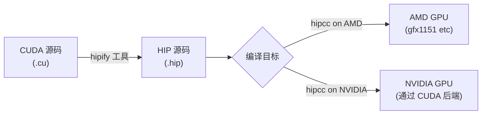
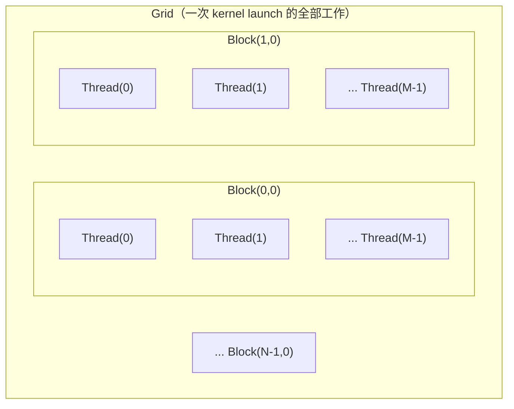
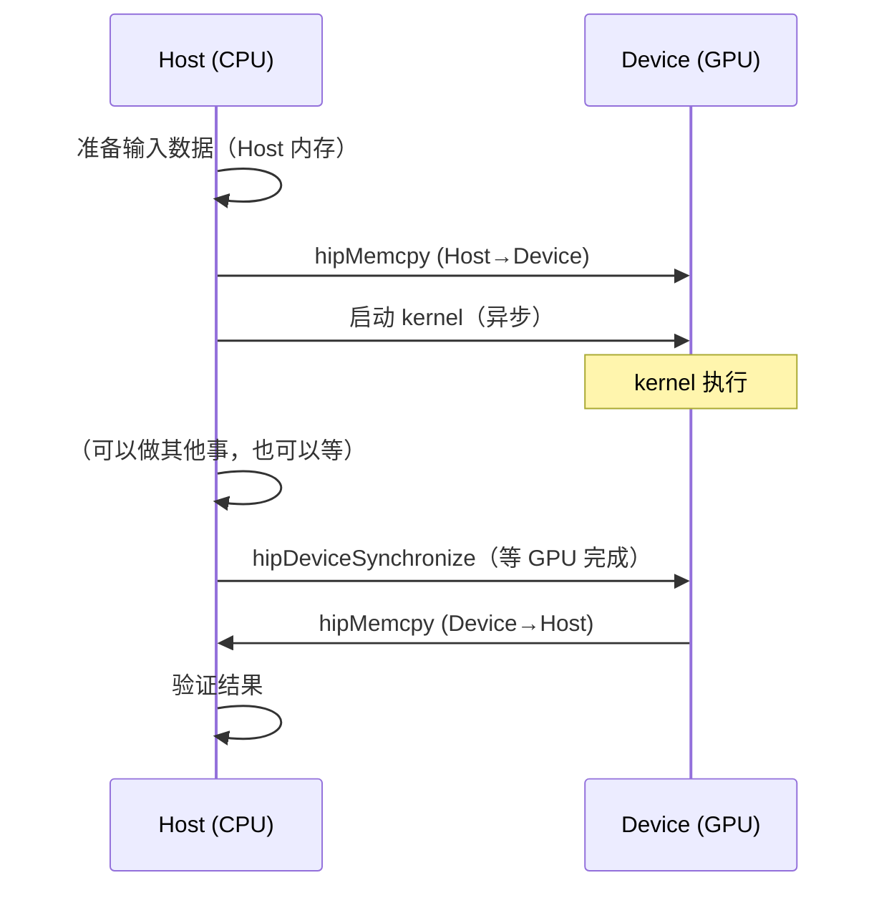
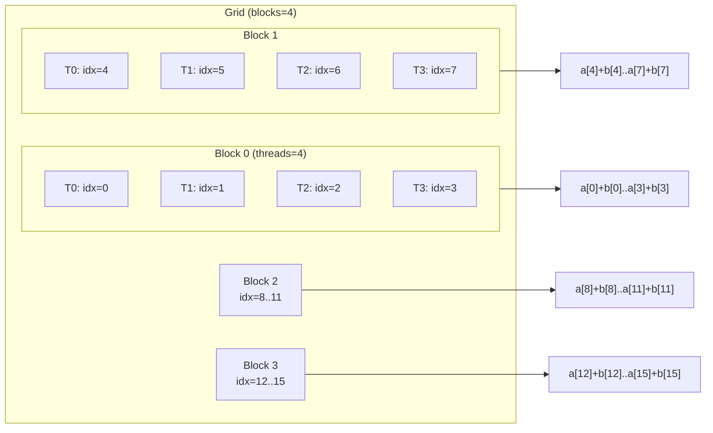

# 第11章 HIP 编程基础

## 本章导读

> 本章建立 HIP 编程的最小语法和执行模型，为后续手写算子做准备。前置知识是第 1–10 章关于 AMD GPU 架构和 ROCm 环境的基础，以及能够在 AMD-AIMAX395 上激活 ROCm 环境。读完本章，你应该能看懂一个 HIP kernel 如何从 Host 端启动并在 Device 上执行，也能独立写出"分配内存 → 拷贝数据 → 启动 kernel → 拷贝结果 → 释放内存"这条完整的基础程序骨架。

很多人第一次接触 GPU 编程时，最大的障碍不是语言本身，而是脑子里没有一张清晰的"CPU 在做什么、GPU 在做什么、它们之间如何通信"的地图。本章就是要帮你建立这张地图。

本章不需要 benchmark 数字——这是一章入门概念章。但代码必须能在 AMD-AIMAX395 上真实编译运行；对应的 smoke 验证程序放在 `code/part3-hip-kernels/chapter11/`。

## 11.1 HIP 和 CUDA 的关系

很多 GPU 编程教程把 HIP 和 CUDA 的关系写成一张 API 对照表，但这样读下来只会让你觉得"HIP 是 CUDA 的方言"，对真正写程序帮助不大。这一节用迁移视角讲清楚 HIP 的定位，让你知道它解决什么问题、为什么这样设计。

### HIP 是什么

HIP（Heterogeneous-Compute Interface for Portability，异构计算可移植接口）是 AMD 提供的 GPU 编程 API。它的核心设计目标是：让开发者写一套代码，既能在 AMD GPU 上跑，也能在 NVIDIA GPU 上跑。

这不是营销说辞，而是工程现实。HIP 的语法和 CUDA 有高达 90% 以上的相似度：函数命名规则一致（`cudaMalloc` → `hipMalloc`，`cudaMemcpy` → `hipMemcpy`），kernel 的声明方式一致（`__global__` 修饰符不变），launch 的语法一致（`<<<blocks, threads>>>`）。AMD 甚至提供了 `hipify` 工具，可以把 CUDA 源文件批量转换成 HIP 源文件。

::: figure fig-hip-portability


HIP 的可移植性设计：同一份源码经 hipcc 编译，按目标硬件分路
:::

如 @fig-hip-portability 所示，HIP 编译器（hipcc）在 AMD 机器上把 `.hip` 源码编译成 AMD GPU 的可执行代码；如果在 NVIDIA 机器上用同一份代码，hipcc 会把 HIP API 映射回 CUDA API 后端再编译。这就是"可移植"的实现方式。

### 本教程不写 CUDA 对照表的原因

如果你从没接触过 CUDA，最好直接学 HIP——对照表对你没什么用。如果你有 CUDA 基础，你会发现 HIP 的心智模型和 CUDA 几乎完全相同，差异只是前缀从 `cuda` 换成 `hip`，以及少数 AMD 特有的概念（Wavefront vs Warp、CU vs SM）。

本教程的读者群是"从零开始认识 AMD GPU"，所以后面的章节会直接用 HIP，不反复写"CUDA 里对应的 XXX 是 YYY"。如果你需要迁移现有 CUDA 代码，AMD 官方的 [HIP Porting Guide](https://rocm.docs.amd.com/projects/HIP/en/latest/user_guide/hip_porting_guide.html) 是更合适的参考。

### HIP 和 ROCm 的关系

HIP 是 ROCm（Radeon Open Compute）软件栈的核心组成部分。ROCm 是 AMD 的整套 GPU 计算平台，包含驱动、编译器、库和开发工具。HIP 只是其中的编程 API 层——你写 HIP，背后是 ROCm 提供运行时支持。

在 AMD-AIMAX395 上激活 ROCm 环境后，`hipcc` 编译器就在 PATH 里了：

```bash
# 在 AMD-AIMAX395 上，source 环境后
hipcc --version
```

在 AMD-AIMAX395 上 source `code/part3-hip-kernels/.venv` 配套的 `activate-rocm.sh`（实测使用 part2 venv 的 ROCm 7.12 SDK）后，输出如下（节选）：

```text
HIP version: 7.12.60610-2bd1678d3d
AMD clang version 22.0.0git (https://github.com/ROCm/llvm-project.git
  c849bc16b0e49951d313756f20b73c2b28d321d7+PATCHED:9a6ac45c97a1e511db838c5b46257324d2de1780)
Target: x86_64-unknown-linux-gnu
Thread model: posix
InstalledDir: .../site-packages/_rocm_sdk_devel/lib/llvm/bin
```

完整日志见 `code/part3-hip-kernels/chapter11/logs/hipcc_version.log`。注意如果直接调用宿主机 `/usr/bin/hipcc`，看到的是 ROCm 7.2.0 版本——要拿到 7.12，必须先 source 篇内的 `activate-rocm.sh`。

## 11.2 Kernel、Thread、Block、Grid

这一节讲 GPU 并行程序的基本执行层级。这是 GPU 编程最核心的心智模型，后面的每一行代码都建立在这个理解上。

### GPU 为什么能并行

CPU 的设计哲学是"少数几个核，每个核都很快"——复杂的分支预测、乱序执行、大缓存，目的是让单线程跑得快。GPU 的设计哲学是"大量简单核，同时执行相同指令"——每个计算单元（CU）简单，但几十个 CU 同时工作，总吞吐量极高。

这种设计天然适合数组运算：假设你要对一个 100 万元素的数组做加法，GPU 可以把 100 万个加法任务拆成很多批次，每批让几千个线程同时执行，而不是让一个线程循环 100 万次。

### 层级结构：Thread → Block → Grid

HIP（以及 CUDA）把这个并行结构分成三层：

```
Grid（网格）
└── Block（线程块）×N
    └── Thread（线程）×M
```

- **线程（Thread）**：最小执行单元。每个线程有自己的寄存器和局部变量，运行同一份 kernel 代码，但处理不同的数据。
- **线程块（Block）**：一组线程的集合。同一个 Block 里的线程可以通过**共享内存（Shared Memory）**通信，也可以用 `__syncthreads()` 做块内同步。不同 Block 之间无法直接通信（Global Memory 除外）。
- **网格（Grid）**：所有 Block 的集合，构成一次 kernel launch 的全部工作。

::: figure fig-grid-block-thread


Grid / Block / Thread 三层结构示意。同一 Block 内的线程共享 LDS（本地数据共享内存）。
:::

### 如何在 kernel 里知道"我是哪个线程"

kernel 是在 GPU 上执行的函数，每个线程都执行同一段代码，但通过内置变量区分自己的身份：

| 变量 | 含义 |
| ---- | ---- |
| `threadIdx.x` | 当前线程在 Block 内的索引（x 方向） |
| `blockIdx.x` | 当前 Block 在 Grid 内的索引（x 方向） |
| `blockDim.x` | 每个 Block 的线程数（x 方向） |
| `gridDim.x` | Grid 里 Block 的总数（x 方向） |

对于一维的情况（处理数组），每个线程的全局索引计算公式是：

```cpp
int idx = blockIdx.x * blockDim.x + threadIdx.x;
```

这是 GPU 编程里最常见的一行代码。假设 `blockDim.x = 256`，那么：
- Block 0 里的 Thread 0 → `idx = 0`
- Block 0 里的 Thread 255 → `idx = 255`
- Block 1 里的 Thread 0 → `idx = 256`
- Block 1 里的 Thread 255 → `idx = 511`
- ...依此类推

### 为什么是一维、二维、三维

`threadIdx`、`blockIdx`、`blockDim`、`gridDim` 都有 `.x`、`.y`、`.z` 三个分量。这是为了方便处理不同形状的数据：

- 一维数组 → 用 `.x` 就够了
- 二维矩阵 → 用 `.x` 和 `.y` 映射行列
- 三维张量 → 用全部三个分量

多数入门教程只用一维，本章也以一维为主。二维映射会在后续矩阵相关章节展开。

## 11.3 Host 与 Device

这一节区分 CPU 侧（Host）控制逻辑和 GPU 侧（Device）执行逻辑，以及它们之间的通信边界。

### 两个世界，两套内存

写 HIP 程序时，你同时在维护两个"世界"：

- **Host（主机，CPU 端）**：普通 C++ 代码运行的地方，有 Host 内存（普通 `new`/`malloc` 分配的内存）。
- **Device（设备，GPU 端）**：kernel 运行的地方，有 Device 内存（`hipMalloc` 分配的内存）。

这两套内存**物理上隔离**，不能直接互访（对于 AI MAX 395 这类 APU，CPU 和 GPU 共享同一物理内存，但在编程模型层面，HIP 仍然保持这个抽象边界——你需要显式复制，除非使用特殊的统一内存 API）。数据在两端之间传输需要显式调用 `hipMemcpy`。

::: figure fig-host-device-flow


Host 与 Device 的数据流和同步点。kernel launch 默认是异步的，hipDeviceSynchronize 是显式同步屏障。
:::

如 @fig-host-device-flow 所示，有几个重要细节：

**kernel launch 是异步的**。调用 `kernel<<<blocks, threads>>>(...)` 后，CPU 侧的代码会立刻继续往下执行，不等 GPU 跑完。如果你在 GPU 还没算完时就从 Device 拷数据回来，拿到的是未定义结果。所以计时、验证或下一次 memcpy 之前，必须先调用 `hipDeviceSynchronize()`。

**kernel 函数用 `__global__` 修饰**。这告诉编译器：这个函数在 Device 上执行，由 Host 调用（还有 `__device__` 函数只能被 Device 调用，`__host__` 是普通 CPU 函数）。

### 一个最小的 Host/Device 交互骨架

```cpp
// Host 端分配
std::vector<float> h_data(n, 1.0f);

// Device 端分配
float* d_data;
hipMalloc(&d_data, n * sizeof(float));

// 数据从 Host 传入 Device
hipMemcpy(d_data, h_data.data(), n * sizeof(float), hipMemcpyHostToDevice);

// 启动 kernel（异步）
my_kernel<<<blocks, threads>>>(d_data, n);

// 等 GPU 跑完
hipDeviceSynchronize();

// 数据从 Device 拉回 Host
hipMemcpy(h_data.data(), d_data, n * sizeof(float), hipMemcpyDeviceToHost);

// 释放 Device 内存
hipFree(d_data);
```

这个骨架是每一个 HIP 程序的基础结构。后面的所有 kernel，无论多复杂，都是对这个骨架的扩展。

## 11.4 Device Memory 管理

这一节介绍分配、拷贝和释放 Device 内存的基本流程，以及几种常见的内存类型。

### 三个基本操作

| 操作 | 函数 | 类比 |
| ---- | ---- | ---- |
| 分配 | `hipMalloc(void** ptr, size_t size)` | CPU 端的 `malloc` |
| 拷贝 | `hipMemcpy(dst, src, size, direction)` | CPU 端的 `memcpy` |
| 释放 | `hipFree(void* ptr)` | CPU 端的 `free` |

`hipMalloc` 分配的是**全局内存（Global Memory）**——这是 GPU 上最大的一块内存，所有线程都能读写，但速度相对较慢（延迟高、需要访存合并才能发挥带宽）。后续章节优化时会引入**共享内存（LDS，Local Data Share）**，这是每个 Block 内的高速片上内存。

`hipMemcpy` 的第四个参数 `direction` 有四个选项：

| 方向常量 | 含义 |
| ---- | ---- |
| `hipMemcpyHostToDevice` | Host → Device（输入数据送 GPU） |
| `hipMemcpyDeviceToHost` | Device → Host（结果拉回来） |
| `hipMemcpyDeviceToDevice` | Device 内部复制 |
| `hipMemcpyDefault` | 自动推断（需要统一内存或 UVA 支持） |

### 一个常见错误：忘了 size 用 count

`hipMalloc` 和 `hipMemcpy` 的 `size` 参数单位都是**字节**，不是元素个数。忘记乘以 `sizeof(float)` 是新手最常犯的错误之一：

```cpp
// 错误：只分配了 n 字节，但 float 需要 4 字节/元素
hipMalloc(&d_a, n);

// 正确：分配 n 个 float 的字节数
hipMalloc(&d_a, n * sizeof(float));
```

### 设备属性查询

在程序里查询当前 GPU 的属性，对选择合适的 block size、检查显存大小很有用：

```cpp
hipDeviceProp_t prop{};
hipGetDeviceProperties(&prop, 0);  // 0 是设备编号
std::cout << "GPU: " << prop.name << std::endl;
std::cout << "Global memory: " << prop.totalGlobalMem / (1024*1024) << " MB" << std::endl;
std::cout << "Max threads per block: " << prop.maxThreadsPerBlock << std::endl;
std::cout << "Warp size: " << prop.warpSize << std::endl;
```

在 AMD-AIMAX395 上跑 `code/part3-hip-kernels/chapter11/hello_hip.hip`（编译 + 运行命令见 `run_all.sh`），实测输出：

```text
GPU: Radeon 8060S Graphics
Global memory: 63972 MB
Max threads per block: 1024
Warp size: 32
[device] hello from GPU! total threads = 64
status: PASS
```

几个细节：

- `Radeon 8060S Graphics` 是 AI MAX 395 集成 GPU 的零售名（gfx1151，RDNA3 架构）。
- `Global memory: 63972 MB` 表示 GPU 可见到 ~64 GB——AI MAX 是 APU，与 CPU 共享主存。
- `Warp size: 32`：AMD RDNA3 默认运行 Wave32 模式（与 GCN/CDNA 的 Wave64 不同），Wavefront 大小 32 而非 64。本节后面"block size 选 64 的倍数"在 RDNA3 上更准确的说法是"32 的倍数"，但选 128 / 256 这种同时是 32 与 64 倍数的值仍然是最稳的写法。
- 完整日志见 `code/part3-hip-kernels/chapter11/logs/hello_hip.log`。

## 11.5 Kernel Launch

这一节理解 launch 参数（`<<<blocks, threads>>>`）如何影响并行度和数据映射。

### Launch 语法

启动一个 kernel 的语法是：

```cpp
kernel_function<<<gridDim, blockDim, sharedMem, stream>>>(arg1, arg2, ...);
```

常用的形式只指定前两个参数：

```cpp
kernel_function<<<gridDim, blockDim>>>(arg1, arg2, ...);
```

- `gridDim`：Grid 的形状，类型是 `dim3`（可以是 `dim3(Bx, By, Bz)` 或直接写整数表示一维）。
- `blockDim`：每个 Block 的线程数，类型也是 `dim3`。
- `sharedMem`（可选）：每个 Block 动态分配的共享内存字节数，默认 0。
- `stream`（可选）：HIP stream，默认是 default stream（后续章节讲流并行时会用到）。

### 如何选择 block size

Block 的大小（`blockDim`）通常选 **64 的倍数**，最常见的是 128 或 256。原因是：

- AMD GPU 上，一个 Wavefront（波前，类比 NVIDIA 的 Warp）包含 **64 个线程**。Block 大小对齐 64 能保证 Wavefront 被充分填满。
- 每个 Block 最多支持 1024 个线程（具体上限查 `prop.maxThreadsPerBlock`）。
- Block 太小会导致调度开销大（太多碎 Block）；Block 太大会限制每个 CU 能同时运行的 Block 数（影响 occupancy）。

给定数组长度 `n` 和 block size `threads`，计算 grid size：

```cpp
const int threads = 256;
const int blocks = (n + threads - 1) / threads;  // 向上取整，保证覆盖所有元素
```

这个"向上取整"公式是标准写法。它保证最后一个 Block 即使只有部分线程有效也能覆盖全部数据——但代价是最后一个 Block 里可能有"多余"的线程，所以 kernel 里一定要做边界检查：

```cpp
__global__ void my_kernel(float* data, int n) {
    int idx = blockIdx.x * blockDim.x + threadIdx.x;
    if (idx >= n) return;  // 边界检查：多余线程直接返回
    data[idx] = data[idx] * 2.0f;
}
```

### Launch 参数与数据的映射关系

以向量加法为例，可视化 launch 参数如何把线程映射到数据：

::: figure fig-thread-to-index-mapping


以 blocks=4, threads=4 为例：每个线程对应数组中的一个元素位置
:::

如 @fig-thread-to-index-mapping 所示，当 `blockDim.x = 4, gridDim.x = 4` 时，共有 16 个线程，分别处理数组中的 16 个元素。实际程序里 `threads` 通常是 128 或 256，`blocks` 会根据数据规模动态计算。

## 11.6 错误检查与调试

这一节建立最小错误检查习惯，避免 HIP API 调用失败时程序只是静默地输出错误结果。

### 为什么要做错误检查

HIP 的大多数 API（`hipMalloc`、`hipMemcpy` 等）会返回 `hipError_t` 类型的错误码。如果你不检查返回值，出错了程序也不会崩溃——它只会继续跑，最终产出错误的结果，甚至静默退出，调试起来极其困难。

典型的坑：

- 忘记检查 `hipMalloc` 的返回值，显存不够时分配失败，之后 `hipMemcpy` 读写 null 指针。
- 忘记检查 kernel launch 后的错误，kernel 崩了（比如越界写入），但程序继续跑，最后只看到输出全是 0 或随机数。

### HIP_CHECK 宏

标准做法是定义一个 `HIP_CHECK` 宏，把每次 API 调用包裹起来：

```cpp
#define HIP_CHECK(call)                                                      \
  do {                                                                       \
    hipError_t err = (call);                                                 \
    if (err != hipSuccess) {                                                 \
      std::cerr << "HIP error at " << __FILE__ << ":" << __LINE__           \
                << ": " << hipGetErrorString(err) << std::endl;              \
      std::exit(1);                                                          \
    }                                                                        \
  } while (0)
```

用法：

```cpp
HIP_CHECK(hipMalloc(&d_a, bytes));
HIP_CHECK(hipMemcpy(d_a, h_a.data(), bytes, hipMemcpyHostToDevice));
```

### kernel launch 的错误检查

kernel launch 本身（`kernel<<<...>>>(...)`）不返回 `hipError_t`，需要在 launch 之后立即检查：

```cpp
my_kernel<<<blocks, threads>>>(d_data, n);
HIP_CHECK(hipGetLastError());       // 检查 launch 时的配置错误
HIP_CHECK(hipDeviceSynchronize());  // 等待 kernel 完成，捕获执行时的错误
```

注意：`hipGetLastError()` 捕获的是 launch 参数错误（比如 block size 超过上限）；kernel 执行过程中发生的错误（如越界写入），通常会在 `hipDeviceSynchronize()` 返回时暴露。

### 演示：故意触发错误

`code/part3-hip-kernels/chapter11/error_check.hip` 里有一个故意触发错误的演示，包括：
- 申请超出显存上限的内存（OOM 错误）
- 使用超过 `maxThreadsPerBlock` 的 block size（launch 配置错误）

带 `HIP_CHECK` 的版本会打印清晰的错误信息并退出，不带检查的版本会静默出错：

实测带 `HIP_CHECK` 的演示路径（申请 1 TB 显存）：

```text
error_check 演示程序
模式: 带 HIP_CHECK（打印错误后退出）

=== 演示 1: OOM（带 HIP_CHECK）===
尝试分配 1 TB 显存...
HIP error at error_check.hip:47: out of memory
# 进程以 exit(1) 终止
```

带 `--no-check` 的对照路径——同样的 `hipMalloc` 失败，但忽略返回值后程序继续跑：

```text
error_check 演示程序
模式: 不带检查（静默出错）

=== 不带检查版本：OOM 后继续跑 ===
hipMalloc 返回，d_bad = 0（nullptr 表示分配失败）
程序继续执行但 d_bad 无效，后续操作将产生未定义行为
# 进程正常 exit(0)
```

对比清楚：带 `HIP_CHECK` 时分配失败立刻打印 `hipError out of memory` 并 exit(1)；不带检查时同一条调用静默返回 `nullptr`，程序若再去 `hipMemcpy` 就是 UB。完整日志见 `code/part3-hip-kernels/chapter11/logs/error_check.log` 与 `error_check_no_check.log`。

### 调试技巧

**打印调试信息**：kernel 里可以用 `printf` 打印（HIP 支持 device 端 printf），但只在调试时用，生产代码里注释掉：

```cpp
__global__ void debug_kernel(float* data, int n) {
    int idx = blockIdx.x * blockDim.x + threadIdx.x;
    if (idx == 0) {
        // 只让第一个线程打印，避免几千行重复输出
        printf("[device] first element = %f\n", data[0]);
    }
}
```

**验证结果的正确性**：在 CPU 上写一份参考实现，对比 GPU 输出，是最可靠的验证方式。对于浮点运算，检查最大绝对误差而不是精确相等：

```cpp
float max_error = 0.0f;
for (int i = 0; i < n; ++i) {
    max_error = std::max(max_error, std::abs(h_result[i] - h_reference[i]));
}
std::cout << "max_error: " << max_error << std::endl;
```

## 11.7 思考题

通过下面几道小题，确认你是否理解了本章的基本执行模型。建议先不看答案，自己想一遍。

**题 1：线程索引计算**

如果 `blockDim.x = 128`，`blockIdx.x = 3`，`threadIdx.x = 64`，那么 `idx = blockIdx.x * blockDim.x + threadIdx.x` 等于多少？这个线程会处理数组中的哪个元素？

<details>
<summary>参考答案</summary>

`idx = 3 * 128 + 64 = 448`，这个线程处理数组下标 448 的元素。

</details>

**题 2：为什么需要边界检查**

数组长度 `n = 1000`，`threads = 256`，那么 `blocks = (1000 + 255) / 256 = 4`（向上取整），共启动 `4 * 256 = 1024` 个线程。多出来的 24 个线程（idx 在 1000–1023 之间）应该如何处理？如果不加边界检查会发生什么？

<details>
<summary>参考答案</summary>

多出来的 24 个线程对应的数组索引超出了 `n = 1000` 的范围。如果 kernel 里没有 `if (idx >= n) return;` 的边界检查，这 24 个线程会访问越界的内存，导致未定义行为（可能是读取随机值，也可能触发 GPU 硬件错误）。

</details>

**题 3：kernel launch 后不加 hipDeviceSynchronize 会怎样**

以下代码有什么问题：

```cpp
my_kernel<<<blocks, threads>>>(d_result, n);
hipMemcpy(h_result.data(), d_result, n * sizeof(float), hipMemcpyDeviceToHost);
```

<details>
<summary>参考答案</summary>

`hipMemcpy` 会在 kernel 还没执行完时就开始把数据拷回来，拿到的是 Device 内存中的未初始化数据或部分计算结果。正确做法是在 `hipMemcpy` 之前加 `hipDeviceSynchronize()`（或者利用 `hipMemcpy` 本身对 default stream 的隐式同步，但显式同步更清晰）。

</details>

**题 4：如何选择 block size**

在 AMD GPU 上，为什么建议 block size 选 64 的倍数？128 和 256 哪个更常见，为什么？

<details>
<summary>参考答案</summary>

AMD GPU 的 Wavefront（波前）大小是 64 个线程，类似 NVIDIA GPU 的 Warp（32 个线程）。Block 大小如果不是 64 的倍数，最后一个 Wavefront 会有空线程（称为 partial wavefront），浪费计算资源。

128 和 256 都很常见。256 是更常见的默认选择，因为它让每个 CU 可以调度 4 个 Wavefront（256/64=4），occupancy 更高。128 在寄存器压力大的 kernel 里更常用，因为每个 Block 用的寄存器更少，可以同时跑更多 Block。

</details>

**题 5：smoke 验证**

按本章的步骤，在 AMD-AIMAX395 上编译运行 `hello_hip.hip`，应该看到什么输出？如何确认 kernel 真的在 Device 上执行了而不是静默地什么都没做？

<details>
<summary>参考答案</summary>

正确运行 `hello_hip` 应该打印包含设备名称（如 `Radeon 8060S Graphics` 或 `gfx1151`）和一条来自 kernel 的消息（通过 device printf）。确认 kernel 真正执行的方法是：检查 `HIP_CHECK(hipGetLastError())` 和 `HIP_CHECK(hipDeviceSynchronize())` 没有报错，以及验证输出数据与预期一致（smoke test 最重要的是正确性验证，不是性能数字）。

</details>

## 本章小结

- HIP 和 CUDA 的编程模型高度相似，函数名前缀从 `cuda` 换成 `hip`，心智模型不变；本教程直接用 HIP，不写 CUDA 对照表。
- GPU 并行程序按 Thread → Block → Grid 三层组织；每个线程用 `blockIdx.x * blockDim.x + threadIdx.x` 计算自己处理的数据下标。
- Host（CPU 端）负责控制：分配 Device 内存、拷贝数据、launch kernel、等待同步、取回结果；Device（GPU 端）只执行 kernel。
- Device 内存管理的三个基本操作：`hipMalloc`（分配）、`hipMemcpy`（传输，注意用字节数）、`hipFree`（释放）。
- Kernel launch 是异步的，计时或取数据前必须 `hipDeviceSynchronize()`；block size 选 64 的倍数，通常用 128 或 256。
- 每次 HIP API 调用都要用 `HIP_CHECK` 宏检查返回值，kernel launch 后要加 `hipGetLastError()` 检查；不做错误检查时失败会静默发生。
- 下一章将在此基础上实现第一个真正的性能对比实验：CPU 基线 vs naive HIP vector add vs 访存合并优化版本。

## 延伸阅读

- [HIP Programming Guide](https://rocm.docs.amd.com/projects/HIP/en/latest/user_guide/hip_programming_guide.html)
- [HIP API Reference](https://rocm.docs.amd.com/projects/HIP/en/latest/doxygen/html/index.html)
- [HIP Porting Guide（CUDA 迁移参考）](https://rocm.docs.amd.com/projects/HIP/en/latest/user_guide/hip_porting_guide.html)
- [AMD GPU Architecture：Wavefront 与 CU 详解](https://rocm.docs.amd.com/en/latest/conceptual/gpu-arch.html)
