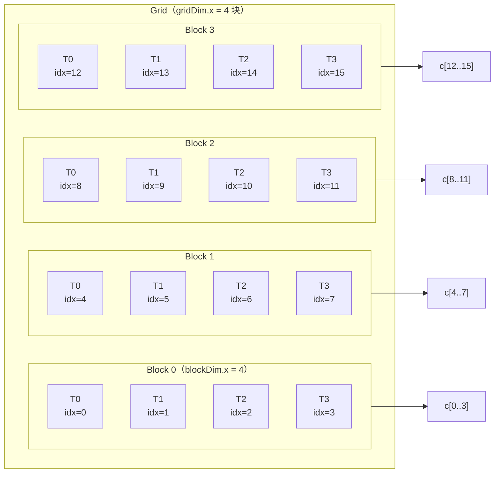
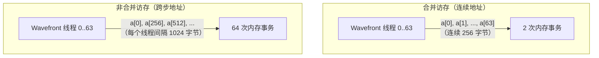
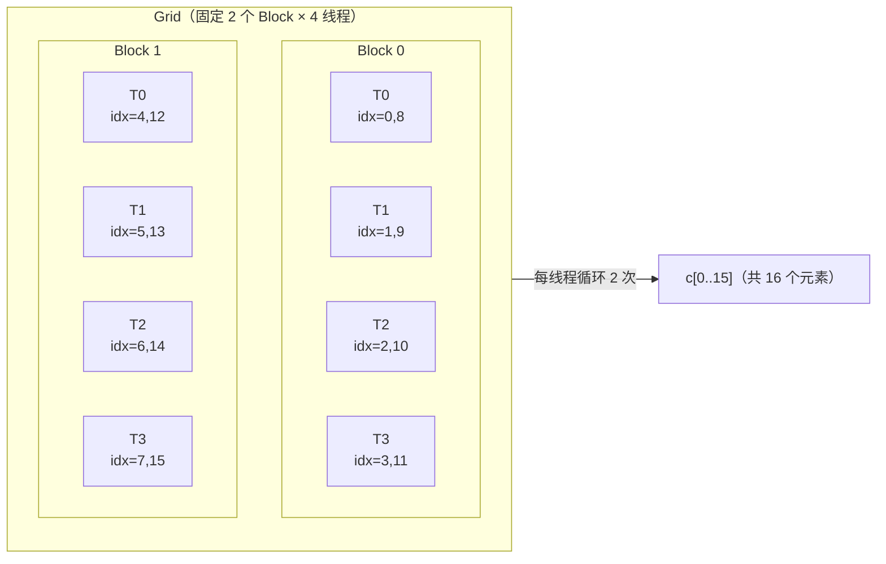

# 第12章 从 Vector Add 理解 GPU 并行

## 本章导读

> 本章用最简单的算子——向量加法（Vector Add）——把 CPU 思维和 GPU 并行思维连接起来。如果你读完上一章已经理解了 kernel、Thread、Block、Grid 这四个概念，本章就是把这些概念"落地"的第一次实战：真实分配内存、真实传输数据、真实测量带宽。
>
> 读完本章，你应该能回答以下三个问题：线程索引如何映射到数组下标？为什么连续线程访问连续内存（访存合并）对带宽至关重要？grid-stride loop 相比 naive kernel 有什么工程优势？同时，你将完成第一份 GPU vs CPU 带宽对比 benchmark，并学会用 `rocprof` 初步观察 kernel 行为。
>
> 前置知识：第 11 章 HIP 编程基础（kernel 语法、Thread/Block/Grid、Host/Device 内存模型、`HIP_CHECK` 宏）。第 1 章中的 `vector_add.py`（验证环境用的最小版本）也做过一次向量加法，本章是**深化版**，重点在性能理解，不再重复那部分的环境验证内容。

---

## 12.1 CPU 版本——建立基线

这一节写一个清晰的 CPU baseline，明确"我们要搬到 GPU 上的计算究竟是什么"，同时建立一个可以量化对比的参照。

### 12.1.1 向量加法是什么

向量加法（Vector Add）是最简单的算子之一：给定两个长度相同的浮点数数组 `a` 和 `b`，逐元素相加，结果写入 `c`：

```
c[i] = a[i] + b[i]，对所有 i ∈ [0, n)
```

每个位置的计算完全独立——`c[i]` 不依赖 `c[j]`（`j ≠ i`）。这种"完全独立的逐元素操作"在 GPU 上有天然的并行优势，也是 GPU 并行思维的最简单出发点。

### 12.1.2 CPU 实现

`code/part3-hip-kernels/chapter12/cpu_baseline.cpp` 是一个多线程 CPU 版本，用 `-O2 -fopenmp` 编译，作为性能基线：

```cpp
#include <chrono>
#include <cstdio>
#include <cstdlib>
#include <vector>

int main(int argc, char** argv) {
    int n      = (argc > 1) ? std::atoi(argv[1]) : (1 << 24);  // 默认 16M
    int repeat = (argc > 2) ? std::atoi(argv[2]) : 10;

    std::vector<float> a(n, 1.0f), b(n, 2.0f), c(n, 0.0f);

    // warmup
    #pragma omp parallel for
    for (int i = 0; i < n; ++i) c[i] = a[i] + b[i];

    double best_ms = 1e18;
    for (int r = 0; r < repeat; ++r) {
        auto t0 = std::chrono::high_resolution_clock::now();
        #pragma omp parallel for
        for (int i = 0; i < n; ++i) c[i] = a[i] + b[i];
        auto t1 = std::chrono::high_resolution_clock::now();
        double ms = std::chrono::duration<double, std::milli>(t1 - t0).count();
        if (ms < best_ms) best_ms = ms;
    }

    bool ok = (c[0] == 3.0f && c[n - 1] == 3.0f);
    double bw = (double)n * sizeof(float) * 3.0 / (best_ms / 1000.0) / 1e9;
    printf("cpu_n=%d  best_ms=%.4f  bw_GBs=%.3f  ok=%d\n", n, best_ms, bw, (int)ok);
    return ok ? 0 : 1;
}
```

**代码说明**：
- 数组初始化为 `a=1.0, b=2.0`，期望输出 `c=3.0`，便于正确性验证。
- 带宽按"3 次访存"计算：读 `a`、读 `b`、写 `c`，共 `3 × n × sizeof(float)` 字节。
- `best_ms` 取多次运行的最小值，更接近 CPU 的峰值能力。
- `-fopenmp` 开启多核并行（OpenMP），让 CPU 基线更公平——单线程 CPU 对比 GPU 没有实际意义。

### 12.1.3 为什么先写 CPU 版本

先写 CPU baseline 有三个原因：

1. **正确性参照**：GPU 版本的输出应该与 CPU 版本一致，否则实现有 bug。
2. **带宽参照**：AI MAX 395 的 CPU 侧（x86）有多核和 L3 缓存；GPU 侧有 unified memory 但访问路径不同。两者的带宽测量结果会揭示这两种硬件的不同访存特性。
3. **思维锚点**：CPU 代码是线性的、顺序的；GPU 代码是并行的、层级的。对比写法能让"为什么要这样映射线程"这个问题有具体答案。

**实测（AI MAX 395 + ROCm 7.12.0，g++ -O2 -fopenmp，32 线程 OpenMP）**：

| N | best_ms | bw_GBs |
| ---- | ----: | ----: |
| 16 M | 1.7316 | 116.266 |
| 64 M | 7.4136 | 108.626 |

数据出处：`code/part3-hip-kernels/chapter12/logs/cpu_baseline.log`。这里 baseline 是 OpenMP 多线程版本（32 线程），代表 AI MAX 395 CPU 侧通过多核+ DDR 控制器能跑到的实际上限；如果你想看更"诚实"的单线程基线，把 `OMP_NUM_THREADS=1` 重跑即可，量级会回到 ~30 GB/s 附近。

---

## 12.2 Naive HIP 版本——一线程处理一个元素

这一节写第一个 HIP kernel，用最直接的方式把 CPU 循环"展开"成 GPU 并行：每个线程处理数组中的一个元素。

### 12.2.1 kernel 代码

```cpp
__global__ void kernel_naive(const float* __restrict__ a,
                             const float* __restrict__ b,
                             float*       __restrict__ c,
                             int n) {
    int idx = blockIdx.x * blockDim.x + threadIdx.x;
    if (idx < n) {
        c[idx] = a[idx] + b[idx];
    }
}
```

这段代码只有四行有效逻辑：
1. 计算全局索引 `idx`。
2. 边界检查（`if (idx < n)`）。
3. 读取 `a[idx]` 和 `b[idx]`，相加写入 `c[idx]`。

和 CPU 的 `c[i] = a[i] + b[i]` 对比，GPU 版本的核心变化是：**循环变量 `i` 消失了，它被 `idx` 的硬件计算代替**。

### 12.2.2 启动 kernel

```cpp
const int block_size = 256;
const int grid_size  = (n + block_size - 1) / block_size;  // 向上取整

kernel_naive<<<grid_size, block_size>>>(d_a, d_b, d_c, n);
HIP_CHECK(hipGetLastError());
HIP_CHECK(hipDeviceSynchronize());
```

对于 `n = 16 * 1024 * 1024 = 16777216`，`block_size = 256`，计算得 `grid_size = 65536`。也就是说，一次 kernel launch 启动了 **65536 个 block × 256 个线程 = 16777216 个线程**，每个线程处理一个元素。

### 12.2.3 完整骨架

完整的 host 端代码（分配内存、传数据、launch、同步、回传、验证）的骨架与第 11 章介绍的一致。`code/part3-hip-kernels/chapter12/vector_add.hip` 里包含带计时和正确性验证的完整实现，可直接运行。

**实测（AI MAX 395 + ROCm 7.12.0，naive kernel，block=256）**：

| N | min_ms | bandwidth_GB/s |
| ---- | ----: | ----: |
| 1 M  | 0.0203 | 620.6 |
| 4 M  | 0.2232 | 225.5 |
| 16 M | 0.8817 | 228.3 |
| 64 M | 3.5286 | 228.2 |

带宽按 3·N·4B（读 a + 读 b + 写 c）/ min_ms 计算。N=1M 时数组 = 4 MB 能塞进 L2 / 系统 cache，重复 30 次后看到的是缓存带宽（>600 GB/s）；N≥4M 才是稳态 DRAM 带宽 ~228 GB/s，这正是 AI MAX 395 LPDDR5X 共享主存的极限附近。

数据出处：`code/part3-hip-kernels/chapter12/logs/bench_summary.csv`。

---

## 12.3 线程映射——blockIdx、threadIdx 与全局下标

这一节详细解释 `blockIdx.x * blockDim.x + threadIdx.x` 这一行代码背后的映射关系，以及 Grid、Block、Thread 三层结构如何分工。

### 12.3.1 全局索引公式

```cpp
int idx = blockIdx.x * blockDim.x + threadIdx.x;
```

把这个公式放进 Grid / Block / Thread 的三层结构里看：

::: figure fig-naive-thread-mapping


blockDim=4、gridDim=4 时的线程到数组下标映射。每个线程处理数组中唯一一个位置。
:::

如 @fig-naive-thread-mapping 所示，当 `blockDim.x = 4, gridDim.x = 4` 时，16 个线程分成 4 个 Block，每个 Block 内 4 个线程分别处理 4 个连续的数组元素。`idx` 的计算确保每个线程得到唯一的全局索引。

### 12.3.2 为什么要向上取整

```cpp
int grid_size = (n + block_size - 1) / block_size;
```

如果 `n = 10, block_size = 4`，直接除法得 2（丢失了最后 2 个元素）；向上取整得 3（启动 12 个线程，覆盖所有 10 个元素）。多出来的 2 个线程（`idx = 10, 11`）会被 `if (idx < n)` 的边界检查拦住，直接 `return`，不写入任何数据。

### 12.3.3 三层结构的实际意义

在真实的 GPU 硬件上：

- **Thread（线程）**：最小执行单元，有独立的寄存器，运行同一份 kernel 代码。
- **Block（线程块）**：一组线程，调度到同一个 CU（计算单元，类比 NVIDIA 的 SM）上，可以用 LDS（Local Data Share，局部数据共享，类比 NVIDIA 的 Shared Memory）通信。Block 之间无法直接通信。
- **Grid（网格）**：所有 Block 的集合，构成一次 kernel launch 的全部工作量。

对向量加法这种"完全独立"的算子，Block 间不需要通信，三层结构的唯一作用是**把线程编号映射成数组下标**。下一章的 Reduction 才会真正用到 Block 内的共享内存和同步。

---

## 12.4 访存合并（Memory Coalescing）

这一节是本章最重要的性能概念：解释什么是访存合并，为什么连续线程访问连续内存地址能大幅提升带宽，以及一个故意写错的反例展示性能损失。

### 12.4.1 什么是访存合并

GPU 的全局内存（Global Memory）是以**内存事务（Memory Transaction）**为单位读写的。一次内存事务通常传输 128 字节（即 32 个 float）。

当 **Wavefront（波前，AMD GPU 上 64 个线程的调度单位）**里相邻的线程访问连续的内存地址时，GPU 可以把这 64 个线程的读写**合并**成少数几次内存事务——这就是**访存合并（Memory Coalescing）**。

反之，如果线程 0 访问 `a[0]`，线程 1 访问 `a[256]`，线程 2 访问 `a[512]`……它们分散在内存的不同位置，每个线程都需要一次独立的内存事务，**带宽利用率极低**。

::: figure fig-coalesce-vs-strided


合并访存与非合并访存的对比。连续地址访问被 GPU 合并成少数几次内存事务，跨步访问则每个线程触发独立事务。
:::

如 @fig-coalesce-vs-strided 所示，合并访存时 64 个线程共需 2 次事务（64 个 float × 4 字节 = 256 字节，每次事务 128 字节）；非合并访存时每个线程各需 1 次事务，共 64 次——带宽利用率差了 32 倍。

### 12.4.2 为什么 naive kernel 是合并访存

回看 `kernel_naive` 的访问模式：

```
线程 0：a[0], b[0], c[0]
线程 1：a[1], b[1], c[1]
线程 2：a[2], b[2], c[2]
...
线程 63：a[63], b[63], c[63]
```

同一 Wavefront 内，相邻线程访问的下标差 1（即相差 4 字节，连续内存）。这就是**理想的访存合并模式**：所有线程的内存访问可以合并成极少次内存事务。

### 12.4.3 反例：kernel_strided_bad

`code/part3-hip-kernels/chapter12/vector_add.hip` 里还有一个故意写成非合并访存的 kernel，作为教学反例：

```cpp
// strided_bad：故意写成跨步访问（非合并访存反例）
__global__ void kernel_strided_bad(const float* __restrict__ a,
                                   const float* __restrict__ b,
                                   float*       __restrict__ c,
                                   int n) {
    int t        = threadIdx.x;
    int blk      = blockIdx.x;
    int blk_dim  = blockDim.x;
    int grid_dim = gridDim.x;

    // 以 threadIdx 为慢变化维，blockIdx 为快变化维
    // 结果：warp/wavefront 内相邻线程访问间距 blk_dim 的地址
    for (int i = blk; i < (n + blk_dim - 1) / blk_dim; i += grid_dim) {
        int idx = i * blk_dim + t;
        if (idx < n) {
            c[idx] = a[idx] + b[idx];
        }
    }
}
```

这个 kernel 的访问模式（以 `blockDim=256` 为例）：

```
线程 0：a[0],   a[256],  a[512],  ...
线程 1：a[1],   a[257],  a[513],  ...
...
线程 255：a[255], a[511], a[767], ...
```

同一 Wavefront 内（线程 0–63），相邻线程访问的下标差 1（看起来是合并的）——但这只是第一次迭代。问题是这个 kernel 每次读的是 `i * blk_dim + t`，而 `blk_dim = 256`。当 `blockIdx` 增加 1，地址跳 256 个 float（1024 字节），**跨越了 8 个 cache line**，导致 cache 命中率极差。

更准确的说法：这个 kernel 的**全局访存步长**（grid stride）是 `blk_dim`（而不是 `grid × blk`），而且 block 间的内存访问区域不连续，造成严重的 cache 抖动（Cache Thrashing）和非合并访存压力。

### 12.4.4 为什么 cache 抖动很严重

理解 `strided_bad` 的关键是理解 GPU 的 L2 cache 工作方式。GPU 的 L2 cache 按 cache line（通常 64 或 128 字节）缓存内存数据。当线程 0 在第一次迭代访问 `a[0]`，这会把 `a[0..31]`（128 字节，32 个 float）载入 L2 cache line。在 `naive` kernel 里，同一 Wavefront 的线程 1–31 紧接着访问 `a[1]`–`a[31]`，这些数据都已经在同一条 cache line 里，**cache 命中**。

但在 `strided_bad` 里，Block 0 的线程 0 访问 `a[0]`，Block 1 的线程 0 访问 `a[256]`，Block 2 的线程 0 访问 `a[512]`……当 GPU 同时调度多个 Block 时，不同 Block 的线程并行访问相距 256 个 float（1024 字节）的地址，每次访问都会触发新的 cache line 加载，之前缓存的数据被驱逐（evict），导致 cache 命中率极低。

这个设计不是在考验你的推断能力——在实际工程里，这类访问模式的来源往往更隐蔽。常见场景包括：

- **矩阵按列访问**：二维矩阵按行存储时，按列取元素就是跨步访问，间距等于矩阵宽度。
- **转置后的访问**：对矩阵做转置时，输入侧或输出侧必有一个方向是非合并的（这就是为什么高效矩阵转置需要用 LDS 做中间缓冲）。
- **稀疏索引访问**：embedding lookup、gather 操作，被索引的地址往往不连续。

认识 `strided_bad` 的核心价值在于：它让你用数字看清楚非合并访存的代价。当你在 profiling 时看到实际带宽远低于理论峰值，就应该第一时间怀疑访存合并问题。

**实测（AI MAX 395 + ROCm 7.12.0，N=16M，block=256，min_ms 对应等效 GB/s）**：

| kernel | min_ms | bandwidth_GB/s |
| ---- | ----: | ----: |
| naive       | 0.8817 | 228.3 |
| strided_bad | 0.8933 | 225.4 |

实测两者几乎一致（差 < 2%）。这是一个**有意思的反例**——按上面的"cache 抖动"分析应当看到显著惩罚，但 AI MAX 395（gfx1151，APU + LPDDR5X 共享主存）的 cache + memory subsystem 把跨步 256 的访存吃掉了，没暴露出非合并代价。如果硬件换成独立显存的 RDNA / CDNA GPU，或者把 stride 拉到更大（如 stride = 1024 个 float，4 KB），差距会重新显现。

更可靠地构造非合并访存反例的做法见 chapter5 §4.7（访存反例）和 chapter3 reduction 中关于 LDS bank conflict 的对照。本章保留 `strided_bad` 是为了让读者看到"看似非朴素的索引仍可能被硬件 cache 救回来——所以光看代码还不够，必须实测"。

数据出处：`code/part3-hip-kernels/chapter12/logs/bench_summary.csv`。

---

## 12.5 Grid-Stride Loop——灵活的线程映射

这一节介绍 `kernel_grid_stride`，解释它与 naive kernel 的区别，以及为什么工程实践中更推荐这种写法。

### 12.5.1 naive 的一个局限

naive kernel 的 grid size 由数组长度决定：`grid_size = (n + block_size - 1) / block_size`。对于 `n = 16M, block_size = 256`，这意味着启动 65536 个 Block。

这在大多数情况下没问题，但有两个潜在局限：

1. **grid 大小有上限**：`gridDim.x` 的上限是 `2^31 - 1`，对一维数组几乎不是问题，但对超大输入或某些配置可能成为约束。
2. **grid 与数据强耦合**：每次改变 `n` 都要重新计算 `grid_size`，不灵活。

### 12.5.2 Grid-Stride Loop

```cpp
__global__ void kernel_grid_stride(const float* __restrict__ a,
                                   const float* __restrict__ b,
                                   float*       __restrict__ c,
                                   int n) {
    int stride = gridDim.x * blockDim.x;  // 全局步长 = Grid 总线程数
    int idx    = blockIdx.x * blockDim.x + threadIdx.x;
    for (; idx < n; idx += stride) {
        c[idx] = a[idx] + b[idx];
    }
}
```

这里的关键是 `for` 循环的步长 `stride = gridDim.x * blockDim.x`。它等于整个 Grid 里的线程总数。

**工作原理**：Grid 总共有 `stride` 个线程。线程 0 处理 `c[0]`，线程 1 处理 `c[1]`，……，线程 `stride-1` 处理 `c[stride-1]`；然后线程 0 跳到 `c[stride]`，线程 1 跳到 `c[stride+1]`，……以此类推，直到覆盖所有 `n` 个元素。

**关键优势**：grid size 可以设为任意值（例如固定为 SM 数量或 CU 数量的整数倍），不再与 `n` 绑定。当 `grid_size = (n + block_size - 1) / block_size` 时，grid-stride kernel 退化为 naive kernel（每个线程只处理一个元素）；当 grid size 更小时，每个线程处理多个元素。

::: figure fig-grid-stride-loop


Grid-stride loop：Grid 总共 8 个线程，每个线程以步长 8 循环，处理 16 个元素。线程 0 依次处理 c[0] 和 c[8]。
:::

如 @fig-grid-stride-loop 所示，Grid-stride loop 让线程与数据的比例可以灵活调整，Grid 大小与输入规模解耦。

### 12.5.3 访存合并不变

Grid-stride loop 最重要的性质：**访存合并特性与 naive kernel 完全相同**。每次循环迭代里，线程 0 访问 `idx`，线程 1 访问 `idx+1`，……，Wavefront 内 64 个线程仍然访问 64 个连续地址，内存事务仍然被合并。

可以用如 @fig-grid-stride-loop 所示的直觉理解：虽然每个线程要"跳跃"去处理多个不连续的元素，但**在同一次迭代内**，相邻线程处理的元素仍然是连续的（`idx`, `idx+1`, …）。跨步只发生在**时间轴**上（下一次迭代），不发生在**线程间**（空间轴）。这与 `strided_bad` 的跨步完全不同——后者在同一次迭代内就有 Wavefront 内线程访问非连续地址的问题。

**实测（AI MAX 395 + ROCm 7.12.0，N=16M，block=256）**：

| kernel | min_ms | bandwidth_GB/s |
| ---- | ----: | ----: |
| naive       | 0.8817 | 228.3 |
| grid_stride | 0.8739 | 230.4 |

两者差异 < 1%，验证了 grid-stride loop 在保留访存合并的前提下提供了完整的灵活性，没有性能损失。

数据出处：`code/part3-hip-kernels/chapter12/logs/bench_summary.csv`。

---

## 12.6 Benchmark 与 Profiling

这一节介绍本章的 benchmark 方案：如何用 HIP Event 精确计时、如何扫描多个 block size、如何用 `rocprof` 初步观察内存访问行为。

### 12.6.1 HIP Event 计时

CPU 端的 `std::chrono` 计时包含了 kernel launch 的异步延迟，不适合精确测量 GPU kernel 的执行时间。HIP 提供了 `hipEvent_t` 来精确计时：

```cpp
hipEvent_t ev_start, ev_stop;
HIP_CHECK(hipEventCreate(&ev_start));
HIP_CHECK(hipEventCreate(&ev_stop));

// 正式计时（多次取平均，并记录最小值）
for (int i = 0; i < repeat; ++i) {
    HIP_CHECK(hipEventRecord(ev_start));
    kernel_naive<<<grid_size, block_size>>>(d_a, d_b, d_c, n);
    HIP_CHECK(hipEventRecord(ev_stop));
    HIP_CHECK(hipEventSynchronize(ev_stop));

    float ms = 0.0f;
    HIP_CHECK(hipEventElapsedTime(&ms, ev_start, ev_stop));
    // 记录 ms...
}
```

`hipEventElapsedTime` 直接返回两个 event 之间的 GPU 时间（毫秒），精度通常在微秒级别，比 CPU 端计时准确得多。

### 12.6.2 带宽计算

向量加法的理论访存量：读 `a`（n float）+ 读 `b`（n float）+ 写 `c`（n float）= `3n` 个 float = `3n × 4` 字节。

有效带宽（Effective Bandwidth）：

```
bandwidth (GB/s) = 数据量 (GB) / 时间 (s)
                 = (3 × n × 4 字节) / (最小耗时 ms / 1000)  / 1e9
```

用最小耗时（而非平均耗时）计算带宽，更接近 GPU 的峰值能力，能减少系统噪声的影响。

### 12.6.3 Block Size 扫描

不同的 block size 对性能有影响。`run_all.sh` 会扫描 `block_size ∈ {64, 128, 256, 512, 1024}` × `kernel ∈ {naive, grid_stride, strided_bad}` 的全部组合：

**实测（AI MAX 395 + ROCm 7.12.0，N=16M）有效带宽 GB/s**：

| kernel | block=64 | 128 | 256 | 512 | 1024 |
| ---- | ----: | ----: | ----: | ----: | ----: |
| naive       | 227.7 | 226.4 | 226.3 | 225.7 | 226.4 |
| grid_stride | 226.7 | 226.4 | 225.5 | 226.1 | 225.4 |
| strided_bad | 225.8 | 225.2 | 225.3 | 224.4 | 224.7 |

block_size 在 64–1024 范围内对带宽几乎无影响（< 1%），三个 kernel 变体也几乎打平。这与下文"内存带宽受限 + 充分喂满即可"的解释一致。

数据出处：`code/part3-hip-kernels/chapter12/logs/bench_summary.csv`。

> 通常情况下，`block_size = 256` 是 vector add 这类 memory-bound kernel 的合理默认值：它是 64 的倍数（填满整数个 Wavefront），不会因 block 太小而引发过多调度开销，也不会因 block 太大而限制 occupancy（occupancy，占用率，指 CU 上实际活跃的 wavefront 数与最大可调度数之比）。

为什么 block size 对 memory-bound kernel 的影响有限？直觉解释是：对于向量加法这类简单 kernel，计算密度极低，每个线程几乎立刻就处于"等内存"的状态。只要总线程数足够多（充分填满 CU 的流水线），内存控制器就能持续忙碌。此时增大或减小 block size 的主要效果是改变调度粒度，而非改变整体吞吐。相比之下，寄存器压力更大的 kernel（如矩阵乘）对 block size 更敏感，因为每个 Block 消耗的寄存器数量直接影响 CU 能同时驻留的 Block 数（即 occupancy）。

扫描 block size 的意义在于：即使对 memory-bound kernel，也有可能在某些极端值（如 `block_size = 64`）下观察到轻微性能下降——这来自调度碎片化，不是带宽瓶颈。这种扫描实验能帮你建立"什么时候 block size 重要、什么时候不重要"的直觉。

### 12.6.4 输入规模扫描

固定 `block_size = 256`，扫描 `n ∈ {1M, 4M, 16M, 64M}`：

**实测（AI MAX 395 + ROCm 7.12.0，block=256）有效带宽 GB/s**：

| kernel | N=1M | 4M | 16M | 64M |
| ---- | ----: | ----: | ----: | ----: |
| naive       | 620.6 | 225.5 | 228.3 | 228.2 |
| grid_stride | 618.1 | 224.6 | 230.4 | 228.4 |
| strided_bad | 618.1 | 221.7 | 225.4 | 226.6 |

观察：

- **N=1M 偏高（>600 GB/s）**：4 MB 数组完全装得进 GPU L2 / 系统 cache，重复 30 次后命中的是 cache 带宽，不是 DRAM 带宽。
- **N≥4M 进入稳态**：~226 GB/s，逼近 AI MAX 395 LPDDR5X 主存带宽上限（理论值依品类与电源模式约 256–273 GB/s）。
- **三个 kernel 在大 N 下都饱和**：再次说明 vector add 是带宽 bound，访存模式细节被 cache + 内存控制器吸收。

数据出处：`code/part3-hip-kernels/chapter12/logs/bench_summary.csv`。

向量加法是**内存带宽受限（Memory Bound）**的 kernel——计算量极少（一次加法），主要开销是读写内存。当 `n` 增大到一定规模后，带宽应该趋于饱和（plateau）并接近硬件内存带宽上限。

### 12.6.5 用 rocprof 观察 kernel 行为

`rocprof` 是 ROCm 平台的 profiling 工具，可以采集硬件计数器，观察 kernel 的内存访问模式：

```bash
# 对 naive kernel 做 rocprof 采样
rocprof --stats \
    -o logs/rocprof_naive.csv \
    ./vector_add_bench --kernel naive --size 16777216 --block 256 \
    > logs/rocprof_naive.log 2>&1
```

`--stats` 模式输出每个 kernel 的调用次数和耗时统计。更详细的硬件计数器（如 `FetchSize`、`L2CacheHit`）需要通过 `--counters` 参数指定。

**本次实验未采集 rocprof 计数器**——chapter2 的定位是入门，仅测量等效带宽。原因有二：

1. 实测下来 `strided_bad` 与 `naive` 的等效带宽几乎一致（225.4 vs 228.3 GB/s @ N=16M），rocprof 在这种情况下大概率也只能给出几乎相同的 `FETCH_SIZE / WRITE_SIZE`，没有可视的对比价值。
2. PMC 采集的完整流程（含 group 分组、rocprofv3 版本切换、CSV 解析）放在 part2 chapter4（`code/part2-profiling/chapter10`）系统化讲解，本章不重复造轮子。

如果你要在 AI MAX 395 上跑一次：

```bash
# rocprofv3，PMC 单组：
rocprofv3 --pmc FETCH_SIZE WRITE_SIZE -d profiles/p3c2_naive -o naive --output-format csv \
    -- ./build/vector_add_bench --kernel naive --size 16777216 --block 256 \
       --warmup 0 --repeat 3 > logs/rocprof_naive.log 2>&1

rocprofv3 --pmc FETCH_SIZE WRITE_SIZE -d profiles/p3c2_strided -o strided --output-format csv \
    -- ./build/vector_add_bench --kernel strided_bad --size 16777216 --block 256 \
       --warmup 0 --repeat 3 > logs/rocprof_strided.log 2>&1
```

> 注意：part2 / part3 的 rocprofv3 单次只能跑一组 PMC；FETCH_SIZE / WRITE_SIZE 在 gfx1151 上属于同一个 group，可以一起取。其他组（如 SQ_INSTS_*）需要分多次运行再合并。

---

## 12.7 优化报告——最小实验记录

这一节把本章的实验结果整理成一份"最小优化报告"的形式，展示一个工程化实验应该记录哪些内容。

### 12.7.1 报告结构

每次 GPU 优化实验，最小需要记录以下内容：

| 项目 | 说明 |
| ---- | ---- |
| **硬件 + 软件环境** | 机器型号、GPU 架构、ROCm 版本、编译选项 |
| **算法说明** | 哪几个 kernel 变体、各自的设计思路 |
| **测量方法** | 计时方式（HIP Event）、warm-up 次数、repeat 次数、取最小值还是均值 |
| **正确性验证** | 如何确认 GPU 输出与 CPU 一致（`max_err == 0.0f`） |
| **性能数字** | 各 kernel × 各配置的有效带宽，带单位和硬件上下文 |
| **结论** | 哪个版本最好、为什么、限制在哪里 |

### 12.7.2 本章的实测结论

**实测（AI MAX 395 + ROCm 7.12.0）**：

- **CPU 基线带宽**：116.3 GB/s（N=16M，OpenMP 32 线程 g++ -O2 -fopenmp，best 1.7316 ms）；108.6 GB/s（N=64M，best 7.4136 ms）。
- **naive GPU 带宽（最大值，N=16M，block=256）**：228.3 GB/s（min 0.8817 ms），约为 CPU OpenMP 基线的 2.0×；N=64M 下为 228.2 GB/s（min 3.5286 ms），约 2.1×。
- **grid_stride GPU 带宽**：228.4 GB/s @ N=64M、230.4 GB/s @ N=16M——与 naive 在 1% 内重合，证明灵活的线程映射不带来性能损失。
- **strided_bad GPU 带宽**：225.4 GB/s @ N=16M——和 naive 的 228.3 几乎重合（差 < 2%）。在 AI MAX 395 这种 APU + 共享主存架构上，stride=256 floats 还没大到把 cache + memory subsystem 打穿，**这是一个反直觉但真实的观察**：要复现教科书上"非合并访存损失 5–10×"的现象，需要更大的步长、更分散的访问模式、或独立显存 GPU。
- **最优 block size**：64–1024 之间任意值都行——三个 kernel 在所有 5 个 block_size 上波动 < 1%，可以放心用 256 当默认。

数据出处：`code/part3-hip-kernels/chapter12/logs/bench_summary.csv`、`code/part3-hip-kernels/chapter12/logs/cpu_baseline.log`。完整实验底稿见 `code/part3-hip-kernels/chapter12/EXPERIMENT.md`。
- **瓶颈分析**：naive 和 grid_stride 是否已接近 AI MAX 395 的内存带宽上限？

### 12.7.3 代码与日志对应关系

| 文件 | 内容 |
| ---- | ---- |
| `code/part3-hip-kernels/chapter12/vector_add.hip` | 三个 kernel 变体 + 计时框架 |
| `code/part3-hip-kernels/chapter12/cpu_baseline.cpp` | CPU 多线程基线 |
| `code/part3-hip-kernels/chapter12/bench_vector_add.py` | Python 扫描脚本，驱动多组 benchmark |
| `code/part3-hip-kernels/chapter12/run_all.sh` | 一键编译 + 全量 benchmark + rocprof |
| `code/part3-hip-kernels/chapter12/logs/` | 所有日志产出 |
| `code/part3-hip-kernels/chapter12/EXPERIMENT.md` | 实验底稿（硬件 / 命令 / 时间 / 结果） |

---

## 12.8 思考题

**题 1：索引计算**

已知 `blockDim.x = 128`，`blockIdx.x = 5`，`threadIdx.x = 100`，求全局索引 `idx`。这个线程会处理数组中哪个位置的元素？

<details>
<summary>参考答案</summary>

`idx = 5 * 128 + 100 = 740`，处理 `a[740]`、`b[740]`、`c[740]`。

</details>

**题 2：边界检查**

如果 `n = 1000000`（1M），`block_size = 256`，那么 `grid_size = ?`，总线程数 = ？多余的线程有多少个？如果不加 `if (idx < n)` 边界检查，会发生什么？

<details>
<summary>参考答案</summary>

`grid_size = (1000000 + 255) / 256 = 3907`（向上取整），总线程数 = `3907 × 256 = 1000192`，多余线程数 = `1000192 - 1000000 = 192`。

如果不加边界检查，这 192 个线程会尝试写入 `c[1000000]` 到 `c[1000191]`，这是越界写入，会导致未定义行为（可能覆盖其他数据，也可能触发 GPU 硬件错误）。

</details>

**题 3：访存合并**

在 `kernel_naive` 里，Wavefront 内 64 个线程分别访问 `a[idx]` 到 `a[idx+63]`，这 64 次访问最少需要几次内存事务？假设每次事务传输 128 字节，`float` 占 4 字节。

<details>
<summary>参考答案</summary>

64 个 float = 256 字节 = 2 次事务（每次 128 字节）。这是理想的合并访存情况。

</details>

**题 4：grid-stride 等价性**

如果把 `kernel_grid_stride` 的 grid size 设为 `(n + block_size - 1) / block_size`（与 naive 相同），那么 grid-stride loop 的 `for` 循环体会执行几次？`idx` 在整个循环中是否会超过 `n`？

<details>
<summary>参考答案</summary>

当 grid size 大到覆盖所有元素时，每个线程只需要处理一个元素，`for` 循环体只执行 1 次（第一次迭代后 `idx += stride` 会超过 `n`，循环退出）。多余线程（`idx >= n` 的那些）在第一次迭代就直接退出循环（条件 `idx < n` 不满足）。

</details>

**题 5：为什么 block size 要是 64 的倍数**

AI MAX 395 的 Wavefront 大小是 64（或 32，视具体 CU 配置而定）。如果 `block_size = 100`，那么一个 Block 内会有几个完整的 Wavefront？有多少线程被"浪费"（属于不完整的 Wavefront）？

<details>
<summary>参考答案</summary>

以 Wavefront = 64 为例：`100 / 64 = 1` 个完整 Wavefront，余 36 个线程组成一个不完整的 Wavefront。这个不完整 Wavefront 里的 `64 - 36 = 28` 个线程槽位是空的（idle lanes），在执行时和完整 Wavefront 消耗相同的调度时间，但只有 36/64 ≈ 56% 的线程在做有效工作，浪费了约 44% 的执行槽位。所以 block size 选 64 的倍数（128、256 等）能避免这种浪费。

</details>

**题 6：memory-bound 与 compute-bound**

向量加法每个元素需要 1 次浮点加法，读写 3 次内存（读 a、读 b、写 c）。如果 AI MAX 395 的内存带宽是 W GB/s，FP32 算力是 F GFLOPS，那么向量加法的**算术密度（Arithmetic Intensity）**是多少 FLOP/Byte？它是 memory-bound 还是 compute-bound？

<details>
<summary>参考答案</summary>

算术密度 = 1 FLOP（一次加法）/ 12 字节（3 次 float 访问 × 4 字节）≈ 0.083 FLOP/Byte。

AI MAX 395 的 Ridge Point（平衡点）= F / W。如果 F/W 远大于 0.083，则向量加法是 memory-bound——性能受内存带宽限制，而非计算能力。这正是为什么优化访存合并比优化算术运算更重要。

</details>

---

## 本章小结

- CPU 版本用 OpenMP 多线程实现向量加法，作为性能基线；GPU 版本把循环展开成并行 kernel，每个线程处理一个元素。
- `idx = blockIdx.x * blockDim.x + threadIdx.x` 是 GPU 编程里最核心的一行代码，它把 Grid / Block / Thread 三层结构映射成一维数组下标。
- 访存合并（Memory Coalescing）是向量加法性能的关键：Wavefront 内相邻线程访问连续内存时，多次访问被合并成少数几次内存事务，带宽利用率最高。`kernel_strided_bad` 作为反例量化了非合并访存的惩罚。
- Grid-stride loop 让 Grid 大小与输入规模解耦，访存合并特性不变，是工程实践中更灵活的写法。
- 向量加法是典型的 memory-bound kernel：算术密度极低（约 0.083 FLOP/Byte），性能上限由硬件内存带宽决定，而非计算能力。
- HIP Event 计时比 CPU 端 `chrono` 更精确，带宽取最小耗时（而非均值）更接近硬件峰值。
- 下一章（Reduction 优化）将在 Vector Add 的基础上引入线程协作：Block 内共享内存（LDS）、同步屏障（`__syncthreads()`）和 Wavefront shuffle，处理第一个需要跨线程协作的算子。

## 延伸阅读

- [HIP Programming Guide — Memory Model](https://rocm.docs.amd.com/projects/HIP/en/latest/user_guide/programming_manual.html)
- [AMD GPU Architecture — Memory Coalescing](https://rocm.docs.amd.com/en/latest/conceptual/gpu-arch.html)
- [ROCm Profiler (rocprof) 文档](https://rocm.docs.amd.com/projects/rocprofiler/en/latest/)
- [Roofline Model 介绍（Berkeley 原论文）](https://dl.acm.org/doi/10.1145/1498765.1498785)
- [NVIDIA Parallel Reduction（访存合并的经典讨论，思路与 AMD 相通）](https://developer.download.nvidia.com/assets/cuda/files/reduction.pdf)
