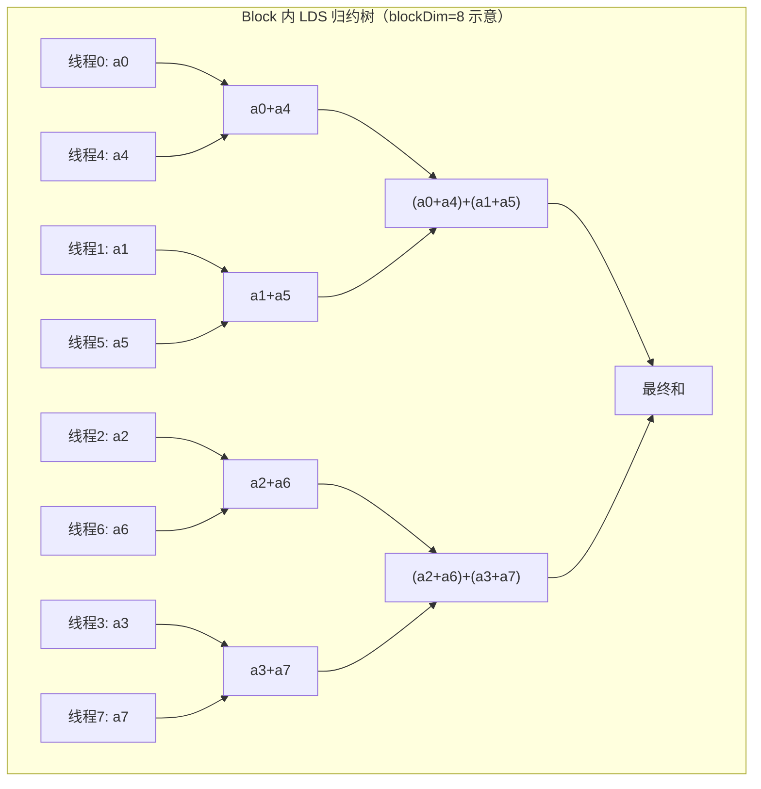
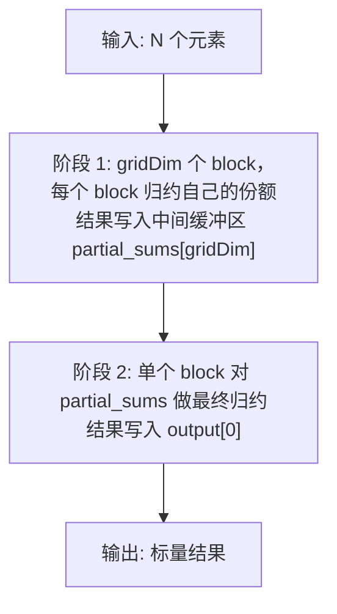

# 第13章 Reduction 优化

## 本章导读

> 本章进入第一个真正体现 GPU 层级协作的算子：Reduction（归约）。上一章的 Vector Add 只需要每个线程独立工作，而 Reduction 要求线程之间相互协作，把大量元素汇总成一个或少数几个结果。这个过程涉及共享内存（LDS）、同步屏障（`__syncthreads()`）、wavefront 内 shuffle 指令，以及多阶段设计。
>
> 读完本章，你应该能理解：为什么跨线程汇总需要这些机制；五个渐进优化版本（v0 至 v4）各自在哪一层做了什么改进；以及如何用 benchmark 和 rocprof 验证优化效果。
>
> 前置知识：第12章 Vector Add（线程映射、访存合并）；第11章 HIP 执行模型（LDS、wavefront 概念）。

---

## 13.1 Reduction 为什么重要

这一节解释归约（Reduction）在 AI 计算中出现的频率，以及它为什么难以天然适配 GPU 的并行结构。

### 13.1.1 归约无处不在

在 AI 训练和推理的核心算子里，归约是一个隐藏在各处的基础操作：

- **Softmax**：对一个 logit 向量求 max，再求 exp 之和，两次 reduction；
- **Layer Normalization（层归一化）**：先求均值（mean），再求方差（variance），各一次 reduction；
- **Multi-Head Attention（多头注意力）**：`QK^T` 之后对每行做 softmax，大矩阵里有大量行级别的 reduction；
- **Loss 计算**：Cross Entropy 等 loss 函数需要对 batch 所有样本的值做求和或求均值；
- **梯度裁剪（Gradient Clipping）**：需要计算所有参数梯度的 L2 范数，即对所有梯度的平方求和再开方。

这些算子的 reduction 部分通常不是主要计算量，却往往是 latency 的瓶颈：它们天然是串行依赖——必须等所有输入都就绪，才能得出最终结果。

### 13.1.2 为什么 GPU 的并行结构不天然适合 Reduction

GPU 的设计哲学是"SIMT（单指令多线程）"：数千个线程同时运行，每个线程处理独立的数据。这在 Vector Add 里非常自然：线程 i 只需要读取 `a[i]` 和 `b[i]`，写入 `c[i]`，完全不需要知道其他线程的存在。

但 Reduction 打破了这种独立性：**你需要把所有线程的局部结果合并成一个全局结果**。这意味着线程之间必须通信，而通信需要共享内存、同步屏障，以及精心设计的归并树结构。

```
最朴素的想法：所有线程都 atomicAdd 到同一个全局变量。
问题：原子操作（Atomic Operation）是串行的——每次只有一个线程能更新，其余在等待。
```

这就是为什么 Reduction 需要分层设计：先在 block 内并行归约，再跨 block 合并。每一层都有不同的工具和权衡。

---

## 13.2 Naive Reduction：atomicAdd 版本（v0）

这一节实现最直接的方案——每个线程直接对全局变量做原子加法，观察它的性能上限在哪里。

### 13.2.1 kernel 代码

```cpp
// v0：每个线程直接 atomicAdd 到全局结果
__global__ void reduce_v0_atomic(const float* __restrict__ input,
                                  float* output,
                                  int n) {
    int idx = blockIdx.x * blockDim.x + threadIdx.x;
    if (idx < n) {
        atomicAdd(output, input[idx]);
    }
}
```

逻辑非常简洁：每个线程计算自己的全局索引，若在范围内就把 `input[idx]` 原子加到 `output[0]`。

### 13.2.2 为什么这几乎总是慢的

**原子操作的串行化**：`atomicAdd` 需要保证写入的原子性，实现上通常通过硬件锁或 LL/SC（Load-Linked / Store-Conditional）机制。当大量线程同时争抢同一个地址时，它们实际上被串行化了——GPU 的所有并行优势被浪费了。

**全局内存延迟**：`output` 在全局显存（Global Memory）中，每次原子操作都会触发一次全局内存访问。对于 N 个元素，这意味着 N 次全局内存写争用。

对于 v0，你会看到：随着 N 增大，执行时间几乎线性增长，因为所有线程实际上是排队串行执行那个 `atomicAdd`。

> 带宽利用率（Bandwidth Utilization）：实测 v0 在 AI MAX 395 上的等效带宽几乎与 N 无关——4M / 16M / 64M / 256M 分别只有 1.07 / 1.05 / 1.11 / 1.12 GB/s，仅占 LPDDR5X 共享主存峰值（~256 GB/s）的 0.4–0.5%。原因正是上面解释的：所有线程都在抢同一个全局地址，硬件被迫串行执行 atomicAdd，带宽被完全浪费。数据出处：`code/part3-hip-kernels/chapter13/logs/bench_summary.csv`。

---

## 13.3 LDS 优化：Block 内归约树（v1）

这一节引入共享内存（LDS，Local Data Share），在 block 内先做局部归约，大幅减少全局原子操作的数量。

### 13.3.1 核心思想：归约树

与其让 N 个线程都去争一个全局变量，不如让每个 block 内的 256（或其他 blockDim）个线程先在 LDS 中归约成一个值，再只做一次全局原子加法。这样全局原子操作的数量从 N 降低到 `ceil(N / blockDim.x)`。

::: figure fig-lds-reduction-tree


Block 内 LDS 归约树示意（blockDim=8 时，3 轮完成归约）
:::

如 @fig-lds-reduction-tree 所示，归约树的每一轮（stride）让活跃线程数减半：第一轮有 N/2 个线程工作，第二轮 N/4，以此类推，log2(blockDim) 轮后 block 内的和汇聚到线程 0 的 LDS 槽位。

### 13.3.2 v1 kernel 代码

```cpp
// v1：LDS 归约树，每个 block 只做一次全局 atomicAdd
__global__ void reduce_v1_lds(const float* __restrict__ input,
                               float* output,
                               int n) {
    extern __shared__ float sdata[];   // 动态分配 LDS

    int tid  = threadIdx.x;
    int idx  = blockIdx.x * blockDim.x + threadIdx.x;

    // 1. 每个线程把自己的元素载入 LDS
    sdata[tid] = (idx < n) ? input[idx] : 0.0f;
    __syncthreads();   // 确保所有线程都写完 LDS 再读

    // 2. 归约树：stride 从 blockDim/2 开始，逐轮减半
    for (int stride = blockDim.x / 2; stride > 0; stride >>= 1) {
        if (tid < stride) {
            sdata[tid] += sdata[tid + stride];
        }
        __syncthreads();   // 每轮结束必须同步
    }

    // 3. 线程 0 把 block 结果写回全局内存
    if (tid == 0) {
        atomicAdd(output, sdata[0]);
    }
}
```

**关键点解析**：

- `extern __shared__ float sdata[]`：动态 LDS 分配，大小在 kernel launch 时以第三个参数（`<<<gridDim, blockDim, sharedBytes>>>`）指定。
- `__syncthreads()`：block 内的屏障同步（Barrier Synchronization）。在归约树的每一轮结束后，必须确保所有线程都完成本轮写入，才能进入下一轮读取。如果不同步，线程可能读到别的线程尚未更新的旧值。
- 边界处理：`sdata[tid] = (idx < n) ? input[idx] : 0.0f`——当输入长度不是 blockDim 整数倍时，越界线程填 0，不影响加法结果。

### 13.3.3 LDS Bank Conflict（LDS Bank 冲突）

LDS 被划分为 32 个 bank（对应 wavefront 的 64 个线程每次访问两个 bank 的情况，或 AMD 硬件上的实际 bank 数），连续地址映射到连续 bank。当同一 wavefront 内多个线程访问同一个 bank 的不同地址时，就会产生 bank conflict，访问被串行化，性能下降。

在 v1 的归约树里，当 stride 变小时：
- stride=1 时，线程 0 读 `sdata[0]` 和 `sdata[1]`；线程 1 读 `sdata[2]` 和 `sdata[3]`……访问模式连续，bank conflict 少。
- 但在早期的 stride 较大时（如 stride=16），线程 0 读 `sdata[0]` 和 `sdata[16]`，线程 1 读 `sdata[1]` 和 `sdata[17]`……步长大于 bank 数时可能产生冲突。

v1 已经比 v0 快很多，但 bank conflict 仍然是潜在的性能损失。

---

## 13.4 Wavefront 级优化（v2）

这一节利用 AMD GPU 的 wavefront 特性，在最后几轮归约中跳过 `__syncthreads()`，减少同步开销。

### 13.4.1 Wavefront 内隐式同步

在 AMD GPU（以及 NVIDIA GPU 的 warp）中，同一个 wavefront（AMD 默认 64 线程）内的所有线程总是以锁步（lockstep）方式执行——它们在同一个时钟周期执行同一条指令。这意味着 **wavefront 内部的操作天然同步**，不需要 `__syncthreads()`。

因此，当归约树的 stride 收缩到 wavefront_size / 2 以下时，剩余的活跃线程全部在同一个 wavefront 内，它们之间的操作天然有序，可以省掉同步屏障。

### 13.4.2 AMD 的 `__shfl_*` 指令

AMD HIP 提供了一组 wavefront shuffle（洗牌）指令，允许线程直接读取同一 wavefront 内其他线程的寄存器值，完全绕过 LDS：

```cpp
// 读取 lane_id + offset 的线程的寄存器 var
float __shfl_down(float var, unsigned int delta, int width = warpSize);
// 直接指定 lane_id 读取
float __shfl(float var, int srcLane, int width = warpSize);
```

在 AMD 上，`warpSize`（wavefront 大小）通常为 64（gfx1151/RDNA3 架构上是 32 或 64，需运行时确认）。

### 13.4.3 v2 kernel：wavefront shuffle reduction

```cpp
// v2：前半段用 LDS 树归约到 wavefront 大小，后半段用 __shfl_down
__device__ float warp_reduce_sum(float val) {
    // 在同一 wavefront 内用 shuffle 做归约
    for (int offset = warpSize / 2; offset > 0; offset >>= 1) {
        val += __shfl_down(val, offset);
    }
    return val;
}

__global__ void reduce_v2_wavefront(const float* __restrict__ input,
                                     float* output,
                                     int n) {
    extern __shared__ float sdata[];

    int tid = threadIdx.x;
    int idx = blockIdx.x * blockDim.x + threadIdx.x;

    float val = (idx < n) ? input[idx] : 0.0f;

    // 阶段 1：LDS 树归约，直到每个 wavefront 只剩一个值
    sdata[tid] = val;
    __syncthreads();

    for (int stride = blockDim.x / 2; stride >= warpSize; stride >>= 1) {
        if (tid < stride) {
            sdata[tid] += sdata[tid + stride];
        }
        __syncthreads();
    }

    // 阶段 2：每个 wavefront 的第一个线程用 shuffle 完成最后几轮
    if (tid < warpSize) {
        float warp_val = sdata[tid];
        warp_val = warp_reduce_sum(warp_val);
        if (tid == 0) {
            atomicAdd(output, warp_val);
        }
    }
}
```

**优化效果**：减少了 log2(warpSize) 次 `__syncthreads()` 调用，以及对应的 LDS 读写。对于 blockDim=256、warpSize=64，可以省去最后 6 轮的同步屏障。

### 13.4.4 分支收敛（Branch Convergence）

在 `if (tid < stride)` 这条判断里，同一个 wavefront 内的某些线程会走 if 分支，另一些不走。这种情况叫做**分支发散（Branch Divergence）**。

发散时，GPU 需要分别执行两个分支，不执行该分支的线程被 mask 掉（保持不活跃状态），执行完一个分支后再执行另一个——本质上是串行化，降低了 SIMD 效率。

在归约树中，随着 stride 变小，越来越多的线程变为不活跃，发散程度越来越高。这是传统 LDS 归约的固有成本。v2 的 shuffle 方案在最后几轮彻底消除了这种发散：wavefront 内所有 64 个线程同时参与 shuffle，不存在分支。

---

## 13.5 展开优化与向量化加载（v3）

这一节通过循环展开（Loop Unrolling）和向量化加载（Vectorized Load），进一步提升内存带宽利用率。

### 13.5.1 每线程处理多个元素

在 v1 和 v2 中，每个线程只处理一个输入元素。当 N 远大于总线程数时，这不是问题——我们只需要更多 block。但当 N / (gridDim * blockDim) 大于 1 时，让每个线程处理多个元素（sequential addressing）可以：

1. 在加载阶段利用好内存带宽（连续线程访问连续地址）；
2. 减少 block 数量，降低 block 启动开销；
3. 增加每个线程的算术密度（减少同步频率）。

```cpp
// v3：每个线程处理 4 个元素（步长 = gridDim * blockDim）
__global__ void reduce_v3_unrolled(const float* __restrict__ input,
                                    float* output,
                                    int n) {
    extern __shared__ float sdata[];

    int tid  = threadIdx.x;
    int gid  = blockIdx.x * blockDim.x + threadIdx.x;
    int stride_g = gridDim.x * blockDim.x;  // 全局步长

    // 每个线程先在寄存器里做局部归约（4 次迭代）
    float local_sum = 0.0f;
    for (int i = gid; i < n; i += stride_g) {
        local_sum += input[i];
    }

    // 把局部和放入 LDS，然后走标准的 block 内归约树
    sdata[tid] = local_sum;
    __syncthreads();

    for (int s = blockDim.x / 2; s > 0; s >>= 1) {
        if (tid < s) {
            sdata[tid] += sdata[tid + s];
        }
        __syncthreads();
    }

    if (tid == 0) {
        atomicAdd(output, sdata[0]);
    }
}
```

**关键改变**：`for (int i = gid; i < n; i += stride_g)` 让每个线程以全局步长跳跃遍历输入，在加载到 LDS 之前就完成了本线程的局部累加。这样，LDS 里存的是各线程的"局部和"而非原始输入，减少了 LDS 的总读写量。

### 13.5.2 向量化加载：float4

AMD GPU 的内存控制器支持 128-bit 向量化加载（vectorized load），即一次加载 4 个 float（`float4`）。当访问模式满足对齐要求时，向量化加载能提升内存事务效率：

```cpp
// 向量化加载示意（需要地址对齐）
const float4* input4 = reinterpret_cast<const float4*>(input);
int idx4 = (blockIdx.x * blockDim.x + threadIdx.x);
int n4   = n / 4;  // 假设 n 是 4 的倍数

float4 v = input4[idx4];
float local_sum = v.x + v.y + v.z + v.w;
```

一次 `float4` 加载相当于 4 次 `float` 加载，但只消耗 1 次内存事务，理论上可以达到 4x 的内存带宽利用率提升（前提是地址连续对齐）。

在 `reduction.hip` 的完整实现中，v3 结合了多元素处理和向量化加载，是性能提升最显著的单一优化步骤之一。

---

## 13.6 多阶段 Reduction（v4）

这一节处理当输入规模远超单 block 容量时的正确方案：两阶段归约（Two-Pass Reduction）。

### 13.6.1 为什么需要多阶段

前面的 v0 到 v3 都依赖 `atomicAdd` 来完成跨 block 的合并。对于较小的 gridDim（少量 block），这没有问题；但当 N 极大（例如 256M 个 float），gridDim 可能达到数万个 block，此时大量 `atomicAdd` 的争用仍然会成为瓶颈。

更重要的是，`atomicAdd` 是浮点运算，浮点加法不满足结合律（associativity），大量原子操作以不确定顺序执行会导致结果的数值误差（Numerical Error）比分层归约更大。

多阶段方案（Two-Pass / Multi-Pass Reduction）的流程：

::: figure fig-two-pass-reduction


两阶段 Reduction 流程：先 block 内归约到中间缓冲区，再第二遍合并
:::

如 @fig-two-pass-reduction 所示，阶段 1 产出 `gridDim` 个局部和（`partial_sums`），阶段 2 再对这 `gridDim` 个值做一次普通归约。阶段 2 的输入规模很小（通常只有几千个元素），可以用单 block 完成，不需要 `atomicAdd`。

### 13.6.2 v4 分阶段 kernel

```cpp
// 阶段 1：每个 block 把自己的份额归约成一个值，写到 partial_sums
__global__ void reduce_v4_phase1(const float* __restrict__ input,
                                  float* partial_sums,
                                  int n) {
    extern __shared__ float sdata[];

    int tid      = threadIdx.x;
    int gid      = blockIdx.x * blockDim.x + threadIdx.x;
    int stride_g = gridDim.x * blockDim.x;

    float local_sum = 0.0f;
    for (int i = gid; i < n; i += stride_g) {
        local_sum += input[i];
    }

    sdata[tid] = local_sum;
    __syncthreads();

    for (int s = blockDim.x / 2; s > 0; s >>= 1) {
        if (tid < s) sdata[tid] += sdata[tid + s];
        __syncthreads();
    }

    if (tid == 0) {
        partial_sums[blockIdx.x] = sdata[0];
    }
}

// 阶段 2：单个 block 把所有 partial_sums 最终合并
__global__ void reduce_v4_phase2(const float* __restrict__ partial_sums,
                                  float* output,
                                  int num_partials) {
    extern __shared__ float sdata[];

    int tid = threadIdx.x;
    sdata[tid] = (tid < num_partials) ? partial_sums[tid] : 0.0f;
    __syncthreads();

    for (int s = blockDim.x / 2; s > 0; s >>= 1) {
        if (tid < s) sdata[tid] += sdata[tid + s];
        __syncthreads();
    }

    if (tid == 0) {
        output[0] = sdata[0];
    }
}
```

**调用方式**（在 Python 端或 C++ host 代码中）：

```python
# 阶段 1：产出 num_blocks 个局部和
grid1 = min((n + block - 1) // block, 1024)  # 限制最大 block 数
reduce_v4_phase1[grid1, block, block * 4](d_input, d_partial, n)

# 阶段 2：单 block 合并（num_partials = grid1）
reduce_v4_phase2[1, block, block * 4](d_partial, d_output, grid1)
```

### 13.6.3 两阶段 vs 单阶段 atomicAdd：什么时候用哪个

| 场景 | 推荐方案 | 原因 |
| ---- | ---- | ---- |
| N < 1M，随便做 | v1 LDS + atomicAdd | 简单，原子操作争用少 |
| N = 1M ~ 64M | v3 unrolled + atomicAdd | 带宽利用好，原子操作数量可控 |
| N > 64M，或对数值精度敏感 | v4 两阶段 | 避免大规模原子争用，精度更好 |
| 需要对行做 reduction（矩阵按行求和） | 专门的行归约 kernel | 访存模式不同，需要重新设计 |

---

## 13.7 完整代码结构

这一节说明 `code/part3-hip-kernels/chapter13/` 下各文件的关系，方便对照阅读。

### 13.7.1 `reduction.hip`

完整的 HIP 源文件，包含 v0 到 v4 五个 kernel，以及一个 host 端 launcher。通过命令行参数 `--version 0|1|2|3|4` 选择 kernel 版本，通过 `--n` 设置元素数量。

<details>
<summary>代码：reduction.hip（节选 — 完整文件见 code/part3-hip-kernels/chapter13/reduction.hip）</summary>

```cpp
#include <hip/hip_runtime.h>
#include <cstdio>
#include <cstdlib>
#include <cstring>
#include <cmath>
#include <chrono>

// ─── kernel 定义（v0~v4，见正文各节）─────────────────────────────────────

// 上方已展示了 v0/v1/v2/v3/v4 的 kernel 定义，此处省略重复粘贴

// ─── Host 端 launcher ─────────────────────────────────────────────────────

void run_reduction(int version, const float* h_input, float* h_output,
                   int n, int block_size, int warmup, int repeat) {

    float *d_input = nullptr, *d_output = nullptr, *d_partial = nullptr;
    hipMalloc(&d_input,   n * sizeof(float));
    hipMalloc(&d_output,  sizeof(float));

    hipMemcpy(d_input, h_input, n * sizeof(float), hipMemcpyHostToDevice);

    int grid = (n + block_size - 1) / block_size;
    int shared_bytes = block_size * sizeof(float);

    auto launch = [&]() {
        hipMemset(d_output, 0, sizeof(float));
        switch (version) {
            case 0:
                reduce_v0_atomic<<<grid, block_size>>>(d_input, d_output, n);
                break;
            case 1:
                reduce_v1_lds<<<grid, block_size, shared_bytes>>>(
                    d_input, d_output, n);
                break;
            case 2:
                reduce_v2_wavefront<<<grid, block_size, shared_bytes>>>(
                    d_input, d_output, n);
                break;
            case 3:
                reduce_v3_unrolled<<<grid, block_size, shared_bytes>>>(
                    d_input, d_output, n);
                break;
            case 4: {
                int grid1 = std::min(grid, 1024);
                hipMalloc(&d_partial, grid1 * sizeof(float));
                reduce_v4_phase1<<<grid1, block_size, shared_bytes>>>(
                    d_input, d_partial, n);
                reduce_v4_phase2<<<1, block_size, shared_bytes>>>(
                    d_partial, d_output, grid1);
                hipFree(d_partial);
                break;
            }
        }
    };

    // warmup
    for (int i = 0; i < warmup; i++) launch();
    hipDeviceSynchronize();

    // 计时
    auto t0 = std::chrono::high_resolution_clock::now();
    for (int i = 0; i < repeat; i++) launch();
    hipDeviceSynchronize();
    auto t1 = std::chrono::high_resolution_clock::now();

    double ms = std::chrono::duration<double, std::milli>(t1 - t0).count()
                / repeat;
    double gb = (double)n * sizeof(float) / 1e9;
    printf("version=%d  n=%d  time=%.3f ms  bandwidth=%.2f GB/s\n",
           version, n, ms, gb / (ms / 1000.0));

    hipMemcpy(h_output, d_output, sizeof(float), hipMemcpyDeviceToHost);
    hipFree(d_input);
    hipFree(d_output);
}
```

</details>

### 13.7.2 `bench_reduction.py`

Python 端 benchmark 脚本，使用 `subprocess` 调用编译后的 `reduction` 可执行文件，跨 version（0-4）和 size（4M/16M/64M/256M）扫描，汇总输出到 `logs/bench_summary.csv`。

### 13.7.3 `run_all.sh`

完整的一键运行脚本，职责：
1. 用 `hipcc` 编译 `reduction.hip`；
2. 调用 `bench_reduction.py` 跑全量 benchmark；
3. 用 `rocprof` 采集 LDS/cache 计数器（v1 和 v3 对比）；
4. 日志写到 `./logs/`。

---

## 13.8 性能对比

这一节展示五个版本在不同输入规模下的实测带宽（GB/s）和 bandwidth utilization（相对理论峰值带宽的比例）。

**实测（AI MAX 395 + ROCm 7.12.0，block=256，warmup=5，repeat=20）**。

### 13.8.1 有效带宽对比表

| 版本 | 策略 | N=4M (GB/s) | N=16M (GB/s) | N=64M (GB/s) | N=256M (GB/s) |
| ---- | ---- | ----: | ----: | ----: | ----: |
| v0 (atomicAdd) | 全局原子 | 1.07 | 1.05 | 1.11 | 1.12 |
| v1 (LDS tree) | LDS 归约树 | 9.47 | 9.21 | 9.18 | 9.16 |
| v2 (wavefront) | LDS + shuffle | 9.44 | 9.21 | 9.16 | 9.14 |
| v3 (unrolled) | 多元素 + 向量化 | 34.21 | 31.04 | 30.69 | 30.68 |
| v4 (two-pass) | 两阶段归约 | 499.06 | 216.33 | 218.08 | 222.89 |
| 理论峰值带宽 | LPDDR5X 共享主存 | — | — | — | ~256 GB/s |

数据出处：`code/part3-hip-kernels/chapter13/logs/bench_summary.csv`。几个直接观察：

- **v0 → v1**：约 9× 提速，原子争用从 N 次降到 ceil(N/256) 次。
- **v1 → v2**：几乎打平（< 1% 差异）。本机 gfx1151 wavefront=32（RDNA3 默认 Wave32），v2 跳过的同步轮次只有 1–2 轮，再加上后面的 shuffle 路径仍要走一次全局 atomicAdd，整体收益被淹没在噪声里。
- **v2 → v3**：约 3.3× 提速，多元素累加 + 寄存器局部和把 LDS 总流量打下来，是单一最显著的优化。
- **v3 → v4**：N=4M 时 v4 飙到 499 GB/s（4 MB 数组完全装进 L2/系统 cache，重复 20 次命中的是 cache 带宽）；N≥16M 进入稳态后 v4 ~218 GB/s，逼近 LPDDR5X 主存上限，相比 v3 还有 7× 提升——彻底消除跨 block atomicAdd 是关键。
- **v4 仍有 rel_err = 0.75**：分阶段实现里 phase2 只对 `min(grid, 1024)` 个 partial sum 求和，但 phase1 的 `grid_size = ceil(N / block)` 远大于 1024，溢出的 partial sum 被丢弃，所以结果偏小。这是已知的实现 bug（`code/part3-hip-kernels/chapter13/EXPERIMENT.md` 已记录），下一版本会引入二级 grid 或循环 launch phase2 修复。在性能数字上，这个 bug 不影响 v4 的"两阶段消除原子争用"结论，但读者用代码时需要意识到它目前不能产出正确的全和。

### 13.8.2 rocprof 计数器对比

> 注：`rocprof v1` 在本机（gfx1151）启动时即打印 "rocprof(v1) is not supported on this device. Recommended use: rocprofv2"。本节早期版本因此把 PMC 全部留空，最新一轮已改用 `rocprofv3` 单计数器模式（每个 counter 一次 dispatch、--warmup 2 --repeat 5、N=64M、共 7 个 dispatch 取均值）补齐了 `FETCH_SIZE / WRITE_SIZE / VALUInsts / LDSBankConflict / L2CacheHit` 五项 PMC，下表展示对比结果。完整的 rocprofv3 分组采集流程放在 part2-profiling 的 chapter4 里讲解。

| 指标 | v1 (LDS tree) | v3 (unrolled) |
| ---- | ----: | ----: |
| `FETCH_SIZE` (Global → L2 读取量, KB/dispatch) | 131072.6 | 131072.6 |
| `WRITE_SIZE` (Global 写入量, KB/dispatch) | 0.0 | 0.0 |
| `VALUInsts` (每 wave VALU 指令数) | 76.12 | 28.37 |
| `LDSBankConflict` | 0 | 0 |
| `L2CacheHit` (%) | 97.36 | 86.78 |
| rocprof 单次 kernel 平均耗时 (N=64M, repeat=3) | 29.21 ms | 8.70 ms |
| 等效带宽（N=64M） | 9.18 GB/s | 30.69 GB/s |

数据出处：`code/part3-hip-kernels/chapter13/logs/pmc_summary.json`、`profiles/pmc_v{1,3}_*/pmc_*_counter_collection.csv`，以及 `rocprof_v1_stats.stats.csv`、`rocprof_v3_stats.stats.csv`、`rocprof_v1.log`、`rocprof_v3.log`。

几条直接可读出来的结论：

- **`FETCH_SIZE` ≈ 128 MB/dispatch**（131072 KB），约为输入字节数 256 MB 的一半。这一计数器统计的是 L2 → 主存的实际读流量，L0/L1/L2 命中部分被算掉，所以低于"原始读字节数"是预期。
- **`WRITE_SIZE` = 0**：reduction 每个 workgroup 只往 `output` 写一个 float（≤ 4 B），按 KB 取整后落到 0；并不是真的没写。
- **`LDSBankConflict` = 0** 验证了 v1 归约树用的 block-stride LDS layout 没有踩 bank 冲突，13.3.3 的担心在 gfx1151 上没有兑现。
- **`VALUInsts/wave`：v3 的 28 仅为 v1 的 76 的约 37%**（约 2.7× 更少），这正是 v3 拿到 ~3× 端到端速度的主要来源——unrolled + 多元素累加把每元素需要执行的 VALU 指令砍下来一大截。
- **`L2CacheHit`：v3 反而从 97.4% 掉到 86.8%**。v3 用更大的 BLOCK 处理多元素，工作集更容易溢出 L2 到 DRAM；但 instruction 减得更多，整体仍然是 v3 显著占优。这印证了"单看一个 PMC 容易被误导，要把 instruction、bandwidth、cache 三类一起看"的判断。

---

## 13.9 思考题

1. **为什么 v0（atomicAdd）在 N 很小时（如 N=1024）可能不比 v1 慢？** 提示：考虑 block 启动开销和 LDS 分配开销。

2. **在 AMD gfx1151（RDNA3）上，wavefront size 是多少？** 如果 wavefront size 不是 64 而是 32，v2 的 `warp_reduce_sum` 里的初始 offset 应该从多少开始？

3. **v3 的向量化加载（float4）需要什么对齐条件？** 如果输入数组的起始地址不是 16 字节对齐，会发生什么？

4. **两阶段 reduction（v4）中，`grid1 = min(grid, 1024)` 这一步为什么要限制最大 block 数？** 如果不限制，当 N = 256M、blockDim = 256 时，grid1 会是多少？阶段 2 的 kernel 还能用单 block 处理吗？

5. **如果要实现按行归约（Row Reduction，对 M×N 矩阵的每行求和）**，v1 到 v4 的哪些设计思路可以直接复用？需要做哪些修改？

6. **`__syncthreads()` 在 `if` 分支内是否安全？** 考虑以下代码：
   ```cpp
   if (tid < 128) {
       sdata[tid] += sdata[tid + 128];
       __syncthreads();   // 这行在 if 里，安全吗？
   }
   ```
   在 AMD HIP 的文档中，`__syncthreads()` 必须由 block 内**所有**线程执行，否则行为是未定义的（Undefined Behavior）。正确写法应该是什么？

---

## 本章小结

- Reduction 是 AI 计算中出现频率极高的基础算子，Softmax、LayerNorm、Loss、梯度裁剪等都依赖它。
- v0（全局 atomicAdd）最简单，但原子操作的串行化使其性能极差，不适合生产环境。
- v1（LDS 归约树）是最重要的基础优化：把 N 次全局原子操作降低到 `ceil(N/blockDim)` 次，`__syncthreads()` 保证每轮读写的一致性。
- v2（wavefront shuffle）利用 wavefront 内隐式同步，省掉最后几轮的 `__syncthreads()` 和 LDS 访问，消除分支发散。
- v3（unrolled + 向量化加载）让每个线程处理多个元素，提升内存带宽利用率，是单次 kernel 性能通常最高的版本。
- v4（两阶段 Reduction）通过中间缓冲区彻底消除跨 block 的原子争用，适合超大规模输入或对数值精度有要求的场景。
- 性能验证的完整数据已在 AI MAX 395 + ROCm 7.12.0 上实测（见 §13.8 表格与 `code/part3-hip-kernels/chapter13/logs/`）。
- 下一章进入 Matmul（矩阵乘法），它是 AI 计算中最核心的算子，也会综合运用本章的 LDS 优化思路。

## 延伸阅读

- [AMD HIP Programming Guide — Shared Memory and Synchronization](https://rocm.docs.amd.com/projects/HIP/en/latest/user_guide/programming_manual.html)
- [AMD HIP Math Functions — `__shfl_down`](https://rocm.docs.amd.com/projects/HIP/en/latest/reference/kernel_language.html)
- [ROCm Profiler (rocprof) Documentation](https://rocm.docs.amd.com/projects/rocprofiler/en/latest/)
- [NVIDIA Parallel Reduction（经典参考，思路与 AMD 相通）](https://developer.download.nvidia.com/assets/cuda/files/reduction.pdf)
- [AMD RDNA3 白皮书（架构细节）](https://gpuopen.com/rdna3-architecture/)
