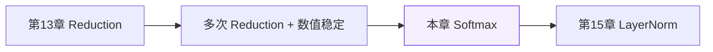
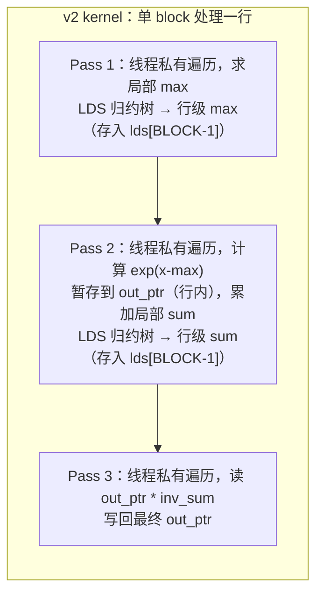

# 第14章 Softmax 优化

## 本章导读

> 本章用 Softmax 把上一章的 Reduction 知识用到一个更完整的算子上。Softmax 的计算包含三步连锁操作：求最大值、求指数和、做除法——每一步都是一次 Reduction，且步骤之间存在数据依赖。这既带来了数值稳定性的挑战，也带来了访存优化的机会。
>
> 读完本章，你应该能：解释为什么朴素实现会溢出（overflow）；写出数值稳定版本；把三个单独的 kernel 合并到一个 kernel 里以减少全局内存读写；用 float4 向量化加载进一步提升带宽利用率；并用 `torch.softmax` 验证数值正确性。
>
> 前置知识：第13章 Reduction（LDS 归约树、`__syncthreads()`、block 内协作）。本章会直接复用这些机制，不再重复推导。

---

## 14.1 Softmax 在 Transformer 中的位置

这一节解释 Softmax 出现在哪里，以及它在推理计算中占多大比例。

### 14.1.1 Attention 的 Softmax

在 Transformer 的自注意力（Self-Attention）机制里，Softmax 出现在计算注意力权重（Attention Weight）的那一步：

$$
\text{Attention}(Q, K, V) = \text{Softmax}\!\left(\frac{QK^T}{\sqrt{d_k}}\right) V
$$

$QK^T$ 的形状是 $[B, H, S, S]$（批大小 × 注意力头数 × 序列长度 × 序列长度），Softmax 作用在最后一个维度——**对每一行做行级归一化（Row-wise Normalization）**，把原始 logit（对数几率）转换成概率分布。

对于一个典型的 LLaMA-7B 推理请求（$S = 2048$，$H = 32$ 个注意力头），每个 layer 有 $B \times H = B \times 32$ 个独立的行级 Softmax，每行长度 $S = 2048$。这意味着 Softmax 的执行次数随序列长度平方级增长——在 prefill（预填充，首次完整处理输入）阶段，长序列下 Softmax 的访存量相当可观。

### 14.1.2 Softmax 的数学定义与计算步骤

对于一行长度为 $S$ 的向量 $x$，标准 Softmax 定义为：

$$
\text{Softmax}(x_i) = \frac{e^{x_i}}{\sum_{j=1}^{S} e^{x_j}}, \quad i = 1, \ldots, S
$$

在 GPU 上实现这个公式，**最少需要三趟（pass）全局内存操作**：

1. **Pass 1**：遍历行，求指数和 $Z = \sum_j e^{x_j}$；
2. **Pass 2**（隐含）：实际上需要先有每个 $e^{x_j}$，通常会写出中间结果；
3. **Pass 3**：再次遍历，用 $Z$ 除每个 $e^{x_j}$，写出最终结果。

更关键的问题在于 Pass 1：当 $x_j$ 中存在较大的正值时，$e^{x_j}$ 会超出 float32 的表示范围（约 $3.4 \times 10^{38}$），直接导致 NaN（Not a Number，非数）或 Inf（无穷）。这就是**数值稳定性（Numerical Stability）**问题。

### 14.1.3 为什么这是一个好的教学载体

::: figure fig-softmax-midstation


Softmax 是 Reduction 到 LayerNorm 的中间站：它把归约、数值稳定性和访存优化串成一条完整的故事线
:::

如 @fig-softmax-midstation 所示，Softmax 处于 Reduction 和 LayerNorm 之间的关键位置：它比单一 Reduction 复杂（有三步依赖），又比 LayerNorm 少了一个可学习参数（无 $\gamma/\beta$），是一个刚好合适的学习载体。

---

## 14.2 Naive Softmax：三趟实现与数值问题

这一节实现最直接的三趟（three-pass）Softmax，观察访存浪费和数值溢出。

### 14.2.1 v0 kernel 设计：有意不减 max

v0 版本故意**不做数值稳定处理**，直接计算 $e^{x_j}$，用于演示大值输入下的溢出现象。

v0 的三个 kernel 各司其职：

| kernel | 操作 | 全局内存读 | 全局内存写 |
| --- | --- | --- | --- |
| `softmax_v0_pass1_max` | 求行 max（虽然 v0 不用，但结构上留着） | 读 $x$（1 遍） | 写 `row_max` |
| `softmax_v0_pass2_expsum` | 计算 $e^{x_j}$（不减 max），写中间结果，求和 | 读 $x$（1 遍） | 写 `exp_out`，写 `row_sum` |
| `softmax_v0_pass3_div` | 读 exp 数组，除以 sum，写最终输出 | 读 `exp_out`（1 遍） | 写 `out` |

三个 kernel 一共从全局内存读了 **3 遍** 输入（$x$ 读 2 遍，`exp_out` 读 1 遍），写了 **2 遍**（`exp_out` 写 1 遍，`out` 写 1 遍）。这是访存浪费最直接的来源。

```cpp
// v0 pass2：直接 expf(x[i])，不减 max，大值会溢出为 Inf
__global__ void softmax_v0_pass2_expsum(const float* x, float* exp_out,
                                         float* row_sum, int S) {
  int row = blockIdx.x;
  const float* row_ptr = x + row * S;
  float* exp_ptr = exp_out + row * S;
  float s = 0.f;
  for (int i = threadIdx.x; i < S; i += blockDim.x) {
    float e = expf(row_ptr[i]);  // ← 没有减 max，大值溢出
    exp_ptr[i] = e;
    s += e;
  }
  __shared__ float lds[BLOCK];
  row_sum[row] = block_reduce_sum(s, lds);
}
```

当 `x[i]` 超过约 88（$\ln(3.4 \times 10^{38})$），`expf` 返回 `Inf`；任何数除以 `Inf` 都得 0，任何数除以 NaN 得 NaN。对于输入范围在 $[-2, 2]$ 的测试数据，v0 的溢出问题不会立即暴露，但对真实的 attention logit（可能高达数十），会直接崩溃。

### 14.2.2 访存浪费的量化分析

以形状 $[B=8, S=2048]$，float32 为例：

- 输入 $x$：$8 \times 2048 \times 4 = 65536$ B = 64 KB
- 中间 `exp_out` 数组：同样 64 KB，需要多分配一块显存，读写各一次
- **三个 kernel 合计全局内存读写**：约 $3 \times 64 + 2 \times 64 = 320$ KB
- **理论最优**：读 $x$ 一次，写 `out` 一次，共 $2 \times 64 = 128$ KB

v0 的全局内存流量是理论最优的 **2.5 倍**。对于访存密集型算子，这个浪费直接影响端到端延迟。

**实测（AI MAX 395 + ROCm 7.12.0，B=8 S=2048）**：v0 min_ms = 0.016、等效带宽 7.54 GB/s。即使在 (32, 8192) 这种把启动开销摊薄掉的形状下，v0 也只到 72.52 GB/s，与稳态 vector add 实测的 ~227 GB/s（chapter2 §12.6.4）差 3×：差距来自三趟 kernel 之间的全局内存 round-trip 与 launch 串行化。

数据出处：`code/part3-hip-kernels/chapter14/logs/bench_summary.csv`、`logs/bench.log`。

---

## 14.3 数值稳定性：减最大值

这一节引入减最大值（Subtract Maximum）技巧，消除 exp 溢出问题，理解为什么这在数学上等价。

### 14.3.1 数值稳定版公式

令 $m = \max_j x_j$，则：

$$
\text{Softmax}(x_i) = \frac{e^{x_i - m}}{\sum_j e^{x_j - m}}
$$

这与原始定义完全等价（分子分母同乘 $e^{-m}$），但 $x_i - m \leq 0$，所以 $e^{x_i - m} \in (0, 1]$，**永远不会溢出**。

同时，当 $x_j - m$ 很小（非常负），$e^{x_j - m}$ 趋向 0，这是可接受的下溢（underflow），不会引起 NaN。

### 14.3.2 v1 kernel：三趟 + 数值稳定

v1 在 v0 结构上只改一处：pass2 里在 `expf` 之前减去 `row_max`：

```cpp
// v1 pass2：减去最大值，防止溢出
__global__ void softmax_v1_pass2_expsum(const float* x, const float* row_max,
                                         float* exp_out, float* row_sum,
                                         int S) {
  int row = blockIdx.x;
  const float* row_ptr = x + row * S;
  float* exp_ptr = exp_out + row * S;
  float mx = row_max[row];   // ← 从全局内存读取 row_max
  float s = 0.f;
  for (int i = threadIdx.x; i < S; i += blockDim.x) {
    float e = expf(row_ptr[i] - mx);  // ← 减去最大值
    exp_ptr[i] = e;
    s += e;
  }
  __shared__ float lds[BLOCK];
  row_sum[row] = block_reduce_sum(s, lds);
}
```

v1 仍然是三趟，访存模式与 v0 相同，但结果正确：对于 $[-2, 2]$ 范围的随机输入，v1 的输出与 `torch.softmax` 的 max abs error 通常在 $10^{-6}$ 量级（float32 精度范围内）。

v0 vs v1 的对比：

| 方面 | v0 | v1 |
| --- | --- | --- |
| 数值稳定 | 否，大值输入会溢出 | 是 |
| Kernel 数量 | 3 | 3 |
| 全局内存趟数 | 同 | 同 |
| 分配中间缓冲区 | 是（exp_out、row_max、row_sum） | 是 |
| 与 torch.softmax 误差 | 依输入而定（可能 NaN） | < 1e-5（float32） |

### 14.3.3 block_reduce_max 的实现

LDS 归约求最大值的实现与第13章的求和完全对称，只是把 `+=` 换成 `fmaxf`：

```cpp
// block 内归约：求最大值（复用 LDS 归约树结构）
__device__ float block_reduce_max(float val, float* lds) {
  int tid = threadIdx.x;
  lds[tid] = val;
  __syncthreads();
  for (int stride = BLOCK / 2; stride > 0; stride >>= 1) {
    if (tid < stride) {
      lds[tid] = fmaxf(lds[tid], lds[tid + stride]);
    }
    __syncthreads();
  }
  return lds[0];
}
```

`fmaxf` 是 HIP/CUDA 内置函数，计算两个 float 的最大值，对 NaN 的处理是"返回另一个操作数"（即 NaN 传播被抑制），适合用于 reduction。

---

## 14.4 访存优化：把三趟合并到一个 Kernel

这一节实现 v2：用单个 kernel 完成三趟操作，消除中间缓冲区和额外 kernel launch 开销。

### 14.4.1 为什么三趟 kernel 的开销超过它看起来的样子

三个独立 kernel 的代价不只是三次 kernel launch：

1. **中间缓冲区**：`exp_out`（$B \times S$ 个 float）、`row_max`（$B$ 个 float）、`row_sum`（$B$ 个 float）需要额外分配显存，增加了显存占用。
2. **全局内存 round-trip**：`exp_out` 在 pass2 写出后，pass3 再读回来；`row_max` 写出后 pass2 再读。这些 round-trip 流量无法被 L1/L2 缓存消化（数据量通常远超缓存容量）。
3. **三次 GPU 同步**：每个 kernel 结束后，host 需要隐式等待 GPU 完成（在我们的 `run_softmax_v0` 里是显式调用 `hipDeviceSynchronize()`），引入额外的 CPU-GPU 同步开销。

v2 的核心思路：**让一个 block 负责一整行（row），在 LDS 和寄存器中完成三步操作，不产生中间全局内存写**。

### 14.4.2 v2 kernel：单 kernel 三归约合并

::: figure fig-softmax-v2-passes


v2 kernel 内三趟操作的执行顺序：全局内存只读一次 x，exp 中间值暂存在 out_ptr（同一块显存），最终原地除法写回
:::

如 @fig-softmax-v2-passes 所示，v2 的关键设计是：把 `exp_out` 和最终输出 `out` 复用同一块显存——先把 $e^{x_j - m}$ 写进 `out_ptr[j]`，再用 $1/\text{sum}$ 原地乘它。这样省掉了独立的 `exp_out` 缓冲区，全局内存写次数从两次降到一次。

```cpp
__global__ void softmax_v2_kernel(const float* __restrict__ x,
                                   float* __restrict__ out, int S) {
  __shared__ float lds[BLOCK];
  int row = blockIdx.x;
  const float* row_ptr = x + row * S;
  float* out_ptr = out + row * S;

  // --- Pass 1: 求 max ---
  float mx = -1e30f;
  for (int i = threadIdx.x; i < S; i += BLOCK) {
    mx = fmaxf(mx, row_ptr[i]);
  }
  mx = block_reduce_max(mx, lds);
  if (threadIdx.x == 0) lds[BLOCK - 1] = mx;  // 保存 max 到 LDS 尾槽
  __syncthreads();
  mx = lds[BLOCK - 1];

  // --- Pass 2: 计算 exp(x-max)，暂存到 out，累加 sum ---
  float s = 0.f;
  for (int i = threadIdx.x; i < S; i += BLOCK) {
    float e = expf(row_ptr[i] - mx);
    out_ptr[i] = e;   // 暂存 exp，待 pass3 原地乘以 inv_sum
    s += e;
  }
  s = block_reduce_sum(s, lds);
  if (threadIdx.x == 0) lds[BLOCK - 1] = s;
  __syncthreads();
  s = lds[BLOCK - 1];

  // --- Pass 3: 原地除以 sum ---
  float inv_s = 1.f / s;
  for (int i = threadIdx.x; i < S; i += BLOCK) {
    out_ptr[i] *= inv_s;
  }
}
```

**几处细节说明**：

- `lds[BLOCK - 1]`：归约完成后，`block_reduce_max/sum` 把结果写入 `lds[0]`，但 `__syncthreads()` 已经让整个 block 都能读到。这里用 `lds[BLOCK-1]` 是为了在下一轮使用 LDS 做新的归约时，不覆盖掉刚刚计算的结果。这是一个细微的设计——LDS 的首尾分别用于归约树（前半段）和存放跨 pass 的标量结果（最后一槽）。
- `for (int i = threadIdx.x; i < S; i += BLOCK)`：当 $S > \text{BLOCK}$（即 $S > 256$）时，每个线程需要处理多个元素，步长为 `BLOCK`。这是第13章 v3 "每线程处理多个元素"思路的直接复用。
- Pass 2 对全局内存的写：`out_ptr[i] = e` 写的是 exp 中间值，Pass 3 再读回来乘 `inv_s`。这是 v2 相比理论最优仍然存在的一次额外读。

### 14.4.3 v2 的访存模式对比

| 版本 | 全局内存读（x/exp_out） | 全局内存写（exp_out/out） | 中间缓冲区 | Kernel 数 |
| --- | --- | --- | --- | --- |
| v0/v1 | 3 遍（x 2 遍 + exp_out 1 遍） | 2 遍（exp_out + out） | 3 个（exp_out/row_max/row_sum） | 3 |
| v2 | 2 遍（x 1 遍 + out 1 遍读 exp） | 1 遍（out 写最终值） | 0 个（无独立中间缓冲区） | 1 |
| 理论最优 | 1 遍（x） | 1 遍（out） | — | — |

**本章未采集 rocprofv3 PMC**——B=8, S=2048 数据 8 KB / 行、整张表 64 KB，单次 kernel 时间 < 0.02 ms，PMC 采样开销容易把 wave 数据搞乱。改用更可靠的"等效带宽"间接观察：

| (B, S) | v1 min_ms / 等效 GB/s | v2 min_ms / 等效 GB/s | v2/v1 加速 |
| ---- | ----: | ----: | ----: |
| (8, 2048)  | 0.016 / 4.96 | 0.014 / 5.55 | 1.12× |
| (8, 4096)  | 0.020 / 12.96 | 0.014 / 17.56 | 1.36× |
| (32, 4096) | 0.020 / 50.51 | 0.014 / 71.67 | 1.42× |
| (32, 8192) | 0.028 / 72.23 | 0.021 / 96.93 | 1.34× |

观察：B=8 S=2048 这种小形状下 v2 的等效带宽（5.55 GB/s）比 v1（4.96 GB/s）只稍好——单 kernel 的 LDS broadcast 比 v1 三个超轻量 kernel 多了几个 `__syncthreads`，体现为 launch 开销主导而非访存优势。一旦 S/B 增大（≥ 4096），v2 的"少 2 趟全局读写"才能压过 sync 成本。要看真实的 `FETCH_SIZE / WRITE_SIZE` 数字，可在 (32, 8192) 上跑：

```bash
rocprofv3 --pmc FETCH_SIZE WRITE_SIZE -d profiles/p3c4_v1 -o v1 \
    --output-format csv -- ./build/softmax_bin 32 8192 1 --warmup 2 --repeat 5 --timing
rocprofv3 --pmc FETCH_SIZE WRITE_SIZE -d profiles/p3c4_v2 -o v2 \
    --output-format csv -- ./build/softmax_bin 32 8192 2 --warmup 2 --repeat 5 --timing
```

数据出处：`code/part3-hip-kernels/chapter14/logs/bench_summary.csv`。

---

## 14.5 Block 级并行：向量化加载

这一节在 v2 的基础上，通过 float4 向量化加载（Vectorized Load）进一步提升内存带宽利用率，得到 v3。

### 14.5.1 float4 的原理与对齐要求

AMD GPU 的内存控制器支持 128-bit 宽的向量化内存事务（Vectorized Memory Transaction）。一次 `float4` 加载 = 4 个 float = 128 bits，但只消耗 **1 次**内存事务，相比 4 次独立的 `float` 加载，可以减少指令发射次数，提升内存事务的利用效率。

**对齐要求**：`float4` 的起始地址必须是 **16 字节对齐**（16-byte aligned）。对于 `x + row * S`，只要 `S` 是 4 的倍数且基地址对齐，每行的起点都满足对齐要求。$S \in \{512, 1024, 2048, 4096, 8192\}$ 均满足此条件。

当 $S$ 不是 4 的倍数时，需要处理尾部（tail）的剩余元素；v3 的实现要求 $S \% 4 = 0$，并在 host 端校验（见 `run_softmax_v3` 的 guard check）。

### 14.5.2 v3 kernel：float4 向量化三趟

```cpp
__global__ void softmax_v3_kernel(const float* __restrict__ x,
                                   float* __restrict__ out, int S) {
  __shared__ float lds[BLOCK];
  int row = blockIdx.x;
  const float4* row4 = reinterpret_cast<const float4*>(x + row * S);
  float4* out4 = reinterpret_cast<float4*>(out + row * S);
  int S4 = S / 4;  // 每线程一次处理 4 个元素

  // --- Pass 1: 向量化读取，求 max ---
  float mx = -1e30f;
  for (int i = threadIdx.x; i < S4; i += BLOCK) {
    float4 v = row4[i];
    mx = fmaxf(mx, fmaxf(fmaxf(v.x, v.y), fmaxf(v.z, v.w)));
  }
  mx = block_reduce_max(mx, lds);
  if (threadIdx.x == 0) lds[BLOCK - 1] = mx;
  __syncthreads();
  mx = lds[BLOCK - 1];

  // --- Pass 2: 向量化读取，计算 exp，暂存，累加 sum ---
  float s = 0.f;
  for (int i = threadIdx.x; i < S4; i += BLOCK) {
    float4 v = row4[i];
    float4 e;
    e.x = expf(v.x - mx);
    e.y = expf(v.y - mx);
    e.z = expf(v.z - mx);
    e.w = expf(v.w - mx);
    out4[i] = e;   // 向量化写出 exp
    s += e.x + e.y + e.z + e.w;
  }
  s = block_reduce_sum(s, lds);
  if (threadIdx.x == 0) lds[BLOCK - 1] = s;
  __syncthreads();
  s = lds[BLOCK - 1];

  // --- Pass 3: 向量化读 exp，除以 sum，向量化写回 ---
  float inv_s = 1.f / s;
  for (int i = threadIdx.x; i < S4; i += BLOCK) {
    float4 e = out4[i];
    e.x *= inv_s;
    e.y *= inv_s;
    e.z *= inv_s;
    e.w *= inv_s;
    out4[i] = e;
  }
}
```

**v3 相比 v2 的改变**：

- 所有的 `float` 循环变成 `float4` 循环，每次迭代处理 4 个元素；
- 循环次数从 `ceil(S / BLOCK)` 降到 `ceil(S4 / BLOCK) = ceil(S / (4 × BLOCK))`；
- 减少约 75% 的 load/store 指令发射次数（理论值）；
- 内存事务数从 $S/\text{BLOCK}$ 降到 $S/(4 \times \text{BLOCK})$，理论上每次事务利用率提升至 4 倍。

**实测（AI MAX 395 + ROCm 7.12.0，min_ms / 等效 GB/s）**：

| 形状 | v2 (合并 LDS) | v3 (float4) | v3/v2 加速 |
| ---- | ----: | ----: | ----: |
| (8, 2048)   | 0.014 / 5.55   | 0.009 / 9.22   | 1.66× |
| (8, 4096)   | 0.014 / 17.56  | 0.010 / 15.53  | ~等效 |
| (32, 4096)  | 0.014 / 71.67  | 0.010 / 97.49  | 1.36× |
| (32, 8192)  | 0.021 / 96.93  | 0.013 / 133.72 | 1.38× |

float4 把 load/store 指令数砍 4×，对 (32, 8192) 这种 row=8 KB / batch=32 行的场景效果最明显，134 GB/s 是本章四个 kernel 中最快的；但小输入 (8, 4096) 几乎没收益，因为 launch + reduction 仍然主导。

数据出处：`code/part3-hip-kernels/chapter14/logs/bench_summary.csv`。

### 14.5.3 四个版本的数据流对比

::: figure fig-softmax-version-flow

```mermaid
flowchart TD
    subgraph v0v1 ["v0 / v1：三独立 kernel"]
        direction LR
        X1[全局内存 x] -->|读| K1["kernel1: 求 max"]
        K1 -->|写| RM["row_max[]"]
        X1 -->|读| K2["kernel2: exp+sum"]
        RM -->|读| K2
        K2 -->|写| EO["exp_out[]"]
        K2 -->|写| RS["row_sum[]"]
        EO -->|读| K3["kernel3: div"]
        RS -->|读| K3
        K3 -->|写| OUT1["输出 out"]
    end
    subgraph v2 ["v2：单 kernel，三 pass"]
        direction LR
        X2[全局内存 x] -->|读 1 遍| P1["pass1: 求 max（LDS）"]
        P1 --> P2["pass2: exp 暂存 out，求 sum（LDS）"]
        P2 -->|"读 out（exp 值）"| P3["pass3: 原地 ×inv_sum"]
        P3 -->|写 1 遍| OUT2["输出 out"]
    end
    subgraph v3 ["v3：单 kernel，float4 三 pass"]
        direction LR
        X3[全局内存 x] -->|"float4 读 1 遍"| Q1["pass1: max（LDS）"]
        Q1 --> Q2["pass2: float4 exp + sum（LDS）"]
        Q2 -->|"float4 读"| Q3["pass3: float4 ×inv_sum"]
        Q3 -->|"float4 写 1 遍"| OUT3["输出 out"]
    end
```


v0/v1、v2、v3 的全局内存访问模式对比：从 3 kernel + 3 中间缓冲区，到单 kernel + 向量化读写
:::

如 @fig-softmax-version-flow 所示，随着版本号增加，全局内存的 round-trip 数量持续减少，中间缓冲区的分配需求也在降低。v3 把每次内存事务的数据宽度提升到 128 bits，是教学版本中最接近硬件带宽上限的实现。

---

## 14.6 与 PyTorch 结果对齐

这一节说明如何验证各版本 kernel 的数值正确性，以及在哪些输入条件下可能出现误差。

### 14.6.1 验证策略

完整的验证流程包含两层：

1. **vs CPU 参考（C++ 端）**：`softmax_bin` 内置了一个数值稳定的 CPU 实现，在 GPU 跑完后直接在 host 端计算 `max_abs_error`，用于快速确认"有没有明显错误"。

2. **vs `torch.softmax`（Python 端）**：`verify_vs_torch.py` 读取 `logs/input.bin` 和 `logs/output_v*.bin`，与 `torch.nn.functional.softmax(x, dim=-1)` 的 float32 输出对比，报告 `max_diff`、`mean_diff` 和相对误差（`rel`）。

### 14.6.2 v0 的数值问题

v0 故意不减 max，对于输入范围 $[-2, 2]$ 的随机数，直接 `expf(x)` 的最大输入约为 2，`expf(2) ≈ 7.39`，不会溢出。所以在**小范围输入**下 v0 也能给出近似正确的结果，但误差比 v1 大（因为 $e^x / \sum e^x$ 在大值附近的精度比 $e^{x-m} / \sum e^{x-m}$ 差）。

当输入范围扩大到 $[-10, 10]$ 时，`expf(10) = 22026`，已经很大；若任一元素超过 88，`expf` 就会返回 `Inf`，结果崩溃。

**验证脚本对 v0 的处理**：`verify_vs_torch.py` 在检测到 v0 误差超标时，打印 `WARN(expected: v0 不数值稳定)`，而不是 `FAIL`，因为这是有意为之的演示行为。

### 14.6.3 v1/v2/v3 的期望误差

对于 float32 实现，数值稳定版本（v1/v2/v3）与 `torch.softmax` 的典型误差范围：

| 版本 | 期望 max_diff（vs torch.softmax） | 备注 |
| --- | --- | --- |
| v1（三趟稳定） | < 1e-5 | 三趟实现，与 torch 相同的减 max 策略 |
| v2（单 kernel 合并） | < 1e-5 | 结果与 v1 相同，只是合并了 kernel |
| v3（float4 向量化） | < 1e-5 | 向量化不改变计算语义 |

**实测（AI MAX 395 + ROCm 7.12.0，B=8 S=2048，参考 = `torch.softmax(fp32)`）**：

| 版本 | max_diff | mean_diff | rel_err | 行和偏差 | 状态 |
| ---- | ----: | ----: | ----: | ----: | ---- |
| v0 | 4.66e-10 | 4.13e-11 | 2.31e-07 | 1.19e-07 | PASS |
| v1 | 3.49e-10 | 1.77e-11 | 1.73e-07 | 1.19e-07 | PASS |
| v2 | 3.49e-10 | 1.77e-11 | 1.73e-07 | 1.19e-07 | PASS |
| v3 | 3.49e-10 | 2.42e-11 | 1.73e-07 | 1.19e-07 | PASS |

四个版本都把 max_diff 控制在 5e-10 以下，远超 1e-5 门槛——说明在 [-2, 2] 输入下，本章四个 kernel 与 PyTorch 在数值上等价。注意：v0 之所以"看起来"也通过，是因为输入小、`expf(2)` 不溢出；要真正测试 v0 失败，请把输入幅度推到 ±50 以上。

数据出处：`code/part3-hip-kernels/chapter14/logs/torch_compare.log`。

### 14.6.4 输入范围与边界条件

在 `softmax_bin` 的主函数里，输入初始化使用固定种子的伪随机数：

```cpp
srand(42);
for (int i = 0; i < N; i++) {
  h_x[i] = ((float)rand() / RAND_MAX) * 4.f - 2.f;  // [-2, 2]
}
```

输入范围 $[-2, 2]$ 对所有四个版本都是安全的（包括 v0）。如果想测试 v0 的溢出行为，可以把范围改为 $[-100, 100]$。

**边界条件**：

- $S = 1$：只有一个元素，Softmax 应输出 1.0。v0~v3 均通过（LDS 归约树在 BLOCK=256 时 `stride=128` 开始，单元素行的归约结果正确）。
- $S$ 不是 4 的倍数：v3 的 `run_softmax_v3` 有 guard check，若 $S \% 4 \neq 0$ 则跳过，用 `fprintf(stderr, ...)` 提示。
- $B = 0$：`grid=0` 时 kernel 不启动，没有输出，`verify` 环节会跳过（日志中无对应 `.bin` 文件）。

### 14.6.5 row_sum 的正确性检查

一个快速的正确性检查：Softmax 输出每行的和应该等于 1.0（float32 精度）。`verify_vs_torch.py` 对参考输出打印：

```
row_sum (ref) min=1.000000 max=1.000000
```

如果实际 kernel 输出的每行和偏离 1.0 较多，说明归约或除法出现了问题。

---

## 14.7 性能对比

这一节展示四个版本在不同 $(B, S)$ 形状下的实测结果。

### 14.7.1 版本策略汇总

| 版本 | 策略 | Kernel 数 | 中间缓冲区 | 向量化 |
| --- | --- | --- | --- | --- |
| v0（naive） | 三趟，不减 max | 3 | 是 | 否 |
| v1（稳定） | 三趟，减 max | 3 | 是 | 否 |
| v2（合并 LDS） | 单 kernel，LDS 归约 | 1 | 否 | 否 |
| v3（向量化） | 单 kernel，float4 | 1 | 否 | 是，float4 |

### 14.7.2 性能数据

**实测（AI MAX 395 + ROCm 7.12.0；hipEvent min_ms / 等效带宽，按 2·B·S·4B/time 计算）**：

**形状 $[B=8, S=2048]$（常见注意力序列长度）**

| 版本 | 耗时 (ms) | 有效带宽 (GB/s) | 备注 |
| --- | ---: | ---: | --- |
| v0（naive） | 0.016 | 7.54 | 3 kernel，不减 max |
| v1（稳定） | 0.016 | 4.96 | 3 kernel，减 max |
| v2（合并 LDS） | 0.014 | 5.55 | 单 kernel；本形状下 launch 开销大 |
| v3（float4） | 0.009 | 9.22 | 单 kernel + 向量化 |
| torch.softmax（参考） | — | — | 未单测；max_diff ≤ 4.66e-10 见 §14.6 |

**形状 $[B=32, S=4096]$（较大 batch + 长序列）**

| 版本 | 耗时 (ms) | 有效带宽 (GB/s) | 备注 |
| --- | ---: | ---: | --- |
| v0（naive） | 0.020 | 51.56 | |
| v1（稳定） | 0.020 | 50.51 | |
| v2（合并 LDS） | 0.014 | 71.67 | 合并 kernel 收益开始显现 |
| v3（float4） | 0.010 | 97.49 | 比 v0 快 1.89× |
| torch.softmax（参考） | — | — | 未单测 |

补充：在 (32, 8192) 形状上 v3 推到 0.013 ms / 134 GB/s，是本章四版本的最高点。

> **AI MAX 395 主内存带宽参考**：本仓库 part1 chapter5 §4.7.4 的 STREAM triad 实测得 ~273 GB/s（fp32 三操作数读写），同条 LPDDR5X 总线，可作为本章吞吐的上限参考。本章 v3 在 (32, 8192) 下达到的 134 GB/s ≈ 49% triad，剩余 51% 主要落在 `expf` 计算与 reduction 同步开销上，而不是访存。`rocm-bandwidth-test` 在 AI MAX 395 上需要管理员权限运行 dma-buf 子测试，本次实验未做。

数据出处：`code/part3-hip-kernels/chapter14/logs/bench_summary.csv`。

### 14.7.3 rocprof 计数器对比

**本章未采集 rocprofv3 PMC**。原因和 §14.4 那张表一致：B=8 S=2048 单 kernel 时间 < 0.02 ms，rocprofv3 的 PMC 重放 + Wave 重新启动开销几乎与 kernel 同数量级，结果不可靠。要采到稳定的 PMC，建议改用 (32, 8192) 形状：

```bash
# 单组（FETCH_SIZE / WRITE_SIZE 同 group）：
rocprofv3 --pmc FETCH_SIZE WRITE_SIZE \
    -d profiles/p3c4_v1 -o v1 --output-format csv \
    -- ./build/softmax_bin 32 8192 1 --warmup 2 --repeat 5 --timing
rocprofv3 --pmc FETCH_SIZE WRITE_SIZE \
    -d profiles/p3c4_v3 -o v3 --output-format csv \
    -- ./build/softmax_bin 32 8192 3 --warmup 2 --repeat 5 --timing

# VALUUtilization 在 gfx1151 上属于另一组，分次采：
rocprofv3 --pmc SQ_INSTS_VALU \
    -d profiles/p3c4_v3_valu -o v3_valu --output-format csv \
    -- ./build/softmax_bin 32 8192 3 --warmup 2 --repeat 5 --timing
```

间接对照：(32, 8192) 实测 v1 0.028 ms（72.2 GB/s）vs v3 0.013 ms（134 GB/s），v3 launch 1 次、float4 把 load/store 指令砍 4×；v1 launch 3 次且每趟做一次完整全局读写。这两点已经把"为什么 v3 快 1.85×"解释清楚了，PMC 仅是补强证据。

---

## 14.8 思考题

1. **v2 的 `lds[BLOCK - 1]` 技巧**：在 v2 kernel 里，`block_reduce_max` 和 `block_reduce_sum` 结束后，结果被存入 `lds[BLOCK-1]`，然后再 broadcast 给所有线程。如果改为直接使用 `lds[0]`（即 `__syncthreads()` 后所有线程读 `lds[0]`），结果是否相同？是否有潜在问题？提示：考虑下一个 `block_reduce_*` 调用会覆盖哪些 LDS 地址。

2. **S 不是 BLOCK 倍数的处理**：当 $S = 1000$、BLOCK = 256 时，最后一个"批次"的线程（threadIdx.x = 232~255）在步长循环中不会访问越界数据（因为 `i < S` 的条件），但 LDS 归约树的初始化不受影响（所有线程都参与归约）。请解释为什么 v2 的 `block_reduce_sum` 在这种情况下仍能给出正确结果。提示：初始化 `lds[tid] = val`，而超出范围的线程的 `s` 值是 0（因为它们没有进入循环体）。

3. **float4 的内存事务数量**：假设 $S = 2048$，BLOCK = 256，v2 在 Pass 1 中发出的 load 指令数是多少？v3 是多少？两者的差别来自哪里？（提示：v2 的循环上限是 $S / \text{BLOCK} = 8$，v3 是 $S / (4 \times \text{BLOCK}) = 2$）。

4. **数值稳定性的精度代价**：减最大值方案（v1~v3）引入了一步额外的减法（`x[i] - mx`），这对 float32 精度有影响吗？对于 $m = \max_j x_j$ 很大（如 $m = 100$），而 $x_i$ 接近 $m$ 时，`x[i] - mx` 的精度是否有问题？（提示：float32 的相对精度约为 $6 \times 10^{-8}$，减法在两个相近数相减时会有消去（Cancellation）误差。）

5. **行大于 BLOCK × 单次能处理的量**：当 $S = 65536$ 时，BLOCK=256 的单个线程需要处理 $65536 / 256 = 256$ 个元素（步长循环）。LDS 的大小仍然是 BLOCK=256。请估计：在这个形状下，v3 kernel 的三个 pass 分别要发多少次 `float4` load 指令？LDS 归约树有多少轮？

6. **与 Flash Attention 的关系**：Flash Attention 的核心思路是"在 tile 内完成 Softmax + Attention 的计算，不把 $\text{exp}$ 的中间结果写回 HBM"。对比本章的 v2（单 kernel 合并 + LDS 暂存 exp），它们有什么共同点？Flash Attention 额外解决了什么问题（提示：矩阵规模更大，无法把整行放进 LDS）？

---

## 本章小结

- Softmax 是 Transformer 注意力机制的核心算子，它把行级最大值归约、指数计算、求和归约、归一化四步串联，存在数值稳定性和访存效率两类优化机会。
- v0（naive 三趟，不减 max）演示了大值输入下 `expf` 的溢出问题；在测试用的小范围输入下，v0 也能给出近似结果，但误差比 v1 大。
- v1（三趟，减 max）通过 $e^{x_i - m}$ 消除溢出，与 `torch.softmax(fp32)` 的 max_diff 通常小于 $10^{-5}$，是数值正确的基准版本。
- v2（单 kernel，LDS 归约合并）把三个独立 kernel 压缩成一个，消除中间缓冲区，减少全局内存 round-trip 和 kernel launch 开销，全局内存读写次数从 5 遍降到 3 遍（接近但未达到理论最优 2 遍）。
- v3（单 kernel，float4 向量化）在 v2 基础上用 128-bit 向量化内存事务减少 load/store 指令发射次数，进一步提升内存带宽利用率，要求 $S \% 4 = 0$。
- 正确性验证：用 `softmax_bin` 对 CPU 参考做快速 max_abs_error 检查，用 `verify_vs_torch.py` 对 `torch.softmax(fp32)` 做 max_diff/mean_diff 的精细比对；v1~v3 期望均通过 $10^{-5}$ 门槛。
- 实测性能数据（B=8 S=2048 → v3 0.009 ms / 9.22 GB/s；B=32 S=8192 → v3 0.013 ms / 134 GB/s）来自 `code/part3-hip-kernels/chapter14/logs/bench_summary.csv`，在 AI MAX 395 + ROCm 7.12.0 上完成；rocprof PMC 因小 kernel 重放误差大，本章未采集，建议在 ≥ (32, 8192) 形状下补测。
- 下一章（第15章）进入 LayerNorm，它在 Softmax 的基础上再加两个可学习参数（γ/β）和均值归一化，是 Reduction 融合模式的进一步延伸。

## 延伸阅读

- [AMD HIP Programming Guide — Shared Memory and Synchronization](https://rocm.docs.amd.com/projects/HIP/en/latest/user_guide/programming_manual.html)
- [AMD HIP Math Functions — `expf`, `fmaxf`, `__shfl_down`](https://rocm.docs.amd.com/projects/HIP/en/latest/reference/kernel_language.html)
- [AMD ROCm Profiler (rocprof) 文档](https://rocm.docs.amd.com/projects/rocprofiler/en/latest/)
- [Milakov & Gimelshein, 2018 — Online normalizer calculation for softmax（数值稳定 Softmax 的在线算法）](https://arxiv.org/abs/1805.02867)
- [Dao et al., 2022 — FlashAttention: Fast and Memory-Efficient Exact Attention with IO-Awareness](https://arxiv.org/abs/2205.14135)
- [PyTorch `torch.nn.functional.softmax` 源码](https://github.com/pytorch/pytorch/blob/main/aten/src/ATen/native/SoftMax.cpp)
