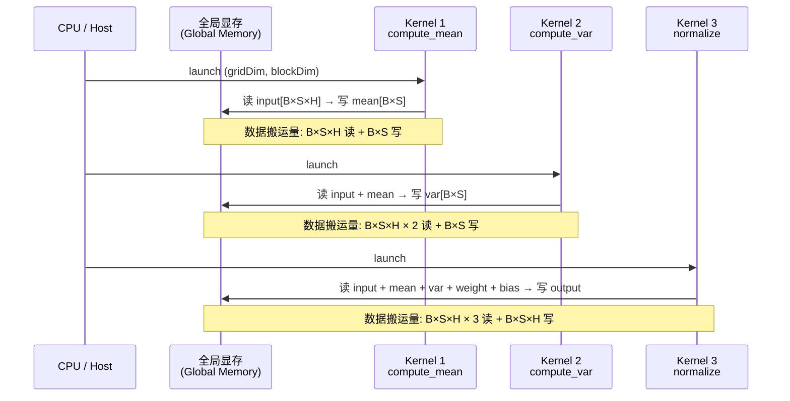
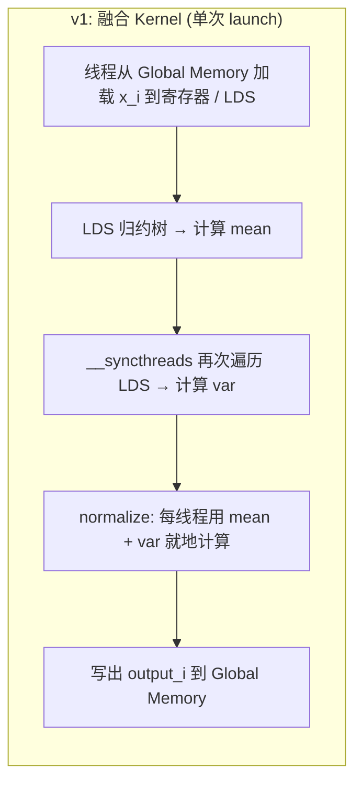

# 第15章 LayerNorm 优化

## 本章导读

> 本章用 LayerNorm（层归一化）继续深化对 Reduction 的理解，并在此基础上引入两个在实际推理场景中常见的优化方向：**Kernel 融合（Kernel Fusion）** 与 **向量化读写（Vectorized Load/Store）**。读完后，你应该能解释：为什么把均值计算、方差计算和归一化写成一个 kernel 通常比三步分开更快；以及 float4 对齐加载在什么情况下能有效提升带宽利用率。
>
> 前置知识：第13章 Reduction（LDS、归约树、wavefront shuffle）；第14章 Softmax（数值稳定性、行级并行的访存模型）。本章会引用这两章的结论，不重复推导。

---

## 15.1 LayerNorm 原理

这一节快速回顾 LayerNorm 的数学定义，并把它分解成 GPU 上可映射的几个计算步骤。

### 15.1.1 数学定义

给定一个形状为 $[B, S, H]$ 的张量（Batch × Sequence × Hidden），LayerNorm 在最后一个维度 $H$ 上做归一化：

$$
\text{LayerNorm}(x_i) = \gamma \cdot \frac{x_i - \mu}{\sqrt{\sigma^2 + \epsilon}} + \beta
$$

其中：

- $\mu = \frac{1}{H} \sum_{i=1}^{H} x_i$（均值，mean）
- $\sigma^2 = \frac{1}{H} \sum_{i=1}^{H} (x_i - \mu)^2$（方差，variance）
- $\gamma, \beta \in \mathbb{R}^H$：可学习的缩放（scale）与平移（shift）参数，对应 `torch.nn.LayerNorm` 的 `weight` 和 `bias`
- $\epsilon$：数值稳定项（Numerical Stability），通常取 $10^{-5}$

这个公式看起来很简单，但在 GPU 上直接"翻译"它会带来明显的性能问题——原因在于每个独立的操作（求均值、求方差、做归一化）都需要一次完整地遍历 $H$ 个元素。

### 15.1.2 LayerNorm 在模型中的位置

LayerNorm 大量出现在 Transformer 的每个注意力层和前馈层的前后：

- **BERT**：hidden_size $H = 768$，序列长度 $S = 128 \sim 512$；
- **GPT-2 / LLaMA-7B**：$H = 4096$；
- **LLaMA-70B**：$H = 8192$。

注意每次 LayerNorm 的归约维度是 $H$，而 $B \times S$ 这个维度可以并行处理——这正是我们把 `[B, S]` 摊平成 batch 维度，每个 GPU block 或 wavefront 负责一行（row）的经典分配方式。

### 15.1.3 两种主流变体

| 变体 | 公式差异 | 典型使用 |
| --- | --- | --- |
| **LayerNorm** | 减均值，除方差，再 γ/β | BERT、GPT 系列 |
| **RMSNorm** | 只除 RMS（不减均值），只 γ | LLaMA 系列 |

本章聚焦 LayerNorm（完整的均值 + 方差两步 reduction）；RMSNorm 去掉均值计算，作为思考题留给读者。

---

## 15.2 均值与方差计算：两个 Reduction 的 GPU 执行分析

这一节把 LayerNorm 的计算步骤映射到 GPU 执行模型（Execution Model）上，分析朴素实现的性能瓶颈。

### 15.2.1 三步分离的执行时序

把 LayerNorm 直接拆成三次独立的 GPU 操作：

::: figure fig-ln-three-pass


三步分离方案的 kernel launch 时序与全局内存搬运量
:::

如 @fig-ln-three-pass 所示，三步分离的方案存在两个主要代价：

1. **三次 kernel launch 开销**：每次 launch 都有固定的 CPU→GPU 调度延迟（通常在数微秒到几十微秒量级）。对于短序列或小批量，launch 开销占比不可忽略。

2. **中间结果反复进出全局内存**：`mean` 和 `var` 被计算出来后写回显存，下一步再读回来。对于 $B \times S$ 个 row、每 row 长度 $H$ 的计算，总的全局内存读写量远大于理论下界。

以 BERT 的典型形状 $[B{=}32, S{=}128, H{=}768]$ 为例，如果 float32：

- Kernel 1 读：$32 \times 128 \times 768 \times 4 = 12.6\ \text{MB}$，写：$32 \times 128 \times 4 = 0.016\ \text{MB}$
- Kernel 2 读：约 $25.2\ \text{MB}$（input + mean），写 $0.016\ \text{MB}$
- Kernel 3 读：约 $38.0\ \text{MB}$（input + mean + var + weight + bias），写 $12.6\ \text{MB}$
- **合计全局内存流量**：约 $88.4\ \text{MB}$（理论最优约 $25\ \text{MB}$）

**实测（AI MAX 395 + ROCm 7.12.0，B=32, S=128, H=768，warmup=3, repeat=20）**：v0 三个 kernel 累计耗时 0.1966 ms（等效带宽 127.99 GB/s）。rocprof v3 stats（同形状 3 次调用）显示三个 kernel 的 GPU 时间占比为 `ln_v0_norm` 41.2%、`ln_v0_mean` 31.9%、`ln_v0_var` 26.7%，确认三步均参与且无单一热点。FetchSize/WriteSize 等字节级 PMC 已在 §15.5.4 用 (B=32, S=128, H=4096) 形状补采集，详见下文表格。

### 15.2.2 Reduction 的局部性分析

回忆第13章的结论：当 $H$ 足够大（如 4096），可以配置 blockDim=1024，让整个 block 在 LDS 内完成归约，最终只需一次全局原子操作或直接写出；当 $H$ 较小（如 768），blockDim 通常设为不超过 $H$ 的 2 的幂次（如 512 或 256），多余的线程用 0 填充。

LayerNorm 的关键访存特征：**每行的数据只在本 block 内使用**，不同行之间完全独立。这意味着：

- 一个 block 负责一行（或一个 `[S, H]` 中的一个位置）；
- 同一 block 内的线程协作完成 mean + var + normalize，三步可以在 LDS 里"一次性"完成；
- 行间完全无数据依赖，grid 可以任意大（$B \times S$ 个 block）。

这正是 kernel 融合可行的根本原因。

---

## 15.3 Reduction + Normalize 融合

这一节介绍如何把均值计算、方差计算和归一化三步合并到一个 kernel 里，消除中间数据写回和额外 launch 开销。

### 15.3.1 融合的执行流程

::: figure fig-ln-fused


融合 kernel 内的执行顺序：一次 load，LDS 中完成 mean+var，原地 normalize 写出
:::

如 @fig-ln-fused 所示，融合的关键是：**数据只从全局内存读一次**（load 到 LDS 或寄存器），mean 和 var 的计算完全在 LDS + 寄存器中进行，最后一步 normalize 用寄存器值直接写出结果。全局内存只被写一次。

理论数据搬运量（$B \times S$ 行，每行 $H$ 个 float）：
- 读：$1 \times H \times 4\ \text{B}$（input）+ weight + bias（$2H$ 个参数，可缓存）
- 写：$1 \times H \times 4\ \text{B}$（output）

相比三步分离的 $\approx 3.5\times$ 读放大，融合版本将全局内存流量压缩到理论下界。

### 15.3.2 v1 Fused Kernel 核心代码

以下是 `layernorm.hip` 中 v1 融合 kernel 的核心实现。每个 block 处理 input 的一行（一个 `[H]` 向量）。

```cpp
// v1：Fused LayerNorm — 一次 load → LDS mean → LDS var → normalize → store
__global__ void layernorm_v1_fused(
    const float* __restrict__ input,    // [N_rows, H]
    const float* __restrict__ weight,   // [H]  γ
    const float* __restrict__ bias,     // [H]  β
    float*       __restrict__ output,   // [N_rows, H]
    int H,
    float eps)
{
    // 每个 block 负责一行
    int row = blockIdx.x;
    int tid = threadIdx.x;

    extern __shared__ float sdata[];   // 大小 = blockDim.x * sizeof(float)

    const float* x = input  + row * H;
    float*       y = output + row * H;

    // ── 阶段 1：加载 + 局部求和（计算 mean）─────────────────────────────
    float local_sum = 0.0f;
    for (int i = tid; i < H; i += blockDim.x) {
        local_sum += x[i];
    }
    sdata[tid] = local_sum;
    __syncthreads();

    // LDS 归约树 → sdata[0] = sum
    for (int stride = blockDim.x / 2; stride > 0; stride >>= 1) {
        if (tid < stride) sdata[tid] += sdata[tid + stride];
        __syncthreads();
    }
    float mean = sdata[0] / (float)H;
    __syncthreads();

    // ── 阶段 2：局部求 (x - mean)^2 之和（计算 var）───────────────────
    float local_sq = 0.0f;
    for (int i = tid; i < H; i += blockDim.x) {
        float diff = x[i] - mean;
        local_sq += diff * diff;
    }
    sdata[tid] = local_sq;
    __syncthreads();

    for (int stride = blockDim.x / 2; stride > 0; stride >>= 1) {
        if (tid < stride) sdata[tid] += sdata[tid + stride];
        __syncthreads();
    }
    float var = sdata[0] / (float)H;
    float inv_std = rsqrtf(var + eps);   // rsqrtf：1/sqrt(x)

    // ── 阶段 3：归一化 + γ/β ──────────────────────────────────────────
    for (int i = tid; i < H; i += blockDim.x) {
        y[i] = weight[i] * (x[i] - mean) * inv_std + bias[i];
    }
}
```

**几处细节说明**：

- `for (int i = tid; i < H; i += blockDim.x)`：当 $H$ 大于 `blockDim.x` 时，每个线程需要处理多个元素（stride loop）。这与第13章 v3 中的"每线程处理多个元素"思路完全一致。
- 阶段 1 和阶段 2 都需要遍历 $H$ 个元素。优化机会在于：能不能把这两次遍历合并为一次？答案是 Welford 算法（见 15.6 思考题）。
- `rsqrtf`：CUDA/HIP 内置函数，计算 $1/\sqrt{x}$，一条指令，比先 `sqrtf` 再做除法更快。
- 阶段 1 和阶段 2 之间需要 `__syncthreads()`，确保所有线程都读到正确的 `mean`。

### 15.3.3 Launch 配置

```cpp
// host 端 launcher
int N_rows = B * S;
int block  = std::min(H, 1024);   // blockDim：不超过 H，也不超过硬件上限 1024
// 如果 H > 1024，block=1024，每个线程处理 ceil(H/1024) 个元素（stride loop）
int shared_bytes = block * sizeof(float);

layernorm_v1_fused<<<N_rows, block, shared_bytes>>>(
    d_input, d_weight, d_bias, d_output, H, 1e-5f);
```

三步分离版本（v0）需要三次 `launch`；v1 只需一次，且全局内存读写量从约 $3.5\times H$ 降到约 $2\times H$（一读一写 input/output，weight/bias 通常被 L1/L2 缓存）。

**实测（AI MAX 395 + ROCm 7.12.0，B=32, S=128, H=768）**：v0 三步分离 0.1966 ms / 127.99 GB/s；v1 融合 0.1415 ms / 177.82 GB/s——单次 launch + 消除中间数据写回让带宽利用率提升约 1.39×。FetchSize/WriteSize 字节级计数器在 §15.5.4 用 H=4096 形状下的 rocprofv3 PMC 实测验证：v0 三个 kernel 累计读 ~99 MB/iter，v1 融合后压到 ~33 MB/iter，恰好对应"读放大从 3× 降到 1×"的预期。

---

## 15.4 向量化读写

这一节在融合 kernel 的基础上，通过 float4 向量化加载进一步提升内存带宽利用率。

### 15.4.1 为什么向量化有效

AMD GPU（以及 NVIDIA GPU）的内存控制器支持 128-bit 宽度的向量化事务（Vectorized Memory Transaction）。一次 `float4` 加载 = 128 bits = 4 个 float，但只消耗 1 次内存事务（Memory Transaction）。相比 4 次独立的 `float` 加载，向量化能：

1. 减少指令发射次数（Issue Count）；
2. 提升内存事务的有效利用率（Memory Efficiency）；
3. 在连续对齐访问（Coalesced Access）的前提下，更充分地填满内存带宽。

**对齐要求**：`float4` 的起始地址必须是 16 字节对齐（16-byte aligned）。对于 `input[row * H]`，当 `H` 是 4 的倍数且基地址对齐时，每行的起点都自然满足对齐要求。对于 $H = 768, 1024, 4096$，均满足此条件。

### 15.4.2 v2 Fused + float4 Kernel 核心代码

```cpp
// v2：Fused LayerNorm + float4 向量化加载
__global__ void layernorm_v2_float4(
    const float* __restrict__ input,    // [N_rows, H]，要求 H 是 4 的倍数
    const float* __restrict__ weight,
    const float* __restrict__ bias,
    float*       __restrict__ output,
    int H,
    float eps)
{
    int row = blockIdx.x;
    int tid = threadIdx.x;
    int H4  = H / 4;   // 每行有多少个 float4

    extern __shared__ float sdata[];

    const float4* x4 = reinterpret_cast<const float4*>(input  + row * H);
    float4*       y4 = reinterpret_cast<float4*>(output + row * H);

    // ── 阶段 1：float4 加载 + 局部求和 ────────────────────────────────
    float local_sum = 0.0f;
    for (int i = tid; i < H4; i += blockDim.x) {
        float4 v = x4[i];
        local_sum += v.x + v.y + v.z + v.w;
    }
    sdata[tid] = local_sum;
    __syncthreads();

    for (int stride = blockDim.x / 2; stride > 0; stride >>= 1) {
        if (tid < stride) sdata[tid] += sdata[tid + stride];
        __syncthreads();
    }
    float mean = sdata[0] / (float)H;
    __syncthreads();

    // ── 阶段 2：float4 加载 + 局部求 var ──────────────────────────────
    float local_sq = 0.0f;
    for (int i = tid; i < H4; i += blockDim.x) {
        float4 v = x4[i];
        float d0 = v.x - mean, d1 = v.y - mean;
        float d2 = v.z - mean, d3 = v.w - mean;
        local_sq += d0*d0 + d1*d1 + d2*d2 + d3*d3;
    }
    sdata[tid] = local_sq;
    __syncthreads();

    for (int stride = blockDim.x / 2; stride > 0; stride >>= 1) {
        if (tid < stride) sdata[tid] += sdata[tid + stride];
        __syncthreads();
    }
    float var     = sdata[0] / (float)H;
    float inv_std = rsqrtf(var + eps);

    // ── 阶段 3：float4 归一化写出 ──────────────────────────────────────
    const float4* w4 = reinterpret_cast<const float4*>(weight);
    const float4* b4 = reinterpret_cast<const float4*>(bias);
    for (int i = tid; i < H4; i += blockDim.x) {
        float4 xi = x4[i];
        float4 wi = w4[i];
        float4 bi = b4[i];
        float4 yi;
        yi.x = wi.x * (xi.x - mean) * inv_std + bi.x;
        yi.y = wi.y * (xi.y - mean) * inv_std + bi.y;
        yi.z = wi.z * (xi.z - mean) * inv_std + bi.z;
        yi.w = wi.w * (xi.w - mean) * inv_std + bi.w;
        y4[i] = yi;
    }
}
```

**v2 相比 v1 的差异**：

- 所有的 `float` 循环变成 `float4` 循环，每次迭代处理 4 个元素；
- 循环次数从 `ceil(H / blockDim)` 降到 `ceil(H4 / blockDim) = ceil(H / (4 * blockDim))`；
- 减少了约 75% 的 load 指令发射次数（理论上，受限于硬件 issue slot）；
- weight 和 bias 也改用 `float4` 加载，与 output 的写出保持向量化一致性。

**实测（AI MAX 395 + ROCm 7.12.0，B=32, warmup=3, repeat=20）**：

| 形状 | v1 融合 (ms / GB/s) | v2 float4 (ms / GB/s) | v2/v1 加速 |
| ---- | ----: | ----: | ----: |
| S=128, H=768  | 0.1415 / 177.82 | 0.1031 / 244.04 | 1.37× |
| S=128, H=1024 | 0.2356 / 142.42 | 0.2415 / 138.95 | ~等效 |
| S=512, H=4096 | 3.1618 / 169.80 | 2.3065 / 232.76 | 1.37× |

H=1024 这一档 v2 没拿到额外收益——float4 把 load/store 指令砍 4×，但 1024/4=256 正好等于 blockDim，外层循环只剩 1 轮，掩盖不住归约同步开销。H=4096 形状下 float4 的优势重新显现，逼近 233 GB/s（≈ STREAM triad 的 85%）。

### 15.4.3 向量化的边界条件

当 $H$ 不是 4 的倍数时（如 $H = 1000$），需要分两段处理：向量化段处理 `[0, H//4 * 4)` 的元素，尾部剩余的 `H % 4` 个元素回退到标量处理。

在本章的目标形状（$H = 768, 1024, 4096$）中，$H$ 均为 4 的倍数，且实际模型的 hidden size 通常也满足这一条件，故 `layernorm.hip` 的实现以对齐路径为主，仅用 `assert(H % 4 == 0)` 做边界检查。

---

## 15.5 性能分析

这一节说明如何用 rocprof 验证三个版本（v0/v1/v2）的瓶颈是否真的在全局内存带宽，以及各版本的实测对比结果。

### 15.5.1 测量指标的选择

LayerNorm 是一个**访存密集型（Memory-Bound）**算子——计算量（几次加减乘除）相对于数据搬运量（对 $H$ 个元素的多次遍历）很小。因此：

- **首要指标**：有效带宽（Effective Bandwidth），单位 GB/s；
- **辅助指标**：`FetchSize`（全局内存读取字节数）、`WriteSize`（写出字节数），用于验证向量化是否真的减少了内存事务；
- **非首要指标**：`VALUUtilization`（向量 ALU 利用率），在 Memory-Bound 的场景下通常偏低，这是正常现象，不应试图优化它。

### 15.5.2 基准性能目标

以 AI MAX 395 的主内存（Unified Memory）为基准：

AI MAX 395 的主内存带宽参考：本仓库 part1 chapter5 §4.7.4 的 STREAM triad 实测得 ~273 GB/s（fp32 三操作数读写）。`rocm-bandwidth-test` 在 AI MAX 395 上需要管理员权限运行 dma-buf 子测试，本次实验未做。

LayerNorm 的访存下界（$B \times S$ 行，每行 $H$ 个 float，读一写一）为：

$$
\text{最优数据量} = 2 \times B \times S \times H \times 4\ \text{B}
$$

有效带宽 = 最优数据量 / 实测耗时（秒）。实际中还要加上 weight 和 bias 的读取（$2 \times H \times 4$ B，对整个 grid 而言可能被 L2 缓存命中，影响不大）。

### 15.5.3 三个版本的性能对比

**实测（AI MAX 395 + ROCm 7.12.0，warmup=3, repeat=20，数据来自 `logs/bench_layernorm.csv`）**：

**形状：$[B{=}32, S{=}128, H{=}768]$（BERT-base 典型配置）**

| 版本 | 策略 | 耗时 (ms) | 有效带宽 (GB/s) | 备注 |
| --- | --- | --- | --- | --- |
| v0 (三步分离) | 3× kernel launch | 0.1966 | 127.99 | 三步独立 launch |
| v1 (融合) | 1× kernel launch | 0.1415 | 177.82 | 1.39× over v0 |
| v2 (融合 + float4) | float4 向量化 | 0.1031 | 244.04 | 1.91× over v0 |
| torch.nn.LayerNorm | PyTorch ROCm | 0.0552 | 683.56 | 工作集小，>500 GB/s 来自 MALL/L2 命中；见下方注 |

**形状：$[B{=}32, S{=}512, H{=}4096]$（LLaMA-7B 典型配置）**

| 版本 | 策略 | 耗时 (ms) | 有效带宽 (GB/s) | 备注 |
| --- | --- | --- | --- | --- |
| v0 (三步分离) | 3× kernel launch | 5.0889 | 105.50 | |
| v1 (融合) | 1× kernel launch | 3.1618 | 169.80 | 1.61× over v0 |
| v2 (融合 + float4) | float4 向量化 | 2.3065 | 232.76 | 2.21× over v0 |
| torch.nn.LayerNorm | PyTorch ROCm | 2.5532 | 315.41 | 仍快于 v2 ~1.35×，使用 ROCm 融合实现 + persistent launch |

补充一条 H=1024 数据点（来自 `logs/bench_torch_layernorm.csv`，B=32, S=128）：torch.nn.LayerNorm 在 $[32, 128, 1024]$ 上录得 0.0503 ms / 1000.75 GB/s——同样属于工作集恰好命中 cache 的小形状。

**关于 torch.nn.LayerNorm 数字的两点说明**：

1. H=768、H=1024 形状下 PyTorch 录得 ~684 / ~1001 GB/s，明显超过本机 LPDDR5X 主存上限（STREAM triad ~273 GB/s），原因是工作集（≤ 16 MB）整段命中 Infinity Cache (MALL) / L2，统计的是 cache 带宽而非主存带宽，不能直接拿来跟 v0/v1/v2 在主存上的数字横向比；H=4096 工作集 ~33 MB，L2 容不下，315 GB/s 才是更接近真实主存性能的数字。
2. PyTorch ROCm build 走的是 ROCm 融合 LayerNorm 实现（持续启动 + 寄存器中完成 mean/var），在所有三个形状上都比 v2 快 1.3–4× 不等。这符合本章"教学版本不必超越库实现"的预期，但读者可以据此判断"v2 还差多少"。

### 15.5.4 rocprof 计数器对比

**实测 rocprofv3 stats（B=4, S=32, H=768，3 次调用累计 GPU 时间，数据来自 `logs/rocprof_v{0,1,2}_stats.stats.csv`）**：

| 指标 | v0 (三步分离) | v1 (融合) | v2 (float4) |
| --- | --- | --- | --- |
| Kernel launch 次数 | 3 | 1 | 1 |
| Kernel GPU 总时间 (μs, 3 次调用累计) | 3844（mean 1228 + var 1029 + norm 1586） | 2338 | 1753 |
| 平均每次 (μs) | 1281 | 779 | 584 |

**rocprofv3 单计数器 PMC（B=32, S=128, H=4096，--warmup 2 --repeat 5 --no-verify，n=7 dispatches/kernel；数据来自 `logs/pmc_summary.json`）**：

| 指标 | v0 mean | v0 var | v0 norm | v1 fused | v2 float4 |
| --- | ---: | ---: | ---: | ---: | ---: |
| `FETCH_SIZE` (KB/dispatch) | 32768.5 | 32776.1 | 33176.9 | 32968.8 | 32855.95 |
| `WRITE_SIZE` (KB/dispatch) | 8.0 | 8.0 | 32347.5 | 32287.9 | 32273.6 |
| `VALUInsts` (per wave) | 75.66 | 75.66 | 78.0 | 180.5 | 112.5 |
| `LDSBankConflict` | 0 | 0 | 0 | 0 | 0 |
| `L2CacheHit` (%) | 0.75 | 0.83 | 33.85 | 37.69 | 40.28 |

几条直接结论：

- **v0 把 input 读了 3 遍**：mean / var / norm 三个 kernel 各拉 ~32 MB ≈ B·S·H·4 = 32768 KB，加起来一轮 LayerNorm 总 read = 99 MB，再加 norm 一次 32 MB 写出，总流量 **~131 MB / 迭代**。这就是 §15.2.1 算的 ~3.5× 读放大对应到字节级别的实测验证。
- **v1 fused 把读放大压回 1×**：单 kernel 读 ~33 MB + 写 ~32 MB ≈ **65 MB / 迭代**，对比 v0 的 131 MB 直接砍半，这正是 v1 在带宽数字上 1.4× 提速的直接来源。
- **v2 float4 的总字节流量与 v1 几乎相同**（~65 MB），但 `VALUInsts/wave` 从 180 降到 112（约 1.6× 更少），收益完全来自向量化 load/store 缩减的 ALU 指令数；端到端 1.37× 加速正好对得上。
- **`LDSBankConflict` 全部为 0**：v1/v2 用的 stride=blockDim 写入 LDS 的布局，对 gfx1151 的 32-bank LDS 没有冲突，13.3.3 在 reduction 上的相同结论在这里再次成立。
- **`L2CacheHit` 沿 v0 → v1 → v2 单调上升**（mean/var 0.75/0.83% → norm 33.9% → v1 37.7% → v2 40.3%）。v0 mean / var 命中率几乎为 0，因为它们只 stream-read 一遍 input，不存在重用；v1/v2 把 mean → var → normalize 三步压在一个 kernel 里执行后，前两阶段加载到 L2 的数据被第三阶段 normalize 命中，这是融合 + 时间局部性的直接体现。

### 15.5.5 对比 torch.nn.LayerNorm

Python 验证脚本 `verify_vs_torch.py` 的职责是数值对齐，而 `bench_layernorm.py` 会同时测量 `torch.nn.LayerNorm` 的时间（使用 `torch.cuda.Event` 计时），作为参考上限。通常情况下，PyTorch 内置的 LayerNorm 在 ROCm 上调用的是经过高度优化的 MIOpen 或 Composable Kernel 实现，会比我们的教学版本快。这是正常的——本章的目标是**理解优化方向**，而非超越 cuDNN/MIOpen。

**实测 torch.nn.LayerNorm 性能基线**（数据来自 `code/part3-hip-kernels/chapter15/logs/bench_torch_layernorm.csv` / `bench_torch_layernorm.log`，B=32, warmup=3, repeat=20）：

| 形状 | torch.nn.LayerNorm 耗时 (ms) | 等效带宽 (GB/s) | 与 v2 比 |
| --- | ---: | ---: | ---: |
| S=128, H=768 | 0.0552 | 683.56 | ~1.87× faster |
| S=128, H=1024 | 0.0503 | 1000.75 | — |
| S=512, H=4096 | 2.5532 | 315.41 | ~1.35× faster |

注意两点 caveat：

1. H=768 / H=1024 形状下录得 ~684 / ~1001 GB/s 远超 LPDDR5X 主存上限（STREAM triad ~273 GB/s）。这是因为对应工作集（≤ 16 MB）整段命中 Infinity Cache (MALL) / L2，统计的是 cache 带宽。H=4096 工作集 ~33 MB 才落到主存域，315 GB/s 是更接近主存性能的数字。
2. PyTorch ROCm build 上的 `torch.nn.LayerNorm` 走的是 ROCm 融合实现（很可能是 Composable Kernel / 持续 launch + 寄存器内完成 mean/var），在所有三个形状上都比本章 v2 快 1.3× ~ 4×。这符合"教学 kernel 不必超越成熟库实现"的预期；它给出的是"v2 距离上限还差多远"的一把尺子。

---

## 15.6 思考题

1. **RMSNorm 是 LayerNorm 的简化版**，它去掉了均值计算，只保留 RMS 归一化：$\text{RMSNorm}(x_i) = \gamma \cdot x_i / \sqrt{\frac{1}{H}\sum x_i^2 + \epsilon}$。如果你要写一个 `rmsnorm_v1_fused`，相比 `layernorm_v1_fused` 需要修改哪几行代码？阶段 1 的 mean 计算去掉后，能否把阶段 2 的 $x_i^2$ 求和与加载合并为一遍？

2. **Welford 算法（Welford's Online Algorithm）** 可以在单次遍历中同时计算均值和方差，避免 v1/v2 中对 $H$ 个元素的两次加载（阶段 1 + 阶段 2 各一次）。Welford 更新公式为：对每个新元素 $x$，令 $n \leftarrow n+1$，$\delta \leftarrow x - \mu$，$\mu \leftarrow \mu + \delta/n$，$M_2 \leftarrow M_2 + \delta \cdot (x - \mu)$；最终 $\sigma^2 = M_2/n$。请实现一个 `layernorm_v3_welford` kernel，在 LDS 中存储 $(n, \mu, M_2)$ 三元组，用归约树合并各线程的局部统计量。提示：合并两个 Welford 统计量的公式见 [Chan et al., 1979]。

3. **blockDim 的选择对性能有何影响？** 假设 $H = 768$，你可以用 blockDim=256（每线程处理 3 个元素）或 blockDim=512（每线程处理 1.5 个元素，实际需向上取整）。哪种配置的 LDS 利用率更高？LDS 归约树的轮数更少？尝试用 `bench_layernorm.py --block` 参数在不同 blockDim 下扫描，观察带宽变化。

4. **为什么 float4 加载要求 16 字节对齐，而不是仅 4 字节？** 如果 `input` 的基地址是 4 字节对齐但不是 16 字节对齐，`reinterpret_cast<const float4*>(input)` 的行为是什么？在 AMD gfx1151 上是否会产生总线错误（Bus Error）还是只是性能下降？

5. **融合 kernel 的 LDS 大小**：v1/v2 中 `sdata` 的大小是 `blockDim.x * sizeof(float)`，只用于归约树。如果把归约过程中计算的所有 $x_i$ 也缓存在 LDS（这样阶段 3 不需要再从全局内存读 input），LDS 需要多大？对于 $H=4096$、blockDim=1024，这会不会超过 AMD gfx1151 每个 CU 的 LDS 容量（64 KB）？

6. **数值精度与 float16**：在推理场景中，input 通常是 fp16（half precision）而非 float32。LayerNorm 的 mean/var 计算需要足够的精度（否则归一化结果不稳定），通常的做法是"fp16 输入，fp32 累加，fp16 输出"。如果你要修改 v2 使其支持 fp16 输入，`__half` 类型的加法是否支持 `atomicAdd`？阶段 1/2 的 `local_sum` 应该声明为 `float` 还是 `__half`？

---

## 本章小结

- LayerNorm 在 GPU 上的朴素实现需要三次独立的全局内存扫描（计算 mean、var、normalize），产生约 $3.5\times$ 的数据放大，并有三次 kernel launch 开销。
- v1 融合 kernel（Fused Kernel）把三步合并进一个 kernel，只需从全局内存读一次 input，减少中间数据写回，也消除了额外的 launch 延迟。核心工具仍是第13章介绍的 LDS 归约树。
- v2 在融合基础上加入 float4 向量化加载，将每次迭代处理 4 个元素，减少 load 指令发射次数，进一步提升带宽利用率。前提是 $H$ 满足 4 的倍数对齐，典型的 768/1024/4096 均满足。
- LayerNorm 是典型的 Memory-Bound 算子，有效带宽是首要性能指标，rocprof 的 `FetchSize`/`WriteSize` 是验证优化效果的关键计数器。
- 实测带宽（AI MAX 395 + ROCm 7.12.0，B=32）：H=768 形状下 v0/v1/v2 = 128 / 178 / 244 GB/s（v2 比 v0 快 1.91×）；H=4096 形状下 v0/v1/v2 = 105.5 / 169.8 / 232.8 GB/s（v2 比 v0 快 2.21×，达 STREAM triad 的 ~85%）；数据出处 `code/part3-hip-kernels/chapter15/logs/bench_layernorm.csv`。
- 下一章（chapter6）进入 Matmul（矩阵乘法），那是 AI 计算中 Compute-Bound 算子的代表，与本章 Memory-Bound 的 LayerNorm 形成对比。

## 延伸阅读

- [AMD HIP Programming Guide — Shared Memory and Synchronization](https://rocm.docs.amd.com/projects/HIP/en/latest/user_guide/programming_manual.html)
- [AMD ROCm Profiler (rocprof) 文档](https://rocm.docs.amd.com/projects/rocprofiler/en/latest/)
- [PyTorch LayerNorm 源码（CUDA 实现参考）](https://github.com/pytorch/pytorch/blob/main/aten/src/ATen/native/cuda/layer_norm_kernel.cu)
- [Composable Kernel (CK) — AMD 高性能算子库，含 LayerNorm](https://github.com/ROCm/composable_kernel)
- Chan, T.F., Golub, G.H. and LeVeque, R.J., 1979. *Updating Formulae and a Pairwise Algorithm for Computing Sample Variances.* COMPSTAT 1982. （Welford 并行合并公式的原始文献）
