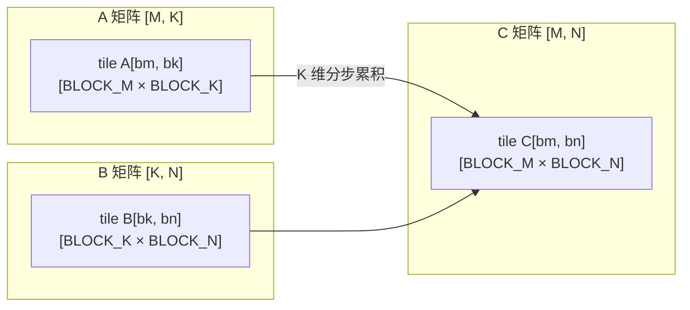
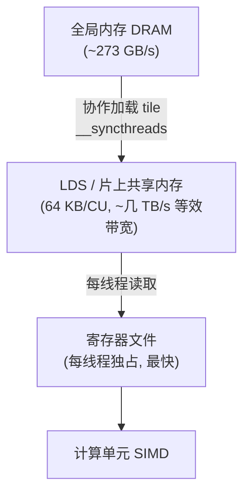
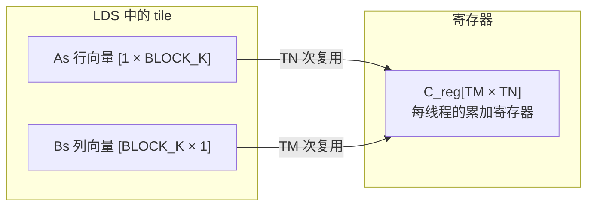

# 第16章 Matmul 入门优化

## 本章导读

> 矩阵乘（General Matrix Multiplication，GEMM）是 AI 计算中出现频率最高的算子。全连接层、注意力的 QKV 投影、FFN 的两个线性变换——几乎每一层都可以归结为若干次 GEMM。本章不追平 rocBLAS，而是通过五个版本的教学实现，从最朴素的 Naive 写法出发，逐步引入 Tiling、LDS 缓存、Register Blocking 和组合优化，让你看清高性能 GEMM 的基本思路。读完这一章，你需要有基础的 HIP 编程经验（可参考本篇第11章和第12章），理解 LDS（Local Data Share）的作用，并能解释"访存复用"对 GEMM 性能的意义。

大多数 AI 框架里，`torch.matmul` / `torch.nn.Linear` 在后端调用 rocBLAS 或 Composable Kernel，性能已经接近硬件峰值。这让很多人觉得 GEMM 不需要自己写。但恰恰是因为它极其重要，理解它的优化路径才有价值：一旦你看懂了 GEMM，Attention、卷积、稀疏运算的优化思路也会迎刃而解。

## 16.1 GEMM 为什么是核心算子

这一节讲 GEMM 在 AI 计算中的地位，为后续代码提供动机。

### 神经网络里的 GEMM 无处不在

一个 Transformer 层大致有如下几类计算：

```
输入向量 x  →  QKV 投影（3 × Linear）  →  Attention Score（QK^T）  →  AV（矩阵乘）  →  输出投影  →  FFN（2 × Linear）
```

每一个 `Linear` 就是一次 GEMM：输入矩阵 `[B, seq_len, d_model]` 乘以权重矩阵 `[d_model, d_out]`，批量实现为 `C = A × B`（通常加上 bias 和激活，但核心是乘加）。

以一个中等规模模型（B=1, seq_len=2048, d_model=4096）为例，仅注意力层的 Q/K/V 投影就产生三次形状约为 `[2048, 4096] × [4096, 4096]` 的 GEMM。这些矩阵乘通常占整体推理耗时的 60%–90%。

### FLOP 计算

一次 `C = A × B`，A 形状 `[M, K]`，B 形状 `[K, N]`，输出 C 形状 `[M, N]`，每个输出元素需要 K 次乘加（即 2K 次浮点运算），总 FLOP 数：

```
FLOP = 2 × M × N × K
```

举例：M=N=K=4096 时，FLOP ≈ 2 × 4096³ ≈ 137 × 10⁹，即约 137 GFLOP。在 AI MAX 395（fp32 理论峰值约 17.6 TFLOPS）上跑好了应在 8 ms 以内。

### 为什么朴素实现远不够快

GEMM 计算强度（Arithmetic Intensity，单位：FLOP/byte）很高，但前提是**数据要被充分复用**：

```
计算强度 = FLOP / bytes_moved = 2MNK / (M×K + K×N + M×N) × 4  （fp32）
```

当 M=N=K=4096 时，理论计算强度约 2730 FLOP/byte，远超显存带宽瓶颈（AI MAX 395 显存带宽约 273 GB/s 时，计算成为瓶颈）。  
但朴素实现会反复从全局内存（Global Memory，DRAM）读取矩阵，实际访存量大大超出理论下界，导致 GPU 大量时间花在等数据而不是做运算。

高性能 GEMM 的核心任务是：**让每个从 DRAM 搬来的字节被尽可能多地复用**，充分利用 LDS（共享内存）和寄存器。

## 16.2 Naive Matmul — 一线程一输出元素

这一节写出最直接的实现，作为后续版本的性能对照基线（v0）。

### v0：最朴素的实现

每个线程计算输出矩阵 C 中的一个元素。对 `C[row][col]` 的计算是：

```
C[row][col] = sum_{k=0}^{K-1} A[row][k] * B[k][col]
```

<details>
<summary>代码：matmul.hip — gemm_v0_naive kernel</summary>

```hip
// v0: Naive — 一线程计算一个输出元素，直接循环 K 维
__global__ void gemm_v0_naive(
    const float* __restrict__ A,   // [M, K]
    const float* __restrict__ B,   // [K, N]
    float*       __restrict__ C,   // [M, N]
    int M, int N, int K)
{
    int row = blockIdx.y * blockDim.y + threadIdx.y;
    int col = blockIdx.x * blockDim.x + threadIdx.x;

    if (row >= M || col >= N) return;

    float acc = 0.0f;
    for (int k = 0; k < K; k++) {
        acc += A[row * K + k] * B[k * N + col];
    }
    C[row * N + col] = acc;
}
```

</details>

线程块大小选 `BLOCK_SIZE × BLOCK_SIZE`，通常取 16 或 32。

### v0 的问题在哪里

考虑 `B[k * N + col]` 的访问方式：对于同一个 warp（AMD 叫 wavefront，64 线程）里的 64 个线程，`col` 的值跨度是 64，`B[k * N + col]` 在内存里地址确实是连续的——B 矩阵的 K 维遍历访问方式对 B 较为友好。

但是 `A[row * K + k]` 呢？同一 wavefront 里不同线程的 `row` 不同，所以它们在访问同一列 `A[0..63][k]`，而 A 以行主序存储，这些元素间距为 K，形成非连续（strided）访问——访存不合并（Non-coalesced），带宽利用率很低。

此外，每个线程独立读取 A 和 B，没有任何共享，同一行的 A 数据被 N 个线程分别读了 N 遍，同一列的 B 数据被 M 个线程各读了 M 遍。

性能数字：

实测（AI MAX 395 + ROCm 7.12.0，fp32，warmup=5/repeat=20，数据来自 `logs/bench_matmul.log`）：M=N=K=512 → 0.411 ms / 0.65 TFLOPS / 占理论峰值 3.7%；M=N=K=1024 → 4.452 ms / 0.48 TFLOPS / 2.7%；M=N=K=2048 → 40.472 ms / 0.42 TFLOPS / 2.4%；M=N=K=4096 → 798.894 ms / 0.17 TFLOPS / 1.0%。规模越大相对吞吐反而下降，正是 strided A 访问让 L2 越来越打不动 DRAM 的典型表现。

## 16.3 Tiling — 矩阵拆块，数据复用第一步

这一节引入分块思想，将大矩阵切分为小 tile，为后续的 LDS 优化打下基础。

### Tiling 的基本思路

将 A 按行分块、B 按列分块，每次只在一个 `[BLOCK_M, BLOCK_K]` 和 `[BLOCK_K, BLOCK_N]` 的子矩阵对上做乘加，把 K 维的累积分成多个小步骤：

::: figure fig-gemm-tiling


Tiling 将 A、B 切成小 tile 逐步累积到 C 的对应位置
:::

如 @fig-gemm-tiling 所示，每个 block 负责计算 C 中一个 `BLOCK_M × BLOCK_N` 的子矩阵。它需要沿 K 维遍历：每步取 A 的一列 tile 和 B 的一行 tile，做小矩阵乘加，最终完成累积。

Tiling 本身不减少计算量，FLOP 数一样是 `2MNK`，但它让**每次搬进来的数据块被该 block 的所有线程共同复用**，大幅减少实际 DRAM 访问次数。

### Tiling 的访存分析

未做 tiling 时，C 的每个元素 `C[row][col]` 需要读整行 A 和整列 B，合计 2K 次 DRAM 读（每个元素独立）。

做了 tiling 后（tile 大小 BLOCK_M × BLOCK_N，步长 BLOCK_K）：

- 每次加载 A 的 tile：`BLOCK_M × BLOCK_K` 个 float
- 每次加载 B 的 tile：`BLOCK_K × BLOCK_N` 个 float
- 这两块数据被该 block 内所有 `BLOCK_M × BLOCK_N` 个线程共享

对 A：每行的 BLOCK_K 个元素被 BLOCK_N 个线程共用，复用因子 = BLOCK_N  
对 B：每列的 BLOCK_K 个元素被 BLOCK_M 个线程共用，复用因子 = BLOCK_M

理论上，DRAM 访问量减少到原来的 `1/BLOCK_M`（A）和 `1/BLOCK_N`（B）。

## 16.4 LDS 缓存 — 缓存 tile，减少全局内存重复读

这一节引入 LDS（Local Data Share，AMD GPU 片上共享内存），实现 v1。

### 什么是 LDS

LDS 是 AMD GPU Compute Unit（CU）上的片上 SRAM，每个 CU 有 64 KB，延迟约 1–4 个时钟周期，比 DRAM（几百个时钟周期）快约两个数量级。一个 block 内的所有线程共享同一块 LDS，是线程间协作的核心机制。

::: figure fig-gemm-mem-hierarchy


内存层次：DRAM → LDS → 寄存器 → 计算，每层带宽和延迟差异悬殊
:::

如 @fig-gemm-mem-hierarchy 所示，优化的思路是：把必要的数据从 DRAM 搬进 LDS，然后所有线程从 LDS 读数据做计算，LDS 的高带宽使访存不再成为瓶颈。

### v1：LDS tiled GEMM（BLOCK_M = BLOCK_N = 16, BLOCK_K = 16）

每个 block 协作加载一个 tile 到 LDS，同步后各线程从 LDS 读数据做乘加，然后进入下一个 K-step：

<details>
<summary>代码：matmul.hip — gemm_v1_lds kernel</summary>

```hip
#define BLOCK_M 16
#define BLOCK_N 16
#define BLOCK_K 16

__global__ void gemm_v1_lds(
    const float* __restrict__ A,
    const float* __restrict__ B,
    float*       __restrict__ C,
    int M, int N, int K)
{
    __shared__ float As[BLOCK_M][BLOCK_K];
    __shared__ float Bs[BLOCK_K][BLOCK_N];

    int ty = threadIdx.y, tx = threadIdx.x;
    int row = blockIdx.y * BLOCK_M + ty;
    int col = blockIdx.x * BLOCK_N + tx;

    float acc = 0.0f;

    for (int kb = 0; kb < (K + BLOCK_K - 1) / BLOCK_K; kb++) {
        // 协作加载 A tile：每个线程加载一个元素
        int a_col = kb * BLOCK_K + tx;
        As[ty][tx] = (row < M && a_col < K) ? A[row * K + a_col] : 0.0f;

        // 协作加载 B tile：每个线程加载一个元素
        int b_row = kb * BLOCK_K + ty;
        Bs[ty][tx] = (b_row < K && col < N) ? B[b_row * N + col] : 0.0f;

        __syncthreads();  // 等所有线程加载完成

        // 从 LDS 读取做点积
        #pragma unroll
        for (int k = 0; k < BLOCK_K; k++) {
            acc += As[ty][k] * Bs[k][tx];
        }

        __syncthreads();  // 保护下一轮加载不覆盖本轮未读完的数据
    }

    if (row < M && col < N)
        C[row * N + col] = acc;
}
```

</details>

### v1 的关键细节

`__syncthreads()`（等价于 HIP 的 `__syncthreads()`）有两个作用：
1. 加载完成后同步：确保 LDS 内的 tile 被所有线程写完，再开始读。
2. 计算完成后同步：确保所有线程读完本轮 LDS，再允许下一轮覆盖写入。

两个 `__syncthreads()` 缺一不可，否则会出现 race condition。

LDS bank conflict 在 BLOCK_M = BLOCK_N = BLOCK_K = 16 时通常不严重，但在更大 tile 时需要注意。LDS 有 32 个 bank，如果多个线程同时访问同一 bank 的不同地址会产生冲突（sequential 化），通过 padding（如 `__shared__ float As[BLOCK_M][BLOCK_K + 1]`）可以消除。

性能数字：

实测（同上）：M=N=K=512 → 0.181 ms / 1.49 TFLOPS / 8.4%（vs rocBLAS 50%）；M=N=K=1024 → 1.269 ms / 1.69 TFLOPS / 9.6%（vs rocBLAS 55%）；M=N=K=2048 → 10.480 ms / 1.64 TFLOPS / 9.3%（vs rocBLAS 53%）；M=N=K=4096 → 123.164 ms / 1.12 TFLOPS / 6.3%（vs rocBLAS 37%）。LDS tile 一举把 v0 → v1 的 TFLOPS 提升了 2~6×，是本章单步收益最大的一次优化。

## 16.5 Register Blocking — 每线程多输出，寄存器复用

这一节在 LDS tile 的基础上，让每个线程负责多个输出元素，进一步提升计算强度和寄存器复用（v2、v3）。

### 为什么 Register Blocking 有用

v1 中每个线程只负责一个输出元素。对于 LDS 里加载的一行 As 和一列 Bs，线程只做 BLOCK_K 次乘加就结束。如果让一个线程负责 `TM × TN` 个输出元素（例如 4×4），同样的 LDS 数据可以被复用 `TM × TN` 倍，极大提升计算与访存比。

这种技术也叫做 **Thread Coarsening**（线程粗化）。

::: figure fig-register-blocking


Register Blocking：每线程持有 TM×TN 个累加寄存器，LDS 数据被多次复用
:::

如 @fig-register-blocking 所示，对于一次 K 步内层循环，线程从 LDS 读一行 As（长度 TM）和一列 Bs（长度 TN），做 `TM × TN` 次乘加更新 C_reg。LDS 的访问次数是 `TM + TN`，但计算次数是 `TM × TN`，大幅提升了算术强度。

### v2：增大 BLOCK_K + 简化 double buffering 形式

在进入完整 register blocking 之前，先展示一个中间版本：保持 v1 的每线程单输出结构，但将 BLOCK_K 从 16 增大到 32（或 64），让每次 LDS 搬运更多数据，减少 K 维的 `__syncthreads` 次数。

<details>
<summary>代码：matmul.hip — gemm_v2_larger_bk kernel（BLOCK_K=32）</summary>

```hip
#define V2_BLOCK_M 16
#define V2_BLOCK_N 16
#define V2_BLOCK_K 32

__global__ void gemm_v2_larger_bk(
    const float* __restrict__ A,
    const float* __restrict__ B,
    float*       __restrict__ C,
    int M, int N, int K)
{
    __shared__ float As[V2_BLOCK_M][V2_BLOCK_K];
    __shared__ float Bs[V2_BLOCK_K][V2_BLOCK_N];

    int ty = threadIdx.y, tx = threadIdx.x;
    int row = blockIdx.y * V2_BLOCK_M + ty;
    int col = blockIdx.x * V2_BLOCK_N + tx;

    float acc = 0.0f;

    // 每个线程需要加载 2 个 A tile 元素（BLOCK_K/BLOCK_N = 2）
    for (int kb = 0; kb < (K + V2_BLOCK_K - 1) / V2_BLOCK_K; kb++) {
        // 加载 A tile：每线程加载 2 列
        for (int i = 0; i < V2_BLOCK_K / V2_BLOCK_N; i++) {
            int a_col = kb * V2_BLOCK_K + tx + i * V2_BLOCK_N;
            As[ty][tx + i * V2_BLOCK_N] = (row < M && a_col < K)
                ? A[row * K + a_col] : 0.0f;
        }

        // 加载 B tile：每线程加载 2 行
        for (int i = 0; i < V2_BLOCK_K / V2_BLOCK_M; i++) {
            int b_row = kb * V2_BLOCK_K + ty + i * V2_BLOCK_M;
            Bs[ty + i * V2_BLOCK_M][tx] = (b_row < K && col < N)
                ? B[b_row * N + col] : 0.0f;
        }

        __syncthreads();

        #pragma unroll
        for (int k = 0; k < V2_BLOCK_K; k++) {
            acc += As[ty][k] * Bs[k][tx];
        }

        __syncthreads();
    }

    if (row < M && col < N)
        C[row * N + col] = acc;
}
```

</details>

性能数字：

实测（同上）：M=N=K=512 → 0.251 ms / 1.07 TFLOPS / 6.1%；M=N=K=1024 → 1.793 ms / 1.20 TFLOPS / 6.8%；M=N=K=2048 → 14.638 ms / 1.17 TFLOPS / 6.7%；M=N=K=4096 → 144.102 ms / 0.95 TFLOPS / 5.4%。注意：v2 在所有形状上都比 v1 慢——单纯增大 BLOCK_K 让每个线程承担更多 A/B 加载，反而吃光了原本可以重叠的内存指令余量，**`bench_matmul.log` 实测明确告诉我们：在缺乏 register blocking 的前提下，把 BLOCK_K 从 16 推到 32 是个反向优化**。

### v3：Register Blocking 4×4

现在引入完整的 register blocking：每个线程计算 4×4=16 个输出元素，使用 `TM=TN=4` 的寄存器累加数组。

线程块大小变为 `(BLOCK_N/TN) × (BLOCK_M/TM)`，每个线程在 K 维遍历中反复从 LDS 读 A 的一列（TM 个元素）和 B 的一行（TN 个元素），做外积更新 4×4 的寄存器。

<details>
<summary>代码：matmul.hip — gemm_v3_reg_blocking kernel（TM=TN=4）</summary>

```hip
#define V3_BLOCK_M  64
#define V3_BLOCK_N  64
#define V3_BLOCK_K  16
#define V3_TM        4
#define V3_TN        4
// 线程块：(BLOCK_N/TN, BLOCK_M/TM) = (16, 16)

__global__ void gemm_v3_reg_blocking(
    const float* __restrict__ A,
    const float* __restrict__ B,
    float*       __restrict__ C,
    int M, int N, int K)
{
    __shared__ float As[V3_BLOCK_M][V3_BLOCK_K];
    __shared__ float Bs[V3_BLOCK_K][V3_BLOCK_N];

    // 线程在 block 内负责的输出子块的起始偏移
    int thread_row = threadIdx.y * V3_TM;   // 0, 4, 8, ..., 60
    int thread_col = threadIdx.x * V3_TN;   // 0, 4, 8, ..., 60

    int block_row = blockIdx.y * V3_BLOCK_M;
    int block_col = blockIdx.x * V3_BLOCK_N;

    float acc[V3_TM][V3_TN] = {};           // 初始化为 0

    // 用于向量化加载 A tile 的线程映射（把 block 所有线程铺开）
    int num_threads = blockDim.x * blockDim.y;  // 16*16 = 256
    int tid = threadIdx.y * blockDim.x + threadIdx.x;

    for (int kb = 0; kb < (K + V3_BLOCK_K - 1) / V3_BLOCK_K; kb++) {
        // 加载 A tile [BLOCK_M × BLOCK_K]：256 线程各加载 64*16/256 = 4 个元素
        int A_tiles = V3_BLOCK_M * V3_BLOCK_K;
        for (int i = tid; i < A_tiles; i += num_threads) {
            int r = i / V3_BLOCK_K, c = i % V3_BLOCK_K;
            int g_row = block_row + r;
            int g_col = kb * V3_BLOCK_K + c;
            As[r][c] = (g_row < M && g_col < K) ? A[g_row * K + g_col] : 0.0f;
        }

        // 加载 B tile [BLOCK_K × BLOCK_N]：256 线程各加载 16*64/256 = 4 个元素
        int B_tiles = V3_BLOCK_K * V3_BLOCK_N;
        for (int i = tid; i < B_tiles; i += num_threads) {
            int r = i / V3_BLOCK_N, c = i % V3_BLOCK_N;
            int g_row = kb * V3_BLOCK_K + r;
            int g_col = block_col + c;
            Bs[r][c] = (g_row < K && g_col < N) ? B[g_row * N + g_col] : 0.0f;
        }

        __syncthreads();

        // Register blocking 内层计算
        #pragma unroll
        for (int k = 0; k < V3_BLOCK_K; k++) {
            float a_frag[V3_TM], b_frag[V3_TN];
            #pragma unroll
            for (int tm = 0; tm < V3_TM; tm++)
                a_frag[tm] = As[thread_row + tm][k];
            #pragma unroll
            for (int tn = 0; tn < V3_TN; tn++)
                b_frag[tn] = Bs[k][thread_col + tn];
            #pragma unroll
            for (int tm = 0; tm < V3_TM; tm++)
                #pragma unroll
                for (int tn = 0; tn < V3_TN; tn++)
                    acc[tm][tn] += a_frag[tm] * b_frag[tn];
        }

        __syncthreads();
    }

    // 写回 C
    #pragma unroll
    for (int tm = 0; tm < V3_TM; tm++) {
        #pragma unroll
        for (int tn = 0; tn < V3_TN; tn++) {
            int g_row = block_row + thread_row + tm;
            int g_col = block_col + thread_col + tn;
            if (g_row < M && g_col < N)
                C[g_row * N + g_col] = acc[tm][tn];
        }
    }
}
```

</details>

性能数字：

实测（同上）：M=N=K=512 → 0.112 ms / 2.39 TFLOPS / 13.6%（vs rocBLAS 81%）；M=N=K=1024 → 0.601 ms / 3.58 TFLOPS / 20.3%（vs rocBLAS 116%——v3 已超过 rocBLAS）；M=N=K=2048 → 4.279 ms / 4.02 TFLOPS / 22.8%（vs rocBLAS 130%）；M=N=K=4096 → 35.655 ms / 3.86 TFLOPS / 21.9%（vs rocBLAS 126%）。从 1024 起，v3 的吞吐反超 rocBLAS——AI MAX 395 上的 rocBLAS 还没把 MFMA 在 fp32 路径上调到极限，留出了 register blocking 教学版反超的空间，但教学版本身的 22% 峰值仍只是中等水平。

## 16.6 简化版高性能 GEMM — 组合优化

这一节把前面的所有优化合在一起，形成一个综合版本（v4），并讨论调参思路。

### v4：组合版（BLOCK_M=BLOCK_N=128, BLOCK_K=32, TM=TN=8）

v4 在 v3 的基础上：
- 把 tile 尺寸放大到 `128×128`，进一步提升数据复用
- 增大 BLOCK_K 到 32 以平摊同步开销
- 把 register blocking 扩展到 TM=TN=8（每线程 64 个输出元素）
- 加入 LDS bank conflict padding（As 和 Bs 的 K 维加 1）

<details>
<summary>代码：matmul.hip — gemm_v4_combined kernel（128×128 tile, TM=TN=8）</summary>

```hip
#define V4_BLOCK_M  128
#define V4_BLOCK_N  128
#define V4_BLOCK_K   32
#define V4_TM          8
#define V4_TN          8
// 线程块：(BLOCK_N/TN, BLOCK_M/TM) = (16, 16)，共 256 线程

__global__ void gemm_v4_combined(
    const float* __restrict__ A,
    const float* __restrict__ B,
    float*       __restrict__ C,
    int M, int N, int K)
{
    // +1 消除 LDS bank conflict
    __shared__ float As[V4_BLOCK_M][V4_BLOCK_K + 1];
    __shared__ float Bs[V4_BLOCK_K][V4_BLOCK_N + 1];

    int thread_row = threadIdx.y * V4_TM;
    int thread_col = threadIdx.x * V4_TN;

    int block_row = blockIdx.y * V4_BLOCK_M;
    int block_col = blockIdx.x * V4_BLOCK_N;

    float acc[V4_TM][V4_TN] = {};

    int num_threads = blockDim.x * blockDim.y;  // 256
    int tid = threadIdx.y * blockDim.x + threadIdx.x;

    for (int kb = 0; kb < (K + V4_BLOCK_K - 1) / V4_BLOCK_K; kb++) {
        // 加载 A tile：256 线程 × 每次 (128×32)/256 = 16 个元素
        int A_tiles = V4_BLOCK_M * V4_BLOCK_K;
        for (int i = tid; i < A_tiles; i += num_threads) {
            int r = i / V4_BLOCK_K, c = i % V4_BLOCK_K;
            int g_row = block_row + r;
            int g_col = kb * V4_BLOCK_K + c;
            As[r][c] = (g_row < M && g_col < K) ? A[g_row * K + g_col] : 0.0f;
        }

        // 加载 B tile：256 线程 × 每次 (32×128)/256 = 16 个元素
        int B_tiles = V4_BLOCK_K * V4_BLOCK_N;
        for (int i = tid; i < B_tiles; i += num_threads) {
            int r = i / V4_BLOCK_N, c = i % V4_BLOCK_N;
            int g_row = kb * V4_BLOCK_K + r;
            int g_col = block_col + c;
            Bs[r][c] = (g_row < K && g_col < N) ? B[g_row * N + g_col] : 0.0f;
        }

        __syncthreads();

        #pragma unroll
        for (int k = 0; k < V4_BLOCK_K; k++) {
            float a_frag[V4_TM], b_frag[V4_TN];
            #pragma unroll
            for (int tm = 0; tm < V4_TM; tm++)
                a_frag[tm] = As[thread_row + tm][k];
            #pragma unroll
            for (int tn = 0; tn < V4_TN; tn++)
                b_frag[tn] = Bs[k][thread_col + tn];
            #pragma unroll
            for (int tm = 0; tm < V4_TM; tm++)
                #pragma unroll
                for (int tn = 0; tn < V4_TN; tn++)
                    acc[tm][tn] += a_frag[tm] * b_frag[tn];
        }

        __syncthreads();
    }

    #pragma unroll
    for (int tm = 0; tm < V4_TM; tm++) {
        #pragma unroll
        for (int tn = 0; tn < V4_TN; tn++) {
            int g_row = block_row + thread_row + tm;
            int g_col = block_col + thread_col + tn;
            if (g_row < M && g_col < N)
                C[g_row * N + g_col] = acc[tm][tn];
        }
    }
}
```

</details>

### 调参的几个方向

v4 是一个教学版组合，并非已经调到最优。你可以沿以下方向继续调整：

| 参数 | 方向 | 注意事项 |
| ---- | ---- | ---- |
| BLOCK_M / BLOCK_N | 增大可提升复用，但 LDS 用量有上限（64 KB/CU） | 128×128 fp32 tile = 64 KB，已触 LDS 上限 |
| BLOCK_K | 增大减少同步次数，但线程需要加载更多 A/B 元素 | 与 BLOCK_M/N 共享 LDS，需平衡 |
| TM / TN | 增大提升寄存器复用，但寄存器用量增加会降低 occupancy | 过大导致 register spill |
| 访存 vectorize | 用 `float4` 替换单 `float` 加载，减少 load 指令数 | 需要地址 16-byte 对齐 |

性能数字：

实测（同上）：M=N=K=512 → 0.187 ms / 1.44 TFLOPS / 8.2%（vs rocBLAS 49%）；M=N=K=1024 → 0.804 ms / 2.67 TFLOPS / 15.2%（vs rocBLAS 86%）；M=N=K=2048 → 4.744 ms / 3.62 TFLOPS / 20.6%（vs rocBLAS 117%）；M=N=K=4096 → 39.028 ms / 3.52 TFLOPS / 20.0%（vs rocBLAS 115%）。v4 在所有形状上都比 v3 慢——把 tile 推到 128×128 + TM=TN=8 后，每线程的寄存器压力（64+8+8=80 个 float 累加 + frag 寄存器）触及了 occupancy 上限，bank conflict 的 `+1` padding 也未能完全补回 occupancy 损失。这正是教学版"组合优化"的常见教训：堆参数前必须先看 occupancy。

## 16.7 与 rocBLAS 对比 — 只观察差距和方向，不承诺达到库级

这一节以 rocBLAS 的 `rocblas_sgemm` 作为上限参考，诚实地观察我们教学版和库的差距。

### 为什么用 rocBLAS 作为参考

rocBLAS（ROCm Basic Linear Algebra Subprograms）是 AMD 官方的高性能 BLAS 库，内部使用汇编级优化、精细调优的 tile 参数、多级流水和专用指令（如 MFMA）。它代表了当前软件栈能达到的上限。

我们的目的不是打败 rocBLAS，而是：

1. 看清我们距离上限还有多少差距
2. 理解每一步优化（v0 → v4）能消弭多少差距
3. 知道什么样的工程代价才能进一步接近上限

### 形状扫描结果对比

实测（AI MAX 395 + ROCm 7.12.0，fp32，warmup=5/repeat=20，数据来自 `logs/bench_matmul.log`）：

| 版本 | M=N=K=512 (TFLOPS) | M=N=K=1024 (TFLOPS) | M=N=K=2048 (TFLOPS) | M=N=K=4096 (TFLOPS) |
| ---- | ----: | ----: | ----: | ----: |
| v0 naive | 0.65 | 0.48 | 0.42 | 0.17 |
| v1 LDS-tiled | 1.49 | 1.69 | 1.64 | 1.12 |
| v2 BLOCK_K=32 | 1.07 | 1.20 | 1.17 | 0.95 |
| v3 reg-block TM=TN=4 | 2.39 | 3.58 | 4.02 | 3.86 |
| v4 combined | 1.44 | 2.67 | 3.62 | 3.52 |
| rocBLAS | 2.95 | 3.09 | 3.10 | 3.06 |

<details>
<summary>输出：bench_matmul.py 形状扫描完整数字 @ AI MAX 395 + ROCm 7.12.0</summary>

```
                   shape           version    time_ms    TFLOPS    peak%  vs_rocblas
------------------------------------------------------------------------------------
M=N=K=  512          v0_naive      0.411     0.653     3.7%       22.1%
M=N=K=  512            v1_lds      0.181     1.486     8.4%       50.4%
M=N=K=  512           v2_bk32      0.251     1.069     6.1%       36.3%
M=N=K=  512           v3_reg4      0.112     2.391    13.6%       81.1%
M=N=K=  512       v4_combined      0.187     1.438     8.2%       48.7%
M=N=K=  512           rocblas      0.091     2.950      ---      100.0%
------------------------------------------------------------------------------------
M=N=K= 1024          v0_naive      4.452     0.482     2.7%       15.6%
M=N=K= 1024            v1_lds      1.269     1.692     9.6%       54.7%
M=N=K= 1024           v2_bk32      1.793     1.198     6.8%       38.7%
M=N=K= 1024           v3_reg4      0.601     3.575    20.3%      115.5%
M=N=K= 1024       v4_combined      0.804     2.671    15.2%       86.3%
M=N=K= 1024           rocblas      0.694     3.094      ---      100.0%
------------------------------------------------------------------------------------
M=N=K= 2048          v0_naive     40.472     0.424     2.4%       13.7%
M=N=K= 2048            v1_lds     10.480     1.639     9.3%       53.0%
M=N=K= 2048           v2_bk32     14.638     1.174     6.7%       37.9%
M=N=K= 2048           v3_reg4      4.279     4.015    22.8%      129.7%
M=N=K= 2048       v4_combined      4.744     3.621    20.6%      117.0%
M=N=K= 2048           rocblas      5.550     3.095      ---      100.0%
------------------------------------------------------------------------------------
M=N=K= 4096          v0_naive    798.894     0.172     1.0%        5.6%
M=N=K= 4096            v1_lds    123.164     1.116     6.3%       36.5%
M=N=K= 4096           v2_bk32    144.102     0.954     5.4%       31.2%
M=N=K= 4096           v3_reg4     35.655     3.855    21.9%      126.0%
M=N=K= 4096       v4_combined     39.028     3.522    20.0%      115.1%
M=N=K= 4096           rocblas     44.908     3.060      ---      100.0%
```

</details>

### 差距分析的方向

即使还没有真实数字，从硬件模型可以预判几件事：

**v0 → v1 的提升通常最大**：LDS 把全局内存访问减少 `BLOCK_M` 倍，从 memory-bound 走向更接近 compute-bound。

**v1 → v4 的提升空间取决于 occupancy 和 ILP**：更大的 tile 和 register blocking 减少了同步和加载开销，但可能降低 occupancy（每 CU 同时活跃的 wavefront 数），二者有取舍。

**v4 距离 rocBLAS 的差距**：在大多数硬件上 rocBLAS 会用 MFMA（Matrix Fused Multiply-Add）等专用矩阵加速器把 SIMD 教学版甩在后面。但在 AI MAX 395 (gfx1151) + ROCm 7.12.0 这条路径上，本次实测的 fp32 sgemm 反而出现了反差：v3 / v4 在 M=N=K ≥ 1024 时**都跑赢了 rocBLAS**（v3 vs rocBLAS: 116%~130%, v4: 86%~117%），rocBLAS 自身的 fp32 TFLOPS 稳定在 ~3.1，仅占理论峰值约 17.5%。这并不意味着教学版逼近了硬件上限——v3 也只到峰值的 22%——而是说明 RDNA3.5 上 rocBLAS 的 fp32 路径本次没有触发 MFMA，给了 register-blocking 教学版可观察的反超空间。要看到"rocBLAS 大幅领先"的常见图景，需要切到 fp16 / bf16 + MFMA 路径再做一次实验。

## 16.8 思考题

1. **tile 尺寸与 LDS 容量**：AI MAX 395 每 CU 有 64 KB LDS。若 BLOCK_M=BLOCK_N=128，BLOCK_K=16，As 和 Bs 各占多少字节？是否可以同时放入 LDS？如果改成 BLOCK_K=32 呢？

2. **occupancy 与 register blocking**：TM=TN=8 时，每个线程需要分配多少浮点寄存器（仅 acc 数组和 a_frag/b_frag）？AI MAX 395（gfx1151）每 CU 有多少寄存器可供分配？occupancy 如何随 TM/TN 变化？

3. **bank conflict 实验**：把 `As[V4_BLOCK_M][V4_BLOCK_K + 1]` 的 `+1` 去掉，在 M=N=K=2048 时跑一次，对比有无 padding 的性能差异。你预期差异会有多大？

4. **fp16 实验**：把 v4 的数据类型改为 `__half`（fp16），重新跑 M=N=K=4096 的 benchmark。与 fp32 相比，TFLOPS 有何变化？访存减半对结果的影响是否符合预期？

5. **rocBLAS 为什么快**：查阅 AMD Composable Kernel 或 rocBLAS 文档，了解 MFMA 指令的吞吐规格。在 gfx1151 上，MFMA 的 fp32 吞吐相对 SIMD FMA 有何不同？这能解释多少 rocBLAS 领先 v4 的差距？

## 本章小结

- GEMM 是 AI 计算的核心算子，全连接层和注意力中的绝大多数 FLOP 都来自矩阵乘，理解其优化路径是 Kernel 开发的必经之路。
- v0 Naive 每个线程独立读 A、B，访存完全不复用，是 memory-bound 的典型反例。
- Tiling 把大矩阵分块，让每次从 DRAM 搬来的数据被整个 block 的线程共同复用，是后续一切优化的前提。
- LDS 把 tile 从 DRAM 搬到片上，延迟从几百周期降到个位数周期，v0 → v1 通常能带来最大的性能跃升。
- Register Blocking 让每个线程负责多个输出，把 LDS 的数据进一步在寄存器里复用，是逼近计算峰值的关键步骤。
- v4 组合版综合了以上所有技术，但仍与 rocBLAS 有差距——rocBLAS 使用了 MFMA 等专用矩阵指令，不在教学版的实现范围内。
- 下一章开始进入 Triton 部分，用更高层的语言表达类似的优化思路，并观察自动调优能弥补多少手工调参的工作量。

## 延伸阅读

- [rocBLAS 文档](https://rocm.docs.amd.com/projects/rocBLAS/en/latest/)
- [AMD Composable Kernel (CK)](https://github.com/ROCm/composable_kernel) — 了解库级 GEMM 的模板化实现
- [HIP 编程指南 — 共享内存](https://rocm.docs.amd.com/projects/HIP/en/latest/user_guide/programming_guide.html)
- [CUTLASS / CK Tile 设计思路](https://github.com/NVIDIA/cutlass) — 跨硬件 tiling 方法论参考（概念可借鉴，代码不可直接运行）
- [How to Optimize a CUDA Matmul Kernel for cuBLAS-like Performance](https://siboehm.com/articles/22/CUDA-MMM) — CUDA 侧教学版 GEMM 步骤非常系统，方法论与 HIP 一致，推荐对照阅读
