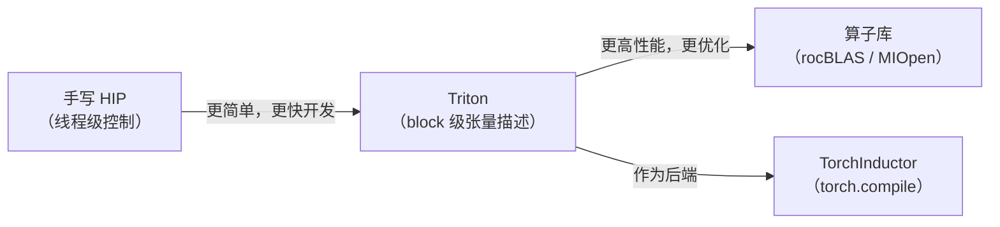
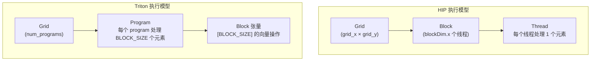
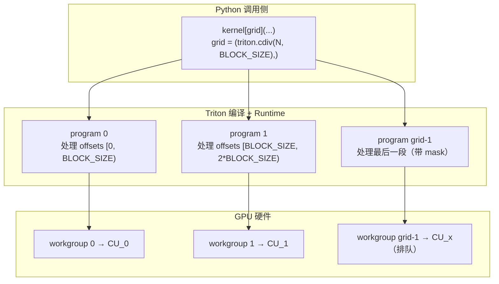

# 第17章 Triton 编程模型

## 本章导读

> 前三部分（硬件、Profiling、HIP 算子）让你建立了从 GPU 执行模型到手写线程级 kernel 的完整基础。本章是 Part 4 的入口，从 HIP 切换到 Triton，重点理解 Triton 为什么让算子开发更接近张量块级编程（block-level tensor programming）。读完后，你应该能解释 program、block 和 mask 如何对应到数据，并能亲手写出向量加法（vector add）和向量拷贝（vector copy）两个 Triton kernel。
>
> 前置要求：读完 Part 3 任意一章（尤其是 [第 13 章 HIP 向量加法](../../part3-hip-kernels/chapter11/index.md) 和 [第 14 章 HIP Softmax](../../part3-hip-kernels/chapter14/index.md)），知道 `threadIdx`、`blockIdx`、`__shared__` 是什么。

在 Part 3 里，你已经用手写 HIP kernel 的方式完成了向量加法、Reduction、Softmax 乃至矩阵乘。你知道了每个线程负责哪一个元素、shared memory 怎么同步、边界条件怎么用 `if (idx < n)` 分支处理。这套思路是正确的，也是完整的——但它有一个门槛：开发者需要同时管理线程级索引、显式共享内存声明和同步原语，稍有疏忽就会出现数据竞争或访存越界。

Triton 的设计目标是：**让开发者在 block 层次描述计算，把线程到数据的映射交给编译器**。这一章帮你建立从 HIP 思维到 Triton 思维的桥梁。

## 17.1 为什么需要 Triton

这一节说明在手写 HIP 和调用算子库之间，Triton 到底提供了什么样的折中。

### 两个极端

写高性能 GPU 算子，目前有两个典型路线：

**路线 A：调用算子库（rocBLAS / MIOpen / Composable Kernel）**

好处是性能有保证——这些库是 AMD 工程师针对目标硬件深度调优的结果，MFMA 指令排布、LDS padding、多级流水线都已经处理好了。坏处是**定制化困难**：库提供的算子接口固定，如果你的模型里有一个非标准的算子（比如 RMSNorm 的某种融合变体），库可能不支持；即便能拼凑出来，也往往需要多次 kernel launch，中间的显存读写白白浪费带宽。

**路线 B：手写 HIP kernel**

好处是完全控制，可以精确指定每个线程干什么、数据怎么流动。坏处是**开发成本高**：一个生产级的 tiled GEMM 需要几百行代码，处理 block/thread 映射、LDS 声明和多种边界情况；换一种 tile 尺寸或数据类型就要大量改动；在 AMD 上还要额外关注 wavefront（线程束）大小和 GFX 架构的差异。

### Triton 的定位

Triton 站在两个极端之间：

- 比手写 HIP 更简单：开发者描述 **block 层次的张量操作**，不需要管线程级索引和共享内存声明；
- 比调用库更灵活：可以把不同算子融合到一个 kernel 里，减少中间结果的显存读写；
- 适合快速原型和教学：同样的矩阵乘，Triton 版本的核心 kernel 通常比 HIP 版本少一半甚至更多的代码行数。

Triton 最广泛的实际应用场景是 **TorchInductor**（PyTorch 的默认编译后端）：当你调用 `torch.compile()` 时，PyTorch 会把计算图拆成若干 Triton kernel 并即时编译执行。理解 Triton 编程模型，是理解 TorchInductor 和现代深度学习编译器的前提之一。

::: figure fig-triton-position


Triton 在 GPU 算子开发谱系中的位置
:::

如 @fig-triton-position 所示，Triton 不是用来"替代"算子库或手写 HIP 的，而是填补中间的空间：快速实现一个正确且不算太差的高性能 kernel，同时保持足够的灵活性来支持算子融合和自定义计算。

### Triton 的局限

在同一张图里没有画出来但同样重要的是 Triton 的局限：

- **生成代码的峰值性能通常低于精心调优的库**：rocBLAS 等库里有汇编级的 MFMA 指令排布和多级流水线，Triton 当前版本生成的代码达不到这个水平。
- **调试难度不低于 HIP**：Triton 在 GPU 上运行，传统调试工具（printf in kernel）有限制；性能瓶颈定位需要 rocprof 等外部工具。
- **AMD ROCm 支持正在快速成熟**：截至 ROCm 7.12.0，Triton on AMD 已经能支持大多数核心操作，但部分高级特性（如某些 `tl.atomic_*` 操作）和 NVIDIA CUDA 路径相比仍有差异。遇到未知行为时，建议先查 [triton-lang 的 GitHub Issues](https://github.com/triton-lang/triton/issues) 确认是否是已知问题。

## 17.2 Triton 和 HIP 的区别

这一节从思维模型的角度，系统对比 HIP 的线程级编程和 Triton 的 block 级张量编程。

### 基本对比

在 HIP 里，kernel 的基本单元是**线程（thread）**。你写的每一行代码，是每个线程分别执行的。要处理一个向量，你需要：

1. 用 `blockIdx.x * blockDim.x + threadIdx.x` 计算当前线程对应哪个元素；
2. 检查索引是否越界；
3. 每个线程独立读写自己负责的那个位置。

在 Triton 里，kernel 的基本单元是 **program**（程序实例，等价于 CUDA/HIP 里的 block / workgroup）。你写的每一行代码，操作的是**整个 block 大小的张量**。要处理同样的向量，你需要：

1. 用 `tl.program_id(axis=0)` 获取当前 program 的 ID；
2. 用 `tl.arange(0, BLOCK_SIZE)` 生成该 program 负责的偏移量向量；
3. 用 `tl.load` / `tl.store` 整体读写一整块数据，用 mask 处理边界。

::: figure fig-hip-vs-triton-model


HIP grid/block/thread 与 Triton grid/program/block 的层次对应关系
:::

如 @fig-hip-vs-triton-model 所示，HIP 有三层：grid → block → thread；Triton 有两层：grid → program，program 内部操作的是 block 大小的张量，线程级的分工由编译器处理。

### 代码层面的对比

以向量加法为例。HIP 版本（参考 [第 13 章](../../part3-hip-kernels/chapter11/index.md)）：

```cpp
__global__ void vec_add_kernel(const float* x, const float* y, float* out, int n) {
    int idx = blockIdx.x * blockDim.x + threadIdx.x;
    if (idx < n) {
        out[idx] = x[idx] + y[idx];
    }
}
```

每个线程计算一个 `idx`，手动判断边界。

等价的 Triton kernel：

```python
import triton
import triton.language as tl

@triton.jit
def vec_add_kernel(
    x_ptr, y_ptr, out_ptr,
    n_elements,
    BLOCK_SIZE: tl.constexpr,
):
    pid = tl.program_id(axis=0)
    offsets = pid * BLOCK_SIZE + tl.arange(0, BLOCK_SIZE)
    mask = offsets < n_elements
    x = tl.load(x_ptr + offsets, mask=mask)
    y = tl.load(y_ptr + offsets, mask=mask)
    tl.store(out_ptr + offsets, x + y, mask=mask)
```

这里的 `offsets` 是一个长度为 `BLOCK_SIZE` 的整数向量，`x` 和 `y` 加载进来也是长度为 `BLOCK_SIZE` 的浮点向量，`x + y` 是向量加法，`tl.store` 整体写出去。没有 `threadIdx`，没有 `if (idx < n)`——边界处理变成了 `mask` 参数。

### 关键概念对照表

| 概念 | HIP | Triton | 说明 |
| ---- | ---- | ---- | ---- |
| 调度单元 | block（workgroup） | program | 都是 GPU 调度的基本单位 |
| 线程标识 | `blockIdx.x`, `threadIdx.x` | `tl.program_id(axis)` | Triton 只有 program 级别的 ID |
| 数据偏移 | 手动计算 `blockIdx * blockDim + threadIdx` | `tl.arange(0, BLOCK_SIZE)` | Triton 生成向量偏移，自动广播 |
| 共享内存 | 手动 `__shared__`，手动 `__syncthreads()` | 编译器自动管理，`num_stages` 控制流水 | Triton 隐藏共享内存细节 |
| 边界处理 | `if (idx < n)` 分支 | `mask=offsets < n, other=0.0` 参数 | Triton 用 mask 表达越界行为 |
| 规约 | 手写树形规约 + `__syncthreads()` | `tl.sum(x, axis=0)`, `tl.max(x, axis=0)` | Triton 规约内置于语言 |
| 数据类型 | 标量和指针 | block 张量（向量/矩阵） | Triton 操作的最小单位是 block 张量 |

### 什么时候选哪个

**选 Triton 的情形**：

- 快速验证算法想法，需要几十行内写出一个正确的 kernel；
- 想做算子融合（把多步操作合并到一个 kernel 避免中间显存写入）；
- 在 TorchInductor / `torch.compile` 的上下文里，几乎一定是 Triton。

**选 HIP 的情形**：

- 需要追求峰值性能的生产级算子（或者直接调用 rocBLAS / MIOpen）；
- 需要精确控制 wavefront 内部的指令排布；
- 需要使用 HIP 特有的 API（如 cooperative groups、精细的原子操作控制）。

两者不是竞争关系，而是工具箱里不同用途的工具。理解 Triton，也会让你更容易读懂 HIP 的性能分析报告——因为本质上，你最终都在优化同一块 GPU 硬件。

## 17.3 Triton on AMD 环境配置

这一节说明在 AMD ROCm 7.12.0 上使用 Triton 的环境配置方式，以及如何验证可用性。

### Triton on AMD 的当前状态

截至 ROCm 7.12.0，AMD 通过 ROCm Python wheel 分发 Triton 支持。这个 Triton 后端（通常以 `triton-rocm` 包名或集成在 ROCm wheel 中）能支持：

- `@triton.jit` 装饰器和 JIT 编译流程；
- 大多数常用原语：`tl.load`、`tl.store`、`tl.arange`、`tl.program_id`、`tl.dot`、`tl.sum`、`tl.max`、`tl.exp` 等；
- `@triton.autotune` 自动调优装饰器（第 21 章会详细介绍）；
- gfx1151（AI MAX 395 / Ryzen AI MAX 系列）目标架构。

与 NVIDIA CUDA 路径相比，AMD 路径的成熟度在持续提升，但存在一些差异：某些 `tl.atomic_*` 操作、部分内存对齐要求和极少数高级调度参数与 CUDA 路径行为略有不同。本教程只使用经过验证的核心 API，避开这些边缘情况。

### 环境配置方式

Part 4 使用与其他篇相同的 `uv` + `pyproject.toml` 管理方式。如果你已经 bootstrap 过 `part4-triton` 的 venv，直接激活即可：

```bash
ssh AMD-AIMAX395
cd /home/modelscope/lwh/hello-ai-infra/code/part4-triton

# 首次：bootstrap 本篇环境
[[ -d .venv ]] || bash ../../scripts/bootstrap-rocm-env.sh --part part4-triton
uv sync
source ./activate-rocm.sh
```

Triton 会随 ROCm wheel 一起安装进 venv，不需要单独 `pip install triton`。

### 快速验证

进入 `chapter1` 目录，运行验证脚本：

```bash
cd chapter1
python check_triton_amd.py
```

验证脚本会打印版本信息、设备信息，并执行一次实际的 Triton kernel 调用（向量加法），确认从编译到执行的全链路可用。

本机（AI MAX 395 + ROCm 7.12.0）上实际跑出来的输出（完整日志在 `code/part4-triton/chapter17/logs/check_triton_amd.log`）：

```
triton_version: 3.6.0
torch_version:  2.10.0+rocm7.12.0
device_count:   1
device_0:       Radeon 8060S Graphics  (gcn_arch=N/A)
vector_add_check: PASS  max_diff=0.0
```

要点：

- Triton 是 `3.6.0+rocm7.12.0`，PyTorch 是 `2.10.0+rocm7.12.0`，wheel tag 与 ROCm 版本对齐。
- `device_count=1`，设备名 `Radeon 8060S Graphics`，对应 AI MAX 395 的集成 GPU。
- `gcn_arch_name` 在当前 wheel + torch 2.10 组合下返回 `N/A`，这是已知现象（不是 bug）；要确认架构号，跑 `rocminfo | grep -i gfx`，会看到 `gfx1151`。
- vector add（N=1M, fp32, BLOCK=1024）与 `x+y` 完全一致：`max_diff=0.0`。

如果看到 `vector_add_check: PASS`，说明 Triton 在当前 AMD 环境下可以正常编译和执行，可以继续后面的章节。

## 17.4 第一个 Triton kernel

这一节用完整的向量加法（vector add）示例，逐行解读 `program_id`、`tl.arange`、`tl.load`、`tl.store` 和 `mask`。

### 17.4.1 完整 kernel 代码

下面是完整的向量加法 Triton 实现（对应 `code/part4-triton/chapter17/vector_add_triton.py`）：

```python
import torch
import triton
import triton.language as tl


@triton.jit
def vector_add_kernel(
    x_ptr,           # 输入向量 x 的指针
    y_ptr,           # 输入向量 y 的指针
    out_ptr,         # 输出向量的指针
    n_elements,      # 向量长度
    BLOCK_SIZE: tl.constexpr,  # 每个 program 处理的元素数，编译时常量
):
    # 1. 获取当前 program 的 ID（类似 HIP 里的 blockIdx.x）
    pid = tl.program_id(axis=0)

    # 2. 计算当前 program 负责的元素偏移量（一个长度为 BLOCK_SIZE 的向量）
    offsets = pid * BLOCK_SIZE + tl.arange(0, BLOCK_SIZE)

    # 3. 构造 mask：超出向量范围的位置不做读写
    mask = offsets < n_elements

    # 4. 带 mask 的向量化加载
    x = tl.load(x_ptr + offsets, mask=mask)
    y = tl.load(y_ptr + offsets, mask=mask)

    # 5. 向量加法（element-wise，Triton 自动广播）
    out = x + y

    # 6. 带 mask 的向量化存储
    tl.store(out_ptr + offsets, out, mask=mask)


def vector_add(x: torch.Tensor, y: torch.Tensor) -> torch.Tensor:
    """Python 调用侧：负责设定 grid 并启动 kernel。"""
    assert x.shape == y.shape, "输入形状不匹配"
    assert x.is_cuda and y.is_cuda, "输入必须在 GPU 上"

    out = torch.empty_like(x)
    n = x.numel()
    BLOCK_SIZE = 1024

    # grid 是一个元组，每个维度对应 tl.program_id 的一个 axis
    grid = (triton.cdiv(n, BLOCK_SIZE),)

    vector_add_kernel[grid](
        x, y, out,
        n_elements=n,
        BLOCK_SIZE=BLOCK_SIZE,
    )
    return out
```

### 17.4.2 program_id 详解

`tl.program_id(axis=0)` 返回当前 program 在第 0 轴（axis=0）上的索引，范围是 `[0, grid[0])`。

与 HIP 的对比：`tl.program_id(axis=0)` 等价于 `blockIdx.x`；`tl.program_id(axis=1)` 等价于 `blockIdx.y`。

Triton 的 grid 可以是 1D、2D 或 3D 元组，对应最多三个 axis。对于向量操作，1D grid 就够了；对于矩阵操作（如 Matmul），通常用 2D grid，分别对应输出矩阵的行分块和列分块（第 18 章会详细展开）。

### 17.4.3 tl.arange 和 offsets

`tl.arange(0, BLOCK_SIZE)` 生成 `[0, 1, 2, ..., BLOCK_SIZE-1]` 的整数向量，数据类型为 Triton 的 `int32`。

`offsets = pid * BLOCK_SIZE + tl.arange(0, BLOCK_SIZE)` 利用标量（`pid * BLOCK_SIZE`）加向量（`tl.arange(...)`）的广播，得到当前 program 负责的全部元素索引。

举个具体例子：假设 `n=2048, BLOCK_SIZE=1024`：

- `pid=0` 时：`offsets = [0, 1, ..., 1023]`，处理 x[0:1024]
- `pid=1` 时：`offsets = [1024, 1025, ..., 2047]`，处理 x[1024:2048]

如果 n 不能被 BLOCK_SIZE 整除（比如 `n=1500, BLOCK_SIZE=1024`）：

- `pid=0`：`offsets=[0,...,1023]`，全部有效（mask 全 True）
- `pid=1`：`offsets=[1024,...,2047]`，其中 1500–2047 越界，mask 会屏蔽这些位置

### 17.4.4 mask 机制

`mask = offsets < n_elements` 是一个布尔向量（True/False 各位），长度为 `BLOCK_SIZE`。

`tl.load(ptr + offsets, mask=mask)` 的语义：
- mask 为 True 的位置：正常从内存地址 `ptr + offsets[i]` 读取；
- mask 为 False 的位置：返回默认值（缺省为 0，可以用 `other=<value>` 指定）。

`tl.store(ptr + offsets, values, mask=mask)` 的语义：
- mask 为 True 的位置：把 `values[i]` 写入内存地址 `ptr + offsets[i]`；
- mask 为 False 的位置：**不做任何写操作**（而不是写 0），这样就不会破坏 n 之后的内存区域。

mask 是 Triton 处理边界的统一方式，取代了 HIP 里的 `if (idx < n)` 分支。

### 17.4.5 launch wrapper 的作用

Python 侧的 `vector_add` 函数承担了几个 HIP 调用侧的职责：

- 分配输出 tensor `torch.empty_like(x)`；
- 计算 `grid`：`triton.cdiv(n, BLOCK_SIZE)` 是向上取整的整除，确保最后一个 program 能覆盖到剩余元素；
- 通过 `kernel_name[grid](...)` 语法启动 kernel，方括号里传 grid，圆括号里传参数。

`BLOCK_SIZE=BLOCK_SIZE` 以关键字参数的形式传入 kernel。在 kernel 签名里，`BLOCK_SIZE: tl.constexpr` 告诉 Triton 这是一个**编译时常量**——Triton 会为每个不同的 BLOCK_SIZE 值单独 JIT 编译出一份代码，让 `tl.arange(0, BLOCK_SIZE)` 在编译时确定大小，生成更优的指令。

### 17.4.6 数值验证

`vector_add_triton.py` 里包含了与 `torch +` 的数值对齐验证：

```python
if __name__ == "__main__":
    N = 1 << 20  # 1M 元素
    x = torch.rand(N, device="cuda", dtype=torch.float32)
    y = torch.rand(N, device="cuda", dtype=torch.float32)

    out_triton = vector_add(x, y)
    out_ref    = x + y

    max_diff = (out_triton - out_ref).abs().max().item()
    print(f"max_diff = {max_diff:.2e}")
    assert max_diff < 1e-5, f"数值对齐失败：max_diff={max_diff}"
    print("PASS: Triton vector_add 与 torch + 数值对齐")
```

如果 max_diff 远小于 `1e-5`（通常在机器精度 `1e-7` 量级），说明 kernel 逻辑正确，可以继续更复杂的算子。

实测：`code/part4-triton/chapter17/vector_add_triton.py` 跑过 7 组配置，全部 `max_diff=0.00e+00`，PASS（详见 `code/part4-triton/chapter17/logs/vector_add_triton.log`）：

```
[1M 元素, fp32, BLOCK=1024]   PASS
[n=1500, fp32, 非整除]        PASS
[n=2049, fp32, 非整除]        PASS
[n=1, fp32, 最小情形]         PASS
[64K 元素, BLOCK=512]         PASS
[64K 元素, BLOCK=2048]        PASS
[1M 元素, fp16]               PASS
```

边界形状（n=1、n=1500、n=2049）和不同 BLOCK_SIZE / dtype 都通过，说明 mask + grid cdiv 在 AMD 后端的行为符合预期。fp16 也跑通，但本章只关注正确性，性能数字留给第 18 章 GEMM 一并讨论。

## 17.5 Triton 的 block / program model

这一节从 GPU 执行模型的角度，把 Triton 的抽象和底层硬件概念对应起来。

### 17.5.1 program → workgroup → CU

当你用 `kernel[grid]` 启动一个 Triton kernel 时，Triton 会把 grid 里的每一个 program 编译成一个 GPU **workgroup**（AMD 术语，在 CUDA 里叫 block）。每个 workgroup 被调度到 GPU 的一个 **CU（Compute Unit，计算单元）**上执行。

AI MAX 395（gfx1151）有多个 CU，如果 grid 大小大于 CU 数量，GPU 会把剩余的 workgroup 排队，CU 完成当前任务后自动领取下一个。

::: figure fig-triton-program-to-cu


Triton program 到 GPU workgroup 再到 CU 的映射关系
:::

如 @fig-triton-program-to-cu 所示，从用户代码看，你只需要决定 grid 大小（每个 program 处理多少数据）；Triton 编译器和 ROCm Runtime 负责把 program 变成 workgroup，GPU 硬件负责调度到空闲的 CU 上。

### 17.5.2 block 张量如何对应 wavefront

在 Triton 的 AMD 后端，每个 program 内部的 block 张量操作会被编译器拆分到该 workgroup 的若干 **wavefront（线程束）**上执行。

AI MAX 395 属于 RDNA4 架构（gfx1151），默认 wavefront 大小为 **32**（wave32 模式）。这意味着：

- 如果 `BLOCK_SIZE=1024`，一个 program 内部会有 `1024/32 = 32` 个 wavefront 协作处理这 1024 个元素；
- `tl.arange(0, BLOCK_SIZE)` 在编译后，每个 wavefront 负责其中连续的 32 个偏移量。

这个细节通常不需要在写 Triton kernel 时显式处理——Triton 编译器会自动生成正确的 wavefront 级代码。但它解释了为什么 `BLOCK_SIZE` 需要是 32 的倍数（对于 wave32 架构），以避免浪费的空跑 lane。

> CDNA 架构（MI250X、MI300X 等）的默认 wavefront 大小是 64（wave64）。如果你的代码需要在两类硬件上都跑，BLOCK_SIZE 选 64 的倍数是最安全的。

### 17.5.3 tl.constexpr 和 JIT 编译

Triton 使用 **JIT（Just-In-Time）编译**：第一次调用某个 kernel 时才编译，编译结果缓存起来。`tl.constexpr` 参数（如 `BLOCK_SIZE`）是编译时常量，不同的值会触发不同的编译实例。

这意味着：

- `kernel[grid](x, y, out, n, BLOCK_SIZE=1024)` 和 `kernel[grid](x, y, out, n, BLOCK_SIZE=2048)` 是两份独立编译的代码；
- 第一次调用有额外的编译开销（通常几百毫秒到几秒），后续调用直接用缓存；
- 这是 `@triton.autotune` 能生效的基础：它在第一次调用时尝试多个配置，选出最快的一个缓存下来（第 21 章详细介绍）。

### 17.5.4 `@triton.jit` 装饰器

`@triton.jit` 是所有 Triton kernel 的入口，它做两件事：

1. **把 Python 函数转成 Triton IR（中间表示）**：分析函数体里的操作，构建 Triton 的类型化计算图；
2. **注册 JIT 编译触发机制**：当 `kernel[grid](...)` 调用时，根据参数类型和 `tl.constexpr` 值，触发编译到目标架构（如 gfx1151）的 GCN/RDNA ISA。

在写 `@triton.jit` 函数时有几个约束要注意：

- 函数体里只能用 Triton 支持的操作，不能调用任意 Python 库；
- 控制流（`if`、`for`）是支持的，但条件必须是编译时可知的（`tl.constexpr` 类型）或者是 mask 向量操作；
- Python 里的 `print` 在 kernel 里不起作用（kernel 在 GPU 上执行），调试时只能通过写入额外的输出张量或使用 `triton.testing` 的解释器模式。

### 17.5.5 从 Triton 抽象回到 GPU 三层模型

把所有概念串起来，对应关系如下：

| GPU 物理层次 | HIP 编程概念 | Triton 编程概念 | 说明 |
| ---- | ---- | ---- | ---- |
| CU × 多个 CU 协同 | grid | grid（元组） | 决定总的并行 program/workgroup 数量 |
| CU 内的 workgroup | block（blockDim 个线程） | program（1 个调度单元） | 每个 program 处理 BLOCK_SIZE 个元素 |
| workgroup 内的 wavefront | warp（CUDA）/ wavefront（AMD） | 由编译器自动分配 | Triton 隐藏 wavefront 内部分工 |
| 寄存器文件 | 线程寄存器 | block 张量（tl.arange 生成） | block 张量在寄存器里存储 |
| LDS（Local Data Share） | `__shared__` 内存 | 编译器自动使用（num_stages 控制） | Triton 自动 tile + prefetch |
| 全局内存 | 全局内存 | `tl.load` / `tl.store` 访问 | 带 mask 的向量化访存 |

这张对照表是理解后续章节的索引：当你在第 18 章看到 `tl.dot` 时，它映射到 AMD 的 MFMA 指令；当你看到 `num_stages` 时，它控制 LDS 流水线的预取级数。

## 17.6 mask 详解：向量拷贝实例

这一节用一个比向量加法更能体现 mask 语义的例子——**向量拷贝（vector copy）**——来演示 mask 的多种使用场景。

### 只拷贝奇数索引

`code/part4-triton/chapter17/vector_copy_with_mask.py` 演示了用 mask 做条件性拷贝：只把向量里偶数索引处的元素拷贝到输出，奇数索引处输出 0。

```python
@triton.jit
def vector_copy_even_kernel(
    src_ptr, dst_ptr,
    n_elements,
    BLOCK_SIZE: tl.constexpr,
):
    pid = tl.program_id(axis=0)
    offsets = pid * BLOCK_SIZE + tl.arange(0, BLOCK_SIZE)

    # 组合 mask：既要在范围内，又要是偶数索引
    in_bounds = offsets < n_elements
    is_even   = (offsets % 2) == 0
    mask      = in_bounds & is_even

    # 越界或奇数索引的位置，tl.load 返回 other=0.0
    val = tl.load(src_ptr + offsets, mask=mask, other=0.0)

    # 写出时同样用 in_bounds（允许写 0 到奇数索引位置）
    tl.store(dst_ptr + offsets, val, mask=in_bounds)
```

几个要点：

- **mask 可以是多个条件的组合**：`in_bounds & is_even` 是按位与，得到一个布尔向量；
- **`tl.load` 的 `other=0.0`**：越界或 mask=False 的位置返回 0，而不是垃圾值，这对后续计算的正确性至关重要（特别是在规约算子里）；
- **`tl.store` 的 mask**：mask=False 的位置不执行写操作，保持原始内存内容不变。

### mask 在矩阵操作里的扩展

在二维场景（比如第 18 章的 Matmul），offsets 变成二维，mask 也变成二维布尔矩阵：

```python
# 典型的 2D mask 构造（来自 Triton Matmul）
offs_m = pid_m * BLOCK_M + tl.arange(0, BLOCK_M)
offs_n = pid_n * BLOCK_N + tl.arange(0, BLOCK_N)

# [:, None] 和 [None, :] 让两个一维向量广播成 2D 矩阵
mask = (offs_m[:, None] < M) & (offs_n[None, :] < N)
```

这个广播模式（列向量 × 行向量 → 矩阵）在 Triton 里非常常见，是 block 级张量编程的核心语法之一。

### 一个容易踩的坑：mask=None 的行为

如果你不传 mask 参数（即 `mask=None`）：

- `tl.load`：**不做越界检查**，直接读取 `ptr + offsets` 对应的内存，越界会引发 segfault 或返回垃圾值；
- `tl.store`：同样不检查，越界写会破坏其他数据。

所以在任何 n 不是 BLOCK_SIZE 整数倍的情形下，都**必须**传 mask。养成习惯：先写 `mask = offsets < n_elements`，再把它传给 `tl.load` 和 `tl.store`。

## 本章小结

- Triton 填补了手写 HIP（线程级控制）和直接调用算子库之间的空间，以 block 级张量编程降低开发门槛，支持算子融合，并作为 TorchInductor 的后端 codegen。
- Triton 的核心抽象是 **program**：每个 program 用 `tl.program_id` 获取自己的 ID，用 `tl.arange` 构造偏移量向量，用 `tl.load` / `tl.store` + `mask` 整体读写数据。
- `mask` 是 Triton 处理边界的统一机制，对应 HIP 里的 `if (idx < n)` 分支；`tl.load` 的 `other` 参数控制越界位置的填充值。
- `BLOCK_SIZE: tl.constexpr` 是编译时常量，每个不同值触发独立的 JIT 编译，这是 `@triton.autotune` 的基础。
- Triton program 对应 GPU workgroup，workgroup 内部的 wavefront 分工由编译器自动处理；AI MAX 395（gfx1151）是 wave32 架构，BLOCK_SIZE 取 32 的倍数最安全。
- 截至 ROCm 7.12.0，Triton on AMD 已支持本教程所用的全部核心 API，验证方法见 `code/part4-triton/chapter17/check_triton_amd.py`。
- 下一章（第 18 章）会用 Triton 实现矩阵乘，把 `tl.dot`、2D program grid 和 tile 分解逐一展开。

## 延伸阅读

- [Triton Language Documentation](https://triton-lang.org/main/index.html)
- [OpenAI Triton 原始论文：Triton: An Intermediate Language and Compiler for Tiled Neural Network Computations](https://www.eecs.harvard.edu/~htk/publication/2019-mapl-tillet-kung-cox.pdf)
- [Triton 官方教程 · Vector Addition](https://triton-lang.org/main/getting-started/tutorials/01-vector-add.html)
- [AMD ROCm Documentation](https://rocm.docs.amd.com/)
- [第 13 章 HIP 向量加法](../../part3-hip-kernels/chapter11/index.md) — 本章的 HIP 对应章节，建立线程级编程基础
- [第 18 章 Triton Matmul 优化](../chapter18/index.md) — program 2D grid、tl.dot 和 tile 设计的详细展开
