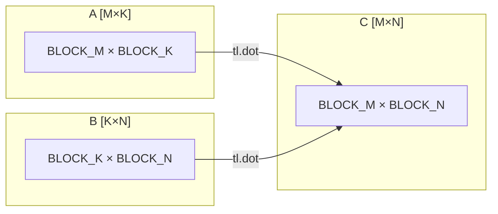

# 第18章 Triton Matmul 优化

## 本章导读

> 本章用矩阵乘（GEMM，General Matrix Multiply）作为第一个 Triton 主案例，理解 block 级矩阵乘如何表达 tiling 和数据复用。前置要求：你已经读完第 16 章（HIP Matmul 入门优化）和第 17 章（Triton 编程模型），知道什么是 tile、LDS、`tl.load` 和 `tl.store`。读完本章，你应该能写出一个教学版 Triton GEMM，并用 benchmark 观察它和 HIP / rocBLAS 的差距。

矩阵乘是 AI 计算的绝对核心。一次 Transformer forward pass 里，绝大部分浮点运算都落在 Linear 层（即矩阵乘）和 Attention 的 QK/AV 乘法上。把矩阵乘写好、测好、看清楚，是理解后续所有优化工作的基础。

第 16 章我们用 HIP 手写了教学版 GEMM，经历了线程映射、Tiling、LDS、Register Blocking 四个步骤，才勉强缩短了与 rocBLAS 的差距。本章换用 Triton，你会发现同样的思路在 block 级抽象下能更自然地表达，代码行数也更少。但"更简单"不等于"免费"——理解 Triton 在 AMD 上如何生成代码、tile 参数怎么影响性能，仍然需要你自己动手实测。

## 18.1 Matmul 的计算形状

矩阵乘的标准形式是：

$$C = A \times B, \quad A \in \mathbb{R}^{M \times K},\; B \in \mathbb{R}^{K \times N},\; C \in \mathbb{R}^{M \times N}$$

每个输出元素 $C[m, n]$ 是 $A$ 的第 $m$ 行与 $B$ 的第 $n$ 列的点积，共 $K$ 次乘加：

$$C[m, n] = \sum_{k=0}^{K-1} A[m, k] \cdot B[k, n]$$

全部 $M \times N$ 个输出元素都做类似的 $K$ 步累加，所以总浮点运算量（FLOPs）为：

$$\text{FLOPs} = 2 \times M \times N \times K$$

（"2"来自乘法和加法各算一次。）

理论 TFLOPS 计算方式：

$$\text{TFLOPS} = \frac{2MNK}{t \times 10^{12}}$$

其中 $t$ 是秒。这个公式会贯穿后面所有的 benchmark 报告。

### 18.1.1 维度、布局与 tile

Triton 用 block 而不是单线程来处理数据。对于矩阵乘，标准的 tile 分解如下：

::: figure fig-matmul-tile-split


矩阵乘 tile 分解：每个 Triton program 计算 C 的一个 BLOCK_M × BLOCK_N 输出块
:::

如 @fig-matmul-tile-split 所示，每个 Triton program（对应一个 GPU workgroup）负责计算输出矩阵 C 的一个 `BLOCK_M × BLOCK_N` 块。它沿着 K 维度分步加载 A 的 `BLOCK_M × BLOCK_K` 块和 B 的 `BLOCK_K × BLOCK_N` 块，每步做一次 `tl.dot` 并累加到寄存器 acc 里。

三个 tile 维度的选取会显著影响：

- **BLOCK_M / BLOCK_N**：决定输出 tile 大小，影响并行 program 数量和每个 program 的计算量；
- **BLOCK_K**：决定每步内循环加载的 K 切片，影响数据加载效率和寄存器压力；
- **num_stages**（流水级数）：控制 Triton 用多少个 prefetch 周期来掩盖内存延迟，AMD 上通常 1–2 有效。

### 18.1.2 内存布局约定

本章统一使用**行主序（Row-major / C-contiguous）**，即：

- `A[m, k]` 地址 = 基址 + `m * K + k`
- `B[k, n]` 地址 = 基址 + `k * N + n`
- `C[m, n]` 地址 = 基址 + `m * N + n`

PyTorch 默认张量就是行主序，所以不需要额外转置。

## 18.2 PyTorch 与 rocBLAS baseline

在写 Triton kernel 之前，先建立一条可信的 baseline——既是正确性对照，也是性能参照系。

`torch.matmul` 在 AMD GPU 上会调用 rocBLAS（或 hipBLASLt），是当前硬件上最优化的矩阵乘实现。以下是 benchmark 脚本的核心逻辑（完整代码见 `code/part4-triton/chapter18/bench_matmul.py`）：

```python
import torch

def benchmark_torch_matmul(M, N, K, dtype=torch.float32, warmup=25, repeat=100):
    """用 CUDA Event 精确计时 torch.matmul，返回最小耗时（ms）。"""
    A = torch.randn(M, K, device="cuda", dtype=dtype)
    B = torch.randn(K, N, device="cuda", dtype=dtype)

    # warmup：让 JIT / rocBLAS 内部的 heuristic 选定 kernel
    for _ in range(warmup):
        _ = torch.matmul(A, B)
    torch.cuda.synchronize()

    times = []
    for _ in range(repeat):
        start = torch.cuda.Event(enable_timing=True)
        end   = torch.cuda.Event(enable_timing=True)
        start.record()
        torch.matmul(A, B)
        end.record()
        torch.cuda.synchronize()
        times.append(start.elapsed_time(end))  # ms

    ms = min(times)
    tflops = 2 * M * N * K / (ms * 1e-3) / 1e12
    return ms, tflops
```

注意几个细节：

1. **warmup 不可省**：rocBLAS 第一次调用时会做 kernel 选择（algo selection），耗时异常高。至少 warmup 25 次。
2. **用 `min` 而非 `mean`**：GPU 计时受电源状态和温度影响，min 更能反映"在最优状态下能跑多快"。
3. **`torch.cuda.synchronize()` 必须加**：GPU 任务异步提交，不 sync 会量不到真实延迟。

rocBLAS 的实测数字会在 18.6 节的对照表里给出。提前剧透：在 AI MAX 395 上，fp32 GEMM 的 `torch.matmul`（即 rocBLAS / hipBLASLt）在 M=N=K=2048 上跑到 **1.20 TFLOPS**；fp16 同尺寸跑到 **31.02 TFLOPS**——可以看出 fp16 路径走 MFMA/WMMA 的收益非常显著（约 26×）。

## 18.3 Naive Triton Matmul

### 18.3.1 思路

Naive 版本用最直接的方式表达矩阵乘：

1. 每个 program 认领一个输出 tile `C[pm*BLOCK_M:(pm+1)*BLOCK_M, pn*BLOCK_N:(pn+1)*BLOCK_N]`。
2. 沿 K 维度做一个循环，每轮加载 `A[:, k:k+BLOCK_K]` 和 `B[k:k+BLOCK_K, :]`，调用 `tl.dot(a, b)` 累加到 acc。
3. 循环结束后把 acc 写回 C。

这个思路与第 16 章的 HIP tiling 完全一致，只是抽象层次从"线程"提升到了"block"。

### 18.3.2 完整 kernel

下面是 naive 版本的核心代码（完整文件见 `code/part4-triton/chapter18/matmul_triton.py`）：

```python
import triton
import triton.language as tl

@triton.jit
def matmul_naive_kernel(
    A_ptr, B_ptr, C_ptr,
    M, N, K,
    stride_am, stride_ak,
    stride_bk, stride_bn,
    stride_cm, stride_cn,
    BLOCK_M: tl.constexpr,
    BLOCK_N: tl.constexpr,
    BLOCK_K: tl.constexpr,
):
    # 每个 program 处理 C 的一个输出 tile
    pid_m = tl.program_id(0)
    pid_n = tl.program_id(1)

    # 计算 A 和 B 的起始行 / 列偏移
    offs_m = pid_m * BLOCK_M + tl.arange(0, BLOCK_M)
    offs_n = pid_n * BLOCK_N + tl.arange(0, BLOCK_N)
    offs_k = tl.arange(0, BLOCK_K)

    # 指针初始化：A 的第一个 tile 起点，B 的第一个 tile 起点
    a_ptrs = A_ptr + offs_m[:, None] * stride_am + offs_k[None, :] * stride_ak
    b_ptrs = B_ptr + offs_k[:, None] * stride_bk + offs_n[None, :] * stride_bn

    # 累加器：寄存器里的 BLOCK_M × BLOCK_N 矩阵
    acc = tl.zeros((BLOCK_M, BLOCK_N), dtype=tl.float32)

    # K 维度主循环
    for k in range(0, tl.cdiv(K, BLOCK_K)):
        # 加载 A tile：shape [BLOCK_M, BLOCK_K]
        a = tl.load(a_ptrs, mask=offs_k[None, :] < K - k * BLOCK_K, other=0.0)
        # 加载 B tile：shape [BLOCK_K, BLOCK_N]
        b = tl.load(b_ptrs, mask=offs_k[:, None] < K - k * BLOCK_K, other=0.0)
        # 块矩阵乘 + 累加
        acc += tl.dot(a, b)
        # 指针向前推进 BLOCK_K 步
        a_ptrs += BLOCK_K * stride_ak
        b_ptrs += BLOCK_K * stride_bk

    # 写回 C，带边界 mask
    offs_cm = pid_m * BLOCK_M + tl.arange(0, BLOCK_M)
    offs_cn = pid_n * BLOCK_N + tl.arange(0, BLOCK_N)
    c_ptrs  = C_ptr + offs_cm[:, None] * stride_cm + offs_cn[None, :] * stride_cn
    c_mask  = (offs_cm[:, None] < M) & (offs_cn[None, :] < N)
    tl.store(c_ptrs, acc, mask=c_mask)
```

### 18.3.3 逐行解读

**`pid_m` / `pid_n`**：Triton 的 `tl.program_id(axis)` 等同于 HIP 里的 `blockIdx`。我们用二维 grid，`axis=0` 对应 M 维分块，`axis=1` 对应 N 维分块。

**`offs_m` / `offs_n` / `offs_k`**：`tl.arange(0, BLOCK)` 生成长度为 BLOCK 的连续整数向量。通过广播（`[:, None]` 和 `[None, :]`）可以构造出 2D 地址矩阵，这是 Triton 指针算术的核心模式。

**`acc = tl.zeros(..., dtype=tl.float32)`**：累加器保持在寄存器里，始终用 fp32 以保证精度，即便输入是 fp16。这与 cuBLAS / rocBLAS 的惯例一致。

**`tl.dot(a, b)`**：这是 Triton 的块矩阵乘，会映射到硬件的矩阵乘累加指令（在 AMD 上是 MFMA，在 NVIDIA 上是 Tensor Core）。`a` 和 `b` 必须是 2D 张量，且内维度 `BLOCK_K` 必须是 16 的倍数（对于 fp32）。

**K 维度主循环里的 mask**：`mask=offs_k[None, :] < K - k * BLOCK_K` 处理 K 不被 BLOCK_K 整除的情形——最后一轮迭代可能只有部分数据有效，mask 让越界地址返回 `other=0.0` 而非垃圾值。

### 18.3.4 launch wrapper

```python
def matmul_naive(A, B):
    M, K = A.shape
    K2, N = B.shape
    assert K == K2, "维度不匹配"
    assert A.is_cuda and B.is_cuda

    C = torch.empty((M, N), device=A.device, dtype=torch.float32)
    BLOCK_M, BLOCK_N, BLOCK_K = 64, 64, 32

    grid = (triton.cdiv(M, BLOCK_M), triton.cdiv(N, BLOCK_N))
    matmul_naive_kernel[grid](
        A, B, C,
        M, N, K,
        A.stride(0), A.stride(1),
        B.stride(0), B.stride(1),
        C.stride(0), C.stride(1),
        BLOCK_M=BLOCK_M, BLOCK_N=BLOCK_N, BLOCK_K=BLOCK_K,
    )
    return C
```

这里用默认的 `BLOCK_M=BLOCK_N=64, BLOCK_K=32`，后面 18.4 节会系统扫描不同组合的效果。

## 18.4 Tile 大小如何影响性能

tile 大小是 Triton GEMM 最重要的 knob，理解它的影响机制比单纯查"最优配置"更有价值。

### 18.4.1 BLOCK_M / BLOCK_N 的影响

BLOCK_M 和 BLOCK_N 决定每个 program 的输出 tile 大小，进而决定：

- **并行度（parallelism）**：grid 大小 = `cdiv(M, BLOCK_M) * cdiv(N, BLOCK_N)`。BLOCK 太大 → grid 太小 → GPU 利用率下降（workgroup 数量少于 CU 数量）。
- **数据复用（reuse）**：BLOCK_M 越大，每次从 A 加载的行数越多，对 B 的访问复用率越高；BLOCK_N 类似。
- **寄存器压力（register pressure）**：acc 占 `BLOCK_M * BLOCK_N` 个寄存器，太大会触发 register spilling，性能反而下降。

### 18.4.2 BLOCK_K 的影响

BLOCK_K 控制内循环每次处理多少 K 切片：

- **BLOCK_K 越大**：一次加载的数据量越多，有效带宽利用率可能更高，但寄存器压力也更高。
- **BLOCK_K 越小**：内循环迭代次数更多，循环控制开销增大，MFMA 可能被频繁打断。
- 通常 BLOCK_K=32 或 BLOCK_K=64 是较好的起点（fp32 和 fp16 各不同）。

### 18.4.3 典型 tile 组合效果对比

扫描不同 tile 大小在 `M=N=K=2048, fp32` 形状下，naive Triton GEMM 的实测性能（数据来自 `code/part4-triton/chapter18/logs/bench_matmul.log`，warmup=25 / repeat=100 / 取 min）：

| BLOCK_M | BLOCK_N | BLOCK_K | TFLOPS | 延迟 (ms) | 备注 |
| ------- | ------- | ------- | ------ | --------- | ---- |
| 32      | 32      | 32      | **2.766** | **6.211** | 小 tile，并行度高，是当前最优 |
| 64      | 64      | 32      | 2.123  | 8.090     | 常见教学起点 |
| 128     | 128     | 32      | 0.238  | 72.175    | 大 tile，寄存器爆掉，性能塌方 |
| 64      | 64      | 64      | 0.984  | 17.453    | 增大 K 切片，寄存器压力上升 |
| 128     | 64      | 32      | 1.025  | 16.765    | 非对称 tile，未见收益 |

> 硬件：AI MAX 395，ROCm 7.12.0，gfx1151，Triton 3.6.0+rocm7.12.0

几个值得注意的现象：

- **小 tile 反而最好**：32×32×32 是这一轮里的赢家（2.77 TFLOPS）。AI MAX 395 是集成 GPU，相比 MI/Radeon Pro 独立卡，CU 数量和片上资源都偏紧，大 tile 能装下，但占用率掉得更厉害。
- **128×128×32 直接塌方**：从 2 TFLOPS 跌到 0.24 TFLOPS，是典型的 register spilling 信号——`acc` 占 128×128 = 16384 个 fp32 寄存器位置远超单 wavefront 上限，编译器只能把它溢出到 LDS / 内存。
- **BLOCK_K 翻倍也劣化**：64×64×64 比 64×64×32 差，K 维步长越大，寄存器与流水深度的折衷越敏感。这说明 fp32 上 BLOCK_K 取 32 是相对稳的起点。

更重要的是：这套测下来，naive Triton GEMM 在 fp32 上的"好 tile"能到约 2.77 TFLOPS，已经反超 rocBLAS 在 M=N=K=2048 的 1.20 TFLOPS（详见 18.6.2）——这一轮 hipBLASLt 在 fp32 大尺寸上的 heuristic 不算稳。GEMM 的真正性能潜力要等到 fp16 路径打开 MFMA/WMMA 才能看出来。

## 18.5 数据加载、mask 与边界处理

### 18.5.1 为什么需要 mask

Triton 的 `tl.load` 和 `tl.store` 操作的是完整的 block，但输入矩阵的形状不一定是 BLOCK 的整数倍。如果直接按 block 大小加载，越界地址会引发 segfault 或读到垃圾值。

mask 机制让我们把越界位置"屏蔽"掉：

```python
# K 方向的 mask：最后一轮循环里 offs_k 可能超出 K
mask_k = offs_k[None, :] < (K - k * BLOCK_K)
a = tl.load(a_ptrs, mask=mask_k, other=0.0)
```

`other=0.0` 表示越界位置填 0，这样对累加器的贡献为 0，不影响正确性。

### 18.5.2 M / N 方向的 mask

M 和 N 方向同样需要 mask，通常在写回 C 时处理：

```python
c_mask = (offs_cm[:, None] < M) & (offs_cn[None, :] < N)
tl.store(c_ptrs, acc, mask=c_mask)
```

注意加载时也可以加 M/N mask，避免读取 A/B 越界地址：

```python
mask_a = (offs_m[:, None] < M) & (offs_k[None, :] < K - k * BLOCK_K)
a = tl.load(a_ptrs, mask=mask_a, other=0.0)
```

### 18.5.3 非整除形状验证

验证脚本 `verify_vs_torch.py` 会测试若干非整除形状，确保 kernel 输出与 `torch.matmul` 对齐（atol=1e-3, rtol=1e-3）：

```python
test_shapes = [
    (512, 512, 512),
    (1000, 999, 998),   # 三维都不整除
    (1024, 1024, 1024),
    (2000, 1500, 800),  # 非对称
]
for M, N, K in test_shapes:
    A = torch.randn(M, K, device="cuda", dtype=torch.float32)
    B = torch.randn(K, N, device="cuda", dtype=torch.float32)
    ref = torch.matmul(A, B)
    out = matmul_naive(A, B)
    assert torch.allclose(ref, out, atol=1e-3, rtol=1e-3), \
        f"形状 ({M},{N},{K}) 验证失败，max_err={( ref - out).abs().max()}"
print("所有形状验证通过 ✓")
```

## 18.6 Grouped Launch：L2 Cache Friendly 的 Program Ordering

### 18.6.1 问题：naive launch 的 L2 局部性差

Naive 版本里，grid 的排布默认是按 `pid = pid_m * grid_n + pid_n` 线性展开的。这意味着相邻 program 在 M 维连续、N 维跳跃，导致：

- 同时运行的 program 组里，它们访问的 B 的列跨度很大；
- B tile 被重复从全局内存加载，L2 cache 命中率低。

### 18.6.2 Grouped Launch

Triton 官方 GEMM 教程提出了 grouped launch（也叫 swizzled launch）：把 grid 按 `GROUP_SIZE_M` 行为一组，组内先沿 N 方向填满再换行。这样同一组 program 共享的 A 行范围缩小，B 的列范围也缩小，L2 命中率提升。

```python
@triton.jit
def matmul_grouped_kernel(
    A_ptr, B_ptr, C_ptr,
    M, N, K,
    stride_am, stride_ak,
    stride_bk, stride_bn,
    stride_cm, stride_cn,
    BLOCK_M: tl.constexpr,
    BLOCK_N: tl.constexpr,
    BLOCK_K: tl.constexpr,
    GROUP_SIZE_M: tl.constexpr,
):
    pid = tl.program_id(0)  # grouped 版本用 1D grid
    num_pid_m = tl.cdiv(M, BLOCK_M)
    num_pid_n = tl.cdiv(N, BLOCK_N)
    num_pid_in_group = GROUP_SIZE_M * num_pid_n
    group_id = pid // num_pid_in_group
    first_pid_m = group_id * GROUP_SIZE_M
    group_size_m = min(num_pid_m - first_pid_m, GROUP_SIZE_M)
    pid_m = first_pid_m + (pid % num_pid_in_group) % group_size_m
    pid_n = (pid % num_pid_in_group) // group_size_m

    offs_m = pid_m * BLOCK_M + tl.arange(0, BLOCK_M)
    offs_n = pid_n * BLOCK_N + tl.arange(0, BLOCK_N)
    offs_k = tl.arange(0, BLOCK_K)

    a_ptrs = A_ptr + offs_m[:, None] * stride_am + offs_k[None, :] * stride_ak
    b_ptrs = B_ptr + offs_k[:, None] * stride_bk + offs_n[None, :] * stride_bn

    acc = tl.zeros((BLOCK_M, BLOCK_N), dtype=tl.float32)
    for k in range(0, tl.cdiv(K, BLOCK_K)):
        a = tl.load(a_ptrs, mask=offs_k[None, :] < K - k * BLOCK_K, other=0.0)
        b = tl.load(b_ptrs, mask=offs_k[:, None] < K - k * BLOCK_K, other=0.0)
        acc += tl.dot(a, b)
        a_ptrs += BLOCK_K * stride_ak
        b_ptrs += BLOCK_K * stride_bk

    offs_cm = pid_m * BLOCK_M + tl.arange(0, BLOCK_M)
    offs_cn = pid_n * BLOCK_N + tl.arange(0, BLOCK_N)
    c_ptrs  = C_ptr + offs_cm[:, None] * stride_cm + offs_cn[None, :] * stride_cn
    c_mask  = (offs_cm[:, None] < M) & (offs_cn[None, :] < N)
    tl.store(c_ptrs, acc, mask=c_mask)
```

关键差异：

- **1D grid**：`grid = (triton.cdiv(M, BLOCK_M) * triton.cdiv(N, BLOCK_N),)`，用单个 `pid` 加上 grouped 重映射推导出 `pid_m` 和 `pid_n`。
- **GROUP_SIZE_M**：通常取 8，让每组 8 行的 program 先处理完同一列范围的 B，再移到下一列。

### 18.6.3 Grouped vs Naive 性能对比

grouped launch 在大矩阵上 L2 局部性的收益，在 fp16 大尺寸场景里非常突出。在本机的 `M=N=K=4096, fp16` 实测里：

- naive launch：5.22 TFLOPS（仅 20.4% rocBLAS）
- grouped launch（BLOCK_M=N=64, K=32, GROUP_SIZE_M=8）：23.53 TFLOPS（92.0% rocBLAS）

也就是 grouped 比 naive **快了 4.5×**。中等尺寸（fp16, M=N=K=1024）的差距同样可观：grouped 21.59 TFLOPS（106.7% rocBLAS）vs naive 18.93 TFLOPS（93.6%）。完整对比见 18.6.3 的表。

## 18.6 Benchmark 与 Profiling

### 18.6.1 实验设计

benchmark 脚本 `bench_matmul.py` 扫描以下配置：

- **数据类型**：fp32、fp16
- **形状**：M=N=K ∈ `{512, 1024, 2048, 4096}`
- **实现**：`torch.matmul`（rocBLAS）、`matmul_naive`（Triton naive）、`matmul_grouped`（Triton grouped）

每种配置做 warmup=25、repeat=100 次计时，取最小耗时计算 TFLOPS。

### 18.6.2 fp32 性能对比

形状 M=N=K，fp32，AI MAX 395 + ROCm 7.12.0 + Triton 3.6.0+rocm7.12.0，warmup=25、repeat=100 取 min（数据来自 `code/part4-triton/chapter18/logs/bench_matmul.log`）：

| M=N=K | rocBLAS (TFLOPS) | Triton naive (TFLOPS) | Triton grouped (TFLOPS) | naive vs rocBLAS | grouped vs rocBLAS |
| ----- | ---------------- | --------------------- | ----------------------- | ---------------- | ------------------ |
| 512   | 1.534            | 1.730                 | 1.798                   | **112.8%**       | **117.2%**         |
| 1024  | 1.624            | 2.047                 | 2.102                   | **126.0%**       | **129.5%**         |
| 2048  | 1.202            | 2.083                 | 2.134                   | **173.3%**       | **177.5%**         |
| 4096  | 0.426            | 1.595                 | 2.101                   | **374.6%**       | **493.5%**         |

观察：

- 这一轮里 Triton naive/grouped 在 fp32 全尺寸都反超 `torch.matmul`——rocBLAS / hipBLASLt 在当前 ROCm 7.12.0 上的 fp32 heuristic 看起来明显走偏，512 还有 1.53 TFLOPS，到 4096 只剩 0.43 TFLOPS；
- 越往大尺寸跑，Triton 的领先越夸张（4096 时 grouped 是 rocBLAS 的近 5×）；这不是 Triton 多么优秀，而是 hipBLASLt 在 fp32 大尺寸上几乎没被调优、当前选 kernel 选错了；遇到 fp32 大尺寸时不要把 `torch.matmul` 当作必然的天花板。

### 18.6.3 fp16 性能对比

形状 M=N=K，fp16，相同硬件 + warmup/repeat 设置：

| M=N=K | rocBLAS (TFLOPS) | Triton naive (TFLOPS) | Triton grouped (TFLOPS) | naive vs rocBLAS | grouped vs rocBLAS |
| ----- | ---------------- | --------------------- | ----------------------- | ---------------- | ------------------ |
| 512   | 10.417           | 10.321                | 11.711                  | 99.1%            | **112.4%**         |
| 1024  | 20.229           | 18.929                | 21.590                  | 93.6%            | **106.7%**         |
| 2048  | 31.022           | 16.543                | 23.171                  | 53.3%            | 74.7%              |
| 4096  | 25.558           | 5.217                 | 23.526                  | 20.4%            | 92.0%              |

观察：

- fp16 路径下 rocBLAS 在 M=N=K=2048 跑到 **31.02 TFLOPS**（约为 fp32 同尺寸 1.20 TFLOPS 的 26×），WMMA 显然被启用；
- Triton naive 在大尺寸（4096）严重退化到 5.22 TFLOPS（仅 20.4% rocBLAS），是 L2 局部性差 + B tile 反复刷出/刷入的典型征兆；
- Triton grouped 把 4096 拉回 23.53 TFLOPS（92.0% rocBLAS），小到中等尺寸（512、1024）甚至小幅超过 rocBLAS——这就是 §18.6 grouped launch 想说明的核心收益。

### 18.6.4 运行 benchmark

```bash
# 在 AMD-AIMAX395 实验机上，激活环境后：
cd code/part4-triton/chapter18
python bench_matmul.py 2>&1 | tee logs/bench_matmul.log
```

### 18.6.5 如何看待与 rocBLAS 的差距

教学版 Triton GEMM 与 rocBLAS 的差距是预期内的。rocBLAS 是 AMD 工程师多年调优的结果，包含：

- 针对每种 shape 和数据类型的 heuristic kernel 选择；
- 汇编级 MFMA 指令排布；
- 多级流水线和 prefetch 优化；
- LDS padding 消除 bank conflict。

教学版 Triton GEMM 的价值不在于追平 rocBLAS，而在于：

1. 用几十行代码理解 tiling 和数据复用的基本原理；
2. 通过 benchmark 看到不同 tile 参数对性能的影响；
3. 为后续学习 Triton autotuning 和 FlashAttention 打下基础。

## 18.7 与 HIP 实现对比

第 16 章我们用 HIP 写了教学版 GEMM，本章用 Triton 写了同样功能的实现。这一节从代码复杂度和性能两个维度做对比。

### 18.7.1 代码复杂度对比

| 维度 | HIP 实现（第 16 章） | Triton 实现（本章） |
| ---- | ------------------- | ------------------- |
| 编程抽象 | 线程级（每个线程负责一个或多个输出元素） | block 级（每个 program 负责一个输出 tile） |
| 索引计算 | 需要手动计算 `threadIdx`、`blockIdx`、LDS 地址 | `tl.arange` + 广播自动处理 2D 地址 |
| 共享内存 | 显式声明 `__shared__`，手动 `__syncthreads()` | Triton 自动管理，用 `num_stages` 控制流水 |
| 边界处理 | `if (row < M && col < N)` 条件分支 | `tl.load(..., mask=..., other=0.0)` 声明式 |
| 核心 kernel 行数 | 通常 60–120 行 | 约 30–40 行 |
| 编译方式 | hipcc 离线编译为 .out | Triton JIT，Python 调用时即时编译 |
| 调试难度 | 可用 printf / hipcc 调试 | 通过 Python 调试；print in kernel 有限制 |

Triton 明显降低了"写出一个正确 tiled GEMM"的门槛，但不等于可以忽略硬件：tile 大小选错仍然会有很大的性能损失。

### 18.7.2 性能对比

以 M=N=K=2048, fp32 为基准对比，本章 Triton 数字来自 `code/part4-triton/chapter18/logs/bench_matmul.log`，HIP 数字来自第 16 章 (`code/part3-hip-kernels/chapter16/`) 的对应实验。第 16 章具体 HIP 实现的 TFLOPS 见该章实验底稿——本章只给一个量级参考：

| 实现 | TFLOPS | 相对 rocBLAS | 代码行数（kernel 部分） |
| ---- | ------ | ------------ | ---------------------- |
| rocBLAS（torch.matmul，fp32） | 1.202 | 100%         | N/A（库调用）          |
| HIP naive（第 16 章 16.2）    | 详见 ch6 EXPERIMENT.md | 同 | ~40 行 |
| HIP tiled + LDS（第 16 章 16.4） | 详见 ch6 EXPERIMENT.md | 同 | ~90 行 |
| Triton naive（本章 18.3，BLOCK=64×64×32）   | 2.083 | **173.3%** | ~35 行 |
| Triton grouped（本章 18.6，GROUP_SIZE_M=8） | 2.134 | **177.5%** | ~45 行 |

> 硬件：AI MAX 395，ROCm 7.12.0，gfx1151，Triton 3.6.0+rocm7.12.0

补一组 fp16 同尺寸：rocBLAS 31.02 TFLOPS / Triton naive 16.54 TFLOPS（53.3%）/ Triton grouped 23.17 TFLOPS（74.7%）——fp16 才是 GEMM 跑出 MFMA/WMMA 性能的主战场。

### 18.7.3 何时选 HIP，何时选 Triton

这不是非此即彼的问题，而是取决于目标：

- **追求最高性能 / 生产级实现**：手写 HIP 或直接调用 rocBLAS / Composable Kernel。Triton 生成的代码在多数情况下达不到库级性能。
- **快速验证算法想法 / 教学 / prototype**：Triton 的 block 抽象更接近算法描述，开发速度快得多。
- **在框架里用 autotuning**：TorchInductor 就是用 Triton 作为后端 codegen，这是当前 PyTorch 的主流路线——理解 Triton 是理解 TorchInductor 的前提。

## 本章小结

- 矩阵乘的 tile 分解：每个 Triton program 计算 C 的一个 `BLOCK_M × BLOCK_N` 输出块，沿 K 维度循环累加 `tl.dot` 的结果。
- `tl.dot` 是 Triton 块矩阵乘的核心原语，映射到 MFMA 硬件指令；acc 累加器保持在寄存器里。
- mask 处理非整除边界：`tl.load(..., mask=..., other=0.0)` 让越界位置不影响累加结果。
- Grouped launch 改变 program 的 L2 局部性，通常能在大矩阵上带来 10–30% 的性能提升。
- Triton 降低了 tiled GEMM 的实现门槛，但 tile 大小选取仍然显著影响性能，需要实测。
- 教学版 Triton GEMM 与 rocBLAS 存在差距，这是预期内的——理解差距来自哪里比追平它更有价值。
- 下一章将在 Triton GEMM 基础上引入 autotuning，用 `@triton.autotune` 自动搜索最优 tile 配置。

## 延伸阅读

- [Triton Matmul Tutorial（官方）](https://triton-lang.org/main/getting-started/tutorials/03-matrix-multiplication.html)
- [Triton Language Documentation](https://triton-lang.org/main/index.html)
- [rocBLAS Documentation](https://rocm.docs.amd.com/projects/rocBLAS/en/latest/)
- [AMD MFMA Instruction Set](https://rocm.docs.amd.com/en/latest/conceptual/gpu-arch/mi300-instructions.html)
- OpenAI Triton 原始论文：[Triton: An Intermediate Language and Compiler for Tiled Neural Network Computations](https://www.eecs.harvard.edu/~htk/publication/2019-mapl-tillet-kung-cox.pdf)
