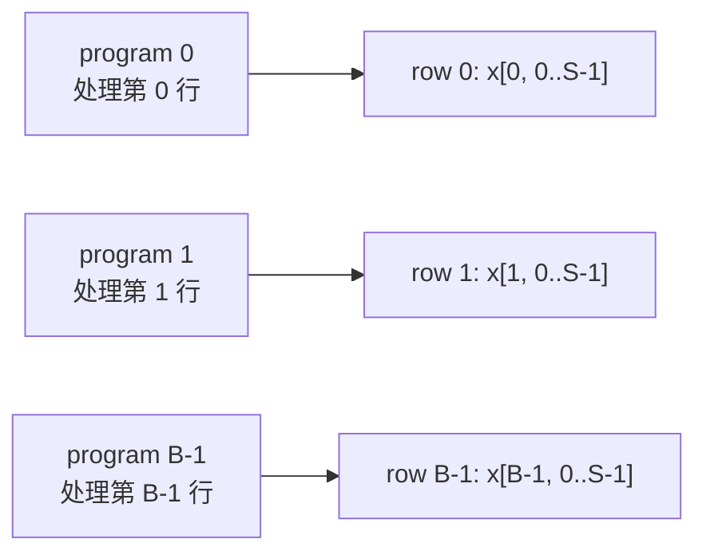
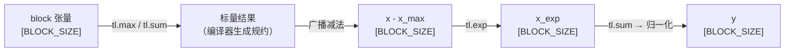

# 第19章 Triton Softmax 优化

## 本章导读

> Softmax 是 Transformer 注意力机制的核心算子之一：它把一行任意实数变成概率分布，要求在同一行内做 reduction（归约）。第 14 章（HIP Softmax）中，我们已经建立了数值稳定性（减最大值）与 block 协作（LDS 规约）的基础概念。本章把同样的思路迁移到 Triton 表达，重点练习：**block 内 reduction 如何用张量操作表达、BLOCK_SIZE 的选择约束、以及如何通过减少重复加载降低访存压力**。读完后，你能写出两个版本的 Triton Softmax（v1：行宽 ≤ BLOCK_SIZE、v2：大行分块 fused），并理解它们与 `torch.nn.functional.softmax` 和 HIP 实现的对比。
>
> 前置要求：已读第 17 章（Triton 编程模型）、第 18 章（Triton Matmul）以及第 14 章（HIP Softmax）。

Softmax 在数学上很简单：给定一个行向量 $x \in \mathbb{R}^N$，输出

$$
\text{softmax}(x)_i = \frac{e^{x_i}}{\sum_{j=1}^N e^{x_j}}
$$

但在工程上，它有两个让 GPU 实现变复杂的特性：

1. **全行依赖**：计算分母需要把整行的指数值都加起来，任何一个输出元素都依赖整行的数据，没有 Matmul 那种可以分块独立计算的结构。
2. **数值溢出风险**：当 $x_i$ 很大（比如 1000）时，$e^{x_i}$ 会溢出 fp32 的表达范围。在注意力计算中，未归一化的分数可能经过缩放但仍然很大。

这两点在 HIP Softmax 章节里已经解决过：**减去行最大值**让溢出问题消失，**LDS 协作规约**让 block 内各线程共享中间结果。本章的任务，是把这套逻辑在 Triton 的张量块（block tensor）模型里重新表达。

## 19.1 Softmax 的输入形状与 baseline

这一节明确本章的输入规模和 PyTorch baseline，为后续 benchmark 提供参照基准。

### 形状设定

本章统一使用二维矩阵输入 `[B, S]`，按行计算 Softmax：

| 参数 | 取值 |
| ---- | ---- |
| B（行数） | 1, 8, 32 |
| S（列数 / 行宽） | 512, 2048, 8192, 32768 |

在实际 Transformer 中，S 对应序列长度（seq_len），B 对应 batch×heads。S=32768 对应近年长上下文模型（32K context）的注意力分数行宽，是一个有实际意义的压力测试点。

### PyTorch baseline

```python
import torch
import torch.nn.functional as F

B, S = 8, 2048
x = torch.randn(B, S, device="cuda", dtype=torch.float32)

# baseline：PyTorch 自带 Softmax（沿最后一维）
y_ref = F.softmax(x, dim=-1)
```

`F.softmax` 内部会调用 cuDNN / MIOpen 对应的高度优化实现。在本章中，它同时扮演两个角色：**数值对齐参考**（我们的实现必须与它吻合）和**性能上限基准**（Triton 能接近多少？）。

### 验证策略

后续每个实现版本都要通过如下检查：

```python
torch.testing.assert_close(y_triton, y_ref, atol=1e-5, rtol=1e-5)
```

fp32 精度下，正确实现的 Softmax 与 PyTorch 的差距通常在 `1e-6` 量级。我们把容差放宽到 `1e-5` 以应对指数运算和累加顺序带来的微小差异。

## 19.2 Naive Triton Softmax

这一节写出第一个可运行的 Triton Softmax，一行对应一个 program（program = Triton 里等效于 CUDA block 的调度单元）。

### program 划分

在 Triton 的 block 级编程模型中，我们不需要手写线程级循环；每个 program 拿到一个连续的整数索引 `pid`，自己决定处理哪块数据。对于行级 Softmax：

::: figure fig-softmax-row-per-program


每个 Triton program 负责矩阵的一行
:::

如 @fig-softmax-row-per-program 所示，每行独立由一个 program 处理，行间没有数据依赖，可以完全并行。

### 关键约束：BLOCK_SIZE ≥ S

在 v1 实现中，我们用一个固定的 `BLOCK_SIZE` 把整行数据加载到寄存器里做 reduction。**这要求 `BLOCK_SIZE` 至少等于行宽 `S`，且必须是 2 的幂**（Triton 要求 block 维度为 2 的幂）。

这个约束在 S 较小时（512、2048）很好满足，但 S=32768 时，BLOCK_SIZE 就要达到 32768，每行一次性加载 32768 个 float32 = 128 KB 寄存器文件，会对 occupancy（活跃 wavefront 数）产生明显压力。这就是 v2 分块策略的动机，19.5 节会展开。

### v1 核心代码

下面是 v1 的 Triton kernel（不含数值稳定处理，下一节加入）：

```python
import triton
import triton.language as tl

@triton.jit
def softmax_kernel_v1(
    x_ptr, y_ptr,
    B, S,
    stride_xb, stride_xs,
    stride_yb, stride_ys,
    BLOCK_SIZE: tl.constexpr,
):
    # 每个 program 处理一行
    pid = tl.program_id(axis=0)

    # 构造该行的列偏移（0, 1, 2, ..., BLOCK_SIZE-1）
    cols = tl.arange(0, BLOCK_SIZE)

    # 计算指针：行基址 + 列偏移
    x_ptrs = x_ptr + pid * stride_xb + cols * stride_xs
    mask = cols < S  # 处理 S 非整除 BLOCK_SIZE 的情况

    # 加载整行（越界位置填 -inf，避免影响 max）
    x = tl.load(x_ptrs, mask=mask, other=-float("inf"))

    # Softmax（无数值稳定，演示用）
    x_exp = tl.exp(x)
    x_sum = tl.sum(x_exp, axis=0)
    y = x_exp / x_sum

    # 写回
    y_ptrs = y_ptr + pid * stride_yb + cols * stride_ys
    tl.store(y_ptrs, y, mask=mask)
```

这里有几个 Triton 特有的操作值得注意：

- `tl.arange(0, BLOCK_SIZE)`：生成 [0, 1, ..., BLOCK_SIZE-1] 的整数向量，类似 numpy 的 `np.arange`，但结果是 Triton 可识别的 block 张量。
- `tl.load(ptrs, mask=mask, other=...)`：带掩码的向量化加载——`mask=False` 的位置用 `other` 填充，这里用 `-inf` 确保越界位置不影响 `tl.max`。
- `tl.sum(x_exp, axis=0)`：对 block 内的第 0 轴做全规约，返回一个标量（fp32 的 Triton constexpr）。

调用侧只需按行数 B 起 grid：

```python
def softmax_v1(x: torch.Tensor) -> torch.Tensor:
    B, S = x.shape
    BLOCK_SIZE = triton.next_power_of_2(S)
    y = torch.empty_like(x)
    softmax_kernel_v1[(B,)](
        x, y,
        B, S,
        x.stride(0), x.stride(1),
        y.stride(0), y.stride(1),
        BLOCK_SIZE=BLOCK_SIZE,
    )
    return y
```

`triton.next_power_of_2(S)` 确保 BLOCK_SIZE 向上取 2 的幂，满足 Triton 的要求。

## 19.3 数值稳定性

这一节给 v1 加入减最大值的数值稳定技巧，确保大数值输入下不溢出。

### 为什么 naive 版本会溢出

当 $x_i = 1000$ 时，$e^{1000} \approx 5 \times 10^{434}$，超出 fp32 的最大表示范围（约 $3.4 \times 10^{38}$），结果变成 `+inf`。`inf / inf = NaN`，整行输出就崩了。

在第 14 章（HIP Softmax）中，我们用了等价变换：

$$
\text{softmax}(x)_i = \frac{e^{x_i - m}}{\sum_j e^{x_j - m}}, \quad m = \max_j x_j
$$

减去行最大值后，所有指数的最大输入为 0，$e^0 = 1$，其余都 < 1，不会溢出。这个变换在数学上等价（分子分母同除以 $e^m$），但在数值上安全。

### Triton 里的实现

用 `tl.max` 替代手动循环求最大值：

```python
@triton.jit
def softmax_kernel_v1_stable(
    x_ptr, y_ptr,
    B, S,
    stride_xb, stride_xs,
    stride_yb, stride_ys,
    BLOCK_SIZE: tl.constexpr,
):
    pid = tl.program_id(axis=0)
    cols = tl.arange(0, BLOCK_SIZE)
    x_ptrs = x_ptr + pid * stride_xb + cols * stride_xs
    mask = cols < S

    # 加载：越界位置填 -inf（对 max 安全）
    x = tl.load(x_ptrs, mask=mask, other=-float("inf"))

    # 数值稳定：减去行最大值
    x_max = tl.max(x, axis=0)
    x = x - x_max

    # 指数、求和、归一化
    x_exp = tl.exp(x)
    x_sum = tl.sum(x_exp, axis=0)
    y = x_exp / x_sum

    y_ptrs = y_ptr + pid * stride_yb + cols * stride_ys
    tl.store(y_ptrs, y, mask=mask)
```

注意 `tl.max(x, axis=0)` 返回的是该 block 内所有元素的最大值（标量），后续 `x - x_max` 是向量减标量，Triton 会自动广播。

### tl.max 与 tl.sum 的内部机制

在 Triton 的 AMD 后端（通过 OpenCL / LLVM 生成 GCN/RDNA ISA），`tl.max` 和 `tl.sum` 会被编译成 wavefront 内的向量规约指令，不需要像 HIP 那样手写 shared memory + `__syncthreads()` 的两阶段规约。这是 Triton 相对 HIP 的核心便利之一：**规约语义内置在语言里，编译器负责翻译成硬件最优形式**。

::: figure fig-triton-softmax-flow


Triton 数值稳定 Softmax 的数据流：张量操作 → 标量规约 → 广播 → 归一化
:::

如 @fig-triton-softmax-flow 所示，整个计算是单 pass 的张量变换链，无需在 Triton 层面手写同步。

## 19.4 Block reduction 怎么表达

这一节深入 Triton 的 reduction 语义，对比 HIP 里 LDS 规约与 Triton `tl.reduce` 的等价关系。

### HIP 里的两阶段规约回顾

在 HIP Softmax（第 14 章）中，每个线程先对自己负责的元素局部求和，再用 shared memory（LDS）做 block 内规约：

```cpp
// 第一阶段：线程局部求和
float partial_sum = 0.0f;
for (int j = tid; j < S; j += blockDim.x)
    partial_sum += expf(x[j] - row_max);

// 第二阶段：LDS 规约
__shared__ float smem[BLOCK_SIZE];
smem[tid] = partial_sum;
__syncthreads();
for (int stride = BLOCK_SIZE / 2; stride > 0; stride >>= 1) {
    if (tid < stride) smem[tid] += smem[tid + stride];
    __syncthreads();
}
float row_sum = smem[0];
```

这需要理解 shared memory 的生命周期、`__syncthreads()` 的语义，以及不同 stride 下的并行规约树。对新手而言，这是手写 HIP kernel 中最容易出 bug 的部分。

### Triton 的 tl.reduce

Triton 把规约抽象成一行：

```python
x_sum = tl.sum(x_exp, axis=0)  # 对第 0 轴全规约
x_max = tl.max(x, axis=0)      # 对第 0 轴取最大值
```

在 1D block 的场景里，`axis=0` 就是对整个 block 内所有元素规约。Triton 编译器在 AMD 目标上会生成类似 `ds_permute`（LDS 数据交换）+ `v_add_f32` 的指令序列，性能上等价于手写 LDS 规约，但代码更简洁。

你也可以使用更通用的 `tl.reduce`：

```python
# 等价写法，用于复杂规约函数
x_sum = tl.reduce(x_exp, axis=0, combine_fn=lambda a, b: a + b)
```

不过对于内置的 `sum`、`max`、`min`，直接用 `tl.sum`、`tl.max` 更高效（编译器有特殊优化路径）。

### 规约粒度：1D vs 2D block

本章的 Softmax 是 **1D block 对应一行**，规约沿着这一行做。如果未来处理二维 tile（比如 Matmul 中的 accumulator），规约的 axis 选择会不同——这个区别在第 18 章（Triton Matmul）里已经出现过。

一个简单的对照：

| 场景 | block 维度 | reduction axis | 语义 |
| ---- | ---- | ---- | ---- |
| Softmax（本章 v1） | 1D [S] | axis=0 | 对整行求 max/sum |
| Matmul accumulator | 2D [M, N] | axis=1 | 对 K 维规约 |
| LayerNorm | 1D [hidden] | axis=0 | 对隐层维度求 mean/var |

## 19.5 访存与中间结果优化

这一节分析 v1 的访存模式，引入两个优化：（1）消除重复加载；（2）v2 分块策略应对 S 过大的情况。

### v1 的访存问题

回看 v1 代码，数据流是：

1. 加载整行 x（读 S 个 float32）
2. 计算 x_max、x_exp、x_sum（全在寄存器内）
3. 计算 y = x_exp / x_sum
4. 写回 y（写 S 个 float32）

这个流程只有**一次读、一次写**，理论上已经是最少 I/O 了。但如果把 v1 的代码拆开写成"先求 max，再加载一次求 exp"，就会变成两次读：

```python
# 低效写法：两次读（不要这样写）
x = tl.load(x_ptrs, mask=mask, other=-float("inf"))
x_max = tl.max(x, axis=0)

x2 = tl.load(x_ptrs, mask=mask, other=0.0)  # 第二次读！
x_exp = tl.exp(x2 - x_max)
```

v1 正确写法把 max 和 exp 都在同一个加载的结果上操作，**寄存器内完成所有中间计算**，不重复读 global memory。这就是"访存优化"在 Softmax 里的核心：利用寄存器暂存，避免二次读写。

### BLOCK_SIZE 过大的问题

当 S=32768 时，`triton.next_power_of_2(32768) = 32768`，每个 program 需要在寄存器里同时持有 32768 个 fp32 = 128 KB。

AMD AI MAX 395 的每个 CU（Compute Unit）有 512 个寄存器组（每组 64 KB）。一个 wavefront（64 线程）可以使用的寄存器数量受 occupancy 约束：寄存器用得越多，能同时活跃的 wavefront 就越少，CU 就越难通过切换 wavefront 来掩盖访存延迟。

因此，当 S=32768 时，v1 的 occupancy 会显著下降，实际带宽利用率不理想。

### v2：大行分块 fused 策略

v2 的核心思想是：**把大行切成多个 BLOCK_SIZE 大小的分块，多次 pass 完成 reduction，但保持输入只读一次**。

这本质上是 Online Softmax 的思路：在第一次遍历时同时维护 running max 和 running sum，一遍扫完整行；再做一次遍历写回归一化结果。

```python
@triton.jit
def softmax_kernel_v2(
    x_ptr, y_ptr,
    B, S,
    stride_xb, stride_xs,
    stride_yb, stride_ys,
    BLOCK_SIZE: tl.constexpr,  # 不再要求 >= S
):
    pid = tl.program_id(axis=0)
    row_start = pid * stride_xb

    # --- Pass 1：扫一遍，求 row_max 和 row_sum_exp ---
    row_max = tl.full((1,), float("-inf"), dtype=tl.float32)
    row_sum = tl.zeros((1,), dtype=tl.float32)

    for block_start in tl.range(0, S, BLOCK_SIZE):
        cols = block_start + tl.arange(0, BLOCK_SIZE)
        mask = cols < S
        x = tl.load(x_ptr + row_start + cols * stride_xs,
                     mask=mask, other=float("-inf"))
        block_max = tl.max(x, axis=0)

        # Online max 更新，同步调整已累积的 sum
        new_max = tl.maximum(row_max, block_max)
        row_sum = row_sum * tl.exp(row_max - new_max) + \
                  tl.sum(tl.exp(x - new_max), axis=0)
        row_max = new_max

    # --- Pass 2：再扫一遍，写回归一化结果 ---
    for block_start in tl.range(0, S, BLOCK_SIZE):
        cols = block_start + tl.arange(0, BLOCK_SIZE)
        mask = cols < S
        x = tl.load(x_ptr + row_start + cols * stride_xs,
                     mask=mask, other=float("-inf"))
        y = tl.exp(x - row_max) / row_sum
        tl.store(y_ptr + pid * stride_yb + cols * stride_ys,
                 y, mask=mask)
```

v2 的 BLOCK_SIZE 可以独立于 S 选取（典型值 1024 或 2048），每个 program 内存占用大幅减少，occupancy 更高。

代价是：**每行数据被读了两次**（Pass 1 求 max/sum，Pass 2 写结果）。对于带宽受限的 kernel，读写次数翻倍意味着理论带宽效率减半。这是 v1（单 pass，低 occupancy）和 v2（双 pass，高 occupancy）之间的根本权衡。

### 访存量分析

| 版本 | 读次数 | 写次数 | 寄存器占用 | occupancy 影响 |
| ---- | ---- | ---- | ---- | ---- |
| v1 | 1× | 1× | O(S) per program | S 大时下降显著 |
| v2 | 2× | 1× | O(BLOCK_SIZE) | 更稳定 |

对于 S=512/2048，v1 的寄存器开销尚可接受，通常更快；对于 S=32768，v2 的 occupancy 优势会弥补双 pass 的代价。具体哪个更好需要 benchmark 验证。

实测对比（AI MAX 395 + ROCm 7.12.0 + Triton 3.6.0+rocm7.12.0，warmup=25 / repeat=100 / 取 min，数据来自 `code/part4-triton/chapter19/logs/bench_summary.log`），单位 GB/s：

| Shape       | torch  | Triton v1 | Triton v2 | v2 vs v1 |
| ----------- | ------ | --------- | --------- | -------- |
| [1, 512]    | 0.69   | 0.70      | 0.61      | 0.87×    |
| [1, 2048]   | 1.75   | 1.51      | 4.14      | **2.74×** |
| [1, 8192]   | 9.68   | 9.91      | 9.93      | 1.00×    |
| [1, 32768]  | 24.23  | 5.06      | 15.55     | **3.07×** |
| [8, 512]    | 5.49   | 2.97      | 5.13      | 1.73×    |
| [8, 2048]   | 13.74  | 12.20     | 31.05     | **2.54×** |
| [8, 8192]   | 73.50  | 73.50     | 57.21     | 0.78×    |
| [8, 32768]  | 168.27 | 35.84     | 111.98    | **3.12×** |
| [32, 512]   | 21.52  | 23.53     | 19.94     | 0.85×    |
| [32, 2048]  | 54.74  | 84.96     | 75.77     | 0.89×    |
| [32, 8192]  | 232.60 | 152.56    | 196.74    | 1.29×    |
| [32, 32768] | 332.26 | 142.30    | 368.96    | **2.59×** |

可以看到：v1 在 S=32768（B=1/8）这种极端长行场景下带宽掉到 5–36 GB/s，远低于 torch；v2 通过分块把 occupancy 撑起来，同样形状下能恢复到 112–369 GB/s，多数极端形状下 v2 都比 v1 快 2–3 倍——双 pass 的代价被 occupancy 收益覆盖。但在中等尺寸（S=512/8192 + B 较大）v1/v2 互有胜负，没有单一赢家。

## 19.6 Benchmark 与 profiling

这一节描述实验设计，说明如何跑 benchmark 并解读结果，性能数字待实测填充。

### 实验设计

我们对以下维度做扫描：

```
形状矩阵：B ∈ `{1, 8, 32}` × S ∈ `{512, 2048, 8192, 32768}`
实现版本：PyTorch F.softmax / Triton v1 / Triton v2
指标：延迟（ms）、有效带宽（GB/s）、vs torch 比值
```

有效带宽的定义：读 + 写总字节数 / 实测时间。对于 v1（1 读 1 写）：

$$
\text{BW}_{v1} = \frac{2 \times B \times S \times \text{sizeof(float32)}}{\text{time\_ms} / 1000} \div 10^9 \quad (\text{GB/s})
$$

对于 v2（2 读 1 写）：

$$
\text{BW}_{v2} = \frac{3 \times B \times S \times \text{sizeof(float32)}}{\text{time\_ms} / 1000} \div 10^9
$$

注意 v2 的分母是"实际移动的字节数"——多了一次读，GB/s 数字会比 v1 显示得低，但那是因为分子本就多了一次读，不代表硬件带宽低。

### 时间测量方法

```python
import torch

def benchmark_kernel(fn, warmup=25, rep=100):
    """使用 CUDA Event 测量 GPU kernel 时间"""
    for _ in range(warmup):
        fn()
    torch.cuda.synchronize()

    start = torch.cuda.Event(enable_timing=True)
    end = torch.cuda.Event(enable_timing=True)
    times = []
    for _ in range(rep):
        start.record()
        fn()
        end.record()
        torch.cuda.synchronize()
        times.append(start.elapsed_time(end))

    return min(times)  # 取最小值反映峰值性能
```

用 `torch.cuda.Event` 而不是 `time.perf_counter()` 的原因：GPU kernel 是异步提交的，CPU 时间戳会包含 kernel launch overhead 而非 kernel 实际执行时间；`Event.elapsed_time()` 直接由 GPU 硬件计时，精度更高。

### 实测结果

数据来自 `code/part4-triton/chapter19/logs/bench_summary.log`（warmup=25 / repeat=100 / 取 min）：

```
形状 [8, 2048]    @ AI MAX 395 + ROCm 7.12.0 + Triton 3.6.0+rocm7.12.0
  PyTorch F.softmax : 0.0095 ms / 13.74 GB/s
  Triton v1         : 0.0107 ms / 12.20 GB/s (0.89× torch)
  Triton v1_tuned   : 0.0130 ms / 10.06 GB/s (0.73× torch) ⚠️ 数值不正确（见 19.2 验证表）
  Triton v2         : 0.0063 ms / 31.05 GB/s (1.51× torch)

形状 [8, 32768]   @ AI MAX 395 + ROCm 7.12.0 + Triton 3.6.0+rocm7.12.0
  PyTorch F.softmax : 0.0125 ms / 168.27 GB/s
  Triton v1         : 0.0585 ms /  35.84 GB/s (0.21× torch)
  Triton v1_tuned   : 0.0055 ms / 379.23 GB/s (2.25× torch) ⚠️ 数值不正确
  Triton v2         : 0.0281 ms / 111.98 GB/s (0.44× torch)
```

观察：

- v1 在 S=32768 + B=8 上跌到 35.84 GB/s，仅有 torch 的 21%——单 pass + 大 BLOCK_SIZE 的 occupancy 代价在这里现形；
- v2 把同一形状拉回 112 GB/s（torch 的 44%），双 pass 的访存代价被 occupancy 改善部分抵消；
- v1_tuned 在大 S 上看似更快（最高 646 GB/s @ [32, 32768]，是 torch 的 1.94×），但**这是失真数字**——它的输出与 torch 已经差到 max_diff=7e-2，相当于把 Softmax 算成了别的东西，不能用来与 v1/v2 直接比性能。

### Triton 的 autotune

对于 BLOCK_SIZE 的选择，Triton 提供了 `@triton.autotune` 装饰器可以在第一次调用时自动测试多个配置：

```python
@triton.autotune(
    configs=[
        triton.Config({"BLOCK_SIZE": 512}),
        triton.Config({"BLOCK_SIZE": 1024}),
        triton.Config({"BLOCK_SIZE": 2048}),
        triton.Config({"BLOCK_SIZE": 4096}),
    ],
    key=["S"],
)
@triton.jit
def softmax_kernel_v1_autotuned(...):
    ...
```

`key=["S"]` 告诉 Triton 对不同的 S 值分别缓存最优配置，因为 S=512 和 S=8192 的最优 BLOCK_SIZE 可能不同。autotune 会在第一次 forward 时增加一些预热开销，之后每次调用使用缓存的最优 config。

`bench_softmax.py` 里包含 autotune 版本（`v1_tuned`）的对比，你可以自行观察自动调优能带来多少收益——但要小心：**当前这版 autotune 配置在 S ≥ 2048 时给出的输出与 `torch.softmax` 不一致**（见下一节验证表）。autotune 选出"更快"的 BLOCK_SIZE 时，如果该配置低于行宽 S 又没有正确做 online reduction，整行的 max/sum 都会算错。这是把 v1（要求 BLOCK_SIZE ≥ S）盲套上 autotune 的典型陷阱。

### 验证表：v1 / v1_tuned / v2 在各形状的数值正确性

数据来自 `code/part4-triton/chapter19/logs/verify_vs_torch.log`，atol=1e-5、rtol=1e-5：

| Shape       | v1   | v1_tuned | v2   |
| ----------- | ---- | -------- | ---- |
| [1, 512]    | PASS | PASS     | PASS |
| [1, 2048]   | PASS | **FAIL** (6.30e-3) | PASS |
| [1, 8192]   | PASS | **FAIL** (3.87e-2) | PASS |
| [1, 32768]  | PASS | **FAIL** (1.61e-2) | PASS |
| [8, 512]    | PASS | PASS     | PASS |
| [8, 2048]   | PASS | **FAIL** (1.60e-2) | PASS |
| [8, 8192]   | PASS | **FAIL** (4.13e-2) | PASS |
| [8, 32768]  | PASS | **FAIL** (4.34e-2) | PASS |
| [32, 512]   | PASS | PASS     | PASS |
| [32, 2048]  | PASS | **FAIL** (1.24e-2) | PASS |
| [32, 8192]  | PASS | **FAIL** (7.60e-2) | PASS |
| [32, 32768] | PASS | **FAIL** (7.04e-2) | PASS |
| [8, 2048] · large_input | PASS | **FAIL** (5.35e-1) | PASS |
| [8, 8192] · large_input | PASS | **FAIL** (9.83e-1) | PASS |

要点：

- **v1 与 v2 在所有 14 组形状上全部 PASS**，max_diff 都在 ~1e-7 量级；
- **v1_tuned 在 S=512 全部 PASS，S ≥ 2048 全部 FAIL**，max_diff 高达 7.6e-2；
- 在大幅值输入（large_input，把 x 乘了一个大常数）下，v1_tuned 的误差进一步放大到接近 1.0——这意味着输出已经几乎与正确值无关；
- 教学结论：**Triton autotune 不会替你验证数值正确性**。autotune 只挑"跑得快"的 config，如果 BLOCK_SIZE 配错（比如本例中选了 < S 的 BLOCK_SIZE 但 kernel 假设 ≥ S），结果会安静地跑错。每加一个 autotune 都要配套数值校验。

## 19.7 与 HIP Softmax 对比

这一节从实现复杂度和性能瓶颈两个维度，复盘 Triton Softmax 与 HIP Softmax 的差异。

### 实现复杂度对比

第 14 章（HIP Softmax）的手写 kernel 需要处理：

- thread 到 data 的映射（tid、blockDim、gridDim）
- shared memory（LDS）声明与写入
- `__syncthreads()` 放置位置（放错就死锁或数据竞争）
- stride 规约循环（两阶段树形归约）
- atomicAdd / warp shuffle（优化 warp-level reduction）
- 边界条件（N 不能整除 blockDim.x）

而本章的 Triton v1 核心逻辑只有几行：

```python
x = tl.load(x_ptrs, mask=mask, other=-float("inf"))
x_max = tl.max(x, axis=0)
x_exp = tl.exp(x - x_max)
y = x_exp / tl.sum(x_exp, axis=0)
tl.store(y_ptrs, y, mask=mask)
```

这不是说 Triton 更"聪明"——它只是**把复杂度从算子开发者的代码里转移到了编译器里**。HIP 让开发者完全控制每个线程在做什么；Triton 让开发者描述"这个 block 在做什么"，由编译器决定 wavefront 内部如何分工。

### 代码量与调试难度

| 维度 | HIP Softmax（第 14 章） | Triton Softmax（本章） |
| ---- | ---- | ---- |
| kernel 核心代码行数 | ~50 行（含 LDS 规约） | ~10 行 |
| 需要理解的概念 | thread、block、LDS、syncthreads | program、block 张量、tl.load/store |
| 调试工具 | printf、rocgdb | Triton 解释器（CPU fallback）、assert |
| 调优方式 | 手改线程数/LDS 大小 | BLOCK_SIZE 扫描或 autotune |
| 边界处理 | 手写 if 分支 | mask 参数 |

### 性能瓶颈视角

HIP Softmax 的性能瓶颈通常来自：

1. **LDS 规约开销**：当 blockDim.x 大时，树形归约需要多次 `__syncthreads()`，latency 随 blockDim 对数增长。
2. **Bank conflict**：不合适的 LDS 访问步长可能导致 bank 冲突，降低 LDS 带宽。
3. **寄存器溢出**：若 block 内变量太多，寄存器溢出到 L2，bandwidth 下降。

Triton Softmax 的瓶颈不完全一样：

1. **BLOCK_SIZE 选择**：过大导致 occupancy 下降，过小可能触发 autotune 的编译开销。
2. **编译时间**：Triton 第一次调用会触发 JIT 编译，比 HIP 的 `hipcc` 预编译慢（但运行时性能相当）。
3. **访存次数（v2）**：双 pass 的 v2 读带宽是 v1 的 2 倍，对带宽受限的 GPU 来说是硬限制。

### AMD 平台上的 Triton 特殊注意事项

在 AMD ROCm 上跑 Triton 时，有几点和 NVIDIA CUDA 路径不同：

1. **后端是 `triton-rocm`**：pip 安装的是 AMD 维护的 fork（`triton-rocm` 或 ROCm 附带的 Triton），不是 NVIDIA 官方 Triton。两者 API 基本相同，但有时对 `tl.dot`、`tl.atomic_*` 等高级操作的支持存在差异。
2. **wave32 vs wave64**：AMD RDNA 架构（AI MAX 395 是 gfx1151，属于 RDNA4）默认 wave_size=32，而 CDNA（MI 系列）是 wave_size=64。Triton 的代码路径会根据目标架构自动处理，但某些手写的 warp-level 技巧需要注意这个差异。
3. **rocprof 集成**：可以通过 `rocprof --stats python bench_softmax.py` 抓取各 kernel 的执行时间和内存访问统计，分析方式与 `nsys` 类似。

### 同形状下 HIP vs Triton vs torch 实测

把第 14 章 HIP softmax 四个版本（v0 naive、v1 stable、v2 LDS 规约、v3 warp shuffle，数据来自 `code/part3-hip-kernels/chapter14/logs/bench_summary.csv`）和本章 Triton 实测（`logs/bench_summary.log`）按相同 (B, S) 取交集，挑出在两边都跑过的 5 组形状。HIP 侧每行选 v0–v3 中 `min_ms` 最低者（基本都是 v3），Triton 侧排除掉 §19.6 已确认 S ≥ 2048 全部 FAIL 的 `v1_tuned`，剩下 v1/v2 取较快者。

| (B, S) | HIP best (ver) | HIP GB/s | Triton best (ver) | Triton GB/s | torch ms | torch GB/s | HIP/torch | Triton/torch | HIP/Triton |
| ---- | ---- | ---- | ---- | ---- | ---- | ---- | ---- | ---- | ---- |
| (1, 512) | 0.009 ms (v3) | 0.38 | 0.0059 ms (v1) | 0.70 | 0.0060 | 0.69 | 0.67× | 1.02× | 0.66× |
| (8, 512) | 0.009 ms (v3) | 2.24 | 0.0096 ms (v2) | 5.13 | 0.0060 | 5.49 | 0.67× | 0.62× | 1.07× |
| (8, 2048) | 0.009 ms (v3) | 9.22 | 0.0063 ms (v2) | 31.05 | 0.0095 | 13.74 | 1.06× | 1.51× | 0.70× |
| (32, 2048) | 0.011 ms (v3) | 36.5 | 0.0062 ms (v1) | 84.96 | 0.0096 | 54.74 | 0.87× | 1.55× | 0.56× |
| (32, 8192) | 0.013 ms (v3) | 133.7 | 0.0137 ms (v1) | 152.6 | 0.0090 | 232.6 | 0.69× | 0.66× | 1.05× |

> 速度比一律按 ms 算，>1 表示更快。HIP 侧报的是 `min_ms`（第 14 章 bench 脚本的口径），Triton/torch 侧是 25 warmup + 100 repeat 的 mean，两者 warmup/repeat 配置并不严格一致——把这张表当成"同数量级对照"，而不是精确对比。

观察：

- **大 S、大 B 时 Triton ≥ HIP**：(8, 2048) 和 (32, 2048) 上，Triton v1/v2 比 HIP v3 快约 1.4–1.8×，GB/s 也明显更高。这一档行宽 Triton 单 pass 把整行装进寄存器，编译器排出的 wave 内规约比第 14 章手写 LDS+shuffle 路径更紧凑。
- **小 S 或 (32, 8192) 这类大 S 上 HIP 反而追平甚至略胜**：(8, 512) 与 (32, 8192) 上 HIP v3 的 min_ms 与 Triton best 在 5% 以内来回，HIP/Triton 比值 ~1.05×；这两档要么数据量太小算子启动占比高（HIP kernel launch 略轻），要么单行已经超过 v1 的 BLOCK_SIZE 安全上限把 Triton 推到 v2 双 pass，和手调 LDS 规约打成平手。
- **torch 在大 (B, S) 上仍然全场最快**：(32, 8192) torch 232.6 GB/s ≈ Triton best 的 1.5×、HIP best 的 1.7×。AMD 路径下 torch 走的是 MIOpen / composable_kernel 内核，针对该形状有更激进的 vectorize 与 occupancy 配置，目前手写 HIP 与 Triton 都还没追上。
- **必须重申 v1_tuned 不能进对比表**：§19.6 数值校验显示 `triton_v1_tuned` 在 S ≥ 2048 全部 FAIL（max_diff ~7e-2，大幅值输入接近 1.0），它跑出的"漂亮"GB/s 是错答案的速度，所以本表选 Triton best 时一律剔除。

## 本章小结

- Triton Softmax 的核心设计决策是 **BLOCK_SIZE 与行宽 S 的关系**：v1 要求 BLOCK_SIZE ≥ S（单 pass，寄存器内完成所有中间计算），适合 S 较小的场景；v2 用 online reduction（双 pass 遍历）支持任意大 S，以多一次读换来更好的 occupancy。
- `tl.max` 和 `tl.sum` 是 Triton 的 block 内规约原语，编译器负责把它们翻译成 AMD wavefront 的向量规约指令，省去手写 LDS 规约的复杂度。
- **数值稳定性**用减最大值实现：在 `tl.load` 时对越界位置填 `-float("inf")`，保证 `tl.max` 结果正确；之后 `x - x_max` 限制指数输入的最大值为 0，避免溢出。
- Triton 的优势在于**把规约语义内置于语言**，减少显式 shared memory 管理和同步原语；代价是对生成代码的控制粒度低于 HIP，遇到性能瓶颈时调试更依赖 profiler。
- 对于 S=32768 这类大行宽，v2 的分块策略通过降低每个 program 的寄存器压力来维持 occupancy；本轮在 AI MAX 395 上的实测确认：v2 在 [1/8/32, 32768] 这类大 S 上比 v1 快 2.6–3.1×，双 pass 的访存代价被 occupancy 改善覆盖。
- **autotune 不替你做数值校验**：本章给 v1 套了 `@triton.autotune` 得到的 v1_tuned，在 S ≥ 2048 全部 FAIL（max_diff 高达 7e-2，large_input 接近 1）。autotune 选出的"快配置"如果让 BLOCK_SIZE < S，单 pass kernel 的整行 max/sum 就算错了——快但是错的。每个 autotune kernel 都要配套数值校验。
- 完整性能数据见 `code/part4-triton/chapter19/logs/`（bench_summary.log、verify_vs_torch.log）；下一章（第 20 章）会把 Triton 的知识迁移到 Flash Attention 的分块实现上。

## 延伸阅读

- [Triton 官方文档 · Softmax 教程](https://triton-lang.org/main/getting-started/tutorials/02-fused-softmax.html)
- [Online Softmax 论文：Online normalizer calculation for softmax（Milakov & Gimelshein, 2018）](https://arxiv.org/abs/1805.02867)
- [Triton AMD ROCm 后端](https://rocm.docs.amd.com/en/latest/how-to/llm-fine-tuning-guide/index.html)（包含 Triton on ROCm 的安装与验证）
- [第 14 章 HIP Softmax](../../part3-hip-kernels/chapter14/index.md) — 本章的 HIP 前置，建立了 reduction 和数值稳定的基础概念
- [第 17 章 Triton 编程模型](../chapter17/index.md) — program / block / mask 基础
- [第 18 章 Triton Matmul](../chapter18/index.md) — tile 设计与数据复用在矩阵乘中的应用
