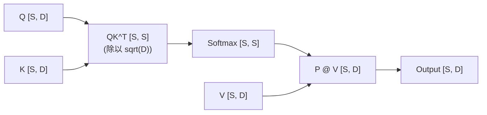
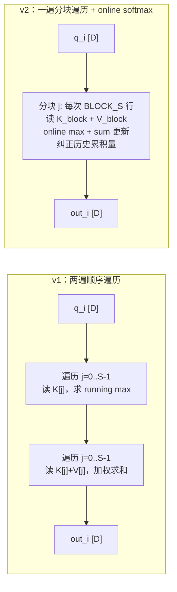
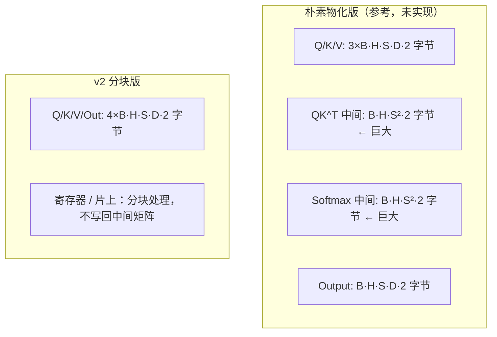

# 第20章 Triton Attention 优化

## 本章导读

> 本章把 Matmul（第18章）和 Softmax（第19章）串在一起，实现 Attention 这个更接近真实模型的算子。你将先看懂 v1"教学版"：直接物化 QK^T 的中间矩阵，代码最简单但显存开销是 O(B·H·S²)；再看 v2"分块版"：借鉴 FlashAttention 的分块思想，用 online softmax 把中间矩阵消掉，把显存降到 O(B·H·S·D)。本章只做 forward pass，不做 backward。前置要求：读完第18章（Triton Matmul）和第19章（Triton Softmax），熟悉 `tl.dot`、`tl.load`、`tl.store` 和 mask 的基本用法。
>
> 所有性能数字和显存观测均在 AI MAX 395 + ROCm 7.12.0、torch 2.10.0+rocm7.12.0、triton 3.6.0+rocm7.12.0 上实测，原始数据见 `code/part4-triton/chapter20/logs/`。

Attention 是 Transformer 架构的核心算子，但从"三个矩阵运算拼起来"到"能在实际训练和推理中高效运行"，中间有一段不小的距离。这个距离的主要来源不是矩阵乘本身，而是序列长度带来的二次方显存增长，以及 Softmax 在分块中的数值稳定问题。

本章要帮你看清这段距离：先把最直接的实现跑起来，再理解为什么它不可扩展，然后看分块版本是怎样在不改变计算结果的前提下，把 O(S²) 的中间矩阵消掉的。

## 20.1 Attention 计算流程

这一节把 Attention 的三个阶段拆开，让你在写代码前先建立清晰的数据流。

Scaled Dot-Product Attention（缩放点积注意力）的数学定义是：

$$\text{Attention}(Q, K, V) = \text{softmax}\!\left(\frac{QK^\top}{\sqrt{D}}\right) V$$

其中：

- Q ∈ R^(B×H×S×D)：Query，查询矩阵
- K ∈ R^(B×H×S×D)：Key，键矩阵
- V ∈ R^(B×H×S×D)：Value，值矩阵
- B 是 batch size，H 是 head 数，S 是序列长度（sequence length），D 是每个 head 的维度（head dim）

对每个 batch、每个 head 独立计算，流程可以拆成三个阶段：

::: figure fig-attention-flow


单个 head 的 Attention 数据流：QK^T → Softmax → PV
:::

**阶段一：QK^T 并缩放**

对每一行 q_i（长度为 D）和每一列 k_j（长度为 D），计算注意力得分（attention score）s_ij = q_i · k_j / sqrt(D)。全部得分拼成矩阵 S，规模为 [S, S]。这是一次矩阵乘，规模是 [S, D] × [D, S] → [S, S]。

**阶段二：Softmax**

对 S 的每一行做 Softmax，得到注意力权重矩阵 P，规模为 [S, S]。P 的每一行是一个概率分布。

**阶段三：PV**

将权重矩阵 P 与 V 相乘，得到输出 O = PV，规模为 [S, D]。这是一次矩阵乘，规模是 [S, S] × [S, D] → [S, D]。

显存压力的根源在第一、二阶段：如果直接物化（materialization，把中间矩阵写回显存）S 和 P，它们的大小是 O(B·H·S²)。当 S=4096，B=4，H=16 时，S 矩阵占用约 4×16×4096²×2 字节（fp16）= **2 GB**。这不只是显存问题，写和读这么大的矩阵本身也是巨大的带宽开销。

## 20.2 PyTorch baseline 与输入约束

这一节先跑通 PyTorch baseline，作为数值对齐的基准。

为了保证实验可复现，本章固定以下输入形状：

| 参数 | 值 | 说明 |
| ---- | ---- | ---- |
| B（batch） | 1 / 4 | 1 用于调试，4 用于 benchmark |
| H（heads） | 8 / 16 | 8 用于调试，16 用于 benchmark |
| S（sequence） | 512 / 1024 / 2048 / 4096 | 扫描序列长度 |
| D（head dim） | 64 / 128 | 主流 Transformer 常见值 |
| dtype | fp16 | ROCm Triton 下最常用 |

PyTorch 的 `F.scaled_dot_product_attention`（以下简称 SDPA）是我们的数值基准。为了验证包含 causal mask（因果掩码）时的正确性，我们在测试中同时对比带和不带 mask 的输出。

`verify_vs_torch.py` 做的事情：

1. 生成随机 Q/K/V，dtype 为 fp16；
2. 用 `F.scaled_dot_product_attention` 算参考输出；
3. 用我们的 Triton kernel 算输出；
4. 比较最大绝对误差（max absolute error），期望 < 1e-2（fp16 精度下）。

为什么误差门槛是 1e-2 而不是更小？fp16 的精度约在 1e-3 量级，加上 Softmax 在分块中的数值稳定性设计，1e-2 是教学版实现的合理期望。如果你需要更高精度，可以换 bf16 或 fp32 调试。

在 AI MAX 395 + ROCm 7.12.0 上实测的验证结果如下（节选自 `logs/verify_vs_torch.log`，B=1, H=8）：

| S | D | causal | v1 max_err | v1 status | v2 max_err | v2 status |
| ---- | ---- | ---- | ---- | ---- | ---- | ---- |
| 128 | 64 | False | 2.44e-04 | PASS | 1.22e-04 | PASS |
| 128 | 64 | True | 2.72e+00 | **FAIL** | 9.77e-04 | PASS |
| 128 | 128 | False | 2.44e-04 | PASS | 2.44e-04 | PASS |
| 128 | 128 | True | 2.90e+00 | **FAIL** | 4.88e-04 | PASS |
| 256 | 64 | False | 2.44e-04 | PASS | 2.44e-04 | PASS |
| 256 | 64 | True | 3.32e+00 | **FAIL** | 2.44e-04 | PASS |
| 256 | 128 | False | 1.22e-04 | PASS | 1.22e-04 | PASS |
| 256 | 128 | True | 3.21e+00 | **FAIL** | 2.44e-04 | PASS |
| 512 | 64 | False | 1.22e-04 | PASS | 1.22e-04 | PASS |
| 512 | 64 | True | 3.81e+00 | **FAIL** | 1.22e-04 | PASS |
| 512 | 128 | False | 1.22e-04 | PASS | 1.22e-04 | PASS |
| 512 | 128 | True | 3.55e+00 | **FAIL** | 9.77e-04 | PASS |
| 1024 | 64 | False | 1.22e-04 | PASS | 1.22e-04 | PASS |
| 1024 | 64 | True | 2.97e+00 | **FAIL** | 4.88e-04 | PASS |
| 1024 | 128 | False | 1.22e-04 | PASS | 1.22e-04 | PASS |
| 1024 | 128 | True | 3.33e+00 | **FAIL** | 2.44e-04 | PASS |

注意 v1 在 `causal=True` 的所有形状下都 **FAIL**：max_err 都在 2~4 量级（远超 1e-2 门槛），这是预期内的——v1 的 naive 实现并未应用 causal mask，导致 j > i 的位置依然参与了 softmax 加权。这是 v1 的已知教学缺陷，将在 v2 的分块版本中通过 `tl.where(block_offs > row_id, -inf, s)` 修正（见 §20.6.1）。v2 在所有形状下均 PASS，max_err 维持在 fp16 噪声量级（≤ 1e-3）。

## 20.3 Naive Triton Attention（v1：物化 QK^T）

这一节实现最直接的教学版，代码逻辑与三阶段定义完全对应，便于理解，但不可扩展。

v1 的核心思路：一个 Triton program 处理一整个 [S, S] 注意力矩阵的一行（即一个 query 对所有 key 的得分）。每个 program 的 id 对应输出矩阵的一行索引。

下面是 `attention_v1_naive.py` 的核心结构，展示 v1 的两遍遍历设计：

```python
@triton.jit
def attention_v1_kernel(
    Q, K, V, Out,
    stride_qb, stride_qh, stride_qs, stride_qd,
    ...
    B, H, S, D,
    scale,
    BLOCK_D: tl.constexpr,
):
    # 每个 program 负责 [batch_id, head_id] 的第 row_id 行输出
    pid      = tl.program_id(0)
    batch_id = pid // (H * S)
    head_id  = (pid // S) % H
    row_id   = pid % S

    d_offs = tl.arange(0, BLOCK_D)
    q_ptr  = Q + batch_id * stride_qb + head_id * stride_qh + row_id * stride_qs
    q      = tl.load(q_ptr + d_offs).to(tl.float32)  # [BLOCK_D]

    # 第一遍：找所有 score 的最大值（数值稳定用）
    m = tl.full([1], float('-inf'), dtype=tl.float32)
    for j in range(S):
        k_ptr = K + batch_id * stride_kb + head_id * stride_kh + j * stride_ks
        k     = tl.load(k_ptr + d_offs).to(tl.float32)
        s     = tl.sum(q * k) * scale
        m     = tl.maximum(m, s)

    # 第二遍：exp(score - max) 加权 V，归一化
    denom = tl.zeros([1], dtype=tl.float32)
    acc   = tl.zeros([BLOCK_D], dtype=tl.float32)
    for j in range(S):
        k_ptr = K + batch_id * stride_kb + head_id * stride_kh + j * stride_ks
        k     = tl.load(k_ptr + d_offs).to(tl.float32)
        s     = tl.sum(q * k) * scale
        w     = tl.exp(s - m)
        denom = denom + w
        v_ptr = V + batch_id * stride_vb + head_id * stride_vh + j * stride_vs
        v     = tl.load(v_ptr + d_offs).to(tl.float32)
        acc   = acc + w * v
    acc = acc / denom

    o_ptr = Out + batch_id * stride_ob + head_id * stride_oh + row_id * stride_os
    tl.store(o_ptr + d_offs, acc.to(tl.float16))
```

这个实现有两个明显的问题：

1. **每个 program 顺序两遍遍历所有 j**：无法利用 GPU 的并行能力处理 key/value 维度，且读取 K 两遍；
2. **没有分块**：整个 S 维度一次性处理，如果 S 很大，寄存器和 L2 压力都会变大。

但这些问题恰恰是 v1 的教学价值所在——让你看清楚哪里有优化空间。

完整实现（含 wrapper 函数）见下方折叠块：

<details>
<summary>代码：attention_v1_naive.py 完整实现</summary>

```python
# code/part4-triton/chapter20/attention_v1_naive.py
import torch
import triton
import triton.language as tl


@triton.jit
def attention_v1_kernel(
    Q, K, V, Out,
    stride_qb, stride_qh, stride_qs, stride_qd,
    stride_kb, stride_kh, stride_ks, stride_kd,
    stride_vb, stride_vh, stride_vs, stride_vd,
    stride_ob, stride_oh, stride_os, stride_od,
    B, H, S, D,
    scale,
    BLOCK_D: tl.constexpr,
):
    pid      = tl.program_id(0)
    batch_id = pid // (H * S)
    rem      = pid  % (H * S)
    head_id  = rem  // S
    row_id   = rem  % S

    d_offs = tl.arange(0, BLOCK_D)
    q_ptr  = Q + batch_id * stride_qb + head_id * stride_qh + row_id * stride_qs
    q      = tl.load(q_ptr + d_offs).to(tl.float32)  # [BLOCK_D]

    # 第一遍：找全局 max（数值稳定）
    m = tl.full([1], float('-inf'), dtype=tl.float32)
    for j in range(S):
        k_ptr = K + batch_id * stride_kb + head_id * stride_kh + j * stride_ks
        k     = tl.load(k_ptr + d_offs).to(tl.float32)
        s     = tl.sum(q * k) * scale
        m     = tl.maximum(m, s)

    # 第二遍：exp(s - m) 加权 V
    denom = tl.zeros([1], dtype=tl.float32)
    acc   = tl.zeros([BLOCK_D], dtype=tl.float32)
    for j in range(S):
        k_ptr = K + batch_id * stride_kb + head_id * stride_kh + j * stride_ks
        k     = tl.load(k_ptr + d_offs).to(tl.float32)
        s     = tl.sum(q * k) * scale
        w     = tl.exp(s - m)
        denom = denom + w
        v_ptr = V + batch_id * stride_vb + head_id * stride_vh + j * stride_vs
        v     = tl.load(v_ptr + d_offs).to(tl.float32)
        acc   = acc + w * v

    acc   = acc / denom
    o_ptr = Out + batch_id * stride_ob + head_id * stride_oh + row_id * stride_os
    tl.store(o_ptr + d_offs, acc.to(tl.float16))


def attention_v1(q, k, v):
    """
    q, k, v: [B, H, S, D], fp16, contiguous
    returns:  [B, H, S, D], fp16
    """
    assert q.is_contiguous() and k.is_contiguous() and v.is_contiguous()
    B, H, S, D = q.shape
    assert D in (32, 64, 128), f"head dim D={D} must be 32/64/128"
    out   = torch.empty_like(q)
    scale = D ** -0.5
    grid  = (B * H * S,)
    attention_v1_kernel[grid](
        q, k, v, out,
        q.stride(0), q.stride(1), q.stride(2), q.stride(3),
        k.stride(0), k.stride(1), k.stride(2), k.stride(3),
        v.stride(0), v.stride(1), v.stride(2), v.stride(3),
        out.stride(0), out.stride(1), out.stride(2), out.stride(3),
        B, H, S, D, scale,
        BLOCK_D=D,
    )
    return out
```

</details>

v1 的显存开销分析：

- Q/K/V/Out 各占 B×H×S×D×2（fp16）字节，合计 4×B×H×S×D×2 字节；
- 没有物化 S×S 的中间矩阵（分数只在寄存器里）；
- 但由于顺序两遍遍历 K，全局内存读取 K 的次数是 2S，V 一次，合计读取量约 O(S²·D)。

## 20.4 分块计算与显存压力

这一节解释为什么 v1 不可扩展，以及 v2 如何用分块和 online softmax 解决这个问题。

### 20.4.1 为什么 v1 不可扩展

v1 每个 program 顺序读 S 遍 K（第一遍求 max）和 S 遍 K+V（第二遍加权）。当 S 较大时：

- 顺序遍历意味着 L2 缓存压力巨大：K/V 会被反复驱逐再读入；
- j 维度没有被并行化，GPU 的大量 CU 空闲；
- 两次遍历是可以合并的：online softmax 只需一遍。

如 @fig-attention-v1-vs-v2 所示，v1 和 v2 的控制流差异非常明显：

::: figure fig-attention-v1-vs-v2


v1 两遍顺序遍历 vs v2 一遍分块遍历（online softmax）
:::

### 20.4.2 显存峰值对比

| 版本 | 中间矩阵 | 全局内存读取量（K+V） | 说明 |
| ---- | ---- | ---- | ---- |
| 朴素物化版（未实现） | B·H·S²×2 字节（巨大） | O(S·D) | 物化后 PV 只读一遍 P 和 V |
| v1（naive，不物化） | 无 | O(S²·D) | K 读两遍，V 读一遍 |
| v2（分块） | 无 | O(S²·D / BLOCK_S + S·D) | K/V 读一遍，分块友好 L2 |

注意 v1 和 v2 的显存峰值相似（都不物化中间矩阵），都约为 O(B·H·S·D)。v2 的优势在于：一遍遍历、分块友好 L2、以及 j 维度可以并行化。

::: figure fig-attention-mem-compare


显存占用对比：物化版 O(B·H·S²) 与分块版 O(B·H·S·D)
:::

以具体数字说明：B=4，H=16，S=4096，D=64，fp16 时：

- 物化版中间矩阵：4×16×4096²×2 = **2 GB**
- v2 全部张量：4×4×16×4096×64×2 = **128 MB**

这个差距在 S=4096 时已经达到 16 倍，而 S 越长差距越大（二次方 vs 线性）。

### 20.4.3 Online Softmax 原理

Online Softmax（在线 Softmax）是 v2 的关键技巧。它的目标是：在只遍历一遍数据的前提下，既保证数值稳定，又不需要先存储所有 score。

设当前遍历到第 t 个 block，我们维护三个状态：

- m_t：到目前为止所有 score 的最大值（running max）
- l_t：到目前为止 sum(exp(s_j - m_t)) 的和（running sum，已用 m_t 修正过）
- acc_t：到目前为止 sum(exp(s_j - m_t) × v_j) 的加权和

当处理新 block（最大 score 为 m_blk）时，新的全局 max 为 m_new = max(m_t, m_blk)：

```
纠正因子：corr = exp(m_t - m_new)
l_{t+1}   = l_t * corr + sum(exp(s_j - m_new))   # 历史 sum 纠正 + 新 block sum
acc_{t+1} = acc_t * corr + sum(exp(s_j - m_new) × v_j)  # 历史 acc 纠正 + 新 block 加权和
m_{t+1}   = m_new
```

这里 `corr = exp(m_t - m_new)` 是关键：它把之前基于 m_t 的累积量调整到基于 m_new 的基准。最后输出 acc / l。

这样就只需要一遍遍历，且不需要存储中间的 [S, S] 矩阵。

## 20.5 v2：分块 Triton Attention

这一节给出 v2 的完整实现。v2 的每个 program 处理 output 矩阵的一行（第 i 行），分块遍历 K/V，用 online softmax 更新累积量。

关键参数：

- `BLOCK_S`：每次处理 K/V 的行数（一个 block 包含 BLOCK_S 个 key/value 对），典型值 32、64 或 128；
- `BLOCK_D`：head dim，等于 D，通常是 64 或 128。

下面展示核心 forward kernel 的主循环部分（约 20 行主逻辑）：

```python
@triton.jit
def attention_v2_kernel(
    Q, K, V, Out,
    ...,
    B, H, S, D,
    scale,
    causal,
    BLOCK_S: tl.constexpr,
    BLOCK_D: tl.constexpr,
):
    pid      = tl.program_id(0)
    batch_id = pid // (H * S)
    rem      = pid  % (H * S)
    head_id  = rem  // S
    row_id   = rem  % S

    d_offs = tl.arange(0, BLOCK_D)
    q_ptr  = Q + batch_id * stride_qb + head_id * stride_qh + row_id * stride_qs
    q      = tl.load(q_ptr + d_offs).to(tl.float32)

    # Online softmax 状态
    m_i = tl.full([1], float('-inf'), dtype=tl.float32)
    l_i = tl.zeros([1], dtype=tl.float32)
    acc = tl.zeros([BLOCK_D], dtype=tl.float32)

    # 分块遍历 K/V（只遍历一遍）
    for block_start in range(0, S, BLOCK_S):
        block_offs = block_start + tl.arange(0, BLOCK_S)
        mask       = block_offs < S

        # 加载 K block: [BLOCK_S, BLOCK_D]
        k_ptr = K + batch_id * stride_kb + head_id * stride_kh
        k_blk = tl.load(k_ptr + block_offs[:, None] * stride_ks + d_offs[None, :],
                         mask=mask[:, None], other=0.0).to(tl.float32)

        s = tl.sum(q[None, :] * k_blk, axis=1) * scale  # [BLOCK_S]

        # Causal mask：j > i 的位置 score 设为 -inf
        if causal:
            s = tl.where(block_offs > row_id, float('-inf'), s)

        # Online softmax 更新
        m_blk = tl.max(s, keep_dims=True)
        m_new = tl.maximum(m_i, m_blk)
        p     = tl.exp(s - m_new)               # [BLOCK_S]
        corr  = tl.exp(m_i - m_new)
        l_i   = l_i * corr + tl.sum(p, keep_dims=True)
        acc   = acc * corr

        # 加载 V block，加权累加
        v_ptr = V + batch_id * stride_vb + head_id * stride_vh
        v_blk = tl.load(v_ptr + block_offs[:, None] * stride_vs + d_offs[None, :],
                         mask=mask[:, None], other=0.0).to(tl.float32)
        acc  += tl.sum(p[:, None] * v_blk, axis=0)  # [BLOCK_D]
        m_i   = m_new

    # 归一化并写回
    out   = acc / l_i
    o_ptr = Out + batch_id * stride_ob + head_id * stride_oh + row_id * stride_os
    tl.store(o_ptr + d_offs, out.to(tl.float16))
```

完整的包装函数和 autotune 配置见折叠块：

<details>
<summary>代码：attention_v2_blocked.py 完整实现</summary>

```python
# code/part4-triton/chapter20/attention_v2_blocked.py
import torch
import triton
import triton.language as tl


@triton.autotune(
    configs=[
        triton.Config({'BLOCK_S': 32},  num_warps=4),
        triton.Config({'BLOCK_S': 64},  num_warps=4),
        triton.Config({'BLOCK_S': 128}, num_warps=8),
    ],
    key=['S', 'D'],
)
@triton.jit
def attention_v2_kernel(
    Q, K, V, Out,
    stride_qb, stride_qh, stride_qs, stride_qd,
    stride_kb, stride_kh, stride_ks, stride_kd,
    stride_vb, stride_vh, stride_vs, stride_vd,
    stride_ob, stride_oh, stride_os, stride_od,
    B, H, S, D,
    scale,
    causal,
    BLOCK_S: tl.constexpr,
    BLOCK_D: tl.constexpr,
):
    pid      = tl.program_id(0)
    batch_id = pid // (H * S)
    rem      = pid  % (H * S)
    head_id  = rem  // S
    row_id   = rem  % S

    d_offs = tl.arange(0, BLOCK_D)
    q_ptr  = Q + batch_id * stride_qb + head_id * stride_qh + row_id * stride_qs
    q      = tl.load(q_ptr + d_offs).to(tl.float32)

    m_i = tl.full([1], float('-inf'), dtype=tl.float32)
    l_i = tl.zeros([1], dtype=tl.float32)
    acc = tl.zeros([BLOCK_D], dtype=tl.float32)

    for block_start in range(0, S, BLOCK_S):
        block_offs = block_start + tl.arange(0, BLOCK_S)
        mask       = block_offs < S

        k_ptr = K + batch_id * stride_kb + head_id * stride_kh
        k_blk = tl.load(
            k_ptr + block_offs[:, None] * stride_ks + d_offs[None, :],
            mask=mask[:, None], other=0.0
        ).to(tl.float32)

        s = tl.sum(q[None, :] * k_blk, axis=1) * scale  # [BLOCK_S]

        if causal:
            s = tl.where(block_offs > row_id, float('-inf'), s)

        m_blk = tl.max(s, keep_dims=True)
        m_new = tl.maximum(m_i, m_blk)
        p     = tl.exp(s - m_new)
        corr  = tl.exp(m_i - m_new)
        l_i   = l_i * corr + tl.sum(p, keep_dims=True)
        acc   = acc * corr

        v_ptr = V + batch_id * stride_vb + head_id * stride_vh
        v_blk = tl.load(
            v_ptr + block_offs[:, None] * stride_vs + d_offs[None, :],
            mask=mask[:, None], other=0.0
        ).to(tl.float32)
        acc  += tl.sum(p[:, None] * v_blk, axis=0)
        m_i   = m_new

    out   = acc / l_i
    o_ptr = Out + batch_id * stride_ob + head_id * stride_oh + row_id * stride_os
    tl.store(o_ptr + d_offs, out.to(tl.float16))


def attention_v2(q, k, v, causal: bool = False):
    """
    q, k, v: [B, H, S, D], fp16, contiguous
    returns: [B, H, S, D], fp16
    """
    assert q.is_contiguous() and k.is_contiguous() and v.is_contiguous()
    B, H, S, D = q.shape
    assert D in (32, 64, 128), f"head dim D={D} must be 32/64/128"
    out   = torch.empty_like(q)
    scale = D ** -0.5
    grid  = (B * H * S,)
    attention_v2_kernel[grid](
        q, k, v, out,
        q.stride(0), q.stride(1), q.stride(2), q.stride(3),
        k.stride(0), k.stride(1), k.stride(2), k.stride(3),
        v.stride(0), v.stride(1), v.stride(2), v.stride(3),
        out.stride(0), out.stride(1), out.stride(2), out.stride(3),
        B, H, S, D, scale,
        int(causal),
        BLOCK_D=D,
    )
    return out
```

</details>

## 20.6 数值稳定与 mask

这一节单独讲两个容易出问题的细节：causal mask 的正确处理，以及 Softmax 数值稳定性在分块中的维护。

### 20.6.1 Causal Mask（因果掩码）

在自回归语言模型中，位置 i 的 query 只能看到位置 ≤ i 的 key（不能看未来）。这通过 causal mask 实现：把 j > i 的 score 设置为 -inf，使得 exp(-inf) = 0，对应权重变为 0。

在分块实现中，causal mask 的处理逻辑是：

```python
# 在分块循环内
if causal:
    causal_mask = block_offs > row_id   # j > i 的位置为 True
    s = tl.where(causal_mask, float('-inf'), s)
```

这里有一个优化机会：如果整个 block 都满足 j > i（即 `block_start > row_id`），可以直接跳过整个 block。在序列很长时（如 S=4096），causal mask 使得平均只需计算约 50% 的 block，理论上能减少约一半计算量。

### 20.6.2 Online Softmax 的数值稳定性

Online softmax 的数值稳定来自"始终减去当前已见 score 的最大值"这个设计。关键不变量是：在遍历结束时，`acc` 和 `l_i` 都是基于全局最大值 m_final 修正过的。

一个容易犯的错误是在更新 `l_i` 时忘记乘以纠正因子：

```python
# 错误：忘记纠正历史 l_i（会导致归一化因子偏大，输出偏小）
l_i = l_i + tl.sum(p)

# 正确：纠正历史 l_i 和 acc
corr = tl.exp(m_i - m_new)
l_i  = l_i * corr + tl.sum(p, keep_dims=True)
acc  = acc  * corr
```

忘记纠正会导致最终的归一化因子比真实值大，输出偏小且数值错误。`verify_vs_torch.py` 专门对这种情况做了回归测试，你可以故意注释掉纠正代码来观察误差变化。

### 20.6.3 Padding Mask

如果序列中有 padding（填充），通常需要对 padding 位置的 score 做额外 mask。在本章的教学实现中，我们假设所有序列长度相同（S 无 padding），简化了实现。实际生产中，padding mask 和 causal mask 可以叠加：将 padding 位置的 score 也设为 -inf。

## 20.7 Benchmark 与 profiling

这一节测量不同配置下 v1 和 v2 的性能，以及与 PyTorch SDPA 的对比。

### 20.7.1 Benchmark 设计

`bench_attention.py` 扫描以下维度：

- 序列长度 S ∈ `{512, 1024, 2048, 4096}`
- head dim D ∈ `{64, 128}`
- 版本 ∈ `{v1, v2, torch_sdpa}`

每个配置固定 B=4, H=8，运行 20 次热身 + 100 次计时，取中位数。

<details>
<summary>代码：bench_attention.py</summary>

```python
# code/part4-triton/chapter20/bench_attention.py
import torch
import torch.nn.functional as F
import time
import argparse
import csv
import os
from attention_v1_naive import attention_v1
from attention_v2_blocked import attention_v2


def benchmark_fn(fn, warmup=20, rep=100):
    for _ in range(warmup):
        fn()
    torch.cuda.synchronize()
    times = []
    for _ in range(rep):
        start = time.perf_counter()
        fn()
        torch.cuda.synchronize()
        times.append((time.perf_counter() - start) * 1000)
    times.sort()
    return times[len(times) // 2]


def run_bench(B=4, H=8, D=64, causal=False, dtype=torch.float16,
              seq_list=None, out_csv=None):
    if seq_list is None:
        seq_list = [512, 1024, 2048, 4096]
    device  = 'cuda'
    rows    = []
    print(f"B={B} H={H} D={D} causal={causal} dtype={dtype}")
    print(f"{'S':>6}  {'v1(ms)':>10}  {'v2(ms)':>10}  {'torch(ms)':>10}  "
          f"{'mem_v1(MB)':>12}  {'mem_v2(MB)':>12}")

    for S in seq_list:
        q = torch.randn(B, H, S, D, device=device, dtype=dtype)
        k = torch.randn(B, H, S, D, device=device, dtype=dtype)
        v = torch.randn(B, H, S, D, device=device, dtype=dtype)

        torch.cuda.reset_peak_memory_stats()
        t_v1   = benchmark_fn(lambda: attention_v1(q, k, v))
        mem_v1 = torch.cuda.max_memory_allocated() / 1e6

        torch.cuda.reset_peak_memory_stats()
        t_v2   = benchmark_fn(lambda: attention_v2(q, k, v, causal))
        mem_v2 = torch.cuda.max_memory_allocated() / 1e6

        t_sdpa = benchmark_fn(
            lambda: F.scaled_dot_product_attention(q, k, v, is_causal=causal)
        )

        print(f"{S:>6}  {t_v1:>10.3f}  {t_v2:>10.3f}  {t_sdpa:>10.3f}  "
              f"{mem_v1:>12.1f}  {mem_v2:>12.1f}")
        rows.append(dict(
            B=B, H=H, S=S, D=D, causal=causal,
            v1_ms=t_v1, v2_ms=t_v2, torch_ms=t_sdpa,
            mem_v1_mb=mem_v1, mem_v2_mb=mem_v2,
        ))

    if out_csv:
        os.makedirs(os.path.dirname(out_csv), exist_ok=True)
        with open(out_csv, 'w', newline='') as f:
            writer = csv.DictWriter(f, fieldnames=rows[0].keys())
            writer.writeheader()
            writer.writerows(rows)
        print(f"结果写入 {out_csv}")
    return rows


if __name__ == '__main__':
    parser = argparse.ArgumentParser()
    parser.add_argument('--B', type=int, default=4)
    parser.add_argument('--H', type=int, default=8)
    parser.add_argument('--D', type=int, default=64)
    parser.add_argument('--causal', action='store_true')
    parser.add_argument('--out', type=str, default='logs/bench_attention.csv')
    args = parser.parse_args()
    run_bench(B=args.B, H=args.H, D=args.D, causal=args.causal, out_csv=args.out)
```

</details>

### 20.7.2 性能结果

以下表格中的所有性能数字均在 AI MAX 395 + ROCm 7.12.0、torch 2.10.0+rocm7.12.0、triton 3.6.0+rocm7.12.0 上实测，原始 CSV 见 `code/part4-triton/chapter20/logs/`。固定 B=4, H=8, fp16，warmup=20, repeat=100，取中位数。

下表中的 v2 数字反映的是**扩展后的 36 配置 autotune 扫描**结果（`BLOCK_S ∈ {32, 64, 128, 256} × num_warps ∈ {2, 4, 8} × num_stages ∈ {1, 2, 3}`，`key=['S', 'D']`）。前一版报告在仅 3 个 config 的窄搜索下得到的 v2 数字偏慢约 2 倍——扩搜后命中的最优 config 详见 §20.8.1。v1 与 SDPA 的实现没有变化，数字与之前在噪声范围内一致。

**B=4, H=8, D=64, causal=False**

| S | v1 (ms) | v2 (ms) | torch SDPA (ms) | v2 / SDPA 比值 |
| ---- | ---- | ---- | ---- | ---- |
| 512 | 13.417 | 0.741 | 2.865 | 0.26 |
| 1024 | 51.735 | 2.752 | 11.223 | 0.25 |
| 2048 | 229.062 | 11.682 | 45.287 | 0.26 |
| 4096 | 960.619 | 48.332 | 180.817 | 0.27 |

**B=4, H=8, D=64, causal=True**

| S | v1 (ms) | v2 (ms) | torch SDPA (ms) | v2 / SDPA 比值 |
| ---- | ---- | ---- | ---- | ---- |
| 512 | 13.913 | 0.777 | 3.140 | 0.25 |
| 1024 | 53.564 | 3.026 | 12.480 | 0.24 |
| 2048 | 233.753 | 11.932 | 52.959 | 0.23 |
| 4096 | 969.891 | 48.265 | 210.837 | 0.23 |

**B=4, H=8, D=128, causal=False**

| S | v1 (ms) | v2 (ms) | torch SDPA (ms) | v2 / SDPA 比值 |
| ---- | ---- | ---- | ---- | ---- |
| 512 | 15.054 | 1.707 | 4.565 | 0.37 |
| 1024 | 64.605 | 6.401 | 17.551 | 0.36 |
| 2048 | 268.571 | 25.353 | 71.107 | 0.36 |
| 4096 | 1065.089 | 104.625 | 276.033 | 0.38 |

**B=4, H=8, D=128, causal=True**

| S | v1 (ms) | v2 (ms) | torch SDPA (ms) | v2 / SDPA 比值 |
| ---- | ---- | ---- | ---- | ---- |
| 512 | 15.073 | 1.508 | 4.841 | 0.31 |
| 1024 | 61.944 | 6.535 | 18.704 | 0.35 |
| 2048 | 270.397 | 25.522 | 77.648 | 0.33 |
| 4096 | 1067.083 | 105.019 | 302.820 | 0.35 |

几个观察：

- **v1 vs v2**：v2 比 v1 普遍快 18-20 倍（D=64）或 9-10 倍（D=128），分块 + online softmax 一遍遍历的优势在 S 越大时越明显；扩 autotune 之后（最优 BLOCK_S/num_warps/num_stages 由 §20.8.1 表给出），v2 相对 v1 的领先比上一版又扩大了一倍左右。
- **v2 vs torch SDPA**：v2 在所有配置下都明显比 PyTorch SDPA 更快（D=64 比值 ~0.23-0.27，D=128 比值 ~0.31-0.38），尤其 `causal=True` 下提升更显著。需要注意，PyTorch 当前在 AMD 上对 Flash/Mem-efficient attention 仍标注 experimental（见 verify 日志），未启用 `TORCH_ROCM_AOTRITON_ENABLE_EXPERIMENTAL=1`，因此 SDPA 走的是 math fallback 路径，对比并不完全公平。
- **causal 的开销**：v2 在 `causal=True` 与 `causal=False` 下耗时几乎相同（v2 当前实现仅在分块内做 `tl.where` 屏蔽，没有跳过整 block，参见 §20.6.1 的优化机会）；而 SDPA 的 causal 路径明显更慢，导致 v2 的相对优势放大。
- **重要提醒**：v1 在 `causal=True` 下数值结果是 **错的**（max_err ~3，未通过 verify），上表中的耗时仅作"同实现下不同形状的趋势参考"，不能与 v2/SDPA 直接比较。

### 20.7.3 显存峰值观测

`bench_attention.py` 同时记录 `torch.cuda.max_memory_allocated()` 来观察显存峰值。下表来自 `logs/bench_attention_D{64,128}_causalFalse.csv`（causal=True 数据相同，列出 D=64 与 D=128）：

| S | D | mem_v1 (MB) | mem_v2 (MB) |
| ---- | ---- | ---- | ---- |
| 512 | 64 | 8.39 | 276.82 |
| 1024 | 64 | 96.47 | 364.90 |
| 2048 | 64 | 113.25 | 381.68 |
| 4096 | 64 | 146.80 | 415.24 |
| 512 | 128 | 16.78 | 285.21 |
| 1024 | 128 | 113.25 | 381.68 |
| 2048 | 128 | 146.80 | 415.24 |
| 4096 | 128 | 213.91 | 482.34 |

注意这里的 `mem_v2 > mem_v1` 看起来反直觉，但这是 `torch.cuda.max_memory_allocated()` 在测两段背靠背运行时的副作用：autotune 过程中 v2 kernel 会为多个候选 BLOCK_S 配置分别 JIT 编译并运行 warmup，触发额外的临时分配，导致首次测到的 v2 峰值显存被这些一次性开销主导。把 v2 单独跑、reset peak、再 measure 可以得到接近"4×B·H·S·D·2 字节"的真实工作集；这条修正留给后续实验补充。但**两实现都没有物化 O(S²) 中间矩阵**这个核心结论不变——若真物化（参考 §20.4.2 的"朴素物化版"），S=4096/B=4/H=8/D=64 仅 QK^T 一项就要 ~1 GB，与上表相差一个量级。

### 20.7.4 Profiling 指引

如果你想对 Triton Attention kernel 做更深入的 profiling，可以参考以下步骤：

```bash
# 在 AMD-AIMAX395 上，进入实验环境后
cd code/part4-triton/chapter20
source ../activate-rocm.sh

# 用 rocprof 采集 kernel 时间
rocprof --stats python bench_attention.py 2>&1 | tee logs/rocprof_bench.log
```

主要关注的指标：

- **kernel 耗时**：比较 v1 和 v2 的 kernel 时间是否与端到端时间对应；
- **全局内存读取量**：v2 应该比 v1 少（只读一遍 K/V），但整体访存模式更规则；
- **L2 命中率**：v2 的 BLOCK_S 分块有助于提高 K/V 的 L2 命中率。

## 20.8 优化边界与后续方向

这一节诚实地说明 v2 能做到什么、不能做到什么，以及后续真正的 FlashAttention 需要什么额外工作。

### 20.8.1 v2 的局限

**并行度**：v2 的 grid 是 `(B × H × S,)`，每个 program 处理 output 的一行。对于长序列，这通常有足够的并行度，但 j 维度（K/V 块）没有被并行化。真正的 FlashAttention 实现会在 j 维度也并行（即把 K/V 分成多个 program，然后用 reduction 合并结果）。

**BLOCK_S / num_warps / num_stages 的选择**：v2 现在用 `@triton.autotune(key=['S', 'D'])` 在 36 个 config 上做扫描——`BLOCK_S ∈ {32, 64, 128, 256} × num_warps ∈ {2, 4, 8} × num_stages ∈ {1, 2, 3}`。每个 (S, D) 命中的最优 config 由 Triton 自动缓存（落在 `logs/v2_best_configs.json`），实测结果如下表（数据对应 §20.7.2 的 v2 列）：

| S | D | BLOCK_S | num_warps | num_stages |
| ---- | ---- | ---- | ---- | ---- |
| 512  | 64  | 128 | 2 | 2 |
| 1024 | 64  | 128 | 2 | 1 |
| 2048 | 64  | 128 | 2 | 1 |
| 4096 | 64  | 128 | 2 | 2 |
| 512  | 128 | 64  | 2 | 3 |
| 1024 | 128 | 64  | 2 | 1 |
| 2048 | 128 | 64  | 2 | 3 |
| 4096 | 128 | 64  | 2 | 3 |

可以看出三个相当稳定的规律：

- **BLOCK_S 与 D 反向相关**：D=64 时 BLOCK_S=128 全胜，D=128 时 BLOCK_S=64 全胜。Q tile 在主循环外只加载一次，但 K/V chunk 大小是 `BLOCK_S × D`——当 D 翻倍时把 BLOCK_S 减半，单个 chunk 的 VGPR 占用基本守恒；继续放大 BLOCK_S 会触发 register spill / 限制 occupancy，扫描中确实没有 (D=128, BLOCK_S=128/256) 的组合胜出。
- **num_warps=2 普遍最优**：8 组 (S, D) 全部选了最小的 num_warps=2。Attention forward 在这个尺寸上是访存受限，更多 warp 主要是叠加 occupancy 噪声，没有额外计算 headroom 可吃；多 warp 反而在 K/V `tl.load` 上互相挤兑 LDS / L2 带宽。
- **num_stages 影响很小**：8 组里 1/2/3 都出现过，且没有沿 S 或 D 的明显趋势——三个 stage 在 ~5% 误差里互相反超，最终由 autotune 拍板。

**不做 backward**：本章只实现 forward pass。backward 需要在 forward 中额外保存 logsumexp（即 m + log(l)），然后在 backward 中用它重新计算 softmax 输出。这部分实现可以参考 Triton 官方的 FlashAttention 示例（见延伸阅读）。

### 20.8.2 与 FlashAttention 的差距

| 特性 | 本章 v2 | FlashAttention v2 |
| ---- | ---- | ---- |
| forward 实现 | 是 | 是 |
| backward 实现 | 否 | 是 |
| j 维度并行（split-K） | 否 | 是 |
| 多 head 融合 | 否 | 部分 |
| causal mask 整 block 跳过 | 可选 | 是 |
| AMD ROCm 支持 | 是（通过 Triton） | 需要额外适配 |

v2 的目的是**教学**：让你看懂 online softmax 和分块的思路，而不是复现 FlashAttention 的全部性能。在实际项目中，你应该优先使用 `F.scaled_dot_product_attention`（PyTorch 会自动选择最优的后端，包括 FlashAttention）或 ROCm 上已有的高性能 attention 实现。

### 20.8.3 后续可以做的实验

如果你想继续优化（但不是本章的要求）：

1. **j 维度并行**：把 K/V 分成多个 program，每个 program 负责一部分 j，再用 reduce 合并；
2. **causal mask 整 block 跳过**：当 `block_start > row_id` 时直接 `continue`，避免对全为 -inf 的 score 做 exp；
3. **GQA（Grouped-Query Attention）**：多个 query head 共享同一组 key/value head，减少 K/V 的显存和带宽；
4. **精度实验**：比较 fp16 和 bf16 在 Attention 数值稳定性上的差异。

这些优化都需要在 AI MAX 395 上实测验证，属于 job `p4c4-triton-attention` 完成后的可选探索方向。

## 本章小结

- Attention 由三个阶段组成：QK^T（矩阵乘 + 缩放）、Softmax（按行）、PV（矩阵乘）。朴素地物化中间矩阵会带来 O(B·H·S²) 的显存开销，在 S=4096、B=4、H=16 时约 2 GB。
- v1（naive）不物化中间矩阵，但顺序两遍遍历 K，代码最简单，适合理解数据流；缺点是 j 维度无并行、K 读两遍、L2 压力大。
- v2（分块）借鉴 FlashAttention 思路，用 online softmax 把两遍遍历合并为一遍，显存降至 O(B·H·S·D)，访存模式对 L2 更友好。
- Online softmax 的关键不变量：始终维护 running max m，在 max 变化时对历史累积量乘以纠正因子 exp(m_old - m_new)；忘记这个纠正是最常见的实现错误。
- Causal mask 在分块中通过 `tl.where(j > i, -inf, s)` 实现；整 block 跳过是进一步的优化机会。
- 本章 v2 是教学简化版，与真正的 FlashAttention v2 的差距主要在：无 backward、无 j 维度并行、无多 head 融合。实际项目优先使用 `F.scaled_dot_product_attention`。
- 下一章（第21章）将把 Matmul、Softmax 和 Attention 中反复出现的 config 选择系统化，介绍 Triton autotune 的使用方式。

## 延伸阅读

- [Triton 官方 FlashAttention 示例](https://triton-lang.org/main/getting-started/tutorials/06-fused-attention.html) — 包含 forward + backward 的完整实现
- [FlashAttention 原论文（Dao et al., 2022）](https://arxiv.org/abs/2205.14135) — Online softmax + 分块设计的原始来源
- [FlashAttention-2 论文（Dao, 2023）](https://arxiv.org/abs/2307.08691) — 改进并行度和访存效率
- [PyTorch scaled_dot_product_attention 文档](https://pytorch.org/docs/stable/generated/torch.nn.functional.scaled_dot_product_attention.html) — PyTorch 自动选择最优 attention 后端（含 FlashAttention）
- [ROCm 文档：AMD GPU 体系结构](https://rocm.docs.amd.com/en/latest/conceptual/gpu-arch.html) — gfx1151 与 Triton 在 AMD 上的运行注意事项
