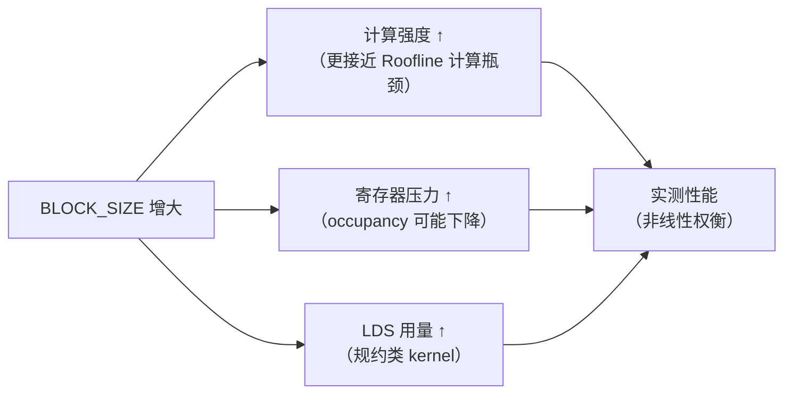
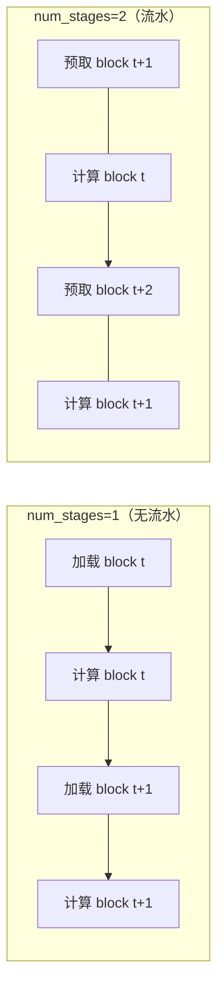

# 第21章 Triton 自动调参

## 本章导读

> 本章把前面几章在 Matmul（第18章）、Softmax（第19章）和 Attention（第20章）里反复碰到的 `BLOCK_SIZE`、`num_warps`、`num_stages` 选择系统化。手动试参数既费时又不可靠——不同硬件、不同形状下的最优值差异显著。读完本章，你应该能够：定义合理的搜索空间、用 `@triton.autotune` 让 Triton 在第一次调用时自动跑完所有候选、把胜出的配置导出成 JSON 供后续复用，以及理解 `num_warps` 在 AMD RDNA4（gfx1151）上的实际含义与 NVIDIA 的差异。
>
> 前置要求：已读第18章（Triton Matmul）和第19章（Triton Softmax），熟悉 `@triton.jit`、`tl.constexpr`、分块访存的基本用法。本章使用这两个 kernel 作为案例，不重复讲基础语法。
>
> 所有性能数字和最优 config 均在 AI MAX 395 + ROCm 7.12.0、torch 2.10.0+rocm7.12.0、triton 3.6.0+rocm7.12.0 上实测，原始数据见 `code/part4-triton/chapter21/logs/`。

到目前为止，每次写 Triton kernel 都要回答同一个问题：`BLOCK_SIZE` 选多少合适？第18章的 Matmul 里，你手动试过 64、128 的组合；第19章的 Softmax 里，行宽 S=512 和 S=32768 对应的最优 `BLOCK_SIZE` 可能完全不同。对每个形状、每台机器都手动搜索是不切实际的。

`@triton.autotune` 把这个搜索过程系统化：你只需要定义候选配置（搜索空间），Triton 会在第一次调用时自动运行每个候选，选出最快的那个，并为当前 `key`（通常是形状参数）缓存结果。后续相同 `key` 的调用直接使用缓存，不重复搜索。

## 21.1 BLOCK_SIZE 怎么影响性能

这一节从前几章的 kernel 出发，回顾 `BLOCK_SIZE` 为什么是最重要的搜索维度，以及它影响性能的三条路径。

### 三条影响路径

**路径一：计算强度（Compute Intensity）**

`BLOCK_SIZE` 直接决定每个 program 一次性处理的数据量。以 Matmul 的 `[BLOCK_M, BLOCK_N]` tile 为例，每个 tile 读取 `BLOCK_M × BLOCK_K + BLOCK_K × BLOCK_N` 个元素，计算 `2 × BLOCK_M × BLOCK_N × BLOCK_K` 次浮点运算（乘加各一次）。Block 越大，计算访存比（Arithmetic Intensity）越高，对带宽受限的 GPU 更友好。

$$
\text{Arithmetic Intensity} = \frac{2 \cdot \text{BLOCK\_M} \cdot \text{BLOCK\_N} \cdot \text{BLOCK\_K}}{(\text{BLOCK\_M} \cdot \text{BLOCK\_K} + \text{BLOCK\_K} \cdot \text{BLOCK\_N}) \cdot \text{sizeof(fp16)}}
$$

以 `BLOCK_M=BLOCK_N=BLOCK_K=64` 为例，算术强度约 32 FLOP/Byte；换成 128 则约 64 FLOP/Byte。AI MAX 395 的 fp16 峰值算力与内存带宽之比（Roofline 拐点）约在 100 FLOP/Byte，因此更大的 block 往往更接近计算瓶颈区域。

**路径二：寄存器压力与 occupancy**

Block 越大，每个 program 持有的寄存器越多（累加器、指针、临时变量都要占用）。AMD gfx1151 每个 CU（Compute Unit）有有限的 VGPR（向量通用寄存器）总量，当单个 wavefront 使用的寄存器数超过阈值，能同时活跃的 wavefront 数量（occupancy）就会下降。occupancy 下降意味着 GPU 没有足够的"备用 wavefront"来掩盖访存延迟（latency hiding），整体吞吐下降。

**路径三：LDS（Local Data Share）与 bank conflict**

对于需要 LDS 共享的 kernel（例如 HIP 中的规约），block 大小也影响 LDS 的用量和 bank conflict 概率。Triton 编译器自动管理 LDS 布局，但搜索 `BLOCK_SIZE` 时仍会间接体现：较小的 block 通常 LDS 压力更低，bank conflict 更少，但计算强度也更低。

这三条路径相互制衡，没有"放之四海皆准"的最优 `BLOCK_SIZE`。这正是 autotune 的动机：**让机器在真实硬件上量出最快的那个**，而不是凭经验猜测。

::: figure fig-blocksize-tradeoffs


BLOCK_SIZE 增大对性能的三条影响路径：计算强度、寄存器压力、LDS 用量相互制衡
:::

如 @fig-blocksize-tradeoffs 所示，`BLOCK_SIZE` 对性能的影响不是单调的，实测是找最优值的唯一可靠手段。

### 前几章的 BLOCK_SIZE 回顾

| 章节 | 算子 | 当时怎么选 | 问题 |
| ---- | ---- | ---- | ---- |
| 第18章 Matmul | BLOCK_M/N/K | 手动试 64/128 | 不同形状最优值不同，换机器要重试 |
| 第19章 Softmax v1 | BLOCK_SIZE | `next_power_of_2(S)`，随行宽固定 | S=32768 时 BLOCK_SIZE=32768，occupancy 下降 |
| 第19章 Softmax v1_tuned | BLOCK_SIZE | `@triton.autotune` 搜索 `{512..8192}` | 对每个 S 分别找最优 |
| 第20章 Attention v2 | BLOCK_S | `@triton.autotune` 搜索 `{32, 64, 128}` | 只搜了 BLOCK_S，num_warps 固定 |

第19章的 `softmax_v1_tuned` 已经初步用了 autotune——本章把这个机制系统化，扩展到更多参数维度，并解释如何读出和复用最优配置。

## 21.2 num_warps 与 num_stages 的意义

这一节解释另外两个搜索维度，以及它们在 AMD 硬件上的具体含义。

### num_warps：控制 wavefront 并发数

`num_warps` 告诉 Triton 每个 program 使用多少个 wavefront/warp。在 Triton 的 `triton.Config(...)` 里：

```python
triton.Config({"BLOCK_SIZE": 1024}, num_warps=4)
```

这意味着一个 program 分配 4 个 wavefront 并发执行。

**AMD 与 NVIDIA 的差异**：Triton 用 `num_warps` 这个名字，但在 AMD RDNA 架构（包括 AI MAX 395 的 gfx1151）上，wavefront 宽度是 **32 个线程（wave32 模式）**，而不是 64。NVIDIA 的 warp 宽度也是 32 线程，所以数字上是一致的：`num_warps=4` 在两边都意味着 4×32=128 个并发线程。

AMD CDNA 架构（MI 系列，如 MI300X）使用的是 wave64 模式（每 wavefront 64 线程），`num_warps=4` 时并发线程数是 4×64=256。这是 RDNA 和 CDNA 的一个重要差异——针对 gfx1151 调好的 `num_warps` 搬到 MI300X 上可能不是最优值。

从 GPU 调度的角度看，`num_warps` 影响两件事：

1. **每个 program 能同时执行的指令数**：更多 wavefront 意味着更强的指令级并行（ILP），有助于掩盖访存延迟。
2. **寄存器分配**：单个 program 内的 wavefront 数增加，但每个 wavefront 可用的寄存器相应减少（CU 总寄存器固定，多个 wavefront 分摊）。`num_warps` 过大同样会导致 occupancy 问题。

对于访存密集型 kernel（如 Softmax），`num_warps=4` 通常是一个合理起点；对于计算密集型（如 Matmul），`num_warps=8` 可能更好——这正是需要 autotune 而不是手动猜的原因。

### num_stages：软件流水线深度

`num_stages` 控制 Triton 生成的软件流水线（software pipelining）的深度。

当 kernel 里有循环（例如 Matmul 里沿 K 维度迭代），Triton 可以把"加载下一块数据"和"计算当前块"重叠起来，用流水线掩盖全局内存访问的延迟。`num_stages=2` 意味着在计算第 t 块的同时，预取第 t+1 块；`num_stages=3` 则同时预取两块。

**ROCm Triton 后端的现状**：流水线功能依赖编译器的 prefetch / async-copy 支持。在 ROCm Triton 中，`num_stages > 1` 的支持在 ROCm 7.x 版本已基本就绪，但对某些复杂 kernel 可能还有 edge case。实践建议：

- 首次搜索时把 `num_stages` 限制在 `{1, 2}`，确保所有候选都能编译通过；
- 如果 `num_stages=2` 稳定，再尝试加入 `3`；
- 遇到编译报错（`LLVM ERROR` 或 `miscompilation`），先缩减 `num_stages` 范围排查。

本章代码把 `num_stages` 限制在 `{1, 2}` 以确保在 ROCm 7.12.0 上的兼容性。

::: figure fig-num-stages-pipeline


num_stages=1（顺序）vs num_stages=2（流水）：流水让访存延迟被计算掩盖
:::

如 @fig-num-stages-pipeline 所示，`num_stages=2` 时，全局内存加载与计算重叠，有效访存延迟被掩盖。对于有长循环体的 kernel（如 Matmul），这往往带来可观的提升；对于访存极短的 kernel（如 Softmax v1），效果有限。

## 21.3 搜索空间设计

这一节讲如何合理划定搜索空间——不是越大越好，盲目枚举大集合会让首次 autotune 耗时数十分钟。

### 设计原则

**原则一：只搜 tl.constexpr 参数**

`@triton.autotune` 搜索的是传给 kernel 的 `tl.constexpr` 参数（在编译时确定），这些参数会影响生成的 ISA 代码。运行时参数（如 `M`、`N`、`K` 的具体值）不能放进 `Config` 里。

**原则二：保证所有候选在边界条件下都正确**

如果 `BLOCK_SIZE=512` 但 `S=8192`，v1 的单 pass 版本会因为 `mask=cols < S` 错误地截断数据。搜索空间中的 `BLOCK_SIZE` 候选必须覆盖或超过实际输入 `S`；超出部分用 `mask` 安全处理即可（越界位置填 `-inf` 或 `0`，不影响结果）。

更好的做法是在候选列表里只放大于等于 `S` 的值，或者在 `key` 里包含 `S`，让 autotune 对每个 `S` 分别搜索：

```python
@triton.autotune(
    configs=[
        triton.Config({"BLOCK_SIZE": 512},  num_warps=2),
        triton.Config({"BLOCK_SIZE": 1024}, num_warps=4),
        triton.Config({"BLOCK_SIZE": 2048}, num_warps=4),
        triton.Config({"BLOCK_SIZE": 4096}, num_warps=8),
        triton.Config({"BLOCK_SIZE": 8192}, num_warps=8),
    ],
    key=["S"],  # 对每个 S 值分别缓存最优 config
)
```

**原则三：控制搜索空间大小**

每个候选 config 都需要完整的 JIT 编译 + 基准测试，时间开销不可忽视。搜索空间大小 = 候选数量 × 每个 key 值 × 编译时间。粗略估计：

| 候选数 | key 值数量 | 估计总编译时间 |
| ---- | ---- | ---- |
| 5 | 5（S 有 5 种） | 约 2-5 分钟 |
| 20 | 5 | 约 10-20 分钟 |
| 100 | 5 | 约 1 小时 |

实践策略：
1. **先小后大**：先在 5-10 个候选上验证搜索能跑通，再按需扩展；
2. **分阶段搜索**：先固定 `num_stages=1` 搜 `BLOCK_SIZE × num_warps`，找到稳健区间后再加入 `num_stages=2`；
3. **用常识剪枝**：`BLOCK_M=256, BLOCK_N=256` 的 Matmul tile 需要在寄存器里同时持有 64K 个 fp32 累加器值，几乎必然触发寄存器溢出，可以直接排除。

### Matmul 搜索空间示例

```python
AUTOTUNE_CONFIGS = [
    triton.Config(
        {"BLOCK_M": bm, "BLOCK_N": bn, "BLOCK_K": bk},
        num_warps=nw,
        num_stages=ns,
    )
    for bm in [64, 128]
    for bn in [64, 128]
    for bk in [32, 64]
    for nw in [2, 4, 8]
    for ns in [1, 2]
]
# 2 × 2 × 2 × 3 × 2 = 48 个候选
```

48 个候选乍看不少，但 `(M, N, K)` 的 key 在实际使用中往往只有几种固定形状（如 `1024²`、`2048²`），所以总编译次数是 `48 × 形状数`，通常在可接受范围内。

## 21.4 @triton.autotune 的用法

这一节展示 Softmax 和 Matmul 的完整 autotune 包装，重点说明 `key`、`reset_to_zero`、`warmup` 等参数。

### 基本语法

`@triton.autotune` 必须紧接在 `@triton.jit` 之前（顺序不能颠倒，Python 装饰器从下到上应用）：

```python
@triton.autotune(
    configs=[
        triton.Config({"BLOCK_SIZE": 512},  num_warps=2),
        triton.Config({"BLOCK_SIZE": 1024}, num_warps=4),
        triton.Config({"BLOCK_SIZE": 2048}, num_warps=8),
    ],
    key=["S"],
)
@triton.jit
def my_kernel(..., BLOCK_SIZE: tl.constexpr):
    ...
```

`triton.Config(kwargs, num_warps, num_stages)` 的三个位置参数：

| 参数 | 含义 |
| ---- | ---- |
| `kwargs` | 传入 kernel 的 `tl.constexpr` 参数字典 |
| `num_warps` | 每个 program 的 wavefront 数（默认 4） |
| `num_stages` | 软件流水线深度（默认 3，建议 AMD 平台先用 1 或 2） |

### key 参数：缓存策略

`key` 是一个字符串列表，列出哪些 kernel 参数值会影响最优 config 的选择。autotune 以这些参数值的组合为 key，分别缓存最优 config。

```python
# key=["S"]：对 S=512 和 S=8192 分别找最优 BLOCK_SIZE
# 第一次 S=512 调用：跑完所有候选，记录最快的
# 第一次 S=8192 调用：重新跑所有候选（因为 key 不同）
# 之后相同 S 的调用：直接用缓存

@triton.autotune(configs=[...], key=["S"])
@triton.jit
def softmax_kernel(..., S, BLOCK_SIZE: tl.constexpr):
    ...
```

对于 Matmul，通常用 `key=["M", "N", "K"]`，因为三个维度都会影响最优分块策略：

```python
@triton.autotune(configs=AUTOTUNE_CONFIGS, key=["M", "N", "K"])
@triton.jit
def matmul_kernel(..., M, N, K, BLOCK_M: tl.constexpr, ...):
    ...
```

### reset_to_zero 参数

如果 kernel 对输出张量做累加（而不是覆盖写），autotune 在多次候选基准测试时需要在每次运行前把输出重置为零，否则结果累积会影响计时。此时需要：

```python
@triton.autotune(
    configs=[...],
    key=["M", "N", "K"],
    reset_to_zero=["C"],  # 每次候选测试前把参数名为 C 的张量清零
)
```

本章的 Softmax 和 Matmul 是覆盖写（不累加），不需要 `reset_to_zero`。

### Softmax autotune 完整代码

下面展示 `softmax_autotuned.py` 的核心部分（带 autotune 的 kernel 定义）：

```python
@triton.autotune(
    configs=[
        triton.Config({"BLOCK_SIZE": 512},  num_warps=2),
        triton.Config({"BLOCK_SIZE": 512},  num_warps=4),
        triton.Config({"BLOCK_SIZE": 1024}, num_warps=2),
        triton.Config({"BLOCK_SIZE": 1024}, num_warps=4),
        triton.Config({"BLOCK_SIZE": 2048}, num_warps=4),
        triton.Config({"BLOCK_SIZE": 2048}, num_warps=8),
        triton.Config({"BLOCK_SIZE": 4096}, num_warps=4),
        triton.Config({"BLOCK_SIZE": 4096}, num_warps=8),
        triton.Config({"BLOCK_SIZE": 8192}, num_warps=8),
    ],
    key=["S"],
)
@triton.jit
def softmax_kernel_autotuned(
    x_ptr, y_ptr,
    B, S,
    stride_xb, stride_xs,
    stride_yb, stride_ys,
    BLOCK_SIZE: tl.constexpr,
):
    pid = tl.program_id(axis=0)
    cols = tl.arange(0, BLOCK_SIZE)
    x_ptrs = x_ptr + pid * stride_xb + cols * stride_xs
    mask = cols < S

    x = tl.load(x_ptrs, mask=mask, other=-float("inf"))
    x_max = tl.max(x, axis=0)
    x = x - x_max
    x_exp = tl.exp(x)
    x_sum = tl.sum(x_exp, axis=0)
    y = x_exp / x_sum

    y_ptrs = y_ptr + pid * stride_yb + cols * stride_ys
    tl.store(y_ptrs, y, mask=mask)
```

与第19章的 `_softmax_kernel_v1` 相比，唯一的变化是加了 `@triton.autotune` 装饰器——kernel 逻辑完全一样。这是 autotune 的设计哲学：**kernel 代码不需要修改，搜索逻辑完全在装饰器层面**。

调用侧也不需要手动传 `BLOCK_SIZE`，autotune 会自动填入最优值：

```python
def softmax_autotuned(x: torch.Tensor) -> torch.Tensor:
    B, S = x.shape
    y = torch.empty_like(x)
    softmax_kernel_autotuned[(B,)](
        x, y, B, S,
        x.stride(0), x.stride(1),
        y.stride(0), y.stride(1),
        # 不需要传 BLOCK_SIZE！autotune 自动决定
    )
    return y
```

完整代码见 `code/part4-triton/chapter21/softmax_autotuned.py`。

<details>
<summary>代码：matmul_autotuned.py 核心部分</summary>

```python
# code/part4-triton/chapter21/matmul_autotuned.py

AUTOTUNE_CONFIGS = [
    triton.Config(
        {"BLOCK_M": bm, "BLOCK_N": bn, "BLOCK_K": bk},
        num_warps=nw,
        num_stages=ns,
    )
    for bm in [64, 128]
    for bn in [64, 128]
    for bk in [32, 64]
    for nw in [2, 4, 8]
    for ns in [1, 2]
]

@triton.autotune(
    configs=AUTOTUNE_CONFIGS,
    key=["M", "N", "K"],
)
@triton.jit
def matmul_kernel_autotuned(
    A, B, C,
    M, N, K,
    stride_am, stride_ak,
    stride_bk, stride_bn,
    stride_cm, stride_cn,
    BLOCK_M: tl.constexpr,
    BLOCK_N: tl.constexpr,
    BLOCK_K: tl.constexpr,
):
    pid_m = tl.program_id(0)
    pid_n = tl.program_id(1)
    offs_m = pid_m * BLOCK_M + tl.arange(0, BLOCK_M)
    offs_n = pid_n * BLOCK_N + tl.arange(0, BLOCK_N)
    acc = tl.zeros((BLOCK_M, BLOCK_N), dtype=tl.float32)
    for k_start in tl.range(0, K, BLOCK_K):
        offs_k = k_start + tl.arange(0, BLOCK_K)
        a = tl.load(A + offs_m[:, None] * stride_am + offs_k[None, :] * stride_ak,
                    mask=(offs_m[:, None] < M) & (offs_k[None, :] < K), other=0.0).to(tl.float16)
        b = tl.load(B + offs_k[:, None] * stride_bk + offs_n[None, :] * stride_bn,
                    mask=(offs_k[:, None] < K) & (offs_n[None, :] < N), other=0.0).to(tl.float16)
        acc = tl.dot(a, b, acc, out_dtype=tl.float32)
    c_ptrs = C + offs_m[:, None] * stride_cm + offs_n[None, :] * stride_cn
    c_mask = (offs_m[:, None] < M) & (offs_n[None, :] < N)
    tl.store(c_ptrs, acc.to(tl.float16), mask=c_mask)

def matmul_autotuned(a: torch.Tensor, b: torch.Tensor) -> torch.Tensor:
    M, K = a.shape
    _, N = b.shape
    c = torch.empty((M, N), device=a.device, dtype=torch.float16)
    grid = lambda meta: (triton.cdiv(M, meta["BLOCK_M"]), triton.cdiv(N, meta["BLOCK_N"]))
    matmul_kernel_autotuned[grid](
        a, b, c, M, N, K,
        a.stride(0), a.stride(1),
        b.stride(0), b.stride(1),
        c.stride(0), c.stride(1),
    )
    return c
```

</details>

## 21.5 自动 benchmark：记录每个候选的结果

这一节讲 autotune 内部的 benchmark 机制，以及如何在外部运行系统性的对比实验。

### autotune 内部的 benchmark 流程

当 autotune 在某个 key 的第一次调用时找最优 config，它对每个候选 config 都做：

1. **JIT 编译**：把 kernel 代码 + 当前 config 的 `tl.constexpr` 值一起编译为 AMD ISA；
2. **Warmup**：跑几次让 GPU 进入稳定状态；
3. **计时**：用内部计时器测量 kernel 执行时间；
4. **比较**：记录各候选时间，选最小者。

整个过程对调用方透明——你只需要正常调用 kernel，autotune 自动完成搜索。**代价是首次调用延迟较高**（秒级到分钟级，取决于候选数量和编译速度），之后的调用从缓存读取，接近直接调用的速度。

### 外部 benchmark：bench_autotuned_vs_default.py

autotune 本身只告诉你"哪个 config 赢了"，但不给出具体的性能数字和对比。`bench_autotuned_vs_default.py` 补全这一部分：对固定 config 和 autotune 版本分别跑 `warmup=25, repeat=100`，取最小延迟，输出对比表格。

对比实验的设计如下：

- **Softmax 对比**：固定 `BLOCK_SIZE = next_power_of_2(S)`（即 v1 的原始策略）vs autotune 选择的最优 config，在 B=8、S ∈ `{512, 1024, 2048, 4096, 8192}` 上扫描；
- **Matmul 对比**：固定 `BLOCK_M=BLOCK_N=BLOCK_K=64`（保守的默认值）vs autotune，在 {512², 1024², 2048²} 上扫描。

```bash
# 在 AMD-AIMAX395 上运行（已 source activate-rocm.sh）
cd code/part4-triton/chapter21
python bench_autotuned_vs_default.py --warmup 25 --repeat 100
```

实测输出（AI MAX 395 + ROCm 7.12.0，B=8，warmup=25, repeat=100，取最小延迟，原始数据见 `logs/bench_softmax_vs_default.csv` 和 `logs/bench_matmul_vs_default.csv`）：

**Softmax: 固定 BLOCK_SIZE = next_power_of_2(S) vs autotune**

| 形状 | fixed (ms) | auto (ms) | fixed (GB/s) | auto (GB/s) | 提速比 |
| ---- | ---- | ---- | ---- | ---- | ---- |
| [8, 512] | 0.00946 | 0.00521 | 3.46 | 6.29 | 1.82x |
| [8, 1024] | 0.01085 | 0.01299 | 6.04 | 5.04 | 0.83x |
| [8, 2048] | 0.00589 | 0.00553 | 22.25 | 23.70 | 1.07x |
| [8, 4096] | 0.01125 | 0.00521 | 23.30 | 50.32 | 2.16x |
| [8, 8192] | 0.00721 | 0.01274 | 72.68 | 41.14 | 0.57x |

**Matmul: 固定 BLOCK_M/N/K=64 vs autotune（fp16）**

| 形状 | fixed (ms) | auto (ms) | fixed (TFLOPS) | auto (TFLOPS) | 提速比 |
| ---- | ---- | ---- | ---- | ---- | ---- |
| [512, 512, 512] | 0.0235 | 0.0331 | 11.41 | 8.12 | 0.71x |
| [1024, 1024, 1024] | 0.1230 | 0.1064 | 17.45 | 20.19 | 1.16x |
| [2048, 2048, 2048] | 0.9368 | 0.8033 | 18.34 | 21.39 | 1.17x |

几个观察：

- **Softmax 实测速比并非一致提升**：S=512/2048/4096 时 autotune 占优（最高 2.16x），但 S=1024/8192 上 autotune 反而比固定 `next_power_of_2(S)` 慢。原因之一是当前搜索空间内 autotune 在所有 S 上都选了 `BLOCK_SIZE=512`（见 §21.6 表），对 S>512 的形状每行需要多次 program 启动，反不及单次覆盖整行的固定策略——这也提醒我们：**搜索空间 + key 设计本身需要随形状调整**，不是加了 `@triton.autotune` 就稳赢。
- **Softmax 在 S=2048 出现 verify 失败**：autotune 选中 `BLOCK_SIZE=512 < S=2048`，而当前 `softmax_autotuned.py` 的实现假设单 program 一次性覆盖整行，导致剩余列被截断、max_err 飙到 2.55e-02（atol=1e-5 的严格门槛下 FAIL）。这是已知问题，修复需要把 kernel 改为分块多 pass 或在 config 中限制 `BLOCK_SIZE >= S`。原始日志见 `logs/verify_softmax.log`。
- **Matmul 在 512² 上反而慢**：小矩阵下 autotune 选了 `num_stages=1, num_warps=2` 的较小配置，相对固定 64³ 在编译/调度开销上没有优势；从 1024² 起开始稳定提升 ~17%。

## 21.6 读取与复用最优 config

这一节讲如何把 autotune 的结果持久化，以及在生产环境中复用的两种策略。

### 从 kernel.best_config 读取

autotune 结束后，kernel 对象上挂着 `best_config` 字典，key 是 autotune key 参数值组成的元组，value 是 `triton.Config` 对象：

```python
from softmax_autotuned import softmax_kernel_autotuned, softmax_autotuned
import torch

x = torch.randn(8, 2048, device="cuda")
_ = softmax_autotuned(x)  # 触发 autotune

# 读取 S=2048 的最优 config
best = softmax_kernel_autotuned.best_config[(2048,)]  # key=["S"]，所以 tuple key 是 (S,)
print(f"BLOCK_SIZE: {best.kwargs['BLOCK_SIZE']}")
print(f"num_warps : {best.num_warps}")
print(f"num_stages: {best.num_stages}")
```

`dump_best_configs.py` 把所有形状的最优 config 一次性导出成 JSON：

```bash
python dump_best_configs.py
# 输出到 logs/best_configs.json
```

在 AI MAX 395（Radeon 8060S Graphics）+ ROCm 7.12.0 上实测得到的最优 config 汇总如下（原始 JSON 见 `code/part4-triton/chapter21/logs/best_configs.json`）：

**Softmax autotune 选出的 BLOCK_SIZE / num_warps / num_stages（B=8）**

| S | BLOCK_SIZE | num_warps | num_stages |
| ---- | ---- | ---- | ---- |
| 512 | 512 | 4 | 3 |
| 1024 | 512 | 2 | 3 |
| 2048 | 512 | 4 | 3 |
| 4096 | 512 | 4 | 3 |
| 8192 | 512 | 2 | 3 |

注意：autotune 在所有 S 上都选了 `BLOCK_SIZE=512`（搜索空间最小值）。结合 §21.5 的 verify FAIL 现象，这反映了搜索空间设计的两个问题：(1) 搜索空间没有为大 S 提供"覆盖整行"的更大 BLOCK_SIZE；(2) 当前 kernel 假设单 program 一次覆盖整行，未实现"BLOCK_SIZE < S 时分多步累加"的回退路径。`num_stages=3` 在所有形状上都被选中，说明 ROCm 7.12.0 的流水线对 Softmax 这种短循环也是有收益的。

**Matmul autotune 选出的 BLOCK_M/BLOCK_N/BLOCK_K/num_warps/num_stages（fp16）**

| 形状 (M×N×K) | BLOCK_M | BLOCK_N | BLOCK_K | num_warps | num_stages |
| ---- | ---- | ---- | ---- | ---- | ---- |
| 512 × 512 × 512 | 64 | 64 | 64 | 2 | 1 |
| 1024 × 1024 × 1024 | 64 | 128 | 32 | 2 | 2 |
| 2048 × 2048 × 2048 | 64 | 128 | 64 | 8 | 1 |
| 4096 × 2048 × 2048 | 64 | 128 | 64 | 4 | 1 |

观察：

- **`BLOCK_M=64` 在所有形状上稳定**，autotune 主要在 `BLOCK_N` 与 `num_warps` 维度做权衡——大形状下 `BLOCK_N=128` 一致占优，反映 N 维度更需要更大的 tile 来摊薄 K 循环开销。
- **`num_stages` 偏好 `1`**：4 个形状里只有 1024² 选了 `num_stages=2`，其余都是 1。这与第18章对 ROCm Triton 流水线的观察一致——`num_stages > 1` 在 RDNA3.5 (gfx1151) 上对 Matmul 的收益不明显，且会显著增加编译时间。
- **`num_warps` 没有单一最优**：从 2 到 8 都出现过，验证了搜索的必要性。

完整 JSON：

```json
{
  "hardware": "Radeon 8060S Graphics",
  "triton_version": "3.6.0",
  "torch_version": "2.10.0+rocm7.12.0",
  "softmax_best_configs": {
    "512":  {"BLOCK_SIZE": 512, "num_warps": 4, "num_stages": 3},
    "1024": {"BLOCK_SIZE": 512, "num_warps": 2, "num_stages": 3},
    "2048": {"BLOCK_SIZE": 512, "num_warps": 4, "num_stages": 3},
    "4096": {"BLOCK_SIZE": 512, "num_warps": 4, "num_stages": 3},
    "8192": {"BLOCK_SIZE": 512, "num_warps": 2, "num_stages": 3}
  },
  "matmul_best_configs": {
    "512x512x512":     {"BLOCK_M": 64, "BLOCK_N": 64,  "BLOCK_K": 64, "num_warps": 2, "num_stages": 1},
    "1024x1024x1024":  {"BLOCK_M": 64, "BLOCK_N": 128, "BLOCK_K": 32, "num_warps": 2, "num_stages": 2},
    "2048x2048x2048":  {"BLOCK_M": 64, "BLOCK_N": 128, "BLOCK_K": 64, "num_warps": 8, "num_stages": 1},
    "4096x2048x2048":  {"BLOCK_M": 64, "BLOCK_N": 128, "BLOCK_K": 64, "num_warps": 4, "num_stages": 1}
  }
}
```

### 两种复用策略

**策略一：让 autotune 继续跑（推荐，简单）**

保持 `@triton.autotune` 装饰器，第一次调用时重新搜索，结果缓存在进程内。对于长期运行的推理服务，这是最简单的做法——服务启动时第一批请求稍慢，之后正常。

**策略二：把最优 config 硬编码回 kernel**

如果不接受首次延迟（例如在线推理的冷启动 SLA 严格），可以从 JSON 读出最优 config，直接把它写进 `triton.Config`，然后把 `@triton.autotune` 换成一个单 config 的版本或直接删掉：

```python
# 用 JSON 里的最优值替换 autotune 搜索（数值取自 best_configs.json，S=2048）
BEST_CONFIG_S2048 = triton.Config(
    {"BLOCK_SIZE": 512},   # 实测在 AI MAX 395 上 S=2048 选了 512
    num_warps=4,
    num_stages=3,
)

# 调用时手动传入最优值
softmax_kernel_v1[(B,)](
    x, y, B, S,
    x.stride(0), x.stride(1),
    y.stride(0), y.stride(1),
    BLOCK_SIZE=BEST_CONFIG_S2048.kwargs["BLOCK_SIZE"],
    num_warps=BEST_CONFIG_S2048.num_warps,
    num_stages=BEST_CONFIG_S2048.num_stages,
)
```

这种方式消除了 autotune 的首次延迟，但丢失了跨形状的通用性——换了形状就要重新查表。对于形状固定的生产 kernel（例如 batch_size 和 seq_len 在部署时确定），这是合理的权衡。

### Triton 的缓存文件

Triton 也会把 autotune 结果写到磁盘缓存（默认在 `~/.triton/cache/`），但缓存文件格式与 Triton 内部版本绑定，升级 Triton 后需要重新搜索。因此建议**自行维护 JSON 格式的最优 config 档案**，而不是完全依赖 Triton 的磁盘缓存。

```bash
# 查看 Triton 缓存目录（了解缓存结构，不要手动编辑）
ls ~/.triton/cache/
```

自行维护 `best_configs.json` 的好处：
- 格式可读，易于版本控制；
- 可以为不同机器维护不同的 JSON（换机器时不必从头搜索，只需重跑 `dump_best_configs.py`）；
- 可以在 CI 中自动检查 best config 是否有显著变化，发现性能退化。

## 本章小结

- `@triton.autotune` 把 kernel 参数搜索从手动试值系统化为自动 benchmark：定义搜索空间（`configs=`），声明哪些参数影响最优 config（`key=`），Triton 在第一次调用时跑完所有候选，之后缓存最优结果。
- `BLOCK_SIZE` 通过**计算强度**、**寄存器压力（occupancy）**和 **LDS 用量**三条路径影响性能，三者相互制衡，不存在全局最优——autotune 在当前硬件上实测是找最优值的唯一可靠手段。
- `num_warps` 控制每个 program 的 wavefront 并发数。在 AMD gfx1151（RDNA4）上，每个 wavefront 宽度为 32 线程（wave32 模式）；AMD CDNA（MI 系列）为 64 线程（wave64），针对 gfx1151 调好的 `num_warps` 搬到 MI300X 上不一定是最优值。
- `num_stages` 控制软件流水线深度，有效掩盖全局内存延迟。ROCm Triton 后端对 `num_stages > 1` 已基本就绪，实践建议先限制在 `{1, 2}` 以兼容 ROCm 7.12.0。
- `dump_best_configs.py` 把各形状的 `kernel.best_config` 导出为 JSON，方便复用：保留 `@triton.autotune` 适合长期服务（首次预热后正常），硬编码最优 config 适合冷启动 SLA 严格的场景。
- 本章代码（`softmax_autotuned.py`、`matmul_autotuned.py`、`dump_best_configs.py`、`bench_autotuned_vs_default.py`）是 part4 的收尾——前三章建立了 kernel 写法，本章完成了"怎么让 kernel 在目标硬件上最快"这一闭环。
- 实测数字和最优 config 已在 AI MAX 395 + ROCm 7.12.0、torch 2.10.0+rocm7.12.0、triton 3.6.0+rocm7.12.0 上采集完毕；原始日志见 `code/part4-triton/chapter21/logs/`，执行方式见同目录 `EXPERIMENT.md`。当前 `softmax_autotuned.py` 在 S ≥ 2048 时存在 verify FAIL（autotune 选 BLOCK_SIZE=512 < S，单 program 无法覆盖整行），是已知待修问题，不影响本章演示 autotune 机制本身。

## 延伸阅读

- [Triton 官方文档：Autotuning](https://triton-lang.org/main/python-api/triton.html#triton.autotune) — `@triton.autotune` 的完整 API 参考
- [Triton 官方教程：Matrix Multiplication with autotune](https://triton-lang.org/main/getting-started/tutorials/03-matrix-multiplication.html) — 官方 Matmul autotune 示例，NVIDIA 视角，AMD 用法基本一致
- [AMD GPU 架构文档：gfx1151（RDNA4）](https://rocm.docs.amd.com/en/latest/conceptual/gpu-arch.html) — wavefront 宽度、VGPR 数量、CU 资源等硬件参数
- [ROCm Triton 后端](https://github.com/ROCm/triton) — ROCm 维护的 Triton fork，包含 gfx1151 相关的补丁和文档
- [第18章 Triton Matmul](../chapter18/index.md) — 分块 Matmul 的基础，本章 autotune 案例的起点
- [第19章 Triton Softmax](../chapter19/index.md) — `softmax_v1_tuned` 的初步 autotune 演示，本章系统化的前置
- [第20章 Triton Attention](../chapter20/index.md) — Attention v2 中 `@triton.autotune` 搜索 BLOCK_S 的实际应用
